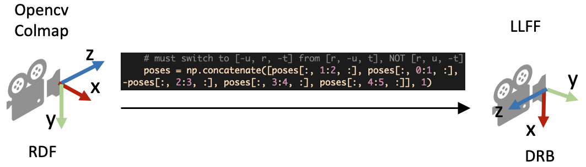
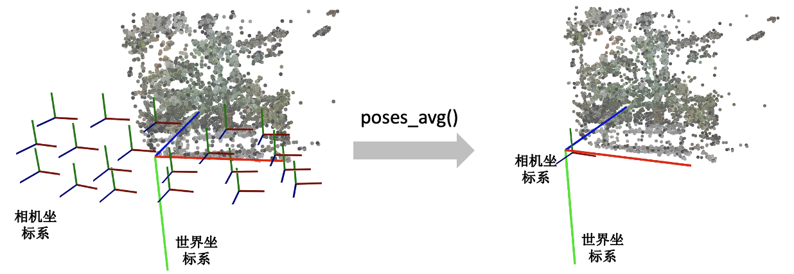
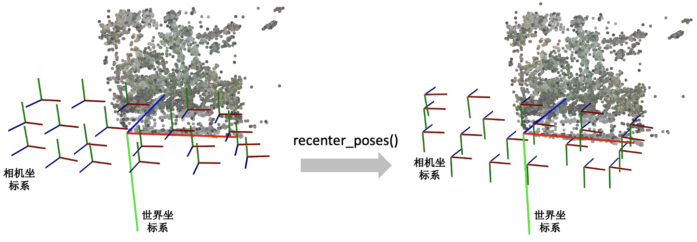
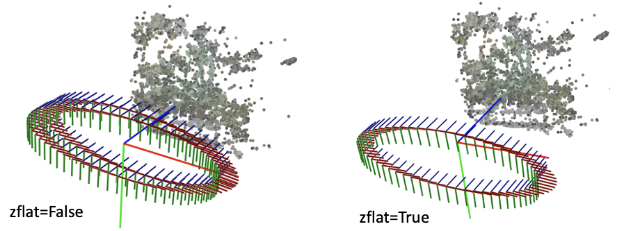
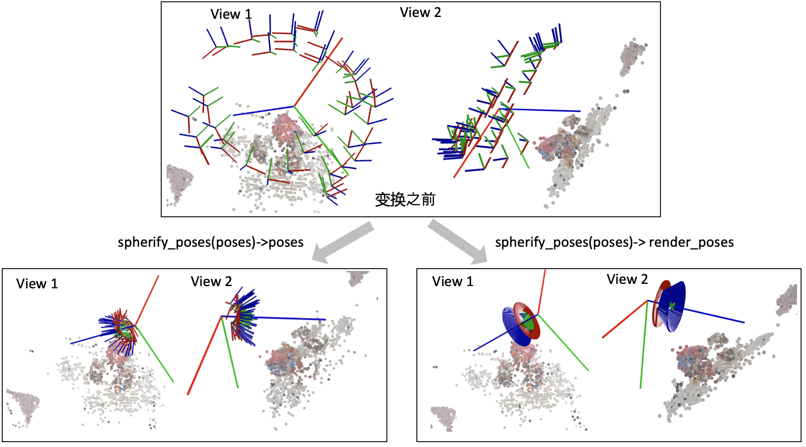

# 【摘录】相机位姿估计相关代码解读

[原文](https://zhuanlan.zhihu.com/p/593204605/)

[前置知识](./相机参数与坐标系变换.md)

## Colmap

下面是COLMAP官网教程给的三个命令行操作步骤：

第一步是对所有的图像进行特征点检测与提取。

```sh
mkdir ./distorted
colmap feature_extractor \
 --database_path ./distorted/database.db \
 --image_path ./input
```

这一步会在`database.db`中的`keypoints`和`descriptors`表中分别写入每个图像上的关键点位置和特征向量。


第二步是进行特征点匹配。

```sh
colmap exhaustive_matcher \
 --database_path ./distorted/database.db
```

这一步会在`database.db`中的`matches`和`two_view_geometries`表中分别写入匹配到的关键点信息。


第三步是进行SFM恢复相机位姿和稀疏的3D特征点。

```sh
mkdir ./distorted/sparse
colmap mapper \
 --database_path ./distorted/database.db \
 --image_path ./input \
 --output_path ./distorted/sparse
```

这一步会在`distorted/sparse/0`中生成：
* `cameras.bin`: 相机位姿
* `images.bin`: 匹配到的特征点位置
* `points3D.bin`: 稀疏点云


可用`model_converter`将`.bin`转换为`.txt`方便查看其内容：

```sh
colmap model_converter \
 --input_path ./distorted/sparse/0 \
 --output_path ./distorted/sparse/0 \
 --output_type TXT
```

`cameras.txt`:

```
# Camera list with one line of data per camera:
#   CAMERA_ID, MODEL, WIDTH, HEIGHT, PARAMS[]
# Number of cameras: 18
1 SIMPLE_RADIAL 2704 2028 1463.602151128247 1352 1014 0.0055591746999265682
2 SIMPLE_RADIAL 2704 2028 1459.0935698535297 1352 1014 0.0043112655758058933
......
```

`images.txt`:

```
# Image list with two lines of data per image:
#   IMAGE_ID, QW, QX, QY, QZ, TX, TY, TZ, CAMERA_ID, NAME
#   POINTS2D[] as (X, Y, POINT3D_ID)
# Number of images: 18, mean observations per image: 1788.7777777777778
1 0.98886101182065456 0.0044390132483014396 -0.14831889032221729 -0.011649087346175238 -0.42030913678886445 1.1207070471455038 0.17055071781075895 1 cam00.png
2536.1962890625 2.5554940700531006 -1 2563.796142578125 3.3455758094787598 -1 2563.796142578125 3.3455758094787598 -1 ......
2 0.98785045325706367 0.0020990654656298869 0.15458715378189467 -0.015807840130701221 -5.1862595908224201 1.1472383676217863 1.9528211257224539 2 cam01.png
2076.231201171875 2.6291365623474121 -1 2044.87548828125 7.0014801025390625 -1 2256.88916015625 8.5179100036621094 -1 ......
......
```

`points3D.txt`:

```
# 3D point list with one line of data per point:
#   POINT3D_ID, X, Y, Z, R, G, B, ERROR, TRACK[] as (IMAGE_ID, POINT2D_IDX)
# Number of points: 6876, mean track length: 4.6826643397324021
944 -2.6695841488219187 3.1376744856540726 13.459112784068168 109 100 113 0.51410901285639965 5 9832 6 11428 1 9899
1 14.849014740997124 -10.071613195692301 12.374907618510433 146 141 138 0.81580193115576016 5 58 6 333 16 316 15 3845
3517 -6.2905061230055503 5.0936986733548917 11.565100043362957 96 90 95 0.87127356787417265 5 10491 4 9373 3 9628 14 9348 13 8953
2 11.384284233822777 -5.0228600507699417 16.028219283545791 113 103 120 0.5440608582630676 5 320 6 667 3 4185 15 292 13 207 11 310
......
```

使用COLMAP得到相机参数后只需要转成NeRF可以读取的格式即可以用于模型训练了。有些相机镜头可能会造成图像扭曲，可以进一步使用`image_undistorter`将图像扭回针孔相机模式，这样可以一定程度上提高NeRF的重建质量：

```sh
colmap image_undistorter \
 --image_path ./input \
 --input_path ./distorted/sparse/0 \
 --output_path . \
 --output_type COLMAP
```

这一步会在`sparse/0`中生成扭回针孔相机模式后的相机内外参、在`images`中生成扭回针孔相机模式的图像。


COLMAP也集成了Multiview Stereo (MVS)算法用于重建场景完整的三维结构，也称为 [Dense Reconstruction](./DenseReconstruct.md)。
`image_undistorter`生成的`stereo`文件夹和两个`.sh`文件即与此有关。

## LLFF真实数据格式

NeRF代码里用load_llff.py这个文件来读取真实的数据，第一次看到LLFF这个词可能不知道是什么意思。其实LLFF [GitHub - Fyusion/LLFF: Code release for Local Light Field Fusion at SIGGRAPH 2019](https://github.com/fyusion/llff) 是NeRF作者的上一篇做新视角合成的工作。为了和LLFF方法保持一致的数据格式，NeRF使用load_llff.py读取LLFF格式的真实数据，并建议大家使用LLFF提供的的[imgs2poses.py](https://github.com/Fyusion/LLFF/blob/master/imgs2poses.py)文件获取所需相机参数。

### COLMAP到LLFF数据格式

imgs2poses.py这个文件其实很简单，就干了两件事。

* 第一件事是调用colmap软件估计相机的参数，在sparse/0/文件夹下生成一些二进制文件：cameras.bin, images.bin, points3D.bin, project.ini。
* 第二件事是读取上一步得到的二进制文件，保存成一个poses_bounds.npy文件。


这里有一个细节需要注意，就是在pose_utils.py文件里load_colmap_data()函数的倒数第二行，有一个操作将colmap得到的c2w旋转矩阵中的第一列和第二列互换，第三列乘以负号：

```python
# LLFF/llff/poses/pose_utils.py
def load_colmap_data(realdir):
 ... 
 # must switch to [-u, r, -t] from [r, -u, t], NOT [r, u, -t]
 poses = np.concatenate([poses[:, 1:2, :], poses[:, 0:1, :], -poses[:, 2:3, :], poses[:, 3:4, :], poses[:, 4:5, :]], 1)
 return poses, pts3d, perm
```

还记得刚刚提到c2w旋转矩阵的三列向量分别代表XYZ轴的朝向，上述操作实际上就是把相机坐标系轴的朝向进行了变换：X和Y轴调换，Z轴取反，如下图所示：



### poses_bounds.npy里有什么

load_llff.py会直接读取poses_bounds.npy文件获得相机参数。poses_bounds.npy是一个Nx17的矩阵，其中N是图像的数量，即每一张图像有17个参数。其中前面15个参数可以重排成3x5的矩阵形式：


最后两个参数用于表示场景的范围 **Bounds (bds)** ，是该相机视角下场景点离相机中心最近(near)和最远(far)的距离，所以near/far肯定是大于0的。

* 这两个值是怎么得到的？是在imgs2poses.py中，计算colmap重建的 **3D稀疏点** 在各个相机视角下最近和最远的距离得到的。
* 这两个值有什么用？之前提到体素渲染需要在一条射线上采样3D点，这就需要一个采样区间，而near和far就是定义了采样区间的最近点和最远点。贴近场景边界的near/far可以使采样点分布更加密集，从而有效地提升收敛速度和渲染质量。


## load_llff.py代码解读

接着，我们介绍NeRF代码里load_llff.py代码里的一些细节。对三维视觉不熟悉的读者，早期读代码的时候可能会有不少困惑。

### DRB到RUB的变换

第一个疑问是，为什么读进poses_bounds.npy里的c2w矩阵之后，对c2w的旋转矩阵又做了一些列变换？

```python
# load_llff.py文件
def load_llff_data(basedir, factor=8, recenter=True, bd_factor=.75, spherify=False, path_zflat=False):
 
 poses, bds, imgs = _load_data(basedir, factor=factor) # factor=8 downsamples original imgs by 8x
 print('Loaded', basedir, bds.min(), bds.max())
 
 # Correct rotation matrix ordering and move variable dim to axis 0
 poses = np.concatenate([poses[:, 1:2, :], -poses[:, 0:1, :], poses[:, 2:, :]], 1)
 ...
```

上面的代码段的最后一行实际上是把旋转矩阵的第一列（X轴）和第二列（Y轴）互换，并且对第二列（Y轴）做了一个反向。这样做的目的是将LLFF的相机坐标系变成OpenGL/NeRF的相机坐标系，如下图所示。

![poses = np.concatenate([poses[:, 1:2, :], -poses[:, 0:1, :], poses[:, 2:, :]], 1)](zhimg.com/v2-5e780f468e73b8e2e21913b3722986d8_r.jpg)

### 缩放图像需要修改什么相机参数？

在_load_data()函数里，有一个用于图像缩放的factor比例参数，将HxW的图像缩放成(H/factor)x(W/factor)。这里面有一个问题是如果缩放了图像尺寸，相机的参数需要相应的做什么变化？

* 做法是： **外参（位置和朝向）不变，相机的焦距f，cx, 和cy等比例缩放** 。下图的示意图展示了当相机位置不变，相机视野(Field of view, FOV)不变的情况下，图像的高和焦距长短的关系。


### viewmatrix()

view_matrix是一个构造相机矩阵的的函数，输入是相机的 **Z轴朝向** 、 **up轴的朝向** (即相机平面朝上的方向Y)、以及 **相机中心** 。输出下图所示的camera-to-world (c2w)矩阵。因为Z轴朝向，Y轴朝向，和相机中心都已经给定，所以只需求X轴的方向即可。又由于X轴同时和Z轴和Y轴垂直，我们可以用Y轴与Z轴的叉乘得到X轴方向。


下面是load_llff.py里关于view_matrix()的定义，看起来复杂一些。其实就是比刚刚的描述比多了一步：在用Y轴与Z轴叉乘得到X轴后，再次用Z轴与X轴叉乘得到新的Y轴。为什么这么做呢？这是因为传入的up(Y)轴是通过一些计算得到的，不一定和Z轴垂直，所以多这么一步。

```python
# load_llff.py
def viewmatrix(z, up, pos):
 vec2 = normalize(z)
 vec1_avg = up
 vec0 = normalize(np.cross(vec1_avg, vec2))
 vec1 = normalize(np.cross(vec2, vec0))
 m = np.stack([vec0, vec1, vec2, pos], 1)
 return m
```

### poses_avg()

这个函数其实很简单，顾名思义就是多个相机的平均位姿（包括位置和朝向）。输入是多个相机的位姿。

* 第一步对多个相机的中心进行求均值得到 **center** 。
* 第二步对所有相机的Z轴求平均得到 **vec2** 向量（方向向量相加其实等效于平均方向向量）。
* 第三步对所有的相机的Y轴求平均得到 **up** 向量。
* 最后将vec2, up, 和center输入到刚刚介绍的viewmatrix()函数就可以得到平均的相机位姿了。


```python
def poses_avg(poses):
 hwf = poses[0, :3, -1:]
 center = poses[:, :3, 3].mean(0)
 vec2 = normalize(poses[:, :3, 2].sum(0))
 up = poses[:, :3, 1].sum(0)
 c2w = np.concatenate([viewmatrix(vec2, up, center), hwf], 1)
 
 return c2w
```

下图展示了一个poses_avg()函数的例子。左边是多个输入相机的位姿，右边是返回的平均相机姿态。可以看出平均相机位姿的位置和朝向是之前所有相机的均值。



### recenter_poses()

recenter_poses()函数的名字听起来是中心化相机位姿（同样包括位置和朝向）的意思。输入N个相机位姿，会返回N个相机位姿。

具体的操作了解起来可能有点跳跃。第一步先用刚刚介绍的poses_avg(poses)得到多个输入相机的平均位姿c2w，接着用这个平均位姿c2w的逆左乘到输入的相机位姿上就完成了归一化。

```python
def recenter_poses(poses):
 poses_ = poses+0
 bottom = np.reshape([0,0,0,1.], [1,4])
 c2w = poses_avg(poses)
 c2w = np.concatenate([c2w[:3,:4], bottom], -2)
 bottom = np.tile(np.reshape(bottom, [1,1,4]), [poses.shape[0],1,1])
 poses = np.concatenate([poses[:,:3,:4], bottom], -2)
 poses = np.linalg.inv(c2w) @ poses
 poses_[:,:3,:4] = poses[:,:3,:4]
 poses = poses_
 return poses
```

首先我们要知道利用同一个旋转平移变换矩阵左乘所有的相机位姿是对所有的相机位姿做一个 **全局的旋转平移变换** ，那下一个问题就是这些相机会被变到什么样的一个位置？我们可以用平均相机位姿作为支点理解，如果把平均位姿的逆c2w^-1左乘平均相机位姿c2w，返回的相机位姿中旋转矩阵为单位矩阵，平移量为零向量。也就是变换后的平均相机位姿的位置处在世界坐标系的原点，XYZ轴朝向和世界坐标系的向一致。

下图我们用一个例子帮助理解。左边和右边分别是输入和输出的相机位姿示意图。我们可以看到变换后的多个相机的平均位姿处在世界坐标系的原点，并且相机坐标系的XYZ轴与世界坐标系保持一致了。



### render_path_spiral()

这个函数写的有点复杂，它和模型训练没有关系，主要是用来生成一个相机轨迹用于新视角的合成，如下面视频所示：
[https://www.zhihu.com/video/1589569584843169793](https://www.zhihu.com/video/1589569584843169793)
下面只放了render_path_spiral()函数的定义，NeRF代码里还有一段是在准备输入参数，由于相关代码比较长就不贴出来。

```python
def render_path_spiral(c2w, up, rads, focal, zdelta, zrate, rots, N):
 render_poses = []
 rads = np.array(list(rads) + [1.])
 hwf = c2w[:,4:5]
 
 for theta in np.linspace(0., 2. * np.pi * rots, N+1)[:-1]:
 c = np.dot(c2w[:3,:4], np.array([np.cos(theta), -np.sin(theta), -np.sin(theta*zrate), 1.]) * rads) 
 z = normalize(c - np.dot(c2w[:3,:4], np.array([0,0,-focal, 1.])))
 render_poses.append(np.concatenate([viewmatrix(z, up, c), hwf], 1))
 return render_poses
```

需要知道这个函数它是想生成一段螺旋式的相机轨迹，相机绕着一个轴旋转，其中相机始终注视着一个焦点，相机的up轴保持不变。简单说一下上面的代码：

首先是一个for循环，每一迭代生成一个新的相机位置。c是当前迭代的相机在世界坐标系的位置，np.dot(c2w[:3,:4], np.array([0,0,-focal, 1.])是焦点在世界坐标系的位置，z是相机z轴在世界坐标系的朝向。接着使用介绍的viewmatrix(z, up, c)构造当前相机的矩阵。

下面这个图可视化了 render_path_spiral()生成的轨迹。



### spherify_poses()

刚刚介绍的render_path_spiral()假设所有相机都朝向某一个方向，也就是所谓的faceforward场景。对于相机围绕着一个物体拍摄的360度场景，NeRF代码提供了一个spherify_poses()的函数用于"球面化"相机分布并返回一个环绕的相机轨迹用于新视角合成。这里插一句，在训练360度场景的时候，需要配合"--no_ndc --spherify --lindisp"三个参数以得到好的结果，具体原理这里不展开介绍。

```python
 if spherify:
 poses, render_poses, bds = spherify_poses(poses, bds)
```

这个函数也比较复杂，前半部分是在将输入的相机参数进行归一化，后半部分是生成一段相机轨迹用于合成新视角。对输入相机参数进行归一化时，思路是：

* 用 pt_mindist = min_line_dist(rays_o, rays_d)找到离所有相机中心射线距离之和最短的点（可以先简单理解成场景的中心位置）


```python
 rays_d = poses[:,:3,2:3]
 rays_o = poses[:,:3,3:4]
 def min_line_dist(rays_o, rays_d):
 A_i = np.eye(3) - rays_d * np.transpose(rays_d, [0,2,1])
 b_i = -A_i @ rays_o
 pt_mindist = np.squeeze(-np.linalg.inv((np.transpose(A_i, [0,2,1]) @ A_i).mean(0)) @ (b_i).mean(0))
 return pt_mindist
 pt_mindist = min_line_dist(rays_o, rays_d)
```

* 将得到的场景中心位置移到世界坐标系的原点，同时将所有相机z轴的平均方向转到和世界坐标系的z轴相同


```python
 center = pt_mindist
 up = (poses[:,:3,3] - center).mean(0)
 vec0 = normalize(up)
 vec1 = normalize(np.cross([.1,.2,.3], vec0))
 vec2 = normalize(np.cross(vec0, vec1))
 pos = center
 c2w = np.stack([vec1, vec2, vec0, pos], 1)
 poses_reset = np.linalg.inv(p34_to_44(c2w[None])) @ p34_to_44(poses[:,:3,:4])
```

* 最后将相机的位置缩放到单位圆内


```python
 rad = np.sqrt(np.mean(np.sum(np.square(poses_reset[:,:3,3]), -1)))
 sc = 1./rad
 poses_reset[:,:3,3] *= sc
```

下面这个图可视化了spherify_poses()返回的结果。

