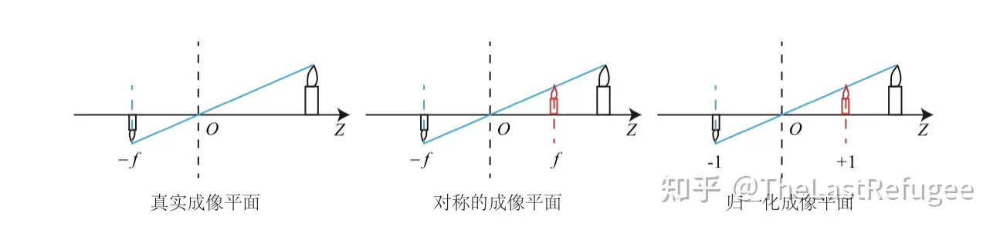
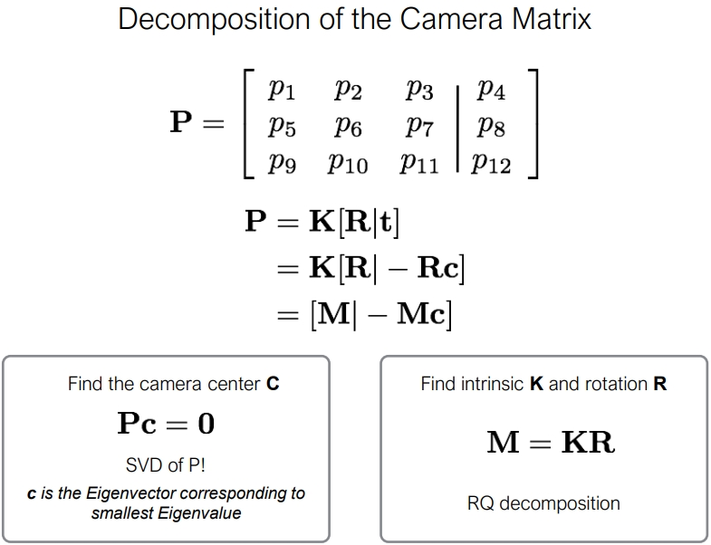

# 【摘录】相机参数与坐标系变换

[原文](https://zhuanlan.zhihu.com/p/593204605/) 作者 陈冠英 香港中文大学（深圳）guanyingc.github.io

[原文](https://blog.csdn.net/qq_40270044/article/details/122127707)

[原文](https://blog.csdn.net/u014709760/article/details/88029841)

《视觉 SLAM 十四讲》高翔

## 总体概览

NeRF的技术其实很简洁，并不复杂。但与2D视觉里考虑的2维图像不同，NeRF考虑的是一个3D空间。下面列的是NeRF实现的几个关键部分：

1. 有一个 **3D空间** ，用一个连续的场表示
1. 空间里存在一个感兴趣的 **物体区域** 
1. 处于 **不同位置和朝向的相机** 拍摄多视角图像
1. 对于一张 **图像** ，根据相机中心和图像平面的一个像素点，两点确定一条 **射线** 穿过3D空间
1. 在射线上采样多个离散的 **3D点** 并利用体素渲染像素的颜色。


这里面涉及到3D空间、物体区域、相机位置和朝向、图像、射线、以及3D采样点等。要想优化NeRF，我们需要能够表达刚刚提到的这些东西。


 **坐标系定义：**  为了唯一地描述每一个空间点的坐标，以及相机的位置和朝向，我们需要先定义一个世界坐标系。一个坐标系其实就是由原点的位置与XYZ轴的方向决定。接着，为了建立3D空间点到相机平面的映射关系以及多个相机之间的相对关系，我们会对每一个相机定义一个局部的相机坐标系。下图为常见的坐标系定义习惯。


## 相机的内外参数

相机的位置和朝向由相机的外参（extrinsic matrix）决定，投影属性由相机的内参（intrinsic matrix）决定。

注意：接下来的介绍假设矩阵是 **列矩阵(column-major matrix)** ，变换矩阵 **左乘** 坐标向量实现坐标变换（这也是OpenCV/OpenGL/NeRF里使用的形式）。

### 6DoF和相机外参

首先，先解释一下自由度，自由度与刚体在空间中的运动相关。可以理解为物体移动的不同基本方式。


* 平移运动：刚体可以在3个自由度中平移：向前/后，向上/下，向左/右


* 旋转运动：刚体在3个自由度中旋转：纵摇(Pitch)、横摇(Roll)、垂摇(Yaw)


因此，3种类型的平移自由度+3种类型的旋转自由度 = 6自由度

在任意一个自由度中，物体可以沿两个“方向”自由运动。例如，电梯限制在1个自由度中(垂直平移)，但电梯能够在这个自由度中上下运动。同样，摩天轮限制在1个自由度中，但这是旋转自由度，所以摩天轮能够朝相反的方向旋转。
我们可以继续举例子，比如说主题公园。碰碰车总共有3个自由度：它只能在3轴中的2条里平移(无法像电梯那样上下移动);然后它只能以一种方式旋转(无法像飞机那样纵摇和垂摇)。 所以2个平移+1个旋转=3自由度。
无论有多复杂，刚体的任何可能性运动都可以通过6自由度的组合进行表达。 例如在你用球拍击打网球的时候，球拍的复杂运动可以表示为平移和旋转的组合。

对相机再这6个自由度的数值描述即相机外参。

相机外参是一个4x4的矩阵，其作用是计算世界坐标系的某个点$[x_w,y_w,z_w]^T$在相机坐标系下的坐标$[x_p,y_p,z_p]^T$。我们也把相机外参叫做 **world-to-camera (w2c)矩阵**。

#### 相机外参：w2c矩阵

w2c矩阵$[\bm R|\bm t]$如何计算世界坐标系的某个点$[x_w,y_w,z_w]^T$在相机坐标系下的坐标$[x_c,y_c,z_c]^T$？一言以蔽之：

$$
\left[
\begin{matrix}
    x_c\\y_c\\z_c
\end{matrix}
\right]
=
[\bm R|\bm t]
\cdot
\left[
\begin{matrix}
    x_w\\y_w\\z_w\\1
\end{matrix}
\right]
=
\left[
\begin{matrix}
    r_{11}&r_{12}&r_{13}&t_1\\r_{21}&r_{22}&r_{23}&t_2\\r_{31}&r_{32}&r_{33}&t_3
\end{matrix}
\right]
\cdot
\left[
\begin{matrix}
    x_w\\y_w\\z_w\\1
\end{matrix}
\right]
=
\left[
\begin{matrix}
    r_{11}&r_{12}&r_{13}\\r_{21}&r_{22}&r_{23}\\r_{31}&r_{32}&r_{33}
\end{matrix}
\right]
\cdot
\left[
\begin{matrix}
    x_w\\y_w\\z_w
\end{matrix}
\right]
+
\left[
\begin{matrix}
    t_1\\t_2\\t_3
\end{matrix}
\right]
=
\bm R
\cdot
\left[
\begin{matrix}
    x_w\\y_w\\z_w
\end{matrix}
\right]
+
\bm t
$$

稍微思考一下，其实 $\bm R$和$\bm t$分别对应坐标系的**旋转**和**平移**。
乘上$\bm R$可以看作是坐标系原点不动，各坐标轴旋转到和相机坐标轴对齐时的该点的坐标$[x_w,y_w,z_w]^T$应该怎么变，而$\bm t$可以看作是接着将坐标系原点移动到旋转后的坐标系的$-\bm t$位置时的该点坐标应该怎么变，$\bm t$值也同时是**世界坐标系原点在相机坐标系下的位置**。其计算结果$[x_c,y_c,z_c]^T$即是目标点相对于相机坐标系的位置：

$$
\left[
\begin{matrix}
    x_c\\y_c\\z_c
\end{matrix}
\right]
=
\left[
\begin{matrix}
    r_{11}&r_{12}&r_{13}&t_1\\r_{21}&r_{22}&r_{23}&t_2\\r_{31}&r_{32}&r_{33}&t_3
\end{matrix}
\right]
\cdot
\left[
\begin{matrix}
    x_w\\y_w\\z_w\\1
\end{matrix}
\right]
$$

正因为这项功能，所以相机的外参$[\bm R|\bm t]$才会被叫做“world-to-camera (w2c)”矩阵，即“世界坐标系到相机坐标系”矩阵。

#### 相机外参逆矩阵：c2w矩阵

因为NeRF主要使用c2w，这里再简要介绍一下c2w的含义。
相机外参的逆矩阵被称为 **camera-to-world (c2w)矩阵** ，其作用是把相机坐标系的点变换到世界坐标系：

$$
[R\quad T]
\cdot
\left[
    \begin{matrix}
        x_c\\y_c\\z_c\\1
    \end{matrix}
\right]
=
\left[
    \begin{matrix}
        x_w\\y_w\\z_w
    \end{matrix}
\right]
$$

刚刚接触的时候，对这个c2w矩阵的值可能会比较陌生。其实c2w矩阵的值直接描述了相机坐标系的朝向和原点：


具体的， 旋转矩阵的第一列到第三列分别表示了**相机坐标系的X, Y, Z轴在世界坐标系下对应的方向**；平移向量表示的是**相机原点在世界坐标系的对应位置** 。对应于上文所述的6DoF，矩阵的第一列到第三列即描述了3种类型的旋转自由度，第四列即描述了3种平移的旋转自由度。

### 相机内参

刚刚介绍了相机的外参，现在简单介绍一下相机的内参。

相机的内参矩阵将相机坐标系下的3D坐标映射到2D的图像平面，这里以针孔相机(Pinhole camera)为例介绍相机的内参矩阵K：

$$
K=\left[
\begin{matrix}
    f_x&0&c_x\\0&f_y&c_y\\0&0&1
\end{matrix}
\right]
$$


内参矩阵K包含4个值，其中$f_x$和$f_y$是相机的水平和垂直 **焦距** （对于理想的针孔相机，$f_x=f_y$）。焦距的物理含义是相机中心到成像平面的距离，长度以像素为单位。$c_x$和$c_y$是图像原点相对于相机光心的水平和垂直偏移量（图像传感器中心并不一定与镜头中轴线对齐）。$c_x$，$c_y$有时候可以用图像宽和高的1/2近似:

```python
# NeRF run_nerf.py有这么一段构造K的代码
if K is None:
    K = np.array([
        [focal, 0, 0.5*W],
        [0, focal, 0.5*H],
        [0, 0, 1]
    ])
```

相机内参的真正含义还需要配合一张图和另一种公式写法来解释：



$$
z_p
\left[
\begin{matrix}
    u\\v\\1
\end{matrix}
\right]
=
\left[
\begin{matrix}
    f_x&0&c_x\\0&f_y&c_y\\0&0&1
\end{matrix}
\right]
\cdot
\left[
\begin{matrix}
    x_c\\y_c\\z_c
\end{matrix}
\right]
=
z_c
\left[
\begin{matrix}
    f_x\frac{x_c}{z_c}+c_x\\f_y\frac{y_c}{z_c}+c_y\\1
\end{matrix}
\right]
$$

这里，$z_p$变成了表示“成像距离”，而$z_cu=x_p$和$z_cv=y_p$变成了表示“若在成像距离$z_p$处放置成像平面，坐标$[x_c,y_c,z_c]^T$会被投影到该成像平面上的何处”。此即相机内参的真正含义，它不是将一个坐标系变换到另一个坐标系，而是**根据目标点给出成像距离与目标点在成像平面上的位置关系**。
其中的$z_c$和$z_p$仅仅是最后用于计算归一化成像平面的量，所以其未进行任何变换，直接是$z_p=z_c$。
这个$z_p=z_c$也可以理解成“小孔成像的物距等于像距”。

所以相机内参的真正表现形式应该是：

$$
\begin{aligned}
    \frac{x_p}{z_p}&=f_x\frac{x_c}{z_c}+c_x\\
    \frac{y_p}{z_p}&=f_y\frac{y_c}{z_c}+c_y
\end{aligned}
$$

联系上文$f_x$和$f_y$是相机焦距，$c_x$和$c_y$是成像中心相对相机中心的偏移量。

反过来理解，从成像反推坐标的过程：

$$
z_p
\bm K^{-1}
\left[
\begin{matrix}
    u\\v\\1
\end{matrix}
\right]
=
\left[
\begin{matrix}
    x_c\\y_c\\z_c
\end{matrix}
\right]
$$

很显然，这里$z_p=z_c$，但$z_p$真的就是$z_c$吗？很显然不是。小孔成像并没有深度，通过像素在照片上的位置只能反推出该像素在空间中的方向，并不能推出其具体的位置，所以这样求出的$x_c,y_c,z_c$只是对方向的指示，而非真正点的位置。

## 如何获得相机参数

NeRF算法假设相机的内外参数是提供的，那么怎么得到所需要的相机参数呢？这里分合成数据集和真实数据集两种情况。

###  合成数据

对于合成数据集，我们需要通过指定相机参数来渲染图像，所以得到图像的时候已经知道对应的相机参数，比如像NeRF用到的Blender Lego数据集。常用的渲染软件还有Mitsuba、OpenGL、PyTorch3D、Pyrender等。渲染数据比较简单，但是把得到的相机数据转到NeRF代码坐标系牵扯到坐标系之间的变换，有时候会比较麻烦。

### 直接线性变换(DLT)

DLT的目标是求解出矩阵$\bm P=\{p_{ij}\}_{3\times 4}$，可根据任意点在空间坐标系下的坐标$[x_w,y_w,z_w]^T$通过线性变换求解其在相机坐标系下的坐标$[x_p,y_p,z_p]^T$：

$$
\left[
    \begin{matrix}
        x_p\\y_p\\z_p
    \end{matrix}
\right]
=\bm W
\cdot
\left[
    \begin{matrix}
        x_w\\y_w\\z_w
    \end{matrix}
\right]
+\bm b
=
\left[
    \begin{matrix}
        p_{11}&p_{12}&p_{13}\\p_{21}&p_{22}&p_{23}\\p_{31}&p_{32}&p_{33}
    \end{matrix}
\right]
\cdot
\left[
    \begin{matrix}
        x_w\\y_w\\z_w
    \end{matrix}
\right]
+
\left[
    \begin{matrix}
        p_{14}\\p_{24}\\p_{34}
    \end{matrix}
\right]
$$

在开始解方程之前，通常会将$[x_w,y_w,z_w]^T$坐标写为一个齐次坐标$\bm X=[x_w,y_w,z_w,1]^T$，从而上述方程可以写作一个矩阵乘：

$$
\left[
    \begin{matrix}
        x_p\\y_p\\z_p
    \end{matrix}
\right]
=
[\bm W|\bm b]
\cdot
\left[
    \begin{matrix}
        x_w\\y_w\\z_w\\1
    \end{matrix}
\right]
=
\left[
    \begin{matrix}
        p_{11}&p_{12}&p_{13}&p_{14}\\p_{21}&p_{22}&p_{23}&p_{24}\\p_{31}&p_{32}&p_{33}&p_{34}
    \end{matrix}
\right]
\cdot
\left[
    \begin{matrix}
        x_w\\y_w\\z_w\\1
    \end{matrix}
\right]
=\bm P\cdot\bm X
$$

现在开始求解。首先将$\bm P$分为三个向量$\bm P=[\bm p_1,\bm p_2,\bm p_3]^T$：

$$
\left[
    \begin{matrix}
        x_p\\y_p\\z_p
    \end{matrix}
\right]
=
\left[
    \begin{matrix}
        \bm p_1^T\\\bm p_2^T\\\bm p_3^T
    \end{matrix}
\right]
\cdot
\bm X
$$

于是可得两个约束：

$$
\begin{aligned}
    \frac{x_p}{z_p}&=\frac{\bm p_1^T\bm X}{\bm p_3^T\bm X}\\
    \frac{y_p}{z_p}&=\frac{\bm p_2^T\bm X}{\bm p_3^T\bm X}\\
\end{aligned}
$$

令$u=\frac{x_p}{z_p}$、$v=\frac{y_p}{z_p}$，将约束写成线性方程形式：

$$
\begin{aligned}
    \bm p_1^T\bm X-\bm p_3^Tu\bm X=0\\
    \bm p_2^T\bm X-\bm p_3^Tv\bm X=0\\
\end{aligned}
$$

相当于把$\bm p_1^T,\bm p_2^T,\bm p_3^T$排成一行$[\bm p_1^T,\bm p_2^T,\bm p_3^T]$进行矩阵乘，所以可以写成矩阵形式：

$$
[\bm p_1^T,\bm p_2^T,\bm p_3^T]
\cdot
\left[
    \begin{matrix}
        \bm X&\bm 0\\
        \bm 0&\bm X\\
        -u\bm X&-v\bm X\\
    \end{matrix}
\right]
=[0,0]
$$

转置一下：

$$
\left[
    \begin{matrix}
        \bm X^T&\bm 0&-u\bm X^T\\
        \bm 0&\bm X^T&-v\bm X^T\\
    \end{matrix}
\right]
\cdot
\left[
    \begin{matrix}
        \bm p_1\\\bm p_2\\\bm p_3
    \end{matrix}
\right]
=
\left[
    \begin{matrix}
        0\\0
    \end{matrix}
\right]
$$

于是，如果有$N$个点$\bm X_1,\dots,\bm X_N$，则可以列出$N$组方程：

$$
\left[
    \begin{matrix}
        \bm X_1^T&\bm 0&-u_1\bm X_1^T\\
        \bm 0&\bm X_1^T&-v_1\bm X_1^T\\
        \vdots&\vdots&\vdots\\
        \bm X_N^T&\bm 0&-u_N\bm X_N^T\\
        \bm 0&\bm X_N^T&-v_N\bm X_N^T\\
    \end{matrix}
\right]
\cdot
\left[
    \begin{matrix}
        \bm p_1\\\bm p_2\\\bm p_3
    \end{matrix}
\right]
=
\left[
    \begin{matrix}
        0\\0\\\vdots\\0\\0
    \end{matrix}
\right]
$$

由于 $[\bm p_1^T,\bm p_2^T,\bm p_3^T]$ 一共有 12 个值，因此**最少通过六对匹配点**（12条方程），即可实现参数矩阵 $[\bm R|\bm t]$ 的线性求解，这种方法(也)称为直接线性变换(Direct Linear Transform, DLT)。当匹配点大于六对时，可以使用 SVD 等方法对超定方程求最小二乘解。

这里应用[SVD](../数学/SVD.md)简单来说就是：

$$
\begin{aligned}
&&\mathop{min}\limits_{\bm x}\|\bm A\bm x\|^2\\
s.t.&&\|\bm x\|=1
\end{aligned}
$$

其中：

$$A=
\left[
    \begin{matrix}
        \bm X_1^T&\bm 0&-u_1\bm X_1^T\\
        \bm 0&\bm X_1^T&-v_1\bm X_1^T\\
        \vdots&\vdots&\vdots\\
        \bm X_N^T&\bm 0&-u_N\bm X_N^T\\
        \bm 0&\bm X_N^T&-v_N\bm X_N^T\\
    \end{matrix}
\right]
$$

$$
\bm x=
\left[
    \begin{matrix}
        \bm p_1\\\bm p_2\\\bm p_3
    \end{matrix}
\right]
$$

求解过程参照[SVD](../数学/SVD.md)中的介绍即可，最终可以解得$\bm P$。

进一步，$\bm P$还可以分解为

$$
\bm P=\bm K[\bm R|\bm t]=
\left[
\begin{matrix}
    f_x&0&c_x\\0&f_y&c_y\\0&0&1
\end{matrix}
\right]
\cdot
\left[
\begin{matrix}
    r_{11}&r_{12}&r_{13}&t_1\\r_{21}&r_{22}&r_{23}&t_2\\r_{31}&r_{32}&r_{33}&t_3
\end{matrix}
\right]
$$

于是具体世界坐标系坐标值到相机坐标系坐标值的计算公式为：

$$
\left[
\begin{matrix}
    x_p\\y_p\\z_p
\end{matrix}
\right]
=
\bm K[\bm R|\bm t]
\cdot
\left[
\begin{matrix}
    x_w\\y_w\\z_w\\1
\end{matrix}
\right]
=
\left[
\begin{matrix}
    f_x&0&c_x\\0&f_y&c_y\\0&0&1
\end{matrix}
\right]
\cdot
\left[
\begin{matrix}
    r_{11}&r_{12}&r_{13}&t_1\\r_{21}&r_{22}&r_{23}&t_2\\r_{31}&r_{32}&r_{33}&t_3
\end{matrix}
\right]
\cdot
\left[
\begin{matrix}
    x_w\\y_w\\z_w\\1
\end{matrix}
\right]
$$

其中这个增广矩阵$[\bm R|\bm t]$就是相机的外参，而$\bm K$即是相机的内参。

#### 进一步深入：分解相机参数$\bm P=\bm K[\bm R|\bm t]$

相机内参$\bm K$有4个未知量、相机外参$\bm R$是旋转矩阵有3个未知量、$\bm t$是位置坐标有3个未知量，因此完整的相机参数共有10个未知量，而$\bm P$中有12个值，所以知道了$\bm P$就能知道相机内外参。

>在 DLT 求解中，我们直接将 $[\bm R|\bm t]$ 矩阵看成了 12 个未知数，忽略了它们之间的联系。因为旋转矩阵 $\bm R\in SO(3)$，用 DLT 求出的解不一定满足该约束，它是一个一般矩阵。平移向量比较好办，它属于向量空间。对于旋转矩阵 $R$，我们必须针对 DLT 估计的 $[\bm R|\bm t]$ 的左边$3\times 3$ 的矩阵块，寻找一个最好的旋转矩阵对它进行近似。这可以由 QR 分解完成，相当于把结果从矩阵空间重新投影到 $SE(3)$ 流形上,转换成旋转和平移两部分。

首先把$\bm P$切分成一个矩阵和一个向量：

$$\bm P=\bm K[\bm R|\bm t]=[\bm K\bm R|\bm K\bm t]=[\bm H|\bm h]$$

所以$\bm P$左边3列就是$\bm H=\bm K\bm R$，最右边一列是$\bm h=\bm K\bm t$。

观察$\bm H=\bm K\bm R$，发现相机内参$\bm K$是一个上三角矩阵，旋转矩阵$\bm R$是正交矩阵。
而QR分解算法就可以将任意矩阵分解为正交矩阵和上三角矩阵的乘积。
于是：

$$\bm H^{-1}=\bm R^{-1}\bm K^{-1}=\bm R^T\bm K^{-1}$$

因此，对$\bm H^{-1}$进行QR分解即可得到$\bm R^T$和$\bm K^{-1}$，进而得到相机内参$\bm K$和旋转矩阵$\bm R$。
进而：

$$\bm t=\bm K^{-1}\bm h$$

结束了？并不。理想很丰满，现实很骨感。QR分解：
* 不保证$\bm K_{3,3}=1$
* 不保证$K_{0,0}>0$和$K_{1,1}>0$
* 不保证$K_{1,2}=0$

所以在$\bm t=\bm K^{-1}\bm h$之前还需要进一步操作：

* 令$\bm K_{3,3}=1$：简单，直接$\hat{\bm K}=\bm K/\bm K_{3,3}$即可
* 令$K_{0,0}>0$和$K_{1,1}>0$：加个绕z轴旋转180°的矩阵$\bm R(z, \pi)$，即$\hat{\bm K}=\bm K\bm R(z, \pi)$、$\hat{\bm R}=\bm R(z, \pi)\bm R$
* 令$K_{1,2}=0$：直接置0

>QR分解得到的上三角矩阵可能是这样的：
>
>$$
>\bm K
>=
>\left[
>\begin{matrix}
>    f_x&cot(\theta)&c_x\\0&f_y&c_y\\0&0&1
>\end{matrix}
>\right]
>$$
>
>这里的$cot(\theta)$还是有一些讲究的。在以前的时候，传感器的像素可能不是标准正方形，而是有一点点角度的平行四边形，这个时候如果将平行四边形的锐角角度记为$\theta$，它就会出现在这里。但是现在工艺水平进步了之后，这个角度一般是直角，所以$cot(\theta)=0$。由于误差的原因，我们会求出来这个不是0，但是放心大胆的置零就可以。

>$cot(\theta)$ encodes any possible skew between the sensor axes due to the sensor not being mounted perpendicular to the optical axis

#### 进一步深入：分解相机参数$\bm P=\bm K[\bm R|\bm t]$



### P3P算法

>PnP(Perspective-n-Point)是求解 3D 到 2D 点对运动的方法。它描述了当我们知道$n$个 3D 空间点以及它们的投影位置时,如何估计相机所在的位姿。——《视觉SLAM十四讲》

>通俗的讲，PnP问题就是在已知世界坐标系下$n$个空间点的真实坐标以及这些空间点在图像上的投影，如何计算相机所在的位姿。换句话说，就是已知量为空间中的真实坐标和图像坐标，求解相机的位姿（未知量）。

上述已知多个点求解相机位姿的问题也被称为 **“PnP问题”**，而DLT是求解PnP问题的多种方法中的其中一种。

接下来要介绍的P3P算法只利用三个点的信息进行求解，其缺点是不能利用更多点的信息，优点是不需要SVD所以计算速度快。


P3P 顾名思义$n=3$，即利用给定的3个点的几何关系。它的输入数据为三对 3D-2D 匹配点。记 3D点为 $A, B, C$，2D 点为 $a, b, c$,其中小写字母代表的点为大写字母在相机成像平面上的投影，如上图所示。此外，P3P 还需要使用一对验证点,以从可能的解出选出正确的那一个(类似于对极几何情形)。记验证点对为 $D-d$,相机光心为 $O$。
请注意,我们知道的是$A, B, C$在**世界坐标系中的坐标**，而不是在**相机坐标系中的坐标**。

首先,显然,三角形之间存在对应关系：

$$\Delta Oab - \Delta OAB, \quad \Delta Obc - \Delta OBC, \quad \Delta Oac - \Delta OAC$$

对于三角形 $Oab$ 和 $OAB$，利用余弦定理可得：

$$
\begin{array}{l}
\overline{OA}^2 + \overline{OB}^2 - 2.\overline{OA}.\overline{OB}.\cos \left\langle a,b \right \rangle  = \overline{AB}^2\\
\overline{OB}^2 + \overline{OC}^2 - 2.\overline{OB}.\overline{OC}.\cos \left\langle b,c \right \rangle  = \overline{BC}^2\\
\overline{OA}^2 + \overline{OC}^2 - 2.\overline{OA}.\overline{OC}.\cos \left\langle a,c \right \rangle  = \overline{AC}^2
\end{array}
$$

对上面三式全体除以 $\overline{OC}^2$ ，并且记 $x=\overline{OA}/\overline{OC},\ y=\overline{OB}/\overline{OC}$，得：

$$
\begin{array}{l}
{x^2} + {y^2} - 2.x.y.\cos \left\langle a,b \right \rangle  = \overline{AB}^2/\overline{OC}^2\\
{y^2} + {1^2} - 2.y.\cos \left\langle b,c \right \rangle  = \overline{BC}^2/\overline{OC}^2\\
{x^2} + {1^2} - 2.x.\cos \left\langle a,c \right \rangle  = \overline{AC}^2/\overline{OC}^2
\end{array}
$$

记 $v = \overline{AB}^2/\overline{OC}^2,\ u.v = \overline{BC}^2/\overline{OC}^2,\ w.v = \overline{AC}^2/\overline{OC}^2$，有:

$$
\begin{array}{l}
{x^2} + {y^2} - 2.x.y.\cos \left\langle a,b \right \rangle  - v = 0\\
{y^2} + {1^2} - 2.y.\cos \left\langle b,c \right \rangle  - u.v = 0\\
{x^2} + {1^2} - 2.x.\cos \left\langle a,c \right \rangle  - w.v = 0
\end{array}
$$

我们可以把第一个式子中的 $v$ 放到等式一边,并代入第 2,3 两式,得:

$$
\begin{array}{l}
\left( {1 - u} \right){y^2} - u{x^2} - 2 \cos \left\langle b,c \right \rangle y + 2uxy\cos \left\langle a,b \right \rangle  + 1 = 0 \\
\left( {1 - w} \right){x^2} - w{y^2} - 2 \cos \left\langle a,c \right \rangle x + 2wxy\cos \left\langle a,b \right \rangle  + 1 = 0.
\end{array}
$$

由于我们知道 2D 点的图像位置,三个余弦角$\cos \left \langle a,b \right \rangle$, $\cos \left\langle b,c \right \rangle$, $\cos \left \langle a,c \right \rangle$是已知的。同时,$u=\overline{BC}^2/\overline{AB}^2, w=\overline{AC}^2/\overline{AB}^2$ 可以通过 $A, B, C$ 在世界坐标系下的坐标算出,变换到相机坐标系下之后,并不改变这个比值，所以也是已知量。该式中的 $x$, $y$ 是未知的,随着相机移动会发生变化。

因此，**P3P问题最终可以转换成关于 x, y 的一个二元二次方程(多项式方程)**

该方程最多可能得到**四个解**，但我们可以用验证点来计算最可能的解，得到 $A, B, C$ 在相机坐标系下的 3D 坐标以及相机的位姿。

#### PnP算法的缺陷

P3P 也存在着一些问题：

1. P3P 只利用三个点的信息。当给定的配对点多于 3 组时,难以利用更多的信息。
2. 如果 3D 点或 2D 点受噪声影响,或者存在误匹配,则算法失效。
所以后续人们还提出了许多别的方法，如 EPnP、 UPnP 等。它们利用更多的信息，而且用迭代的方式对相机位姿进行优化,以尽可能地消除噪声的影响。

### 用Colmap进行SFM

对于真实场景，比如我们用手机拍摄了一组图像，怎么获得相机位姿？目前常用的方法是利用运动恢复结构(structure-from-motion, SFM)技术估计几个相机间的相对位姿。这个技术比较成熟了，现在学术界里用的比较多的开源软件包是COLMAP： [https://colmap.github.io/](https://colmap.github.io/)。输入多张图像，COLMAP可以估计出相机的内参和外参(也就是sparse model)。


[具体介绍](./相机代码.md)

## 3D空间射线怎么构造

最后我们看一下这个射线是怎么构造的。 **给定一张图像的一个像素点，我们的目标是构造以相机中心为起始点，经过相机中心和像素点的射线。** 

首先，明确两件事：

1. 一条射线包括一个起始点和一个方向，起点的话就是相机中心。对于射线方向，我们都知道两点确定一条直线，所以除了相机中心我们还需另一个点，而这个点就是成像平面的像素点。
1. NeRF代码是在相机坐标系下构建射线，然后再通过camera-to-world (c2w)矩阵将射线变换到世界坐标系。


通过上述的讨论，我们第一步是要先写出相机中心和像素点在相机坐标系的3D坐标。下面我们以OpenCV/Colmap的相机坐标系为例介绍。相机中心的坐标很明显就是$[0,0,0]$了。像素点的坐标可能复杂一点：首先3D像素点的x和y坐标是2D的图像坐标 $(i, j)$减去光心坐标 $(c_x,c_y)$，然后z坐标其实就是焦距$f$ (因为图像平面距离相机中心的距离就是焦距$f$)。

所以我们就可以得到射线的方向向量是  $[i-c_x, j-c_y, f] - [0, 0, 0] = [i-c_x, j-c_y, f]$  。因为是向量，我们可以把整个向量除以焦距$f$归一化z坐标，得到  $(\frac{i-c_x}{f}, \frac{j-c_y}{f}, 1)$  。

接着只需要用c2w矩阵把相机坐标系下的相机中心和射线方向变换到世界坐标系就搞定了。


下面是NeRF的实现代码。但关于这里面有一个细节需要注意一下：为什么函数的第二行中dirs的y和z的方向值需要乘以负号，和我们刚刚推导的的  $(\frac{i-c_x}{f}, \frac{j-c_y}{f}, 1)$  不太一样呢？

```python
def get_rays_np(H, W, K, c2w):
 i, j = np.meshgrid(np.arange(W, dtype=np.float32), np.arange(H, dtype=np.float32), indexing='xv)
 dirs = np.stack([(i-K[0][2])/K[0][0], -(j-K[1][2])/K[1][1], -np.ones_like(i)], -1)
 # Rotate ray directions from camera frame to the world frame
 rays_d = np.sum(dirs[..., np.newaxis, :] * c2w[:3,:3], -1) # dot product, equals to: [c2w.dot(dir) for dir in dirs]
 # Translate camera frame's origin to the world frame. It is the origin of all rays.
 rays_o = np.broadcast_to(c2w[:3,-1], np.shape(rays_d))
 return rays_o, rays_d
```

这是因为OpenCV/Colmap的相机坐标系里相机的Up/Y朝下, 相机光心朝向+Z轴，而NeRF/OpenGL相机坐标系里相机的Up/朝上，相机光心朝向-Z轴，所以这里代码在方向向量dir的第二和第三项乘了个负号。


## 更多阅读材料：

前面简单地介绍了下NeRF代码中关于相机参数和坐标系变换的内容，这里面有很多细节没有展开介绍，如果有错误还请批评指正。另外，如果初学者希望进一步学习3D、图形学渲染相关的知识，可以浏览下面的一些网站（不全面，仅供参考）：

* Scratchapixel系列：[https://www.scratchapixel.com/](https://www.scratchapixel.com/index.php?redirect)
* 很棒的一个网站，这个网站里介绍了很多关于计算机图形学渲染的知识。可以从头开始学习或者直接先看 [Computing the Pixel Coordinates of a 3D Point](https://www.scratchapixel.com/lessons/3d-basic-rendering/computing-pixel-coordinates-of-3d-point)
* The Perspective Camera - An Interactive Tour：[https://ksimek.github.io/2012/08/13/introduction/](https://ksimek.github.io/2012/08/13/introduction/)
* 这个网站介绍了相机的内外参数和分解，Dissecting the Camera Matrix part1/part2/part3
* 一篇很详细的关于体素渲染和NDC空间的博客：[A Surge in NeRF | Will](https://yconquesty.github.io/blog/ml/nerf/)


下面是关于NeRF研究方向的一些文章（不全面，仅供参考）：

* [Frank Dellaert-NeRF Explosion 2020](https://dellaert.github.io/NeRF/)
* [Frank Dellaert-NeRF at ICCV 2021](https://dellaert.github.io/NeRF21/)
* [NeRF at CVPR 2022](https://dellaert.github.io/NeRF22/)
* [每周分类神经辐射场: https://github.com/sjtuytc/LargeScaleNeRFPytorch/blob/main/docs/weekly_nerf_cn.md](https://github.com/sjtuytc/LargeScaleNeRFPytorch/blob/main/docs/weekly_nerf_cn.md)
