# 【摘录】NeRF代码解读-相机参数与坐标系变换

[原文](https://zhuanlan.zhihu.com/p/593204605/) 作者 陈冠英 香港中文大学（深圳）guanyingc.github.io

[原文](https://blog.csdn.net/qq_40270044/article/details/122127707)

[原文](https://blog.csdn.net/u014709760/article/details/88029841)

[NeRF: Representing Scenes as Neural Radiance Fields for View Synthesis](https://www.matthewtancik.com/nerf) 是一篇获得ECCV2020 Best Paper Honorable Mention的论文。给定一个场景的多视角的图像，神经辐射场（NeRF）通过图像重建误差优化一个神经场景表征。优化后可以实现逼真的新视角合成效果。被其逼真的图像合成效果所吸引，很多研究人员开始跟进该方向，并在最近的一两年时间里产生了大量的（好几百篇！）改进和拓展工作。

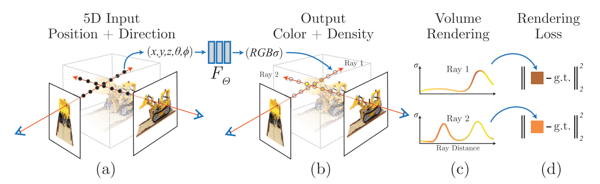

 **为什么写这篇文章** 

网上已经有不少介绍NeRF的文章，这些文章很好地介绍了NeRF论文的核心思想，体素渲染的细节，网络结构，优化策略等等。我这里主要介绍代码实现中 **关于相机参数以及坐标系变换相关的内容，** 这个地方是我觉得初学者容易困惑的地方，特别是没有3D知识基础的读者。

本文的代码讲解以pytorch版本的实现为例：[https://github.com/yenchenlin/nerf-pytorch](https://github.com/yenchenlin/nerf-pytorch)。 **这里假设读者已经看过NeRF论文，并且简单浏览过NeRF的代码。** 

## 总体概览

NeRF的技术其实很简洁，并不复杂。但与2D视觉里考虑的2维图像不同，NeRF考虑的是一个3D空间。下面列的是NeRF实现的几个关键部分：

1. 有一个 **3D空间** ，用一个连续的场表示
1. 空间里存在一个感兴趣的 **物体区域** 
1. 处于 **不同位置和朝向的相机** 拍摄多视角图像
1. 对于一张 **图像** ，根据相机中心和图像平面的一个像素点，两点确定一条 **射线** 穿过3D空间
1. 在射线上采样多个离散的 **3D点** 并利用体素渲染像素的颜色。


这里面涉及到3D空间、物体区域、相机位置和朝向、图像、射线、以及3D采样点等。要想优化NeRF，我们需要能够表达刚刚提到的这些东西。

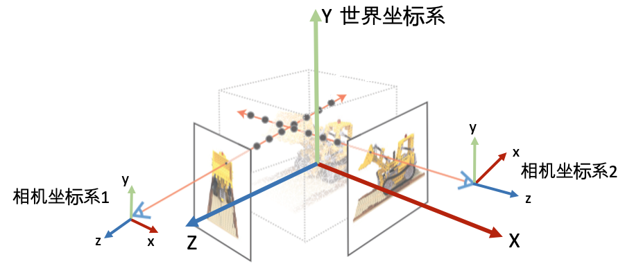

 **坐标系定义：**  为了唯一地描述每一个空间点的坐标，以及相机的位置和朝向，我们需要先定义一个世界坐标系。一个坐标系其实就是由原点的位置与XYZ轴的方向决定。接着，为了建立3D空间点到相机平面的映射关系以及多个相机之间的相对关系，我们会对每一个相机定义一个局部的相机坐标系。下图为常见的坐标系定义习惯。

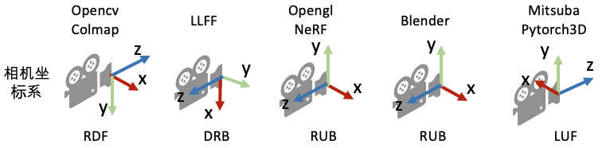

## 相机的内外参数

相机的位置和朝向由相机的外参（extrinsic matrix）决定，投影属性由相机的内参（intrinsic matrix）决定。

注意：接下来的介绍假设矩阵是 **列矩阵(column-major matrix)** ，变换矩阵 **左乘** 坐标向量实现坐标变换（这也是OpenCV/OpenGL/NeRF里使用的形式）。

### 6DoF和相机外参

首先，先解释一下自由度，自由度与刚体在空间中的运动相关。可以理解为物体移动的不同基本方式。

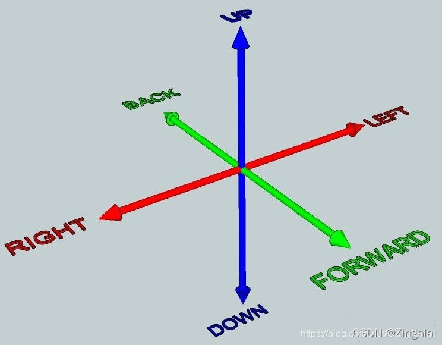

* 平移运动：刚体可以在3个自由度中平移：向前/后，向上/下，向左/右

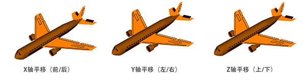

* 旋转运动：刚体在3个自由度中旋转：纵摇(Pitch)、横摇(Roll)、垂摇(Yaw)

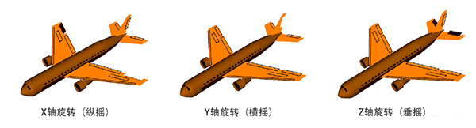

因此，3种类型的平移自由度+3种类型的旋转自由度 = 6自由度

在任意一个自由度中，物体可以沿两个“方向”自由运动。例如，电梯限制在1个自由度中(垂直平移)，但电梯能够在这个自由度中上下运动。同样，摩天轮限制在1个自由度中，但这是旋转自由度，所以摩天轮能够朝相反的方向旋转。
我们可以继续举例子，比如说主题公园。碰碰车总共有3个自由度：它只能在3轴中的2条里平移(无法像电梯那样上下移动);然后它只能以一种方式旋转(无法像飞机那样纵摇和垂摇)。 所以2个平移+1个旋转=3自由度。
无论有多复杂，刚体的任何可能性运动都可以通过6自由度的组合进行表达。 例如在你用球拍击打网球的时候，球拍的复杂运动可以表示为平移和旋转的组合。

对相机再这6个自由度的数值描述即相机外参。

相机外参是一个4x4的矩阵  $M$ ，其作用是将世界坐标系的点  $P_{world}=[x,y,z,1]$  变换到相机坐标系  $P_{camera} = M P_{world}$  下。我们也把相机外参叫做 **world-to-camera (w2c)矩阵** 。（注意用的是4维的齐次坐标，如果不了解齐次坐标系请自行查阅相关资料。）

相机外参的逆矩阵被称为 **camera-to-world (c2w)矩阵** ，其作用是把相机坐标系的点变换到世界坐标系。因为NeRF主要使用c2w，这里详细介绍一下c2w的含义。c2w矩阵是一个4x4的矩阵，左上角3x3是旋转矩阵R，右上角的3x1向量是平移向量T。有时写的时候可以忽略最后一行[0,0,0,1]。

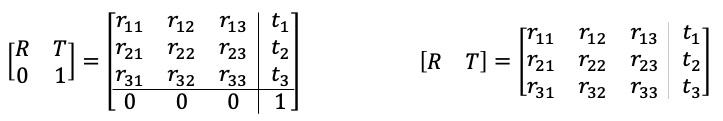

刚刚接触的时候，对这个c2w矩阵的值可能会比较陌生。其实c2w矩阵的值直接描述了相机坐标系的朝向和原点：


具体的， **旋转矩阵的第一列到第三列分别表示了相机坐标系的X, Y, Z轴在世界坐标系下对应的方向；平移向量表示的是相机原点在世界坐标系的对应位置** 。对应于上文所述的6DoF，矩阵的第一列到第三列即描述了3种类型的旋转自由度，第四列即描述了3种平移的旋转自由度。

如果这段描述还是有点抽象，可以尝试进行下列计算帮助自己理解。刚刚讲到c2w是将相机坐标系的向量变换到世界坐标系下，那我们如果将c2w作用到(即左乘)相机坐标系下的X轴[1,0,0,0]，Y轴[0,1,0,0], Z轴[0,0,1,0]，以及原点[0,0,0,1]（注意方向向量的齐次坐标第四维等于0，点坐标第四维等于1），我们会得到它们在世界坐标系的坐标表示：

```python
[R, T][1, 0, 0, 0]^T = [r11, r21, r31]^T # X轴对应的是c2w矩阵的第一列
[R, T][0, 1, 0, 0]^T = [r12, r22, r32]^T # Y轴对应的是c2w矩阵的第二列
[R, T][0, 0, 1, 0]^T = [r13, r23, r33]^T # Y轴对应的是c2w矩阵的第三列
[R, T][0, 0, 0, 1]^T = [t1, t2, t3]^T # 原点对应的是c2w矩阵的第四列
```

从上面可以看到可以看到，将c2w作用到相机坐标系下的X轴、Y轴、 Z轴、以及原点我们会依次得到c2w的四列向量。

### 相机内参

刚刚介绍了相机的外参，现在简单介绍一下相机的内参。

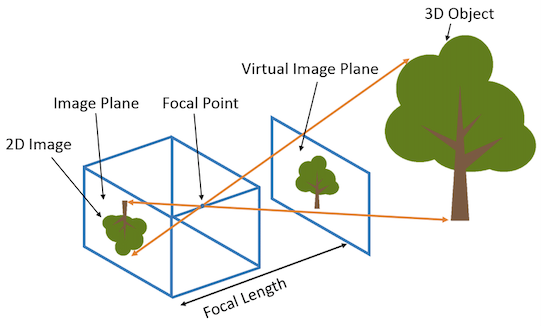

相机的内参矩阵将相机坐标系下的3D坐标映射到2D的图像平面，这里以针孔相机(Pinhole camera)为例介绍相机的内参矩阵K：

$$
K=\left[
\begin{matrix}
    f_x&0&c_x\\0&f_y&c_y\\0&0&1
\end{matrix}
\right]
$$

内参矩阵K包含4个值，其中$f_x$和$f_y$是相机的水平和垂直 **焦距** （对于理想的针孔相机，$f_x=f_y$）。焦距的物理含义是相机中心到成像平面的距离，长度以像素为单位。$c_x$和$c_y$是图像原点相对于相机光心的水平和垂直偏移量。$c_x$，$c_y$有时候可以用图像宽和高的1/2近似:

```python
# NeRF run_nerf.py有这么一段构造K的代码
if K is None:
    K = np.array([
        [focal, 0, 0.5*W],
        [0, focal, 0.5*H],
        [0, 0, 1]
    ])
```

## 如何获得相机参数

NeRF算法假设相机的内外参数是提供的，那么怎么得到所需要的相机参数呢？这里分合成数据集和真实数据集两种情况。

###  **合成数据**  

对于合成数据集，我们需要通过指定相机参数来渲染图像，所以得到图像的时候已经知道对应的相机参数，比如像NeRF用到的Blender Lego数据集。常用的渲染软件还有Mitsuba、OpenGL、PyTorch3D、Pyrender等。渲染数据比较简单，但是把得到的相机数据转到NeRF代码坐标系牵扯到坐标系之间的变换，有时候会比较麻烦。

###  **真实数据**

#### 直接线性变换(DLT)

DLT的目标是求解出矩阵$\bm R=\{r_{ij}\}_{3\times 3}$和向量$\bm t=[t_1,t_2,t_3]^T$，可根据任意点在空间坐标系下的坐标$[x_w,y_w,z_w]^T$计算其在相机坐标系下的坐标$[x_c,y_c,z_c]^T=\bm R[x_w,y_w,z_w]^T+\bm t$，即：

$$
\left[
    \begin{matrix}
        x_c\\y_c\\z_c
    \end{matrix}
\right]
=
\left[
    \begin{matrix}
        r_{11}&r_{12}&r_{13}\\r_{21}&r_{22}&r_{23}\\r_{31}&r_{32}&r_{33}
    \end{matrix}
\right]
\cdot
\left[
    \begin{matrix}
        x_w\\y_w\\z_w
    \end{matrix}
\right]
+
\left[
    \begin{matrix}
        t_1\\t_2\\t_3
    \end{matrix}
\right]
$$

稍微思考一下，其实 **$\bm R$和$\bm t$分别对应坐标系的旋转和平移**。
乘上$\bm R$可以看作是坐标系原点不动，各坐标轴旋转到和相机坐标轴对齐时的该点的坐标$[x_w,y_w,z_w]^T$应该怎么变；加上$\bm t$可以看作是坐标系原点移动$-\bm t$时的点坐标应该怎么变。

在开始解方程之前，通常会将矩阵$\bm R$和向量$\bm t$合写为一个增广矩阵$[\bm R|\bm t]$，并将$P_w$坐标写为一个齐次坐标$\bm X=[x_w,y_w,z_w,1]$，从而上述方程可以写作：

$$
\left[
    \begin{matrix}
        x_c\\y_c\\z_c
    \end{matrix}
\right]
=
\left[
    \begin{matrix}
        r_{11}&r_{12}&r_{13}&t_1\\r_{21}&r_{22}&r_{23}&t_2\\r_{31}&r_{32}&r_{33}&t_3
    \end{matrix}
\right]
\cdot
\left[
    \begin{matrix}
        x_w\\y_w\\z_w\\1
    \end{matrix}
\right]
=[\bm R|\bm t]\cdot\bm X
$$

这个增广矩阵$[\bm R|\bm t]$称为"c2w (camera to world)"矩阵。

现在开始求解。首先左右均除$z_c$：

$$
\left[
    \begin{matrix}
        \frac{x_c}{z_c}\\\frac{y_c}{z_c}\\1
    \end{matrix}
\right]
=\frac{1}{z_c}[\bm R|\bm t]\cdot\bm X
$$

而后将增广矩阵$\frac{1}{z_c}[\bm R|\bm t]$分为三个向量，并将$\frac{x_c}{z_c}$和$\frac{y_c}{z_c}$分别记为$x'$和$y'$：

$$
\left[
    \begin{matrix}
        x'\\y'\\1
    \end{matrix}
\right]
=
\left[
    \begin{matrix}
        \bm p_1^T\\\bm p_2^T\\\bm p_3^T
    \end{matrix}
\right]
\cdot
\bm X
$$


于是可得两个约束：

$$
\begin{aligned}
    x'&=\frac{x_c}{z_c}&=\frac{\bm p_1^T\bm X}{\bm p_3^T\bm X}\\
    y'&=\frac{y_c}{z_c}&=\frac{\bm p_2^T\bm X}{\bm p_3^T\bm X}\\
\end{aligned}
$$

写成线性方程形式：

$$
\begin{aligned}
    \bm p_1^T\bm X-\bm p_3^T\bm Xx'=0\\
    \bm p_2^T\bm X-\bm p_3^T\bm Xy'=0\\
\end{aligned}
$$

转矩阵形式：

$$
\left[
    \begin{matrix}
        \bm X^T&\bm 0&-x'\bm X^T\\
        \bm 0&\bm X^T&-y'\bm X^T\\
    \end{matrix}
\right]
\cdot
\left[
    \begin{matrix}
        \bm p_1\\\bm p_2\\\bm p_3
    \end{matrix}
\right]
=\bm 0
$$

于是，如果有$N$个点$\bm X_1,\dots,\bm X_N$，则可以列出$N$组方程：

$$
\left[
    \begin{matrix}
        \bm X_1^T&\bm 0&-x'_1\bm X_1^T\\
        \bm 0&\bm X_1^T&-y'_1\bm X_1^T\\
        \vdots&\vdots&\vdots\\
        \bm X_N^T&\bm 0&-x'_N\bm X_N^T\\
        \bm 0&\bm X_N^T&-y'_N\bm X_N^T\\
    \end{matrix}
\right]
\cdot
\left[
    \begin{matrix}
        \bm p_1\\\bm p_2\\\bm p_3
    \end{matrix}
\right]
=\bm 0
$$

由于 $[\bm R|\bm t]$ 一共有 12 个值，因此**最少通过六对匹配点**，即可实现矩阵 $[\bm R|\bm t]$ 的线性求解，这种方法(也)称为直接线性变换(Direct Linear Transform, DLT)。当匹配点大于六对时，可以使用 SVD 等方法对超定方程求最小二乘解。

SVD简单来说就是：

$$\hat{\bm x}=\mathop{argmin}\limits_{\bm x}\|\bm A\bm x\|^2 \text{subject to} \|\bm x\|^2=1$$

其中

$$A=
\left[
    \begin{matrix}
        \bm X_1^T&\bm 0&-x'_1\bm X_1^T\\
        \bm 0&\bm X_1^T&-y'_1\bm X_1^T\\
        \vdots&\vdots&\vdots\\
        \bm X_N^T&\bm 0&-x'_N\bm X_N^T\\
        \bm 0&\bm X_N^T&-y'_N\bm X_N^T\\
    \end{matrix}
\right]
$$

$$
\bm x=
\left[
    \begin{matrix}
        \bm p_1\\\bm p_2\\\bm p_3
    \end{matrix}
\right]
$$

>在 DLT 求解中，我们直接将 $[\bm R|\bm t]$ 矩阵看成了 12 个未知数，忽略了它们之间的联系。因为旋转矩阵 $\bm R\in SO(3)$，用 DLT 求出的解不一定满足该约束，它是一个一般矩阵。平移向量比较好办，它属于向量空间。对于旋转矩阵 $R$，我们必须针对 DLT 估计的 $[\bm R|\bm t]$ 的左边$3\times 3$ 的矩阵块，寻找一个最好的旋转矩阵对它进行近似。这可以由 QR 分解完成，相当于把结果从矩阵空间重新投影到 $SE(3)$ 流形上,转换成旋转和平移两部分。
>
>需要解释的是，我们这里的求解去掉了内参矩阵 $\bm K$ 的影响——这是因为内参 $\bm K$ 在 SLAM 中通常假设为已知。如果内参未知，那么我们也能用 PnP去估计 $\bm K$, $\bm R$, $\bm t$ 三个量。然而由于未知量的增多，效果会差一些。

#### PnP算法

>PnP(Perspective-n-Point)是求解 3D 到 2D 点对运动的方法。它描述了当我们知道$n$个 3D 空间点以及它们的投影位置时,如何估计相机所在的位姿。——《视觉SLAM十四讲》

通俗的讲，PnP问题就是在已知世界坐标系下$n$个空间点的真实坐标以及这些空间点在图像上的投影，如何计算相机所在的位姿。换句话说，就是已知量为空间中的真实坐标和图像坐标，求解相机的位姿（未知量）

##### PnP问题的求解方法

PnP问题是在已知$n$个 3D 空间点以及它们的投影位置时估计相机所在的位姿。那么$n$最小为多少时我们才能进行估算呢（最少需要几个3D-2D点对）？
我们可以设想以下场景，设相机位于点$O_c$，而$P_1,P_2,P_3,\dots$为特征点。

* 场景1：$n=1$时：当只有一个特征点$P_1$，我们假设它就在图像的正中央，那么显然向量$\overrightarrow{O_cP_1}$就是相机坐标系中的Z轴，此时相机永远是面对$P_1$，于是相机可能的位置就是在以$P_1$为球心的球面上，此外球的半径也无法确定，于是有无数个解。
* 场景2：$n=2$时：现在多了一个约束条件，显然$O_cP_1P_2$形成一个三角形，由于$P_1$、$P_2$两点位置确定，三角形的边$P_1P_2$确定。再加上向量$O_cP_1$和$O_cP_2$，从$O_c$点射向特征点的方向角也能确定。于是能够计算出$O_cP_1$的长度为$r_1$，$O_cP_2$的长度为$r_2$。于是这种情况下得到两个球：以$P_1$为球心，半径为$r_1$的球A；以$P_2$为球心，半径为$r_2$的球B。显然，相机位于球A，球B的相交处，依旧是无数个解。
* 场景3：$n=3$时：这次又多了一个以$P_3$为球心的球C，相机这次位于ABC三个球面的相交处，终于不再是无数个解了，这次应该会有4个解，其中一个就是我们需要的真解——即相机真实的位姿。
* 场景4：$n>3$时：$n=3$时求出4组解，好像再加一个点就能解决这个问题了，事实上也几乎如此。说几乎是因为还有其他一些特殊情况，这些特殊情况就不再讨论了。$n>3后，能够求出正解了，但为了一个正解就又要多加一个球D显然不够"环保"，为了更快更节省计算机资源地解决问题，先用3个点计算出4组解获得四个旋转矩阵、平移矩阵。根据公式：

$$
\left[
\begin{matrix}
    x\\y\\1
\end{matrix}
\right]
\sim
\left[
\begin{matrix}
    f_x&0&c_x\\0&f_y&c_y\\0&0&1
\end{matrix}
\right]
\cdot
\left[
\begin{matrix}
    r_{11}&r_{12}&r_{13}&t_1\\r_{21}&r_{22}&r_{23}&t_2\\r_{31}&r_{32}&r_{33}&t_3
\end{matrix}
\right]
\cdot
\left[
\begin{matrix}
    X\\Y\\Z\\1
\end{matrix}
\right]
$$

将第四个点的世界坐标代入公式，获得其在图像中的四个投影（一个解对应一个投影），取出其中投影误差最小的那个解，就是我们所需要的正解。

##### PnP算法的数学推导

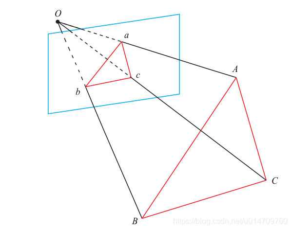

P3P 需要利用给定的三个点的几何关系。它的输入数据为三对 3D-2D 匹配点。记 3D点为 A, B, C,2D 点为 a, b, c,其中小写字母代表的点为大写字母在相机成像平面上的投影，如上图所示。此外，P3P 还需要使用一对验证点,以从可能的解出选出正确的那一个(类似于对极几何情形)。记验证点对为 D − d,相机光心为 O。
请注意,我们知道的是A, B, C 在**世界坐标系中的坐标**,而不是在**相机坐标系中的坐标**。

首先,显然,三角形之间存在对应关系：

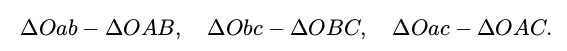

对于三角形Oab 和 OAB，利用余弦定理可得：

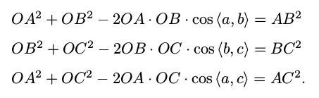

对上面三式全体除以 OC^2 ，并且记 x = OA/OC， y = OB/OC，得：

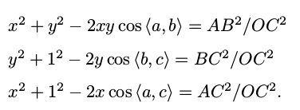

记 v = AB^2 /OC ^2 , uv = BC^2 /OC^2 , wv = AC^2 /OC^2 ,有:

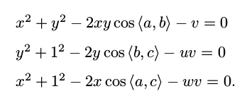

我们可以把第一个式子中的 v 放到等式一边,并代入第 2,3 两式,得:

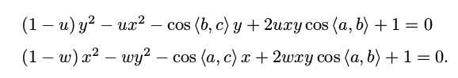

由于我们知道 2D 点的图像位置,三个余弦角cos ⟨a, b⟩ , cos ⟨b, c⟩ , cos ⟨a, c⟩是已知的。同时,u = BC^2 /AB^2 , w = AC^2 /AB^2 可以通过A, B, C 在世界坐标系下的坐标算出,变换到相机坐标系下之后,并不改变这个比值，所以也是已知量。该式中的 x, y 是未知的,随着相机移动会发生变化。

因此，**P3P问题最终可以转换成关于 x, y 的一个二元二次方程(多项式方程)**

该方程最多可能得到**四个解**（有上一小节也可以得出该结论）,但我们可以用验证点来计算最可能的解，得到 A, B, C 在相机坐标系下的 3D 坐标以及相机的位姿。

##### PnP算法的缺陷

P3P 也存在着一些问题：

1. P3P 只利用三个点的信息。当给定的配对点多于 3 组时,难以利用更多的信息。
2. 如果 3D 点或 2D 点受噪声影响,或者存在误匹配,则算法失效。
所以后续人们还提出了许多别的方法，如 EPnP、 UPnP 等。它们利用更多的信息，而且用迭代的方式对相机位姿进行优化,以尽可能地消除噪声的影响。

#### Colmap

对于真实场景，比如我们用手机拍摄了一组图像，怎么获得相机位姿？目前常用的方法是利用运动恢复结构(structure-from-motion, SFM)技术估计几个相机间的相对位姿。这个技术比较成熟了，现在学术界里用的比较多的开源软件包是COLMAP： [https://colmap.github.io/](https://colmap.github.io/)。输入多张图像，COLMAP可以估计出相机的内参和外参(也就是sparse model)。

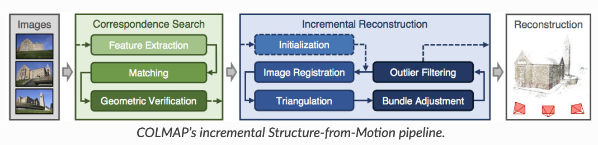

下面是COLMAP官网教程给的三个命令行操作步骤，简单来说： 第一步是对所有的图像进行特征点检测与提取，第二步是进行特征点匹配，第三步是进行SFM恢复相机位姿和稀疏的3D特征点。具体的使用方法和原理还请阅读其官方文档。其实COLMAP也集成了multiview stereo (MVS)算法用于重建场景完整的三维结构(也称为dense model)。不过NeRF本身是一种新颖的场景表征和重建算法，我们只需要相机的位姿信息，所以我们不需要跑MVS进行dense重建。注意：如果没有标定信息，基于单目的SFM无法获得场景的绝对尺度。

```bash
# The project folder must contain a folder "images" with all the images.
$ DATASET_PATH=/path/to/dataset
$ colmap feature_extractor \
 --database_path $DATASET_PATH/database.db \
 --image_path $DATASET_PATH/images
$ colmap exhaustive_matcher \
 --database_path $DATASET_PATH/database.db
$ mkdir $DATASET_PATH/sparse
$ colmap mapper \
 --database_path $DATASET_PATH/database.db \
 --image_path $DATASET_PATH/images \
 --output_path $DATASET_PATH/sparse
```

使用COLMAP得到相机参数后只需要转成NeRF可以读取的格式即可以用于模型训练了。那这里面需要做什么操作？

## LLFF真实数据格式

NeRF代码里用load_llff.py这个文件来读取真实的数据，第一次看到LLFF这个词可能不知道是什么意思。其实LLFF [GitHub - Fyusion/LLFF: Code release for Local Light Field Fusion at SIGGRAPH 2019](https://github.com/fyusion/llff) 是NeRF作者的上一篇做新视角合成的工作。为了和LLFF方法保持一致的数据格式，NeRF使用load_llff.py读取LLFF格式的真实数据，并建议大家使用LLFF提供的的[imgs2poses.py](https://github.com/Fyusion/LLFF/blob/master/imgs2poses.py)文件获取所需相机参数。

### COLMAP到LLFF数据格式

imgs2poses.py这个文件其实很简单，就干了两件事。

* 第一件事是调用colmap软件估计相机的参数，在sparse/0/文件夹下生成一些二进制文件：cameras.bin, images.bin, points3D.bin, project.ini。
* 第二件事是读取上一步得到的二进制文件，保存成一个poses_bounds.npy文件。


这里有一个细节需要注意，就是在pose_utils.py文件里load_colmap_data()函数的倒数第二行，有一个操作将colmap得到的c2w旋转矩阵中的第一列和第二列互换，第三列乘以负号：

```python
# LLFF/llff/poses/pose_utils.py
def load_colmap_data(realdir):
 ... 
 # must switch to [-u, r, -t] from [r, -u, t], NOT [r, u, -t]
 poses = np.concatenate([poses[:, 1:2, :], poses[:, 0:1, :], -poses[:, 2:3, :], poses[:, 3:4, :], poses[:, 4:5, :]], 1)
 return poses, pts3d, perm
```

还记得刚刚提到c2w旋转矩阵的三列向量分别代表XYZ轴的朝向，上述操作实际上就是把相机坐标系轴的朝向进行了变换：X和Y轴调换，Z轴取反，如下图所示：

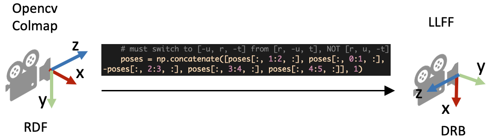

### poses_bounds.npy里有什么

load_llff.py会直接读取poses_bounds.npy文件获得相机参数。poses_bounds.npy是一个Nx17的矩阵，其中N是图像的数量，即每一张图像有17个参数。其中前面15个参数可以重排成3x5的矩阵形式：

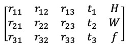

最后两个参数用于表示场景的范围 **Bounds (bds)** ，是该相机视角下场景点离相机中心最近(near)和最远(far)的距离，所以near/far肯定是大于0的。

* 这两个值是怎么得到的？是在imgs2poses.py中，计算colmap重建的 **3D稀疏点** 在各个相机视角下最近和最远的距离得到的。
* 这两个值有什么用？之前提到体素渲染需要在一条射线上采样3D点，这就需要一个采样区间，而near和far就是定义了采样区间的最近点和最远点。贴近场景边界的near/far可以使采样点分布更加密集，从而有效地提升收敛速度和渲染质量。


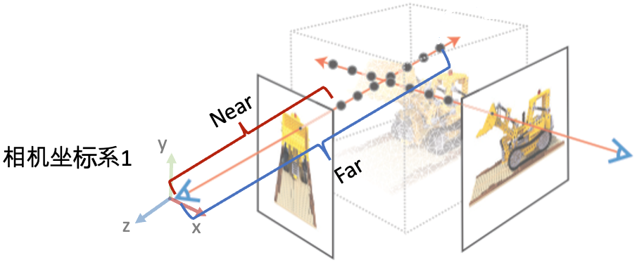

## load_llff.py代码解读

接着，我们介绍NeRF代码里load_llff.py代码里的一些细节。对三维视觉不熟悉的读者，早期读代码的时候可能会有不少困惑。

### DRB到RUB的变换

第一个疑问是，为什么读进poses_bounds.npy里的c2w矩阵之后，对c2w的旋转矩阵又做了一些列变换？

```python
# load_llff.py文件
def load_llff_data(basedir, factor=8, recenter=True, bd_factor=.75, spherify=False, path_zflat=False):
 
 poses, bds, imgs = _load_data(basedir, factor=factor) # factor=8 downsamples original imgs by 8x
 print('Loaded', basedir, bds.min(), bds.max())
 
 # Correct rotation matrix ordering and move variable dim to axis 0
 poses = np.concatenate([poses[:, 1:2, :], -poses[:, 0:1, :], poses[:, 2:, :]], 1)
 ...
```

上面的代码段的最后一行实际上是把旋转矩阵的第一列（X轴）和第二列（Y轴）互换，并且对第二列（Y轴）做了一个反向。这样做的目的是将LLFF的相机坐标系变成OpenGL/NeRF的相机坐标系，如下图所示。

![poses = np.concatenate([poses[:, 1:2, :], -poses[:, 0:1, :], poses[:, 2:, :]], 1)](zhimg.com/v2-5e780f468e73b8e2e21913b3722986d8_r.jpg)

### 缩放图像需要修改什么相机参数？

在_load_data()函数里，有一个用于图像缩放的factor比例参数，将HxW的图像缩放成(H/factor)x(W/factor)。这里面有一个问题是如果缩放了图像尺寸，相机的参数需要相应的做什么变化？

* 做法是： **外参（位置和朝向）不变，相机的焦距f，cx, 和cy等比例缩放** 。下图的示意图展示了当相机位置不变，相机视野(Field of view, FOV)不变的情况下，图像的高和焦距长短的关系。


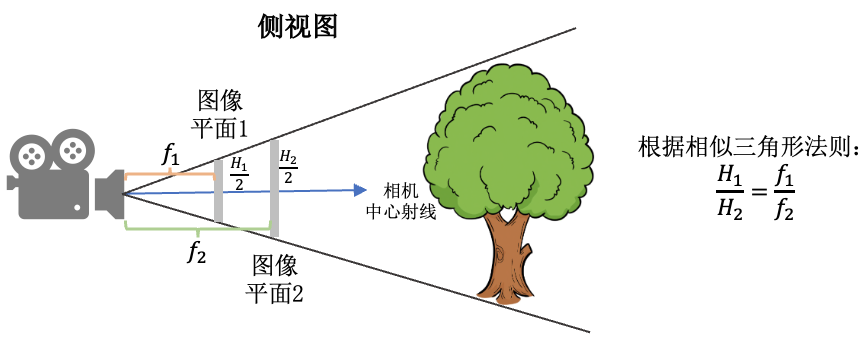

### viewmatrix()

view_matrix是一个构造相机矩阵的的函数，输入是相机的 **Z轴朝向** 、 **up轴的朝向** (即相机平面朝上的方向Y)、以及 **相机中心** 。输出下图所示的camera-to-world (c2w)矩阵。因为Z轴朝向，Y轴朝向，和相机中心都已经给定，所以只需求X轴的方向即可。又由于X轴同时和Z轴和Y轴垂直，我们可以用Y轴与Z轴的叉乘得到X轴方向。

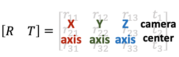

下面是load_llff.py里关于view_matrix()的定义，看起来复杂一些。其实就是比刚刚的描述比多了一步：在用Y轴与Z轴叉乘得到X轴后，再次用Z轴与X轴叉乘得到新的Y轴。为什么这么做呢？这是因为传入的up(Y)轴是通过一些计算得到的，不一定和Z轴垂直，所以多这么一步。

```python
# load_llff.py
def viewmatrix(z, up, pos):
 vec2 = normalize(z)
 vec1_avg = up
 vec0 = normalize(np.cross(vec1_avg, vec2))
 vec1 = normalize(np.cross(vec2, vec0))
 m = np.stack([vec0, vec1, vec2, pos], 1)
 return m
```

### poses_avg()

这个函数其实很简单，顾名思义就是多个相机的平均位姿（包括位置和朝向）。输入是多个相机的位姿。

* 第一步对多个相机的中心进行求均值得到 **center** 。
* 第二步对所有相机的Z轴求平均得到 **vec2** 向量（方向向量相加其实等效于平均方向向量）。
* 第三步对所有的相机的Y轴求平均得到 **up** 向量。
* 最后将vec2, up, 和center输入到刚刚介绍的viewmatrix()函数就可以得到平均的相机位姿了。


```python
def poses_avg(poses):
 hwf = poses[0, :3, -1:]
 center = poses[:, :3, 3].mean(0)
 vec2 = normalize(poses[:, :3, 2].sum(0))
 up = poses[:, :3, 1].sum(0)
 c2w = np.concatenate([viewmatrix(vec2, up, center), hwf], 1)
 
 return c2w
```

下图展示了一个poses_avg()函数的例子。左边是多个输入相机的位姿，右边是返回的平均相机姿态。可以看出平均相机位姿的位置和朝向是之前所有相机的均值。

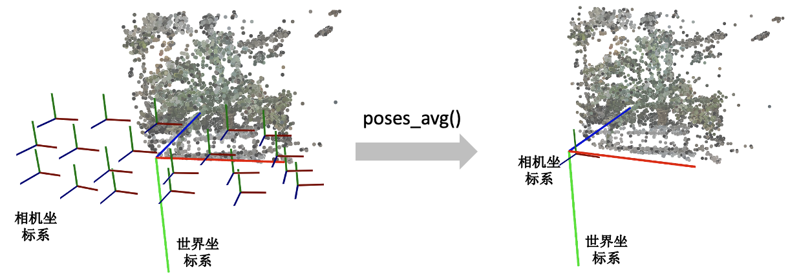

### recenter_poses()

recenter_poses()函数的名字听起来是中心化相机位姿（同样包括位置和朝向）的意思。输入N个相机位姿，会返回N个相机位姿。

具体的操作了解起来可能有点跳跃。第一步先用刚刚介绍的poses_avg(poses)得到多个输入相机的平均位姿c2w，接着用这个平均位姿c2w的逆左乘到输入的相机位姿上就完成了归一化。

```python
def recenter_poses(poses):
 poses_ = poses+0
 bottom = np.reshape([0,0,0,1.], [1,4])
 c2w = poses_avg(poses)
 c2w = np.concatenate([c2w[:3,:4], bottom], -2)
 bottom = np.tile(np.reshape(bottom, [1,1,4]), [poses.shape[0],1,1])
 poses = np.concatenate([poses[:,:3,:4], bottom], -2)
 poses = np.linalg.inv(c2w) @ poses
 poses_[:,:3,:4] = poses[:,:3,:4]
 poses = poses_
 return poses
```

首先我们要知道利用同一个旋转平移变换矩阵左乘所有的相机位姿是对所有的相机位姿做一个 **全局的旋转平移变换** ，那下一个问题就是这些相机会被变到什么样的一个位置？我们可以用平均相机位姿作为支点理解，如果把平均位姿的逆c2w^-1左乘平均相机位姿c2w，返回的相机位姿中旋转矩阵为单位矩阵，平移量为零向量。也就是变换后的平均相机位姿的位置处在世界坐标系的原点，XYZ轴朝向和世界坐标系的向一致。

下图我们用一个例子帮助理解。左边和右边分别是输入和输出的相机位姿示意图。我们可以看到变换后的多个相机的平均位姿处在世界坐标系的原点，并且相机坐标系的XYZ轴与世界坐标系保持一致了。

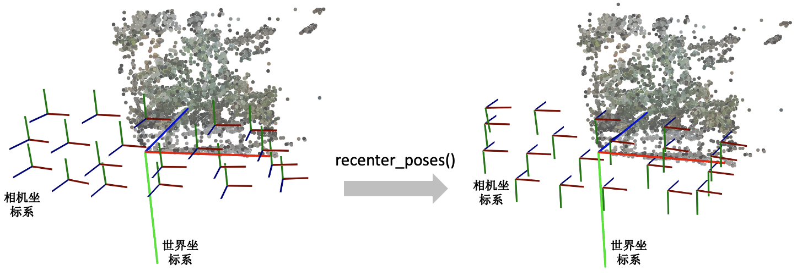

### render_path_spiral()

这个函数写的有点复杂，它和模型训练没有关系，主要是用来生成一个相机轨迹用于新视角的合成，如下面视频所示：
[https://www.zhihu.com/video/1589569584843169793](https://www.zhihu.com/video/1589569584843169793)
下面只放了render_path_spiral()函数的定义，NeRF代码里还有一段是在准备输入参数，由于相关代码比较长就不贴出来。

```python
def render_path_spiral(c2w, up, rads, focal, zdelta, zrate, rots, N):
 render_poses = []
 rads = np.array(list(rads) + [1.])
 hwf = c2w[:,4:5]
 
 for theta in np.linspace(0., 2. * np.pi * rots, N+1)[:-1]:
 c = np.dot(c2w[:3,:4], np.array([np.cos(theta), -np.sin(theta), -np.sin(theta*zrate), 1.]) * rads) 
 z = normalize(c - np.dot(c2w[:3,:4], np.array([0,0,-focal, 1.])))
 render_poses.append(np.concatenate([viewmatrix(z, up, c), hwf], 1))
 return render_poses
```

需要知道这个函数它是想生成一段螺旋式的相机轨迹，相机绕着一个轴旋转，其中相机始终注视着一个焦点，相机的up轴保持不变。简单说一下上面的代码：

首先是一个for循环，每一迭代生成一个新的相机位置。c是当前迭代的相机在世界坐标系的位置，np.dot(c2w[:3,:4], np.array([0,0,-focal, 1.])是焦点在世界坐标系的位置，z是相机z轴在世界坐标系的朝向。接着使用介绍的viewmatrix(z, up, c)构造当前相机的矩阵。

下面这个图可视化了 render_path_spiral()生成的轨迹。

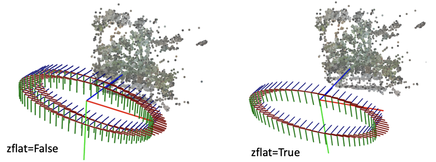

### spherify_poses()

刚刚介绍的render_path_spiral()假设所有相机都朝向某一个方向，也就是所谓的faceforward场景。对于相机围绕着一个物体拍摄的360度场景，NeRF代码提供了一个spherify_poses()的函数用于"球面化"相机分布并返回一个环绕的相机轨迹用于新视角合成。这里插一句，在训练360度场景的时候，需要配合"--no_ndc --spherify --lindisp"三个参数以得到好的结果，具体原理这里不展开介绍。

```python
 if spherify:
 poses, render_poses, bds = spherify_poses(poses, bds)
```

这个函数也比较复杂，前半部分是在将输入的相机参数进行归一化，后半部分是生成一段相机轨迹用于合成新视角。对输入相机参数进行归一化时，思路是：

* 用 pt_mindist = min_line_dist(rays_o, rays_d)找到离所有相机中心射线距离之和最短的点（可以先简单理解成场景的中心位置）


```python
 rays_d = poses[:,:3,2:3]
 rays_o = poses[:,:3,3:4]
 def min_line_dist(rays_o, rays_d):
 A_i = np.eye(3) - rays_d * np.transpose(rays_d, [0,2,1])
 b_i = -A_i @ rays_o
 pt_mindist = np.squeeze(-np.linalg.inv((np.transpose(A_i, [0,2,1]) @ A_i).mean(0)) @ (b_i).mean(0))
 return pt_mindist
 pt_mindist = min_line_dist(rays_o, rays_d)
```

* 将得到的场景中心位置移到世界坐标系的原点，同时将所有相机z轴的平均方向转到和世界坐标系的z轴相同


```python
 center = pt_mindist
 up = (poses[:,:3,3] - center).mean(0)
 vec0 = normalize(up)
 vec1 = normalize(np.cross([.1,.2,.3], vec0))
 vec2 = normalize(np.cross(vec0, vec1))
 pos = center
 c2w = np.stack([vec1, vec2, vec0, pos], 1)
 poses_reset = np.linalg.inv(p34_to_44(c2w[None])) @ p34_to_44(poses[:,:3,:4])
```

* 最后将相机的位置缩放到单位圆内


```python
 rad = np.sqrt(np.mean(np.sum(np.square(poses_reset[:,:3,3]), -1)))
 sc = 1./rad
 poses_reset[:,:3,3] *= sc
```

下面这个图可视化了spherify_poses()返回的结果。

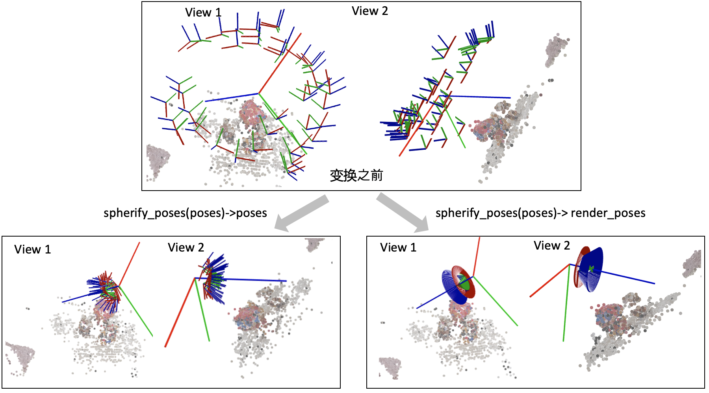

## 3D空间射线怎么构造

最后我们看一下这个射线是怎么构造的。 **给定一张图像的一个像素点，我们的目标是构造以相机中心为起始点，经过相机中心和像素点的射线。** 

首先，明确两件事：

1. 一条射线包括一个起始点和一个方向，起点的话就是相机中心。对于射线方向，我们都知道两点确定一条直线，所以除了相机中心我们还需另一个点，而这个点就是成像平面的像素点。
1. NeRF代码是在相机坐标系下构建射线，然后再通过camera-to-world (c2w)矩阵将射线变换到世界坐标系。


通过上述的讨论，我们第一步是要先写出相机中心和像素点在相机坐标系的3D坐标。下面我们以OpenCV/Colmap的相机坐标系为例介绍。相机中心的坐标很明显就是[0,0,0]了。像素点的坐标可能复杂一点：首先3D像素点的x和y坐标是2D的图像坐标 (i, j)减去光心坐标 (cx,cy)，然后z坐标其实就是焦距f (因为图像平面距离相机中心的距离就是焦距f)。

所以我们就可以得到射线的方向向量是  $(i-c_x, j-c_y, f) - (0, 0, 0) = (i-c_x, j-c_y, f)$  。因为是向量，我们可以把整个向量除以焦距f归一化z坐标，得到  $(\frac{i-c_x}{f}, \frac{j-c_y}{f}, 1)$  。

接着只需要用c2w矩阵把相机坐标系下的相机中心和射线方向变换到世界坐标系就搞定了。

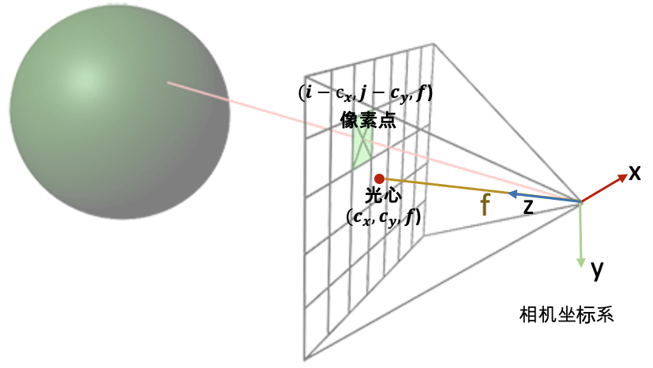

下面是NeRF的实现代码。但关于这里面有一个细节需要注意一下：为什么函数的第二行中dirs的y和z的方向值需要乘以负号，和我们刚刚推导的的  $(\frac{i-c_x}{f}, \frac{j-c_y}{f}, 1)$  不太一样呢？

```python
def get_rays_np(H, W, K, c2w):
 i, j = np.meshgrid(np.arange(W, dtype=np.float32), np.arange(H, dtype=np.float32), indexing='xy')
 dirs = np.stack([(i-K[0][2])/K[0][0], -(j-K[1][2])/K[1][1], -np.ones_like(i)], -1)
 # Rotate ray directions from camera frame to the world frame
 rays_d = np.sum(dirs[..., np.newaxis, :] * c2w[:3,:3], -1) # dot product, equals to: [c2w.dot(dir) for dir in dirs]
 # Translate camera frame's origin to the world frame. It is the origin of all rays.
 rays_o = np.broadcast_to(c2w[:3,-1], np.shape(rays_d))
 return rays_o, rays_d
```

这是因为OpenCV/Colmap的相机坐标系里相机的Up/Y朝下, 相机光心朝向+Z轴，而NeRF/OpenGL相机坐标系里相机的Up/朝上，相机光心朝向-Z轴，所以这里代码在方向向量dir的第二和第三项乘了个负号。

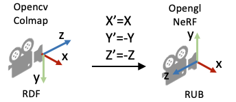

## 更多阅读材料：

前面简单地介绍了下NeRF代码中关于相机参数和坐标系变换的内容，这里面有很多细节没有展开介绍，如果有错误还请批评指正。另外，如果初学者希望进一步学习3D、图形学渲染相关的知识，可以浏览下面的一些网站（不全面，仅供参考）：

* Scratchapixel系列：[https://www.scratchapixel.com/](https://www.scratchapixel.com/index.php?redirect)
* 很棒的一个网站，这个网站里介绍了很多关于计算机图形学渲染的知识。可以从头开始学习或者直接先看 [Computing the Pixel Coordinates of a 3D Point](https://www.scratchapixel.com/lessons/3d-basic-rendering/computing-pixel-coordinates-of-3d-point)
* The Perspective Camera - An Interactive Tour：[https://ksimek.github.io/2012/08/13/introduction/](https://ksimek.github.io/2012/08/13/introduction/)
* 这个网站介绍了相机的内外参数和分解，Dissecting the Camera Matrix part1/part2/part3
* 一篇很详细的关于体素渲染和NDC空间的博客：[A Surge in NeRF | Will](https://yconquesty.github.io/blog/ml/nerf/)


下面是关于NeRF研究方向的一些文章（不全面，仅供参考）：

* [Frank Dellaert-NeRF Explosion 2020](https://dellaert.github.io/NeRF/)
* [Frank Dellaert-NeRF at ICCV 2021](https://dellaert.github.io/NeRF21/)
* [NeRF at CVPR 2022](https://dellaert.github.io/NeRF22/)
* [每周分类神经辐射场: https://github.com/sjtuytc/LargeScaleNeRFPytorch/blob/main/docs/weekly_nerf_cn.md](https://github.com/sjtuytc/LargeScaleNeRFPytorch/blob/main/docs/weekly_nerf_cn.md)
