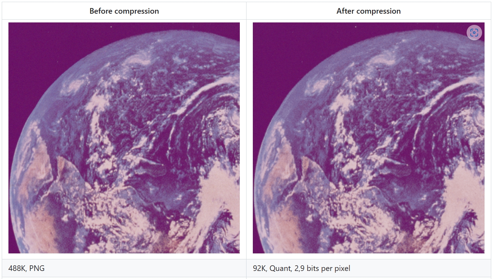
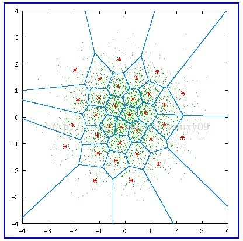

# 矢量量化

模型压缩中的其他相关方法：[《一些常见的模型量化方法》](../人工智能/quant.md)

用码书中与输入矢量最匹配的码字的索引代替输入矢量进行传输与存储，而解码时仅需要简单地查表操作

各类矢量量化讲解文中都会拿出这样一张图解释矢量量化过程：

其中，绿色点对应输入坐标，红星点为量化输出，共有32个红心点，即量化后的数据宽度为5bit，蓝色的线划分了每个量化输出对应的区域；

量化过程：对于每个绿色点，其所在的区域的红心点的编号(0-31)为量化结果。

反量化过程：根据绿色点的量化结果（红心点编号）查出红心点坐标，即反量化结果。

名词|解释|对应内容
-|-|-
code vectors|码矢|红星点坐标
encoding regions|编码区域|蓝色的划分区域
codebook|码书|红星点编号和坐标的对应关系表

上面这张图称为沃罗诺伊图(Voronoi diagrams)，也称作狄利克雷镶嵌(Dirichlet tessellation)，是由俄国数学家Georgy Fedoseevich Voronoi建立的空间分割算法。灵感来源于笛卡尔用凸域分割空间的思想。在几何，晶体学建筑学，地理学，气象学，信息系统等许多领域有广泛的应用。

[《一些常见的模型量化方法》](../人工智能/quant.md)中所介绍的K-means矢量量化是矢量量化的一种。
复习一下，在K-means矢量量化中，K-means将矢量数据（如像素RGB值）聚为指定数量的类，然后每一个类用一个量化值代替，所以其和Voronoi diagrams的区别只是划分区域和选码矢的方式不同。