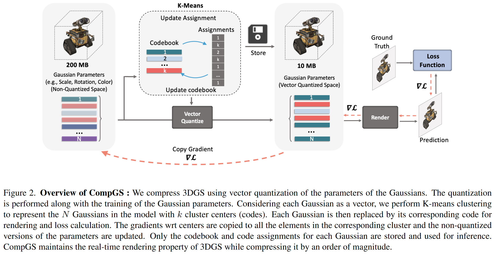
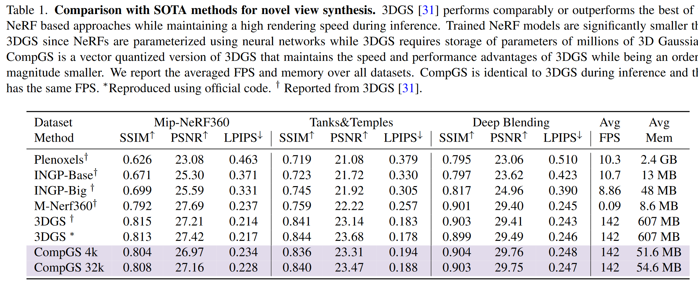

# 可微矢量量化

前置知识：[《一些常见的模型量化方法》](../人工智能/quant.md)

## (SIGGRAPH'22) Variable Bitrate Neural Fields (Vector-Quantized Auto-Decoder, VQ-AD): 用于Feature Grid压缩的矢量量化思想

这论文把矢量量化的思想用到Feature Grid的训练和存储中，从而压缩模型的大小。
具体来说，本文的方法是把InstantNGP中使用空间hash函数查表的方法改成了一个可训练的indices。

前置知识：InstantNGP
* [《体渲染、体素、位置编码——主流Nerf质量优化和计算加速方法学习》](./Nerf加速.md)
* [《【转载】NeRF系列工作总结》](./NeRF系列工作总结.md)

在InstantNGP中，hash表的values可以视为矢量量化中的码矢，训练过程实际上就是在对这个码矢进行训练。
照这个思路，InstantNGP中codebook的key就是由空间hash函数生成的值。
但是，矢量量化的一个很重要的思想就是要对输入向量进行聚类，保证输入向量和其对应的码矢尽可能接近，而InstantNGP中feature值相近的region（内容相似的区域）经过空间hash出来的值随机均匀分布在指定范围内，于是相近的输入向量并不一定会对应到同一个码矢。

所以这样其实并不符合矢量量化的思想，矢量量化通常用聚类等方法让输入向量和其对应的码矢尽可能接近，在InstantNGP的场景就是内容相似的区域对应到同一个码矢。
本文就是要解决这个问题。

符号|含义
-|-
$D\in\mathbb R^{2^b\times k}$|存储$2^b$个$k$维feature的codebook
$m$|空间等分为grid，grid每个顶点都对应一个feature，feature数量共$m$个
$V\in\mathbb Z^m$，取值范围$[0,2^b-1]$|grid的$m$个顶点对应的feature在codebook中的位置
$C\in\mathbb R^{m\times 2^b}$|softened indices矩阵，grid的$m$个顶点都能从其中查出一个$2^b$维向量

### 训练过程中的forward

1. （同InstantNGP）对于每个输入坐标，计算其在grid里的那个cube中，算出cube的8个顶点编号
2. 对于每个顶点，在$C$中查出$2^b$维向量，经过一个softmax激活函数
3. 把这个$2^b$维向量与$D$中的$2^b$个$k$维feature依次相乘后求和，作为这个顶点的feature
4. （同InstantNGP）插值、过MLP、渲染

这样，用可训练的softened indices矩阵$C$代替没法训练的hash函数indices，间接达到聚类的效果。

### 训练结束后的数据转换

softened indices矩阵$C$很大，显然不能直接存它，但是在前面训练的时候让它经过一个softmax激活函数就是为了让它里面的值变成one-hot的，于是直接$V=\text{argmax}_iC[i]$就把它转化为了一个$m$个$b$ bit整数的index表。

### 推断时的forward

1. （同InstantNGP）对于每个输入坐标，计算其在grid里的那个cube中，算出cube的8个顶点编号
2. 对于每个顶点，在$V$中查出$b$ bit整数即其feature在feature表中$D$的位置
3. 根据这个位置从$D$中找出这个顶点的feature
4. （同InstantNGP）插值、过MLP、渲染

### 压缩效果

#### 对比InstantNGP

原文中的描述：

>In contrast to using a hash function [Müller et al. 2022] for indexing, we need to store 𝑏-bit integers in the feature grid but we are able to use a much smaller codebook (table) due to the learned adaptivity of the indices.

比InstantNGP多存$m$个$b$ bit整数，空间划分越细$m$越大。

这种方法用可训练的softened indices间接达到聚类的效果，所以同样的codebook长度其质量要比用空间hash的InstantNGP更好。

实验结果可以看出，VQ-AD主要的存储占用都是那$m$个$b$ bit整数，反倒是codebook成了大头，不过整体上还是VQ-AD更小。

bw表示bitwidth，比如10bw表示codebook $D$的长度是$2^{10}$。
根据这里的VQ-AD在6bw时$V$大小可以算出其将空间划分方式和feature的长度：
* $477\text{kB}/6\text{bit}=651264$，所以空间中共有651264个grid顶点
* $8\text{kB}/2^6=128\text{B}$，论文前面说了特征值是fp16，所以每个feature由64个浮点数组成

1bw的时候codebook应该只有两个feature，这样都能比InstantNGP效果好？

#### 对比其他压缩方法

对比的其他压缩方法都是在模型训练完进行后处理

* LRA: low-rank approximation 低秩估计，具体是用的Karhunen-Loeve Transform（其实就是PCA），即对codebook进行特征值分解，保留较大的特征值
* kmVQ: 对codebook进行[K-means矢量量化](../人工智能/quant.md)

总之就是VQ-AD效果最好

## Compact3D: Compressing Gaussian Splat Radiance Field Models with Vector Quantization: 用于压缩3D Gaussian Splatting的矢量量化和量化感知训练

主要是对高斯点的参数进行K-means量化，并且提出了对应的量化感知训练方法。

被量化的高斯点参数包括四种：颜色、球谐系数、scale、rotation，每种的量化都独立进行，有各自的codebook。

没被量化的高斯点参数是位置和透明度。显然位置被矢量量化了会导致高斯点重合，没有意义；透明度是个标量值不需要矢量量化。

### 量化过程

[K-means矢量量化](../人工智能/quant.md)直接拿来用

### 量化感知训练过程

forward pass: 和通常的量化感知一样，具体如下：
* 高精度参数（高斯点参数）->量化->反量化->得到低精度参数（码矢）->推断->得到梯度

backward pass: 通常的量化感知训练是用反向传播梯度更新高精度参数上，再通过量化操作重新生成低精度参数，但是本文的低精度参数是K-means生成的，每次反向传播都进行一次K-means量化生成低精度参数显然不现实，所以作者每100轮才进行一次K-means量化生成codebook，具体如下：
* 用反向传播梯度同时更新高精度参数和低精度参数
  * 低精度参数的梯度等于所有用了这个码矢的参数梯度之和
    * 每个高精度参数都有一个梯度，每个码矢的梯度对应多个高精度参数，所以有多个梯度
  * 用低精度参数的梯度更新高精度参数
* 每100轮重新进行K-means量化生成codebook

这个操作相当于对整个编码区域中的点进行平移，这样，位于编码区域边缘的点就会在下一次K-means量化中被聚类到别的区域里

### 效果

虽然还是很大，但是已经压了很多了，在某些数据集上甚至比没有向量量化的原版3DGS还高那么一丢丢：

消融实验总之就是我最好：

