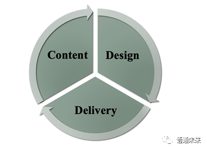

# Presentation skills (1)

## The major characteristics of a good presentation

An academic presentation is a prepared and formal talk given by a speaker in public. It is a powerful way to transmit your message to an audience in a clear and structured way within a time limit. Do you know any of the characteristics of a good presentation?

Actually, a good presentation has many characteristics. The major characteristics are listed below.

A good presentation is accurate. As we know, one of the purposes of making presentations is to convey accurate and concise information about academic studies. To keep the presentation accurate, the presenters may apply some techniques such as using terminology, explaining obscure terms clearly and reducing vague expressions. If possible, the presenters may use diagrams in the presentation to illustrate their points. And flow charts can also be used in the presentation to describe complex process. The data reported in the presentation should be concrete, too.

Brevity is the soul of wit. A good presentation is also featured with brevity. A simple and brief presentation can help the audience get the most important points. The presenters can use basic words for profound meanings and lessen slides’ contents and make more oral explanations.

Another characteristic of a good presentation lies in clarity. To a presenter, it means a big failure if the audience cannot remember any of the points presented in the speech. That’s why the presenters try to think of ways to make the contents of the presentation clearly presented. For example, in the presentation, the presenters prefer to choose simpler words and sentences, helping the audience understand the meaning of the presentation as quickly as possible. They also make efforts to reinforce the slide’s attraction, such as making slides easier to follow and just containing the necessary information in the slides. 

**Accuracy**, **brevity** and **clarity** are the major characteristics of a good presentation introduced in this text. Do you know any other characteristics of a good presentation? Share with your peers about these characteristics and then discuss the tips for making the presentation so effective.

# Conference Presentation Skills (2)

1. What is an academic presentation?
   * Academic presentation is a prepared and formal talk given by a speaker in public. It is a powerful way to transmit your message to an audience in a clear and structured way with in a time limit.
2. Ways to overcome stage fright.
   1. Prepare well
   2. Learn tachniques to relax (breathing exercises, imagery, familiar face location)
   3. Visualize yourself speaking successfully
   4. Utilize notes/outlines
   5. Practice
   6. Don't apologize for your nervousness
   7. Understand mistakes are going to happen
3. Guidelines for PPT slides
   * Using text
     1. 6 by 6 rule
     2. No paragraphs
     3. Bullet points, no sentences
     4. A separate line for each point
     5. Give each slide a title
   * Using graphics
     1. Use scanned images of high quality
     2. All relevant to the text
     3. Replace text with graphics if better
     4. Images should be simple and clear
4. What Makes a Good Presentation?

