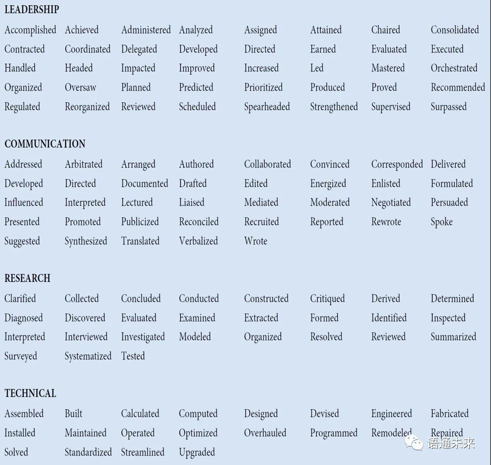
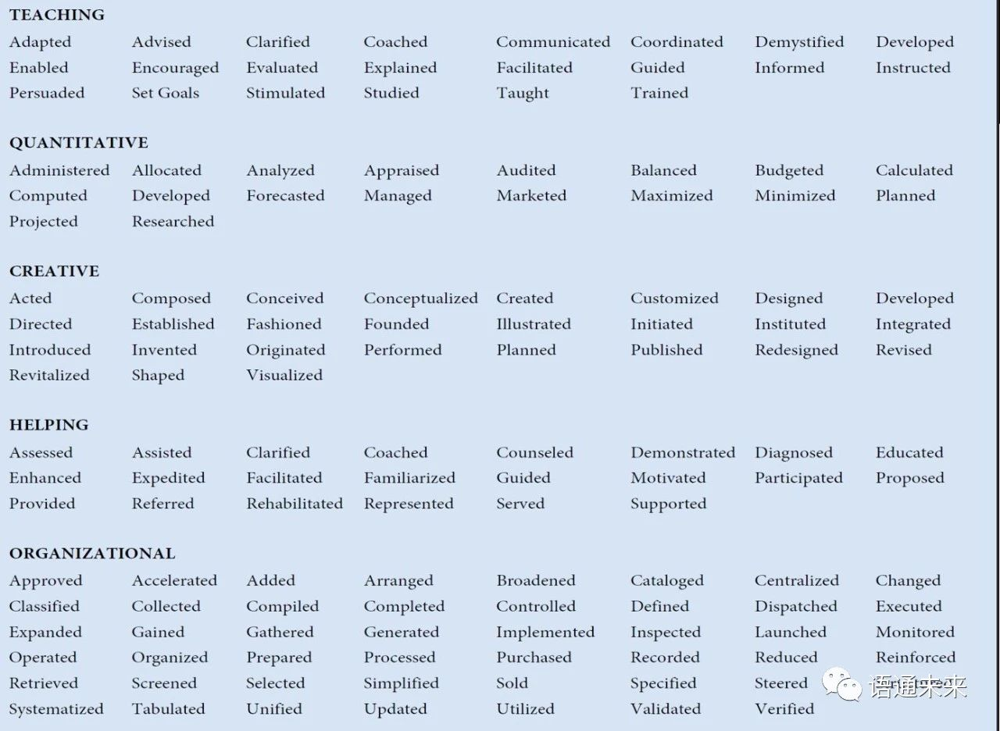
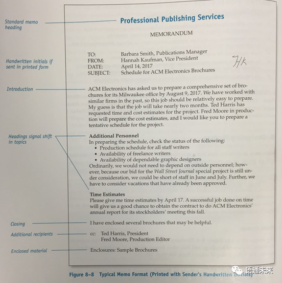

# 英语课复习

# Presentation skills (1)

## The major characteristics of a good presentation

An academic presentation is a prepared and formal talk given by a speaker in public. It is a powerful way to transmit your message to an audience in a clear and structured way within a time limit. Do you know any of the characteristics of a good presentation?

Actually, a good presentation has many characteristics. The major characteristics are listed below.

A good presentation is accurate. As we know, one of the purposes of making presentations is to convey accurate and concise information about academic studies. To keep the presentation accurate, the presenters may apply some techniques such as using terminology, explaining obscure terms clearly and reducing vague expressions. If possible, the presenters may use diagrams in the presentation to illustrate their points. And flow charts can also be used in the presentation to describe complex process. The data reported in the presentation should be concrete, too.

Brevity is the soul of wit. A good presentation is also featured with brevity. A simple and brief presentation can help the audience get the most important points. The presenters can use basic words for profound meanings and lessen slides’ contents and make more oral explanations.

Another characteristic of a good presentation lies in clarity. To a presenter, it means a big failure if the audience cannot remember any of the points presented in the speech. That’s why the presenters try to think of ways to make the contents of the presentation clearly presented. For example, in the presentation, the presenters prefer to choose simpler words and sentences, helping the audience understand the meaning of the presentation as quickly as possible. They also make efforts to reinforce the slide’s attraction, such as making slides easier to follow and just containing the necessary information in the slides. 

**Accuracy**, **brevity** and **clarity** are the major characteristics of a good presentation introduced in this text. Do you know any other characteristics of a good presentation? Share with your peers about these characteristics and then discuss the tips for making the presentation so effective.

# Conference Presentation Skills (2)

1. What is an academic presentation?
   * Academic presentation is a prepared and formal talk given by a speaker in public. It is a powerful way to transmit your message to an audience in a clear and structured way with in a time limit.
2. Ways to overcome stage fright.
   1. Prepare well
   2. Learn tachniques to relax (breathing exercises, imagery, familiar face location)
   3. Visualize yourself speaking successfully
   4. Utilize notes/outlines
   5. Practice
   6. Don't apologize for your nervousness
   7. Understand mistakes are going to happen
3. Guidelines for PPT slides
   * Using text
     1. 6 by 6 rule
     2. No paragraphs
     3. Bullet points, no sentences
     4. A separate line for each point
     5. Give each slide a title
   * Using graphics
     1. Use scanned images of high quality
     2. All relevant to the text
     3. Replace text with graphics if better
     4. Images should be simple and clear
4. What Makes a Good Presentation?

# Opening Speech

## 1. An overview

Opening speech

* signals the start of any special event or occasion requiring aformal opening.
* also called Welcome speech.
* usually delivered by the chairperson or a well-known authority in the field or a distinguished guest.
* a prelude to a conference, setting the keynote of the conference.

## 2. Basic elements

* Acknowledge and welcome any important guests
* Welcome and thank all the guests, stating the name of the event
* Thank the organizations/individuals involved (optional)
* Introduce the history/backgrounds of the event
* Give information about the contents and purposes of this conference
* Conclude with good wishes to the conference and the participants

## 3. Good presentations: typical features

Audiences from all parts of the world appreciate presentations that:
* are professional and are delivered by someone who is credible and  confident
* look like they were prepared specifically for us and make it immediately clear why we should be interested
* have clear slides, with minimal detail and helpful and/orentertaining images
* tell us interesting, curious, and counterintuitive things
* don’t make us work too hard to follow what is being said—two or  three main points, lots of examples, and not too much theory
* are delivered in a friendly, enthusiastic, and relatively informal way
* entertain us and interact with us

## 4. Bad presentations: typical features

No audience will be pleased to attend a presentation where the speaker:
* has clearly not practiced the presentation
* has no clear introduction, a confused structure, and no conclusions
* appears to be talking to himself/herself rather than engaging with  the audience
* reads the slides
* has a series of similar slides full of text and diagrams
* relies on animations
• fails to address the audience’s interest and only sees things from his/her point of view
* is too technical, too detailed
* speaks too fast, speaks with a monotone, speaks for too long
* shows little interest in his/her topic

# Introducing keynote speakers

1. Introducer to keynote speaker can be the chairperson or a particular person instead.
2. Introduction should cover the keynote speaker’s personal background, education background, academic achievements, awards, and administrative positions if he or she has.
3. Academic achievements involve monographs and articles published as well as patents.
4. Before introducing the keynote speaker, the introducer should make sure that he or she can pronounce the speaker’s name correctly.
5. The moment the introducer finishes his or her introduction, he or she should extend a warm welcome to the keynote speaker.

# Keynote speech writing

A keynote speech is an address designed to present the issues of primary interest to an assembly (such as a political convention) and often to arouse unity and enthusiasm. A good keynote speech is inspirational and unifying for its audience.

Before you start writing a keynote speech, you need to know:
* **WHY** you are giving a keynote speech (the purpose)
* **WHO** you are writing your speech for (the audience)
* **WHAT** your speech is going to be about (its topic, main points)
* **HOW** long your speech is going to be (its length)

The first step in developing a strong sense of speech organization is to gain command of the three basic parts of a speech—introduction, body, and conclusion—and the strategic role of each.

Your first job in the introduction is to get the attention and interest of the audience. You can do this by posing a question, telling a story, making a startling statement, or opening with a quotation. The purpose of all these methods is to create a dramatic, colorful opening that will make your audience want to hear more. In addition to gaining attention and interest, the introduction should orient your listeners toward the subject matter of your speech.

After getting the audience’s attention and revealing your topic, you are ready to move into the body of your speech. There are many ways to organize the points in a speech. The following strategic orders are commonly used to organize the speech.
1. **Chronological Order**: Speeches arranged chronologically follow a time pattern. They may narrate a series of events, explain a process or demonstrate how to do something.
2. **Spatial Order**: Speeches arranged in spatial order follow a directional pattern, i.e. the main points proceed from top to bottom, left to right, east to west, or some other route.
3. **Causal Order**: You can deal first with the effects and then with the causes.
4. **Problem-Solution Order**: Speeches arranged in problem-solution order are divided into two main parts—the existence and seriousness of a problem and a workable solution to the problem.
5. **Topical Order**: The speech topic is divided into subtopics, each of which becomes a main point in the speech.

When you finish discussing your final point, you will be ready to move onto your conclusion. You need to accomplish two tasks in this part of the speech: let the audience know you are about to finish and reinforce your major theme. You may end your speech with a direct wind-up, a brief summary or solicitation of comments.

# Question and Answer Session

## Learning Objectives

* to learn how to handle the question & answer session
* to know tips for facilitating the question & answer session
* to get familiar with the useful expressions
* to succeed in role playing

## I. Its importance

* a short but crucial part of a presentation
* listeners: get the chance to clarify some parts of the presentation; ask the speaker to expand on some interesting topics

## II. Its advantages

* The message by the speaker is reinforced through the recall of its important points;
* The audience have a chance to ask and learn more about those aspects in which they are most interested;
* Speakers can receive valuable feedback information about audience reaction to the speech.

## III. How to handle the Q&A session?

1. Prepare well, have a good understanding of your audience and the questions you’ll encounter;
2. Be prepared to wait several seconds for the first question;
3. If silence prevails, break the tension to encourage the audience;
4. Get questions heard and understood by all;
5. For irrelevant questions, quickly dismiss them;
6. Your answers, be direct and to the point;
7. Use printed materials and visual aids, if necessary;
8. For questions you cannot answer, just say “I don’t know”, or ask someone else to answer;
9. Do not allow one person to dominate the session;
10. Conclude the Q&A artistically, keep an eye on the clock.

## IV. Q&A Do’s and Don'ts
### Do’s
* Do prepare some questions and answers beforehand;
* Do address questioners one on one, if possible;
* Do repeat the question so that all attendees can hear;
* Do understand the question fully before answering it;
* Do offer concise and direct answers;
* Do stay within your own area of expertise;
* Do apologize for being unable to take every question if  you run out of time;
* Do state your appreciation to close your Q & A;

### Don’ts
* Don’t answer a question that has already been asked;
* Don’t let a single questioner dominate the Q & A  session;
* Don’t lose your composure;
* Don’t bluff.

# Closing Speech Writing

## Definition

A closing speech is a formal talk given by a distinguished guest at the closing ceremony of a conference. Generally speaking, it consists of the basic elements, such as appreciation, summary, evaluation, expectation, invitation and declaration.

## Things to Be Done

In a good closing speech, we should at least do the following things:
* thanking all the related persons and organizations
* commenting on the contributions of the conference
* noticing the arrangement for the next conference
* declaring the conference closed

Typically, the function of closing speeches is to summarize the conference and to motivate participants to take action.

## Structure

Based on the function mentioned above, we can divide the closing speech into the 5 sections:

1. Gratitude Expression: we may express thanks to keynote speakers, participants, moderator(s), organizer(s), and sponsor(s).
2. Review or Summary: we may review or summarize briefly what has been done at the conference.
3. Evaluation: we may evaluate the conference properly on the achievements, significance or influences.
4. Invitation: we may extend an invitation to the next conference.
5. Declaration: we will declare the closing of the conference.

The closing speech is the last thing that the participants will hear at the conference. Let’s make it impressive and well-organized.

# Writing instructions and user manuals

In this section, we first introduce **technical communication** and how it differs from general communication.

**Technical communication**: the process of finding and using information and sharing meaning. It includes the process of making and sharing information in the workplace, and a set of applications -- the documents you write.

**General communication** vs. **Technical communication**

General communication|Technical communication
-|-
Contains a   general message|Contains a technical message
Informal in   style and approach.|Mostly formal
No set pattern of   communication.|Follows a set pattern
Mostly oral.|Both oral and written
Not always for a specific audience|Always for a specific audience
Does not involve   the use of technical vocabulary or graphics, etc.|Frequently involves jargon, graphics, etc.

Next, we elaborate on the writing of instructions.

We start with the definition of instructions.

**Instruction**: process descriptions written to help users perform a specific task.

Then, we explain the 4-stage writing process

**planning---drafting--revising--editing**

In the *planning stage*, we analyze our target readers, the language(s) they use, the situation they read the instructions, the form of the instruction etc.

When two or more languages are used, we should consider whether to follow the *Simultaneous design* or *Sequential design*.

In the *planning stage*, we also have **safety design**. We use signal words to indicate the seriousness of the advice and put them in very prominent places. A reasonable amount of repetition may also be necessary.

In the *planning stage*, we  need to consider how to best present the instruction to make it more attractive. Use of graphics and airy design will help.

Now we come to the *drafting stage*. We can divide the instruction into four parts: title, introduction, body and conclusion.

**Title**

We have two ways to write titles, how to... or gerund. E.g. How to install a water heater or installing a water heater.

**Introduction**

We provide preliminary information in order to ensure safe and successful installing. Information of the targeted readers, purposes of this instruction, safety measures and tools to be used, duration of the task may be introduced.

**Body**

In the body part, we present step-by-step instructions on how to perform the task.

Here, we should follow the guidelines.

1. Present the right amount of information.
2. Use the imperative mood.
3. State the action first, then follow it feedback such as reasons or conditions.
4. Number the steps.
5. Don’t omit articles to save space.

**Conclusion**: in this part, we can tell our readers that they have successfully completed the task, then follow it by what to do next, or some maintenance tips or trouble-shooting guide.

**In the revising and editing steps**, we work to improve the design and the readability of the document we write. Inviting some people who are at the same understanding level of our target readers may help. Make sure that the instructions are honest, clear, accurate, comprehensive, accessible, concise, professional in appearance and correct. The ultimate goal is to ensure successful and safe installing.

User manuals are similar to instructions in many ways. They contain much of the same sort of information found in a set of instructions. The main difference between the two is that a manual has more elaborate front matter and back matter.

**Front matter and back matter** are used to describe the first and last pages of a user manual. Front matter includes table of contents, title page, conventions section, trademarks etc. Back matter refers to specifications of the device or system, safety regulations, industry code, copyright pages etc.

# Resume

## 1. What to Include in Your Resume？

Here's some information that you should be sure to include on your resume:

### Identification

- Include your name, **address**, telephone number, and email address in the **identification section** at the top of  your resume, or consider one of these other options for addressing your resume.
- Use a professional email address (i.e., johnsmith@gmail.com rather than soccerlover@hotmail.com).
### Objective
- This section is optional. If you decide to include a **resume objective**, keep it **concise** and **specific**; state your desired job or field, and what you hope to accomplish  in that field.

### Profile

- Another optional section is a **resume profile** which includes a summary of your skills, experiences, and goals written specifically for a job posting.
### Education: Here's more information on what to include and how to format a **resume education section**.
- Include the degrees you have received in reverse chronological order (with the most recent degree listed first).
- Be sure to  include the name of each institution, its location, and your date of graduation (or expected date of graduation)
- When applicable, include your major/minor fields, as well as your GPA and any honors, publications, and projects.
- Unless you are a current high school student, do not include your high school degree.

### Experience

Here is more information on the **experience section of a resume**, including what to list, and how to format it.

- Include your work experience in reverse chronological order (with the most recent degree listed first).
- This section can include jobs, internships, and volunteer work. **High school students** might also include clubs and sports teams when applicable.
- Include the  name of the company, the position, and dates of employment.
- List roughly three important tasks, accomplishments, or skills gained at each job. Use **action verbs** to describe your achievements; avoid passive phrases such as responsible for and duties include.

### Skills (Optional): Here's information on the **skills section of a resume**.

- Include any  computer systems with which you are proficient, particularly if they are  related to the position for which you are applying.
- Include  foreign languages with which you are familiar; state both the language and  your level of familiarity (beginning, intermediate, proficient, fluent).
- List any other skills you have that relate to the job but are not included elsewhere in your resume.

### Volunteer Work (Optional)

- You can include a volunteer experience section to convey your leadership, **communication skills**, etc. List the name of the organization, the dates of your **volunteer work**, and your achievements.

### Hobbies and Interests (Optional)

- You can also include a section on your hobbies and interests if they relate to the position. For example, if you are applying to work at a sporting goods store, you can include your passion for basketball.

## 2.  Types of Resume 

There are three **basic types of resume formats** you can use. The format you select will depend on your employment history and credentials.

- **Chronological**: This is the most      frequently used and presents your work history starting with the most      recent job first.
- **Functional**: If you have a spotty      work history, you may want to use a functional resume that focuses on your      skills and experience.
- **Combination**: This resume layout      includes both your skills and your chronological work history.

>The chronological format is the most common one.

## 3. Information to Avoid

Do not include personal information such as birthday, height, weight, marital status, children, etc., unless the position requires it.

## 4. Accuracy

Be sure to edit your resume before sending it. Check spelling, grammar, tenses, names of companies and people, etc. Have a friend or **career services counselorcheck** over your resume as well. Use this **proofreading checklist** to make sure your resume is perfect.

# Cover Letter

## 1. What is a Cover Letter?

A **letter of application**, also known as a **cover letter**, is a document sent with your resume to provide additional information about your skills and experience to an employer. The letter of application is intended to provide detailed information on why you are are a qualified candidate for the job.

>Effective application letters explain the reasons for your interest in the specific organization and identify your most relevant skills.

Your application letter should let the employer know what position you are applying for, what makes you a strong candidate, why they should select you for an interview, and how you will follow up.

## 2. What to Include in Your Letter

As with all cover letters, a job application letter is divided into sections:

* The heading,  which includes your name and contact information.
* A greeting addressed to a specific  person, if possible.
* The introduction, which should include why the  applicant is writing.
* The body,  which discusses your relevant qualifications.
* The close,  which thanks the reader and provides contact information and follow-up  details.
* Your signature to end the letter.

How you sign your cover letter will depend on whether you're sending a paper or email letter. If you're sending a paper letter, type your name after the salutation, leaving a space for your handwritten signature. If you're sending an email cover letter, type your name and contact information after your salutation.

## Action Verbs for your resume

# Introduction to TC

1. What are the differences between general communication and technical communication?
   
General Communication|Technical Communication
-|-
Contains a general message|Contains a technical message
Informal in style and approach|Mostly formal
No set pattern of communication|Follows a set pattern
Mostly oral|Both oral and written
Not always for a specific audience|Always for a specific audience
Involve no technical vocabulary or graphics, etc.|Frequently involves jargon, graphics, etc.
2. What are the objectives of technical communication?
   * To provide organized information that aids in quick decision-making
   * To invite corporate joint ventures
   * To disseminate knowledge in oral or written form
3. What are the characteristics of technical communication?
   * correct
   * accurate
   * clear
   * appropriate
   * to the point
4. At what levels does communication take place?
   * Extrapersonal communication: communication between human beings and non-human entities
   * Intrapersonal communication: communication within an individual
   * Organizational communication: communication in an organization at different hierarchical levels
     * including internal-operational, external-operational, and personal communication
   * Mass communication: communication through mass media such as journals, books, television, newspapers

# Drafting Emails for Work

1. What should we do first when we write an email in the workplace?
   * find out the company's email policies
     * circumstances under which we may and may not use email
     * principles we should use in writing emails
     * the monitoring of employee email
2. Email etiquette
   * Write correctly
    * Use appropriate formality
    * Use proper structure and layout 
    * Identify yourself and the topic
    * Be careful with formatting 
    * Be concise and to the point 
    * Use proper spelling, grammar, and punctuation 
    * Re-read the email before sending it 
    * Do not write in CAPITALS 
    * Avoid long sentences 
    * Use active instead of passive voice 
    * Keep the language gender-neutral 
    * Maintain coherence
    * Answer swiftly
    * Answer all questions, and pre-empt further questions 
    * Use templates for frequently used responses 
    * Take care with abbreviations and emoticons 
    * Be kind. Donot flame.
    * Do not overuse Reply All
    * Do not overuse the high priority option 
    * Do not attach unnecessary files 
    * Do not use email to discuss confidential matters 
    * Avoid using URGENT and IMPORTANT
    * Do not reply to spam 
    * Don’t forward a message to an online discussion forum without the writer’s permission 
    * Don’t send a message unless you have something to say

## Checklist

* Did you refrain from discussing nonbusiness subjects?
* Did you keep the email as brief as possible and send it only to appropriate people?
* Did you use appropriate formality
* Did you write correctly?
* Did you avoid flaming?
* Did you write a specific, accurate subject line?
* Did you use uppercase and lowercase letters?
* Did you skip lines between paragraphs?
* Did you keep the line length under 65 characters?
* Did you check with the writer before forwarding his or her message?

# Memo writing

## General introduction to memo

abbrev.: memo; from Latin *memorandum* est, "It must be remembered"

a written message that may be used in the workplace

In business:
A memo is typically used by firms or institution for **short internal communication**.

The memo format is often used for **sharing short reports and proposals** or for **communicating changes in policies**.

## Audience and purpose

$\quad$|$\quad$
-|-
Audience|Internal
Purpose|to inform, to request information, to  persuade, to deliver bad new, or to confirm, etc.
Medium|printed or email
Format|an organized, concise format; block format;  usually one or two pages

## Samples

**Introduction**: the introduction should help readers get oriented to each document’s purpose and scope. Remember to establish the rhetorical context early in the introduction so that recipients understand why they’re receiving the memo and why they should continue reading.

**Body**: The body is, of course, where the bulk of your important information goes. To support readers in effectively reading your memos, you should utilize effective organizational strategies to guide readers efficiently through the memo: descriptive subheadings, bulleted lists, topic sentences and transitional sentences, and visuals to complement written text, especially complex information. 

**Conclusion**:  a. summarizes the basic message of the document, and calls readers to any necessary action that should be taken as a result.  b. Additionally, because a memo is a correspondence that seeks to maintain a positive workplace environment, it may also include a courteous closing that leaves readers with a very clear understanding of what they need to do with the information provided, e.g “Please let me know by Wednesday if you have any questions about this new policy.”

## Format

The format of a memo follows the general guidelines of technical and professional writing----block format.

1. single spaced
2. left justified (flush left)
3. Skip a line between sentences  to show new paragraphs (instead of using indentations)
4. No indents for paragraph.

Usually a page or two long.

Technical and professional materials should be concise and easy to read. Therefore, it is beneficial to use headings and lists to help the readers pinpoint certain information.