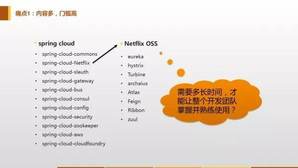
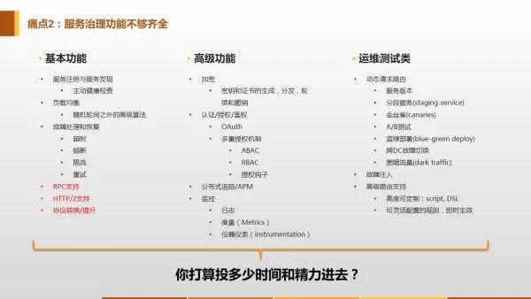
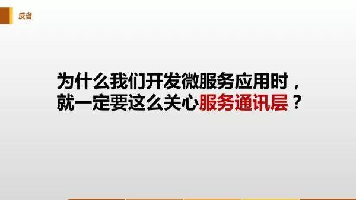
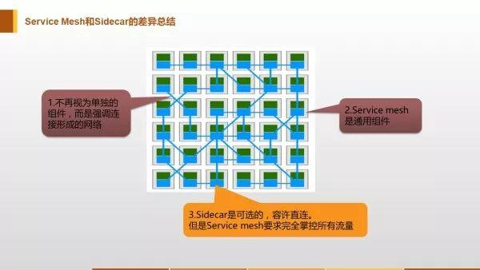

# Service Mesh 服务网格——从何而来

[参考教程](https://time.geekbang.org/article/2360)
[参考教程](https://www.servicemesher.com/istio-handbook/intro/service-mesh-the-microservices-in-post-kubernetes-era.html)

Service Mesh 是一个**基础设施层，用于处理服务间通信**。云原生(Cloud Native)应用有着复杂的服务拓扑，Service Mesh 保证请求可以在这些拓扑中可靠地穿梭。在实际应用当中，Service Mesh 通常是由**一系列轻量级的网络代理组成的**，它们与应用程序部署在一起，但应用程序不需要知道它们的存在。

## 特点

* 应用程序间通讯的中间层
* 轻量级网络代理
* 应用程序无感知
* 解耦应用程序的重试、超时、监控、追踪和服务发现

## 历史

### 软件开发中通信方式的演进

1. 从最原始的主机之间直接使用网线相连
2. 网络层的出现
3. 集成到应用程序内部的控制流
4. 分解到应用程序外部的控制流
5. 应用程序的中集成服务发现和断路器
6. 出现了专门用于服务发现和断路器的软件包/库，Twitter’s Finagle和 Facebook's Proxygen。这时候还是集成在应用程序内部
7. 出现了专门用于服务发现和断路器的开源软件，如：NetflixOSS ecosystem
8. 最后作为微服务的中间层Service Mesh出现以及Cloud Native概念的提出

### 阶段5->6->7->8的演进架构图

### 框架演进架构图

## 从Spring Cloud到Service Mesh

### Spring Cloud：功绩和痛点

同为微服务框架，Service Mesh被视为Spring Cloud之后的新一代微服务技术框架。从历史演进上来说，Spring Cloud是上一节中所写的第5-7阶段的技术集成。

* Spring Cloud解决的痛点：在微服务应用程序的中，每个微服务里面都要手写一遍服务发现和断路器等功能，因此有很多非功能性代码，Spring Cloud把这些代码集成成为一个个库，用几行代码加几个注释就能搞定，极大地简化了开发
* Spring Cloud自身的痛点：
  1. 内容多，门槛高，学完很费时间：这是最大的痛点。**业务开发团队的强项不应该是技术，而应该是对业务的理解，是对整个业务体系的熟悉程度**。微服务只是手段，业务才是重点，在与业务逻辑关系不大的地方投入太多精力是业务团队的大忌。而且，高门槛还会阻碍对已有业务的微服务改造。
  2. 功能不够：很多功能都需要在 Spring Cloud 的基础上自己解决。
  3. 不能跨语言：微服务的概念刚出来的时候就说要跨语言，但是Spring Cloud居然完全不能跨语言。而且，Spring Cloud框架是侵入式的，这意味着，如果要在Spring Cloud框架下实现跨语言，那对每个语言都要实现一个Spring Cloud框架，基本是个不可能的任务。
  4. 更新和兼容性问题：当某次服务端更新导致客户端也要一起更新时就会出现这个问题，因为不能保证每个用户都能按时更新，而Spring Cloud在一开始就没有考虑过多版本共存的问题，因此会出现v2.0的服务器服务v1.0的客户端，这种情况下，解决兼容性就会成为一个大问题。

#### 问题在于服务间通信

* 根源：上面说的这些痛点和微服务实现了什么功能半毛钱关系都没有，问题的根源只是服务间的通信问题
* 本质：正因为服务间的通信和服务本身的功能没有关系，所以不管服务间的通信方式如何变化，服务间通信的内容是不会变的
* 目标：Spring Cloud在微服务开发中的作用只不过是让客户端的业务请求（通信的内容）去到一个正确的地方

### Service Mesh：解决痛点——技术栈下移，避免服务间的直接连接

#### 类比曾经的TCP协议

#### 微服务领域的TCP/IP协议——Sidecar和Service Mesh

微服务间的通信全部通过Sidecar代理实现

## 从Kubernetes到Istio Service Mesh

* Kubernetes 的本质是应用的**生命周期管理**，具体来说就是部署和管理（扩缩容、自动恢复、发布）
* Kubernetes 为微服务提供了可扩展、高弹性的部署和管理平台
* Service Mesh 的基础是**透明代理**，通过 sidecar proxy 拦截到微服务间流量后再通过控制平面配置管理微服务的行为
* Service Mesh 将流量管理从 Kubernetes 中解耦，Service Mesh 内部的流量无需 kube-proxy 组件的支持，通过为更接近微服务应用层的抽象，管理服务间的流量、安全性和可观察性，因此能实现**对每个服务做细粒度的控制**
* Envoy xDS 定义了 Service Mesh 配置的协议标准
* Service Mesh 是对 Kubernetes 中的 service 更上层的抽象，它的下一步是 serverless

下图展示的是 Kubernetes 与 Istio Service Mesh 中的的服务访问关系

从图中可以看出k8s的proxy方式和Istio Service Mesh的proxy方式的不同：

* k8s架构中的proxy是每个node一个kube-proxy，一个node中所有pod的流量都经过同一个proxy，每个kube-proxy都从k8s api server中获取配置，通过设置iptables规则的方式进行代理和请求转发
* Istio Service Mesh 中沿用了Kubernetes中的pod和node架构做服务注册，通过一个 Control Plane 来控制proxy。
