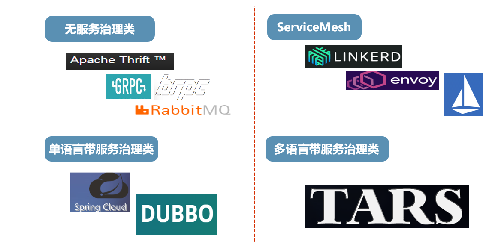

# 微服务的模式语言-1-服务拆分、部署与框架

## 服务拆分(Decomposition)

如何把应用拆分为若干个服务？如何界定服务的范围？

### 根据业务能力拆分（Decompose by business capability）

根据业务能力界定服务的范围，这两条原则都来自面向对象思想。

* 单一职责原则(Single Responsibility Principle, SRP)：一个类应只有一个需要被修改的理由（如果一个类具有多个不同的职责，那么就会有多个不同的原因使程序员修改这个类，而这种修改将影响到该类不同职责的使用者）。
* 共同封闭原则(Common Closure Principle, CCP)：将那些会因为同一种原因进行修改的类放在一个微服务里。当业务规则发生变化时，只需要修改很少量的代码——理想情况是只需要修改一个微服务的代码。

### 根据领域的子域拆分（Decompose by subdomain）

根据领域驱动设计中子域的概念界定服务的范围

## 部署模式（Deployment patterns）

如何部署应用程序的服务？微服务的部署应有以下需求：

* 服务是使用各种不同的语言和不同版本的框架编写的
* 每个服务都包含多个服务实例，以提高吞吐量和可用性
* 每个服务都可独立部署和水平扩展
* 每个服务的实例都与其他实例互相隔离
* 可限制服务消耗的计算资源
* 能监控每个服务实例的行为
* 可快速编译部署
* 可靠的部署
* 尽可能低成本的部署

### 单主机上部署服务的多个实例（Multiple service instances per host）

把服务的多个实例部署在一台主机上。例如：

* 将每个服务部署在独立的JVM上，每个服务都独享一个Tomcat或Jetty。
* 把多个服务部署在一个JVM上，多个服务共用一个Tomcat或Jetty。

优点：

* 更有效地利用计算资源

缺点：

* 有资源需求冲突的风险，平衡各服务间的计算资源是一个问题
* 有依赖版本冲突的风险，不能保证所有服务都可以用在一个版本的Tomcat或者Jetty下正常运行
* 多个服务部署于同一个JVM的时候很难监控单个服务的资源消耗

### 单主机上部署服务的单个实例（Single service instance per host）

把服务的单一实例部署在它独享的主机上。

优点：

* 服务实例间都是互相独立的
* 不存在资源分配问题，每个服务都可以跑满各自的主机
* 容易监控和管理

缺点：

* 计算资源的利用率可能不高

### 服务实例与虚拟机一一对应（Service instance per VM）

把服务的单一实例部署在它独享的虚拟机上。例如：

* Netflix将每个服务打包为EC2系统镜像(AMI)并且将其部署为EC2实例。

优点：

* 扩展应用的方式非常简单直接。在Amazon Autoscaling Groups上甚至可以按照服务的负载自动进行扩展
* 虚拟机可以对服务的构建和启动的细节进行封装。例如，封装不同服务的启动过程使得每个服务都以同样的方式启动。
* 每个服务实例都是独立的
* 虚拟机可以限制服务消耗的计算资源
* 一些IaaS服务提供商（例如Amazon）为部署和管理虚拟机提供了[成熟且功能丰富的基础架构](../云计算/AWS.md)

缺点：

* 构建虚拟机比构建应用更麻烦

### 服务实例与容器一一对应（Service instance per Container）

把服务打包为容器镜像，从而将单一实例部署在它独享的容器上。目前用于应用的容器化打包和部署的技术主要是Docker，而部署和管理Docker集群的应用有Kubernetes、Marathon/Mesos、Amazon EC2 Container Service等。

优点：

* 水平扩展的方式非常直接，只要改变容器实例的数量即可。
* 容器镜像封装了服务的构建和启动细节
* 每个服务实例都是独立的
* 通过容器化可以限制服务消耗的计算资源
* 容器的构建速度和启动速度远大于虚拟机

缺点：

* 部署容器的基础架构不如部署虚拟机的基础架构丰富

### 无服务器部署（Serverless deployment）

使用无服务器部署平台部署服务实例。无服务器部署平台隐藏了后端的所有服务器架构，包括物理和虚拟硬件、操作系统、容器等，部署平台只获取到客户的服务代码和要求的资源限制，客户按照代码运行的资源消耗付费。

无服务器部署服务的代表有AWS Lambda、Google Cloud Functions、Azure Functions等。这些服务面向无状态网络应用，按照事件或请求数等指标收费，服务的运行模式是有请求则调起运行，无请求则暂停。

以AWS Lambda为例。AWS Lambda函数是被调用以处理事件的无状态组件，它要求用户以函数或组件的方式上传一段代码，并为其指定接口名称和计算资源限制。当事件发生时AWS Lambda会自动找到一个可用的实例对事件进行处理，并且还能在大量事件发生时自动增加实例数量以平衡负载。AWS Lambda支持4种事件：

* S3 bucket中有对象被创建
* DynamoDB表中有数据修改
* Kinesis流中有数据到达
* Simple email service收到邮件

AWS Lambda函数还可以配置为AWS Lambda Gateway以处理HTTP请求。在这种模式下，当HTTP请求到达时，AWS Gateway会把请求转化为JSON Object传递给AWS Lambda函数并以函数返回值生成HTTP响应。

AWS Lambda函数还可以配置为定时运行，例如每5分钟运行一次。

优点：

* 完全不需要在硬件、虚拟机和操作系统等底层组件上耗费时间，专注于代码就好
* 无状态函数和组件的部署方式赋予其极度的扩展性，服务可以按照负载进行随意扩展
* 按照请求数或事件数收费的模式无需预估应用的资源消耗

缺点：

* 必须按照部署平台的要求写代码，不同的平台可能支持不同的语言或者传递不同的函数参数，需要不同的处理方法
* 限制了输入的形式，只能对一种或几种固定形式的资源进行响应
* 不能适应需要较长时间才能启动的应用
* 不适用于负载波动较大的应用。服务的扩展需要时间，当一个服务的负载波动很大时，无服务器部署平台会疲于实例增减而造成较大延迟

### 服务部署平台（Service deployment platform）

使用提供服务抽象能力的高度自动化部署平台部署服务实例。上述的AWS Lambda即属于此类模式，但是服务部署平台除了可以提供无服务器部署模式外，还可以提供类似例如 Apache 、Nginx、Passenger 和 IIS等的服务环境，相当于将底层架构隐藏到应用容器层，相当于在EC2系统中预装了各种应用框架和一套CI工具进行自动部署。

典型代表AWS Elastic Beanstalk，和AWS Lambda不一样的地方在于AWS Elastic Beanstalk上传的是整个工程项目而不是代码片段，工程将由平台自动进行编译并部署于平台提供的应用容器中，管理和配置服务器、数据库、负载均衡器、防火墙和网络等工作均由 Elastic Beanstalk 代劳。

## 需要关注的边界问题（Cross cutting concerns）

如何处理服务实例与外界交互的问题？

### 微服务的基底（Microservice chassis）

一个用于服务实例与外界交互和简化服务开发的框架。这样的框架将处理微服务的跨领域问题，跨领域问题包括但不限于：

* 配置信息外部化：将认证信息、外部服务（数据库、消息代理）位置等的配置信息外部化
* 日志：配置系统运行日志（log4j等）
* 健康检查：微服务要能进行自检，并且要提供接口以从外部获取健康状态
* 状态监控：微服务要能监控自身的运行状态（正在执行什么任务、当前资源占用等），并且要提供接口以从外部获取运行状态
* 分布式跟踪：为每个外部请求分配一个在服务之间传递的唯一标识符
* 使用消息代理服务时提供消息模板
* 处理HTTP请求时用提供请求响应模板
* 服务注册机制
* 服务发现机制
* 服务熔断机制
* ......

并且在解决上述问题的同时还需要保证：

* 能为在上述问题上为微服务系统提供统一的解决方案
* 快速简易地创建微服务：微服务的开发周期短，不能有过多的时间花费在解决上述问题中

那么答案就只有一个了：在一个解决了上述所有问题的微服务框架上构建微服务系统。

例如，请看下面4中微服务框架：

* 只有服务调用没有服务治理类的框架。典型的代表有 gRPC、Thrift 等，他们很好地解决了服务间通信的问题，大部分也支持多语言，但使用这类框架时需要自己去解决服务治理问题。
* 带服务治理但支持单一语言的框架。典型的代表有 Spring Cloud 和 Dubbo，它们都是用 Java 实现的框架，用户整合多个开源项目一起并能满足服务治理等的需求。
* Service Mesh。它支持服务治理，并通过 Sidecar 模式解决框架对多语言支持，业务需要再封装一套通讯组件去解决通讯问题，以及异步调用等问题，同时会增加架构和维护的复杂度。
* 带服务治理并支持多语言的框架。目前业界比较少，除了 Tars 目前还没有发现其它具有代表性的框架。

### 配置文件外部化

如何让服务使用第三方服务？如何让服务在不经过单独修改的情况下运行在多种环境中？

* 一个服务必须由一个配置文件告诉它如何连接外部服务，比如数据库的地址等。
* 一个服务必须能在不修改代码和重新编译的情况下运行在多种环境中，例如dev、test、qa、staging、production等环境
* 不同的环境中会有不同的第三方服务实例，例如测试环境的数据库和生产环境的数据库可能是不同的

解决方法：将所有的应用配置外部化，形成一定格式的配置文件，在启动时由服务读入的方式进行配置，在不同的环境中使用不同的配置文件。

优点：服务能在不经过单独修改的情况下运行在多种环境中

缺点：保证各种环境下配置文件的正确性是个问题
