# 傅里叶变换：从一维到二维

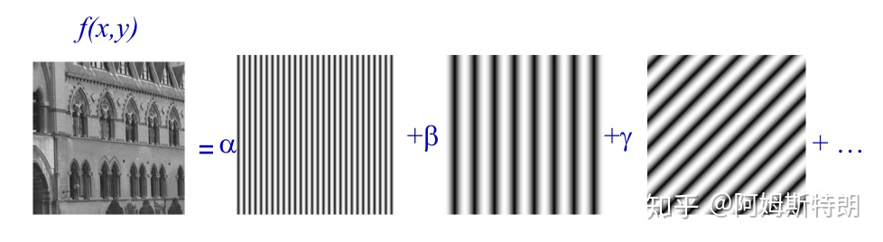

## 一维

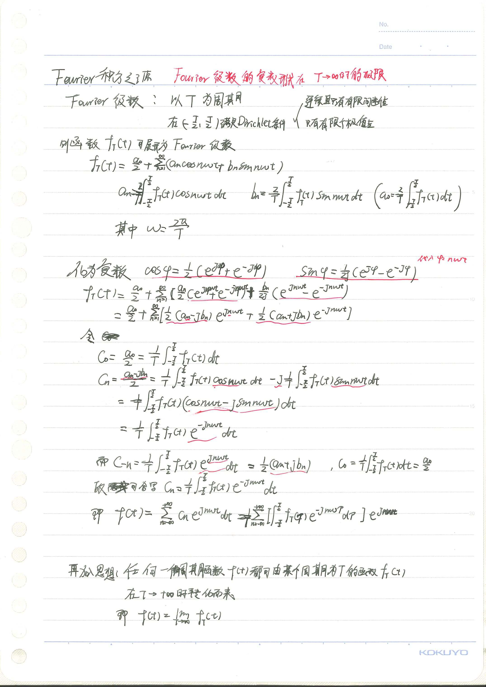
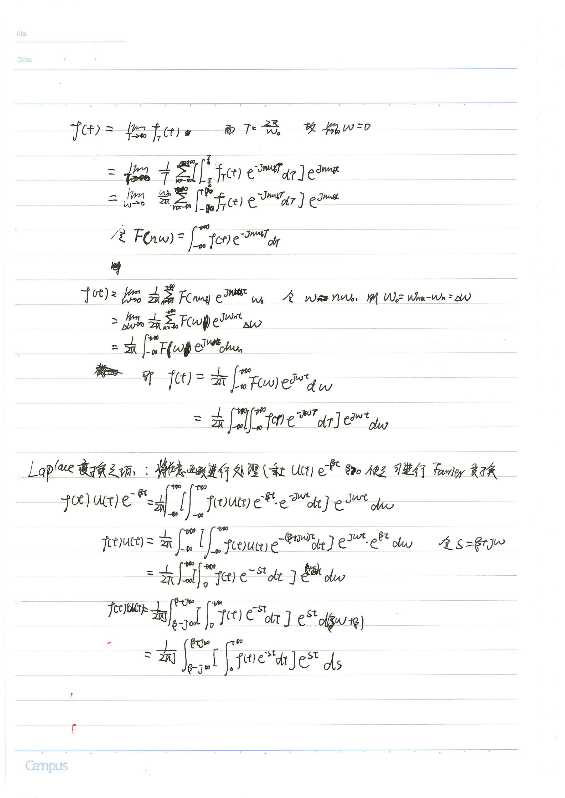
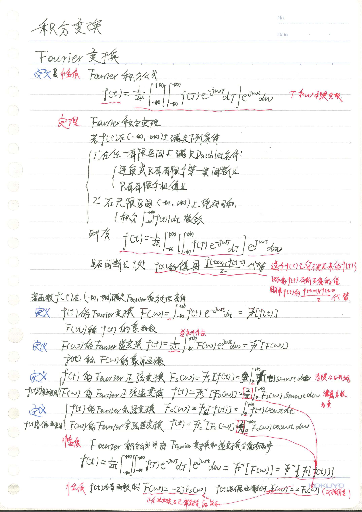

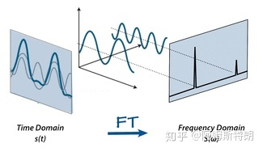
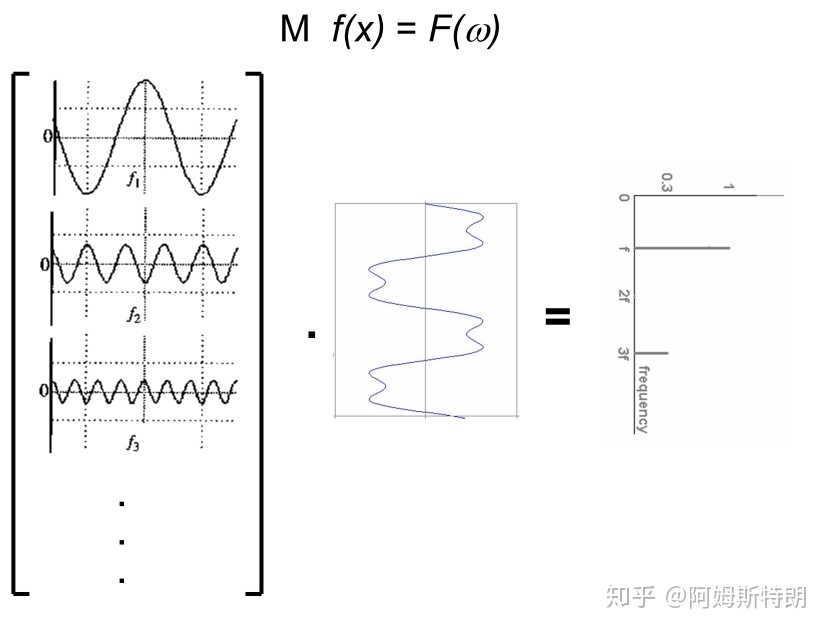

## 二维

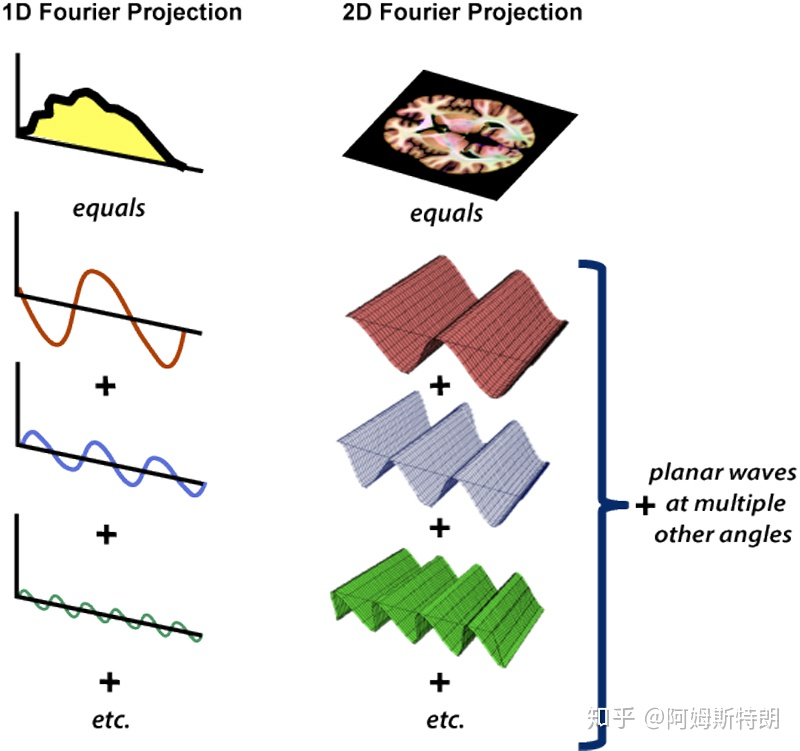

二维FT的公式：

通过公式，我们可以计算出，每个平面波在图像中成分是多少。从公式也可以看到，二维傅里叶变换就是将图像与每个不同频率的不同方向的复平面波做内积（先点乘在求和），也就是一个求在基$\left\{ e^{-j2\pi \left( ux+vy \right)}\right\}$上的投影的过程。（应该知道$\frac{\overrightarrow{a}\cdot \overrightarrow{\begin{array}{c} 	b\\ \end{array}}}{|\overrightarrow{a}|}$是b在a上的投影，只不过这里的|a|的值被设为1，所以只有内积）

### 二维频率域K-SPACE

对于正弦平面波，可以这样理解，在一个方向上存在一个正弦函数，在法线方向上将其拉伸。前面说过三个参数可以确定一个一维的正弦波。哪几个参数可以确定一个二维的正弦平面波呢？答案是四个，其中三个和一维的情况一样（频率$w$，幅度$A$，相位$\varphi$），但是具有相同这些参数的平面波却可以有不同的方向$\vec{n}$ 。如下图所示：

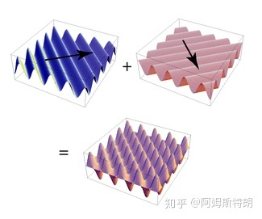

在一维的FT里，我们可以用一个波特图（$w-A$图和一张$w-\varphi$图）来表示$w$，$A$，$\varphi$的关系。

那进入二维加了一个方向$\vec{n}$，又该如何表示？

答案是K-SPACE图

在K-SPACE图中，每一个二维矩阵点$\left(u,v\right)$都存有一个复数值，代表一个平面波
* 矩阵点的坐标$\left(u,v\right)$代表向量代表这个平面波的法向量$\vec{n}$的方向
* 这个向量的模$\sqrt{u^2+v^2}$代表这个平面波的频率
*  这个点里面保存的内容复数就是此平面波的幅度和相位

于是，二维的FT里，我们也可以用一个“波特图”（以幅度为坐标值的K-SPACE图和以相位为坐标值的K-SPACE图）来表示$w$，$A$，$\varphi$，$\vec{n}$的关系。

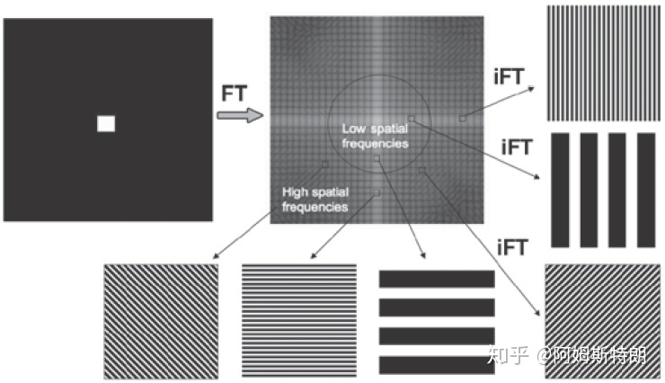

例1：如下图，K空间中只有（0，0）处有值，也就是信号都是直流即不存在变化，所以实空间就是一张白纸。

例2：再如下面这个图片，中心低频贡献了图像的主体，周围高频提供图像的细节和边缘。

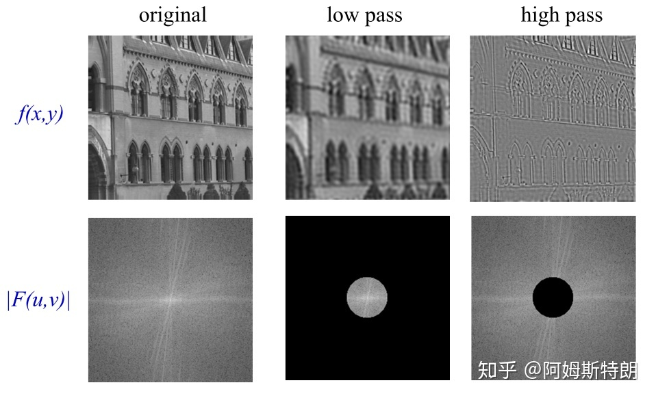

## 更多案例

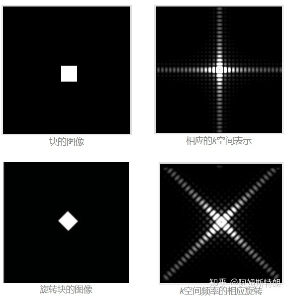

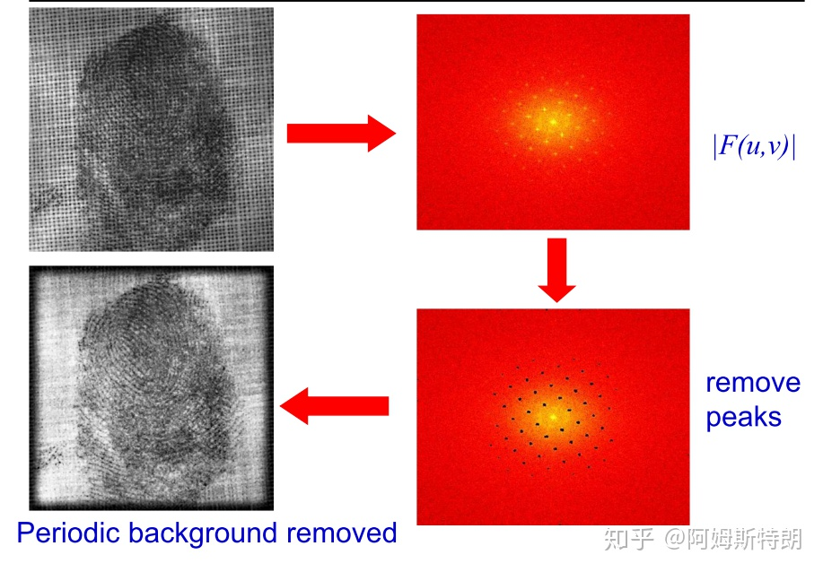

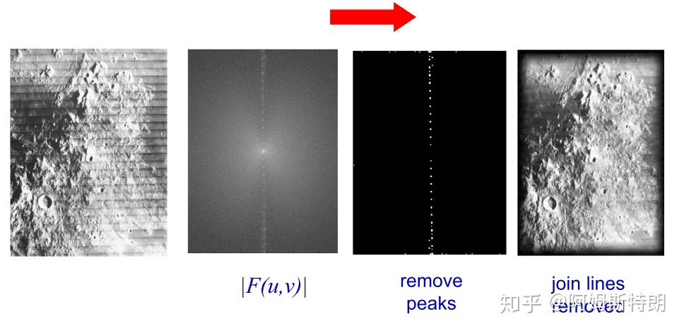

