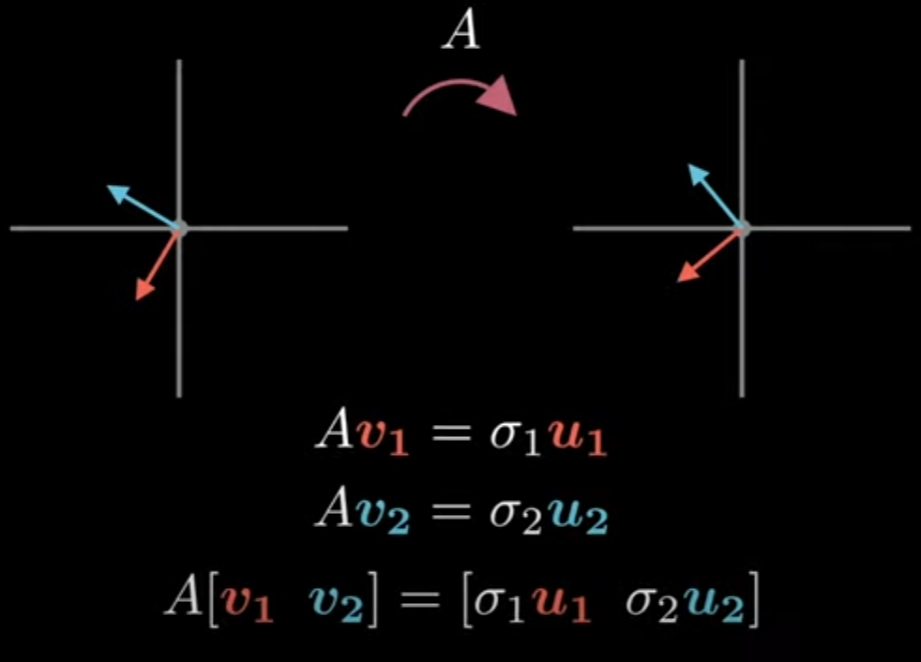
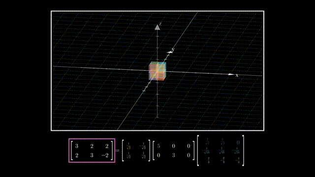
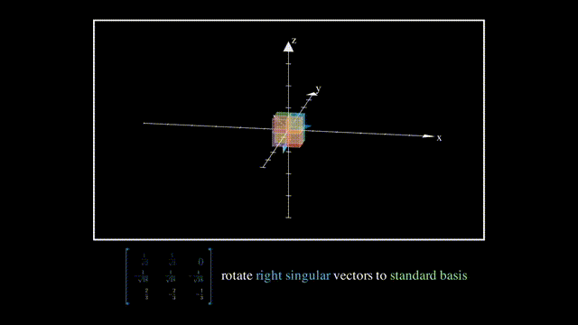
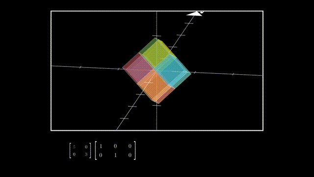
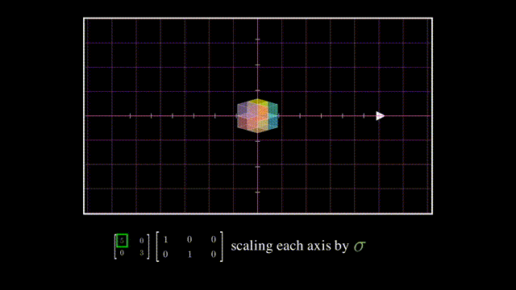
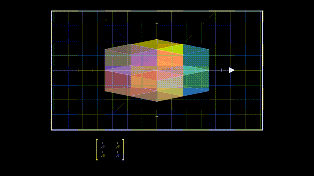
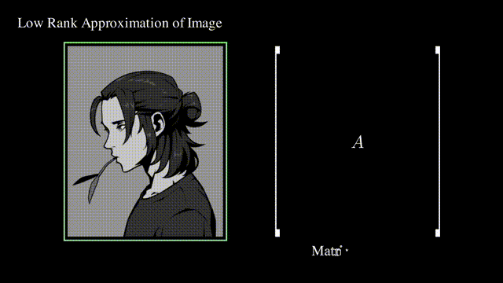

# SVD

## 为什么要用SVD解方程

这是一个矩阵形式的线性方程：

$$\bm A\bm x=\bm b$$

高中以来求解线性方程的方法都只能在矩阵的秩$R(\bm A)=R([\bm A|\bm b])$的情况下有效（即$\bm A$和未知数数量相等且没有任何行向量或列向量之间是线性相关的）。
但在现实线性系统中，很多都是要多次取样求平均值，A不是正定更不是方阵，方程数量不等于求解未知量数量，且测量值还有误差没有精确解，这时的求解不像是在解方程而更像是在进行线性回归。

SVD起作用的场合：

* “求解”欠定方程 underdetermined：方程数量没有未知量多，线性方程组无穷多解
* “求解”超定方程 overdetermined：方程数量比未知量多，线性方程组无解

## SVD的定义

对于一个秩为$r$的矩阵$\bm{A}_{m \times n}$，必存在$m \times m$的正交矩阵$\bm{U}_{m \times m}$，$n \times n$的正交矩阵$\bm{V}_{n \times n}$，$m\times n$的矩阵$\bm{\Sigma}_{m \times n}$，使得

$$
\bm{A}_{m \times n} = \bm{U}_{m \times m} \bm{\Sigma}_{m \times n} \bm{V}^T_{n \times n} = \bm{U}_{m \times m} \begin{pmatrix} \bm{D}_{r \times r} & \bm{O} \\ \bm{O} & \bm{O} \end{pmatrix}_{m \times n} \bm{V}^T_{n \times n} \\\\ \tag{9}
$$

其中，$\bm{D}_{r \times r} = \begin{pmatrix} \sqrt{\lambda_1} \\ & \sqrt{\lambda_2} \\ & & \ddots \\ & & & \sqrt{\lambda_r} \end{pmatrix}_{r \times r}$，$\lambda_1 \geq \lambda_2 \geq... \geq \lambda_r >0$为$\bm{A}^T\bm{A}$的$r$个 **非零特征值** （从大到小排列）。

这里$\sqrt{\lambda_1}, \sqrt{\lambda_2}, \cdots, \sqrt{\lambda_r}$称为$\bm{A}$的 **正奇异值**；$\sqrt{\lambda_1}, \sqrt{\lambda_2}, \cdots, \sqrt{\lambda_r},0_1,0_2, \cdots,0_{n-r}$（从大到小排列）称为$\bm{A}$的 **奇异值** 。

## SVD如何解线性方程

假设要解这个矩阵形式的线性方程：

$$\bm A\bm x=\bm b$$

这个线性方程可能欠定也可能超定

先对$\bm A$进行奇异值分解：

$$\bm A=\bm U\bm\Sigma\bm V^T$$

而正交矩阵$\bm U^T=\bm U^{-1}$、$\bm V^T=\bm V^{-1}$于是线性方程化为：

$$
\begin{aligned}
    \bm A\bm x&=\bm b\\
    \bm U\bm\Sigma\bm V^T\bm x&=\bm b\\
    \bm x&=(\bm V^T)^{-1}\bm\Sigma^{-1}\bm U^{-1}\bm b\\
    \bm x&=\bm V\bm\Sigma^{-1}\bm U^T\bm b\\
    \bm x&=\bm A^+\bm b
\end{aligned}
$$

其中，$\bm A^+=\bm V\bm\Sigma^{-1}\bm U^T$称为伪逆矩阵(pseudo inverse)。

这样求出来的$\bm x=\bm A^+\bm b$可证明存在如下性质：

* 若$\bm A\bm x=\bm b$是欠定方程的表示，那么$\bm x=\bm A^+\bm b$是最小正则化解：

$$
\begin{aligned}
    &&min\|x\|\\
    s.t.&&\bm A\bm x=\bm b
\end{aligned}
$$

* 若$\bm A\bm x=\bm b$是超定方程的表示，那么$\bm x=\bm A^+\bm b$是最小二乘解：

$$
min\|\bm A\bm x-\bm b\|
$$

## 深入：SVD几何含义，方阵的情况

对于一$n$维到$n$维的线性变换$\bm A$（$n$行$n$列），求一组$n$个相互正交的$n$维单位向量$\bm v_i,i\in[1,n]$，使其在线性变换后仍然相互正交。
单位向量$\bm v_i,i\in[1,n]$在变换后不一定是单位向量，所以用一常数$\sigma_i$和单位向量$\bm u_i,i\in[1,n]$表示：

上图扩展到$n$行$n$列，用矩阵形式表示：

$$
\bm A[\bm v_1\dots\bm v_i\dots\bm v_n]=[\sigma_1\bm u_1\dots\sigma_i\bm u_i\dots\sigma_n\bm u_n]=[\bm u_1\dots\bm u_i\dots\bm u_n]\left[
\begin{matrix}
    \sigma_1&0&\cdots&0\\
    0&\sigma_2&\cdots&0\\
    \vdots&\vdots&\ddots&\vdots\\
    0&0&\cdots&\sigma_n
\end{matrix}
\right]
$$

令：

$$
\begin{aligned}
\bm V&=[\bm v_1\dots\bm v_i\dots\bm v_n]\\
\bm U&=[\bm u_1\dots\bm u_i\dots\bm u_n]\\
\bm\Sigma&=\left[
\begin{matrix}
    \sigma_1&0&\cdots&0\\
    0&\sigma_2&\cdots&0\\
    \vdots&\vdots&\ddots&\vdots\\
    0&0&\cdots&\sigma_n
\end{matrix}
\right]
\end{aligned}
$$

于是上述方程化为：

$$\bm A\bm V=\bm U\bm\Sigma$$

即：

$$\bm A=\bm U\bm\Sigma\bm V^T$$

非常清晰。

## 深入：SVD几何含义，矩阵的情况

以行数小于列数的矩阵为例，$\bm A=\bm U\bm\Sigma\bm V^T$可以理解为降维变换：

$\bm V$的列向量相互正交且是单位向量，所以它就是一个旋转：

$\bm\Sigma$可以分成一个对角方阵和单位对角矩阵，其中单位对角矩阵相当于一个维度删除操作：

而对角方阵则是在降维后在各坐标轴上的拉伸：

最后$\bm U$的列向量相互正交且是单位向量，所以也是一个旋转：

## 深入：SVD的求解

首先：

* 由于$\bm v_i$和$\bm u_i$都是相互正交的单位向量，所以有$\bm V^{-1}=\bm V^T,\bm V\bm V^T=1$和$\bm U^{-1}=\bm U^T,\bm U\bm U^T=1$
* 由于$\bm\Sigma$是对角矩阵，所以有$\bm\Sigma\bm\Sigma^T=\bm\Sigma^T\bm\Sigma=\bm\Sigma^2$

于是：

$$
\begin{aligned}
    \bm A\bm A^T&=\bm U\bm\Sigma\bm V^T\bm V\bm\Sigma^T\bm U^T&=\bm U\bm\Sigma\bm\Sigma^T\bm U^T&=\bm U\bm\Sigma^2\bm U^T\\
    \bm A^T\bm A&=\bm V\bm\Sigma^T\bm U^T\bm U\bm\Sigma\bm V^T&=\bm V\bm\Sigma^T\bm\Sigma\bm V^T&=\bm V\bm\Sigma^2\bm V^T
\end{aligned}
$$

所以，要求解$\bm U$、$\bm V$、$\bm\Sigma$，对$\bm A\bm A^T$和$\bm A^T\bm A$做特征分解（Eigendecomposition，又称谱分解 Spectral decomposition）即可。

根据矩阵特征值的性质可知，$\bm A\bm A^T$和$\bm A^T\bm A$特征值必相同，$\bm\Sigma^2$就是其特征值组成的对角矩阵，而$\bm U$和$\bm V$分别是$\bm A\bm A^T$和$\bm A^T\bm A$的特征矩阵。

## 深入：SVD怎么解最优化问题

可用SVD解的方程最直观的表示为“求使$\bm A\bm x$最大（或同理可求最小）的单位向量$\bm x$”：

$$
\begin{aligned}
&&\mathop{max}\limits_{\bm x}\|\bm A\bm x\|^2\\
s.t.&&\|\bm x\|=1
\end{aligned}
$$

换个形式：

$$
\begin{aligned}
&&\mathop{max}\limits_{\bm x}\bm x^T\bm A^T\bm A\bm x\\
s.t.&&\|\bm x\|=1
\end{aligned}
$$

根据特征值的定义，$\bm A^T\bm A$的特征值$\lambda$要满足$\bm A^T\bm A\bm x=\lambda\bm x$：

$$
\begin{aligned}
\bm A^T\bm A\bm x&=\lambda\bm x\\
\bm x^T\bm A^T\bm A\bm x&=\lambda\bm x^T\bm x\\
\bm x^T\bm A^T\bm A\bm x&=\lambda\\
\end{aligned}
$$

所以$\bm x^T\bm A^T\bm A\bm x$的值必然是$\bm A^T\bm A$的特征值中的一个。
于是，$\bm x^T\bm A^T\bm A\bm x$的最大值取$\bm A^T\bm A$的特征值中的最大值即可，最大特征值对应的特征向量就是$\bm x$的最优解。

而SVD中的$\bm V$是$\bm A^T\bm A$的特征矩阵、$\bm\Sigma^2$是$\bm A^T\bm A$的特征值组成的对角矩阵，所以直接去$\bm\Sigma^2$中找到最大值（或最小值）即最优值$\lambda$，其在$\bm V$中对应的列就是最优解$\bm x$。

## 深入：SVD存在性证明

没必要，看下几何含义啥都懂了，数学证明还是算了吧

## 深入：SVD和主成分分析

