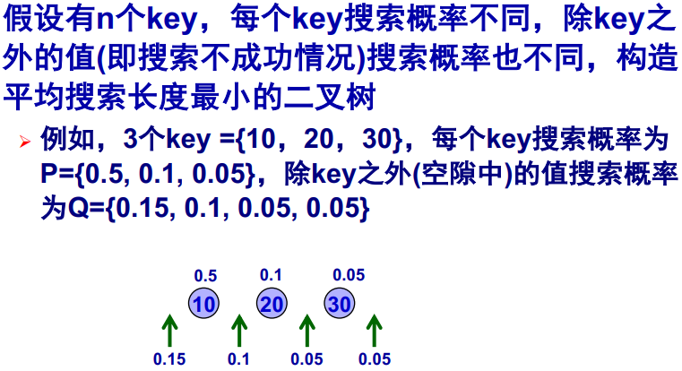
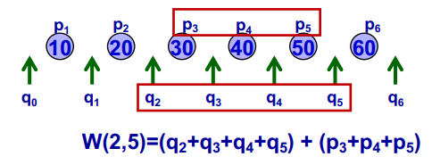
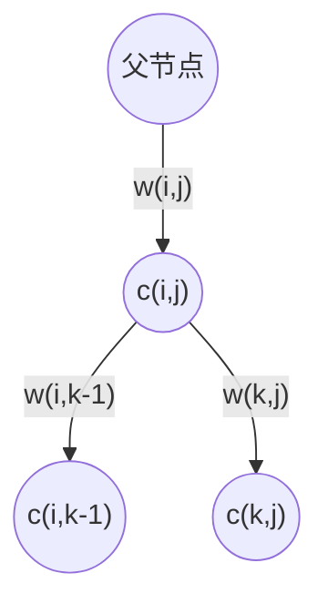
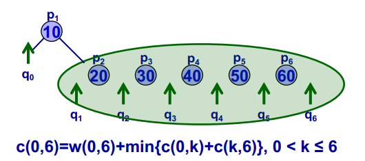
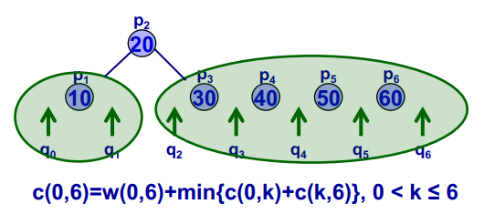
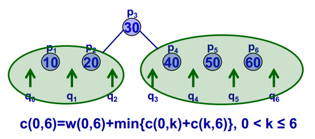
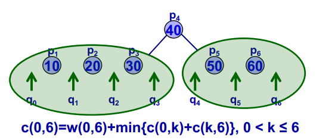
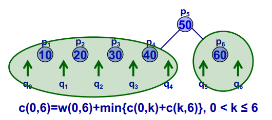
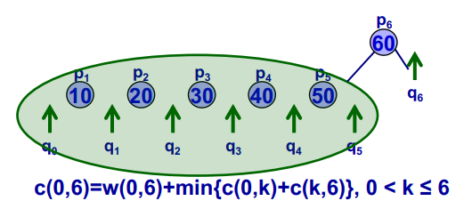
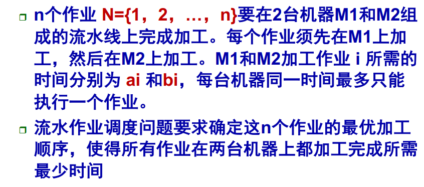

# 动态规划复习

* 最优子结构：原问题的最优解包含子问题的最优解
* 重叠子问题：用来求解原问题的算法能重复地解相同的子问题而不产生新的子问题

## 矩阵连乘

* 两矩阵$M_i$和$M_{i+1}$，维数分别是$p_i\times p_{i+1}$和$p_{i+1}\times p_{i+2}$，则$M_i\cdot M_{i+1}$需要进行$p_i\times p_{i+1}\times p_{i+2}$次乘法
* $n$个矩阵连乘$M_1\cdot M_2\cdot\dots\cdot M_n$，加括号使得乘法运算次数最少

设$M_1\cdot M_2\cdot\dots\cdot M_n$最少的连乘次数为$f(1,n)$，那么它显然是从所有位置切开分为左右两部分相乘的方案中最优的那一个，即包含子问题的最优解：
$$f(i,j)=max\{f(i,k-1)+f(k,j)+p_ip_kp_{j+1}|i<k\leq j\}$$

对于$f(1,n)$，其重叠子问题的集合为：
$$\{f(i,j)|1\leq i\leq j\leq n\}$$

共$n(n+1)/2$个，因此空间复杂度为$O(n^2)$；每个$f(i,j)$都需要从$i$到$j$计算一遍$f(i,k-1)+f(k,j)+p_ip_kp_{j+1}$，因此时间复杂度为$O(n^3)$。

## 钢条切割

切割销售一段长度为$n$的钢条，对于切出的每个长度$i$都有一个销售价格$p_i$，问如何切使收益最大。

若设$f(x)$为长度为$n$钢条切割后的最大收益，那么它包含子问题的最优解：
$$f(x)=max\{f(x-i)+p_i|1\leq i\leq x\}$$

对于$f(n)$，其重叠子问题的集合为：
$$\{f(x)|1\leq x\leq n\}$$

共$n$个，因此时间复杂度为$O(n)$。

## 最长公共子序列(LCS)

* $X=x_1x_2\dots x_m$, 若$1\leq i_1<i_2<\dots <i_k\leq m$，使$Z=z_1z_2\dots z_k=x_{i_1}x_{i_2}\dots x_{i_k}$, 称$Z$是$X$的子序列
* $Z$是序列$X$与$Y$的公共子序列：$Z$既是$X$的子序列又是$Y$的子序列

若设$LCS(X_m,Y_n)$是$X_m=x_1x_2\dots x_m$和$Y_n=y_1y_2\dots y_n$的最长公共子序列，那么它包含子问题的最优解：
$$
LCS(X_m,Y_n)=\left\{\begin{aligned}
LCS(X_{m-1},Y_{n-1})+1&&x_m=y_n\\
max\{LCS(X_{m-1},Y_{n}),LCS(X_{m},Y_{n-1})\}&&x_m\not=y_n\\
\end{aligned}\right.
$$

对于$LCS(X_{m},Y_{n})$，其重叠子问题集合为：
$$\{LCS(X_{i},Y_{j})|1\leq i\leq m,1\leq j\leq n\}$$

共$mn$个，故时间复杂度为$O(mn)$。

## 最优二叉搜索树

若设$w(i,j)=\sum_{k=i}^jq_k+\sum_{k=i+1}^{j}p_k$

在一个二叉搜索树中，每一条边的权值都是其所连子树的所有元素的权值和，而每下一层搜索长度+1，因此以某个点为根的子树所产生的的平均搜索长度是其左右子树的概率$\times 1$加上总的概率$\times 1$：

因此以$p_k,k\in[i,j]$为根的最优二叉树贡献的平均搜索长度$c(i,j)$为：
$$c(i,j)=w(i,j)+c(i,k-1)+c(k,j)$$

要找到这个最优二叉树$c(i,j)$，即是找到最优的根节点$k$，它包含子问题的最优解：
$$c(i,j)=w(i,j)+min\{c(i,k-1)+c(k,j)|1<k\leq j\}$$

对于$c(0,n)$，它的重叠子问题集合为：
$$\{c(i,j)|1\leq i\leq j\leq n\}$$

共$n(n+1)/2$个，因此空间复杂度为$O(n^2)$；每个$c(i,j)$都需要从$i$到$j$计算一遍$c(i,k-1)+c(k,j)$，因此时间复杂度为$O(n^3)$。

## 流水线作业调度问题

显然，在最优方案中：
* 两台机上上加工次序完全相同
  * 若不然，某个任务需要等待其后执行的任务完成第二道工序才能执行，时间更长
* 第一道工序是无间断的
  * 第一道工序没有任何依赖，可以一个一个持续执行

进而，此问题的搜索树是一个排列树，即确定任务的执行次序。

若设任务集合为$S$，开始执行时第二道工序还在执行其他任务，$t$时间后才能使用，设此情况下的最优调度花费的时间为$T(S,t)$，如果此时最优方案是选择$a_i$作为第一个执行的任务，那么：
$$T(S,t)=\left\{\begin{aligned}
&a_i+T(\complement_S\{i\},b_i)&&t\leq a_i\\
&a_i+T(\complement_S\{i\},b_i+(t-a_i))&&t>a_i\\
\end{aligned}\right.$$

进而找最优解$T(S,t)$就是找最优的$a_i$的过程，其包含子问题的最优解：
$$T(S,t)=a_i+min\{T(\complement_S\{i\},b_i+max\{t-a_i,0\})|i\in S\}$$

重叠子问题的集合为：
$$\{T(S,t_{\complement_NS})|S\subseteq N\}$$

相当于把$N$的每个非空子集都计算一次，共$\sum_{k=1}^nC_n^k=2^n-1$个，每次计算都要把$S$中的任务全扫一遍，时间复杂度$O(n2^n-1)$。

### 进一步剪枝：Johnson法则

假定在$T(S,t)$中，前两个被执行的任务是$a_i$和$a_j$，那么：

$$\begin{aligned}
T(S,t)&=a_i+min\{T(\complement_S\{i\},b_i+max\{t-a_i,0\})|i\in S\}&\\
&=a_i+T(\complement_S\{i\},t_i)&t_i=b_i+max\{t-a_i,0\}\\
&=a_i+a_j+T(\complement_S\{i,j\},t_{ij})&t_{ij}=b_j+max\{t_i-a_j,0\}\\
\end{aligned}
$$

而其中：

$$\begin{aligned}
t_{ij}&=b_j+max\{t_i-a_j,0\}\\
&=b_j+max\{b_i+max\{t-a_i,0\}-a_j,0\}\\
&=b_j+b_i-a_j+max\{max\{t-a_i,0\},a_j-b_i\}\\
&=b_j+b_i-a_j+max\{t-a_i,0,a_j-b_i\}\\
&=b_j+b_i-a_j-a_i+max\{t,a_i,a_i+a_j-b_i\}\\
\end{aligned}
$$

可以证明对于最优方案中的所有相邻任务$a_i,a_j$，$min\{b_i,a_j\}\geq min\{b_j,a_i\}$必然成立：

反证法，若$min\{b_i,a_j\}<min\{b_j,a_i\}$

$$
\begin{aligned}
min\{b_i,a_j\}&<min\{b_j,a_i\}\\
-min\{b_i,a_j\}&>-min\{b_j,a_i\}\\
max\{-b_i,-a_j\}&>max\{-b_j,-a_i\}\\
a_i+a_j+max\{-b_i,-a_j\}&>a_i+a_j+max\{-b_j,-a_i\}\\
max\{a_i+a_j-b_i,a_i\}&>max\{a_i+a_j-b_j,a_j\}\\
max\{t,a_i+a_j-b_i,a_i\}&\geq max\{t,a_i+a_j-b_j,a_j\}\\
max\{t,a_i+a_j-b_i,a_i\}&\geq max\{t,a_i+a_j-b_j,a_j\}\\
t_{ij}&\geq t_{ji}
\end{aligned}
$$

即如果不满足$min\{b_i,a_j\}\geq min\{b_j,a_i\}$，将$a_i,a_j$交换位置后更节约时间，进而$T(S,t)$也不是最优方案。

因此，在最优方案中必然有$min\{b_i,a_j\}\geq min\{b_j,a_i\}$成立。

这个不等式给我们带来了一个剪枝方法：已选择的前一个任务为$i$，已知$a_i,b_i$，那么后一个任务$j$只能在满足$min\{b_i,a_j\}\geq min\{b_j,a_i\}$的任务中选。进而·能通过剪枝降低算法复杂度。