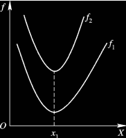
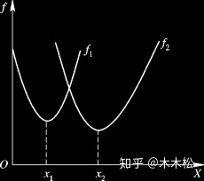
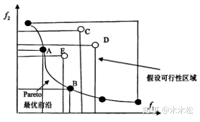

# 博弈论

## Normal form game

形式化定义一个可终止(Finite)的、有$n$个主体参与的博弈为：
$$\langle N, A, u\rangle$$

其中，
* Players：$N= \left\{1,\dots,i,\dots,n \right\}$表示参与博弈的主体
* Actions：$A_i$表示Player $i$可以采取的动作集合，定义Action Profile为$a=(a_1,\dots,a_n)\in A=A_1\times \dots \times A_n$，表示一个可能出现的情况
* Payoff function(Utility function, 效用函数)：$u_i:A\mapsto\mathbb R$表示Player $i$的Payoff function，用来计算特定Action Profile下Player $i$可以获取的回报；$u=(u_1,\dots,u_i,\dots,u_n)$表示profile of utility function

## 最佳响应 Best Response

令$a_{-i}=\langle a_1,\dots,a_{i-1},a_{i+1},\dots,a_n\rangle$表示除Player $i$外的其他所有Player选择的Actions，并将包含Player $i$在内的所有Player选择的Actions记为$a=(a_{-i},a_i)$

对于某已知的$a_{-i}$，其最佳响应集$BR(a_{-i})$定义为：

$$BR(a_{-i})=\{a_i^*|\forall a_i\in A_i, u_i(a_i^*,a_{-i})\geq u_i(a_i,a_{-i})\}$$

即在已知所有其他Player选择的Action$a_{-i}$的情况下给Player $i$带来最大效用的$a_i$的集合

## 纳什均衡 Nash Equilibrium

Pure Strategy 纳什均衡$a=\lang a_1,\dots,a_i,\dots,a_n\rang$定义为：

$$\forall i\in[1,n],a_i\in BR(a_{-i})$$

即每个Player的Action均为Best Response的Action Profile

## 优势策略 dominant strategy

令$S_{-i}=\{a_{-i}\}$表示除Player $i$外的其他所有Player所有可能Action的集合

策略$s_i$严格优于(strictly dominates)$s_i'$定义为

$$\forall s_{-i}\in S_{-i},u_i(s_i,s_{-i})>u_i(s_i',s_{-i})$$

策略$s_i$弱优于(very weakly dominates)$s_i'$定义为

$$\forall s_{-i}\in S_{-i},u_i(s_i,s_{-i})\geq u_i(s_i',s_{-i})$$

严格优于所有其他策略的策略称为优势策略

## 帕累托最优 Pareto Optimality

多目标优化问题的数学模型一般可以写成如下形式：

$$
\begin{aligned}
    min&\quad&&f(x)=\{f_1(x),f_2(x),\dots,f_n(x)\}\\
    s.t.&&&x\in X\\
    &&&X\subseteq R^m
\end{aligned}
$$

其中，$f_1(x),f_2(x),\dots,f_n(x)$表示$n$个目标函数，$X\subseteq R^m$是其变量约束的集合。

### 定义：解A强帕累托支配解B

假设现在有两个目标函数，**解A对应的目标函数值都比解B对应的目标函数值好**，则称解A比解B优越，也可以叫做解A强帕累托支配解B

### 定义：解A能帕累托支配解B

同样假设两个目标函数，**解A对应的一个目标函数值优于解B对应的一个目标函数值，但是解A对应的另一个目标函数值要差于解B对应的一个目标函数值**，则称解A无差别于解B，也叫作解A能帕累托支配解B

### 定义：最优解

假设在设计空间中，解A对应的所有目标函数值都达到最优，则称解A为最优解

必须有一个点让所有函数同时最优，条件很苛刻，基本不可能

### 定义：帕累托最优解

假设两个目标函数，对于解A而言，在 变量空间 中**找不到其他的解能够强帕累托支配解A**，那么解A就是帕累托最优解（在其他任何解上都有一些目标函数值比解A差）（通常是一个范围）

比如上图这样的帕累托最优就是一个范围$[x_1,x_2]$

### 定义：帕累托最优前沿

帕累托最优解组成的集合

## Mixed strategy

Mixed strategy是Action的概率分布。不同于Pure strategy中的策略$a_i$定义为Player$i$从策略集$A_i$中选择的某个Action，Mixed strategy中的策略$s_i$定义为Player$i$在策略集$A_i$上的概率分布。

定义$s_i$为Player$i$在策略集$A_i$上的概率分布，$s_i(a_i)$为Player$i$选择策略$a_i$的概率，令$a_{-i}=\langle a_1,\dots,a_{i-1},a_{i+1},\dots,a_n\rangle$表示除Player $i$外的其他所有Player选择的Actions，并将包含Player $i$在内的所有Player选择的Actions记为$a=(a_{-i},a_i)$。那么，Mixed strategy下的纳什均衡$s=\lang s_1,\dots,s_i,\dots,s_n\rang$定义为：

$$
\forall i\in N,\forall a_i\in A_i\quad\sum_{a}u_i(a)\prod_{j\in N}s_j(a_j)\geq \sum_{a_{-i}}u_i(a_{-i},a_i)\prod_{j\in N,j\not=i}s_j(a_j)
$$

很显然，不等式左边的$u_i(a)$表示某个Action组合$a$给Player$i$带来的效用，$\prod_{j\in N}s_j(a_j)$是$a$中的Action $a_j$在Mixed strategy策略$s_j$中的概率，所以很显然这一项是Action组合$a$在Mixed strategy策略$s_j$下发生的概率，所以整个$\sum_{a}u_i(a)\prod_{j\in N}s_j(a_j)$这一项就表示所有Player的Mixed strategy策略给Player$i$带来的效用值的数学期望。

而不等式右边的的项很显然就是Player$i$确定选某个$a_i$的情况下（$s_i(a_i)=1$）的Mixed strategy策略给Player$i$带来的效用值的数学期望。

所以用人话将，Mixed strategy下的纳什均衡就是：所有Player$i$确定选择任何一个策略$a_i$都不如Mixed strategy策略$s_i$能带来更大的效用期望值。