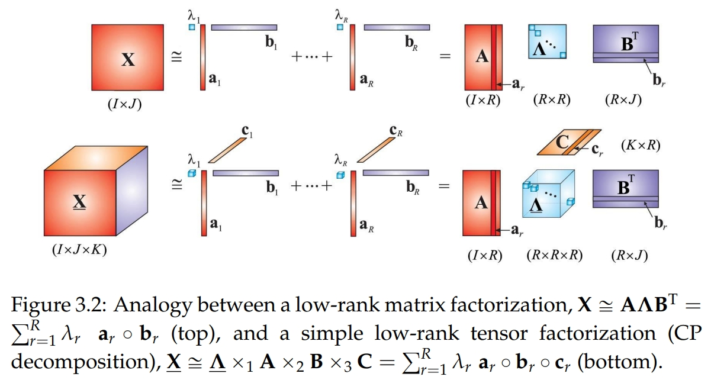
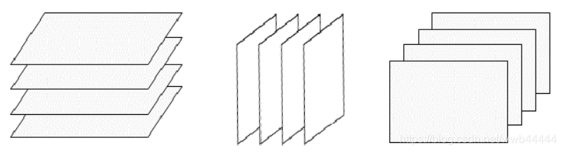
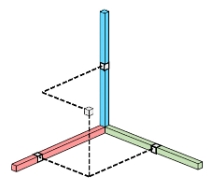
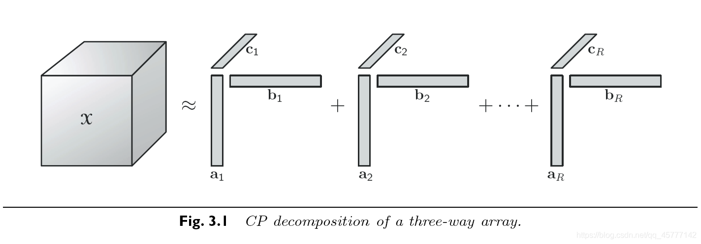
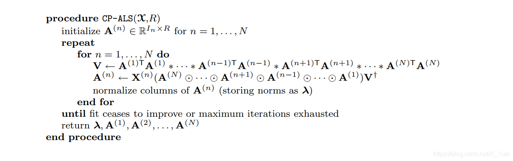
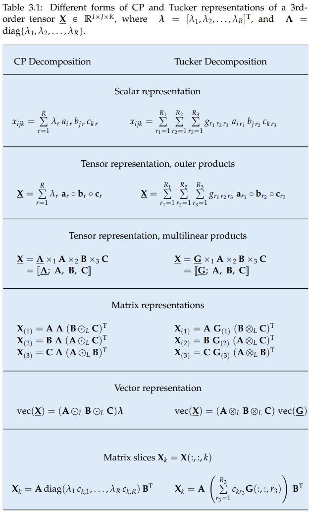

# 张量分解

前置知识：[矩阵分解](./SVD.md)

相关好书：
相关好书：[Low-Rank Tensor Networks for Dimensionality Reduction and Large-Scale Optimization Problems: Perspectives and Challenges PART 1](https://arxiv.org/abs/1609.00893)

张量是矩阵的高维扩展：

* 一阶(一维)张量：向量
* 二阶(二维)张量：矩阵
* 三阶(三维)张量：可以看做是多个矩阵堆叠而成，不过由于三阶张量具有三个维度，因此堆叠矩阵的方式也必然存在三种，即水平切片、侧向切片和正面切片：

张量的应用面很广，大多数的数据都可用张量表示，例如一张彩色图片就是一个三维张量，分别由像素矩阵和第三维的RGB颜色通道组成。

* 四阶(四维)张量：多张图片组成的一段视频或给神经网络推断输入的一个batch
* 五阶(五维)张量、六阶张量......

矩阵分解是将$m\times n$的矩阵分解为更小的矩阵元素，张量则是将高维矩阵分解为更小的张量元素。

## 秩一张量

若一个$N$阶张量$\mathcal X\in\mathbb R^{I_1\times I_2\times\cdots\times I_N}$能够被表示为$N$个向量的外积，则称$\mathcal X$为秩一张量，即：

$$\mathcal X=\bm a_1\circ\bm a_2\circ\cdots\circ\bm a_N$$

这也意味着张量的每个元素都是对应的向量元素的乘积：

$$x_{i_1,i_2\dots i_N}=a_{1,i_1}a_{2,i_2}\cdots a_{N,i_N}$$

比如三维的情况$\mathcal X\in\bm a\circ\bm b\circ\bm c$可以画个示意图：

其中$x_{i,j,k}=a_{i}b_{j}c_{k}$：

## CP分解 CP decomposition

1927年Hitchcock基于秩一张量的定义，首次提出了将张量拆成有限个秩为1的张量相加的形式。后来在1970年Carrol和Chang将这个概念以CANDECOMP(canonical decomposition，标准分解)的形式在引入到心理测验学当中，与此同时 Harshman也提出了PARAFAC(parallel factors，平行因素)的形式，该方法才得以流行，所以今天我们称这个将张量分解为有限个秩一张量和的形式的分解方法为CP分解，即是CANDECOMP/PARAFAC分解的缩写。

>CP分解是将一个高维的张量，分解成多个核的和，每个核是由向量的外积组成；通过这样的分解，我们可以大大地降低参数的维度。其实，不止CP分解，其他的张量分解算法都是同个道理，只是所采用的分解方法不同而已。当然，这样的分解只是原来张量的近似，没办法保证完全复原。从以上角度来说，张量分解的目的跟矩阵分解是相同的，只是一个是在二维上的分解，另一个是在高维上的分解而已！

简单来说，CP分解就是将一个$N$阶张量分解成多个秩一张量之和的形式：

$$\mathcal X\approx\sum_{r=1}^R\bm a_{r,1}\circ\bm a_{r,2}\circ\cdots\circ\bm a_{r,N}$$

比如一个三维张量$\mathcal X$分解为$R$个秩一张量和：

即：

$$\mathcal X\approx\sum_{r=1}^R\bm a_r\circ\bm b_r\circ\bm c_r$$

于是$\mathcal X$中的元素为：

$$x_{i,j,k}\approx\sum_{r=1}^Ra_{r,i}b_{r,j}c_{r,k}$$

### CP秩

张量$\mathcal X$的秩，用秩一张量之和来精确表示所需要的秩一张量的最少个数R的最小值为张量的秩，记作$\text{Rank}_{\text{CP}}(\mathcal X)=R$，这样的CP分解也称为张量的秩分解。

$$\text{Rank}_{\text{CP}}(\mathcal X)=\text{min}\{R|\mathcal X=\sum_{r=1}^R\bm a_{r,1}\circ\bm a_{r,2}\circ\cdots\circ\bm a_{r,N}\}$$

显然，这样定义的张量秩和矩阵的秩的定义十分相似，可以证明二阶张量秩和矩阵的秩等价。
但是在代数性质上，张量的秩与矩阵秩相比则表现出很多不一样的特性。**张量秩的个数求解是一个NP问题**，研究者只能通过一些数值方法近似的找到数个该张量的近似分解，从而估计该张量的秩。

### CP分解算法

当数据无噪声时，通常通过迭代的方法对$R$从1开始遍历直到找到一个重构误差为0的$R$。

当数据有噪声时，可以通过CORCONDIA算法估计$R$。

当$R$确定之后，可以通过交替最小二乘方法（the Alternating Least Squares,ALS）求解CP分解：

看不懂一点😂

在一些应用中，为了使得CP分解更加的鲁棒和精确，可以在分解出的因子上加上一些先验知识即约束。比如说平滑约束(smooth)、正交约束、非负约束(nonegative) 、稀疏约束(sparsity)等。

## Tucker 分解 Tucker decomposition

Tucker分解最早由Tucker在1963年提出的，Levin和Tucker在随后的文章中对其进行了改进。
张量的Tucker分解在将一个张量表示成一个核张量（Core Tensor）沿着每一个模式乘上一个矩阵的形式。

### 从CP分解到Tucker分解

作为对比，给CP分解的秩一矩阵加上一个系数，也可以表示为一个核张量和乘上一个矩阵的形式：

直接上图：

## t-SVD分解

t-SVD分解是建立在新定义的张量积（t-product）基础上的新的分解框架，主要针对三维张量数据的分解。

## 张量链分解

## 张量环分解