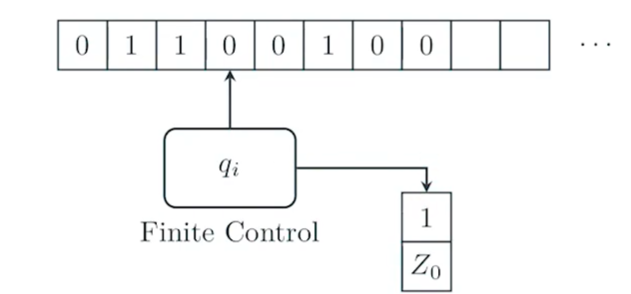
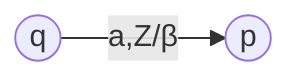
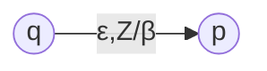
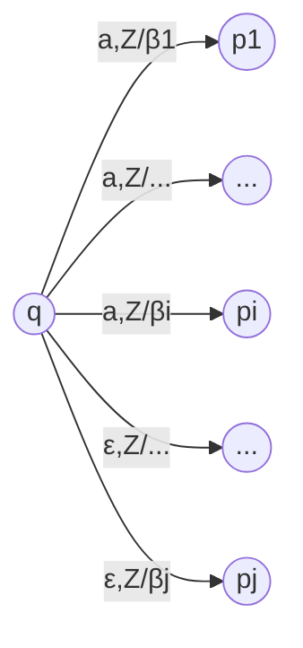
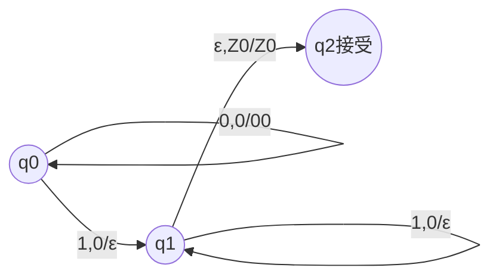

# 下推自动机

“无限状态自动机”：由无穷多个有限状态自动机组成的自动机$L=\sum_{n=0}^\infty\bm 0^n\bm 1^n=\{0^n1^n|n\geq 0\}$

## 下推自动机(Pushdown Automata, PDA)形式定义

PDA为一个七元组$P$：

$$P=(Q, \Sigma, \Gamma, \delta, q_0, Z_0, F)$$

* $Q$：有穷状态集
* $\Sigma$：字母表（有穷输入符号集）
* $\Gamma$：有穷栈符号集
* $\delta$：状态转移函数，$\delta:Q\times(\Sigma\cup\{\varepsilon\})\rightarrow 2^{Q\times\Gamma^*}$
* $q_0$：初始状态，$q_0\in Q$
* $Z_0$：栈底符号，$Z_0\in\Gamma-\Sigma$
* $F$：终结状态集（接受状态集），$F\subseteq Q$

### 定义PDA的动作（状态转移函数详解）

对PDA的当前状态$q\in Q$、输入字符$a\in\Sigma$、当前栈顶符号$Z$，状态转移函数：

$$\delta(q,a,Z)=\{(p,\beta)|p\in Q,\beta\in\Gamma^*\}$$

表示PDA的状态转移为$p\in Q$、栈顶符号修改为字符串$\beta$，且**转移过程是非确定的**。每一个状态的状态转移图表示为：

* 栈顶的一个符号$Z$修改为字符串$\beta$$\rightarrow$弹出栈顶符号后再压入多个符号
* 栈顶的一个符号$Z$修改为空串$\varepsilon$$\rightarrow$只弹出栈顶符号不压入符号

由定义可知，PDA还具有空转移能力：

$$\delta(q,\varepsilon,Z)=\{(p,\beta)|p\in Q,\beta\in\Gamma^*\}$$

每一个状态的状态转移图表示为：

综合得一次状态转移的状态转移图：

### 例：语言$L=\sum_{n=0}^\infty\bm 0^n\bm 1^n=\{0^n1^n|n\geq 0\}$的PDA

## PDA的瞬时描述

PDA的瞬时描述(Instantaneous Description, ID)定义为：

$$(q,w,\gamma)\in Q\times\Sigma^*\times\Gamma^*$$

表示此时PDA处于状态$q$，剩余输入串为$w$，栈内符号串为$\gamma$。

### ID的转移

若PDA$P$某一步状态转移$(p,\beta)\in\delta(q,a,Z)$，则这一步PDA的状态将由$(q,aw,Z\alpha)$变为$(p,w,\beta\alpha)$，称为ID的转移，记为$\vdash_P$：

$$(p,\beta)\in\delta(q,a,Z)\Leftrightarrow(q,aw,Z\alpha)\vdash_P(p,w,\beta\alpha)$$

进一步，对于瞬时描述$I$、$J$、$K$，可递归定义$\vdash_P^*$：

$$
\begin{aligned}
&I\vdash_P^*I\\
&I\vdash_PJ\wedge J\vdash_P^*K\Rightarrow I\vdash_P^*K\\
\end{aligned}
$$

$P$已知时可省略记为$\vdash$和$\vdash^*$。

### PDA的性质

#### PDA一次状态转移不会用到输入字符之后的部分和栈顶符号之下的部分

$$(q,x,\alpha)\vdash_P^*(p,y,\beta)\Rightarrow(q,xw,\alpha\gamma)\vdash_P^*(p,yw,\beta\gamma)$$

#### PDA多次状态转移不会用到输入字符之后的部分（但是可能会用到栈顶符号之下的部分）

$$(\forall w\in\Sigma^*)(q,xw,\alpha\gamma)\vdash_P^*(p,yw,\beta\gamma)\Rightarrow(q,x,\alpha)\vdash_P^*(p,y,\beta)$$

## PDA的语言

对于一个PDA$P=(Q, \Sigma, \Gamma, \delta, q_0, Z_0, F)$，定义了两种接收语言的方式。

### $\bm L(P)$：以终态方式接收的语言

这种语言中的字符串读取结束时可以让PDA运行到接受状态：

$$\bm L(P)=\{w|(q_0,w,Z_0)\vdash_P^*(p,\varepsilon,\gamma),p\in F\}$$

### $\bm N(P)$：以空栈方式接收的语言

这种语言中的字符串读取结束时可以让PDA的栈底符号弹出（栈弹空，使PDA无法正常运行）：

$$\bm L(P)=\{w|(q_0,w,Z_0)\vdash_P^*(p,\varepsilon,\varepsilon),p\in F\}$$

以空栈方式接收的语言有时可以让PDA的设计更加简单。

### 终态方式和空栈方式的等价性(未完成)

$$(\forall L)P_F$$