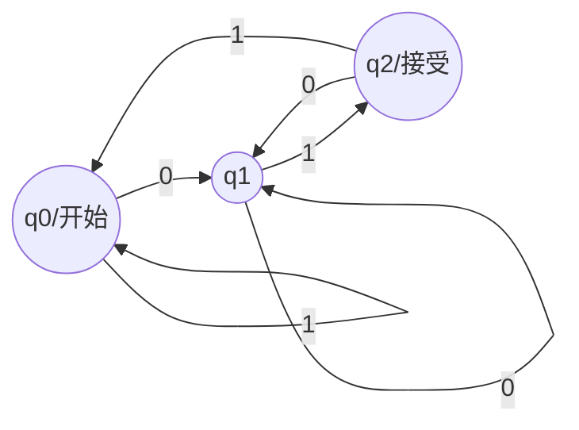
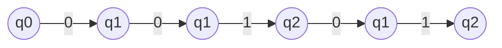
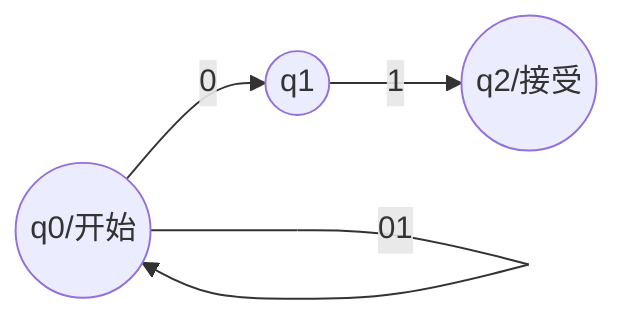
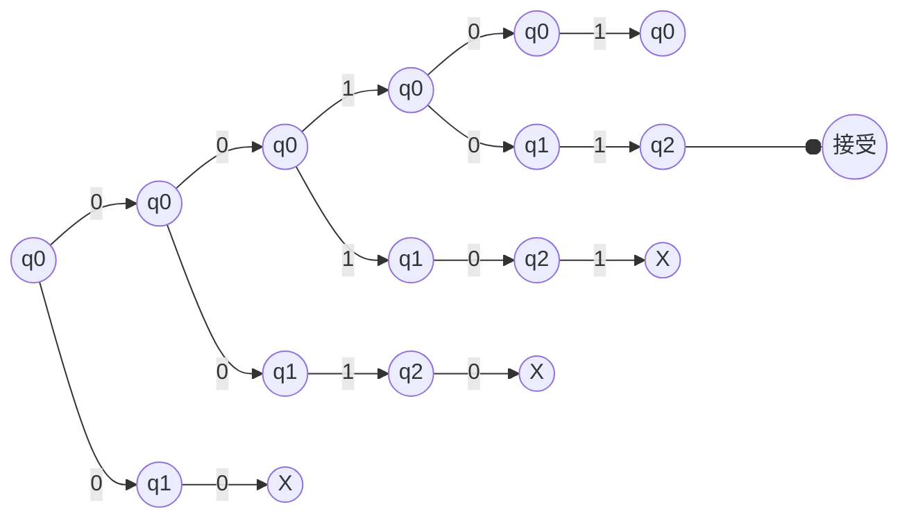
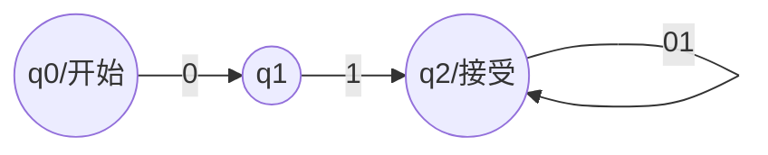
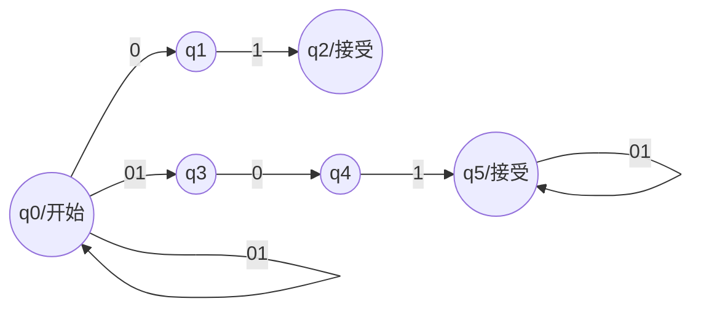
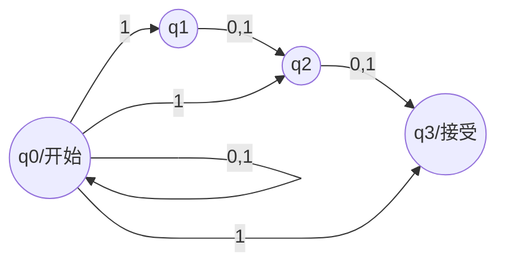
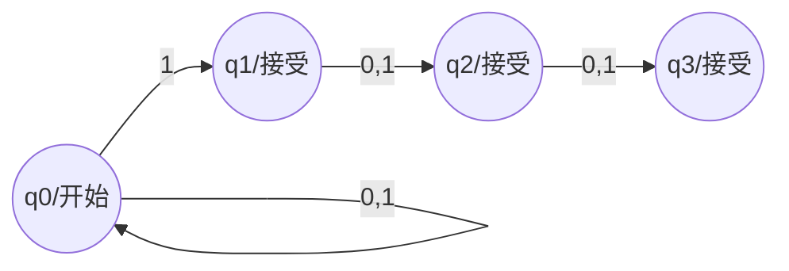
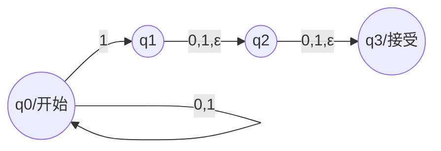

# 有穷自动机(Finite Automation, FA)/有限状态机(Finite State Machine, FSM)

有穷自动机又称有限状态机。

有限状态机是描述有限状态系统的机器。

有限状态系统：
* 电灯开关
* 电梯门控制
* 自动售货机
* 自动取款机

有限状态机应用：
* 数字电路设计
* 电脑游戏AI
* 通讯协议

## 确定的有穷自动机(Deterministic Finite Automation, DFA)

DFA为一个五元组$A$：

$$A=(Q, \Sigma, \delta, q_0, F)$$

* $Q$：有穷状态集
* $\Sigma$：字母表（有穷输入符号集）
* $\delta$：状态转移函数，$\delta:Q\times\Sigma\rightarrow Q$
* $q_0$：初始状态，$q_0\in Q$
* $F$：终结状态集（接受状态集），$F\subseteq Q$

状态转移函数$\delta$表示一个当前状态和输入符号的笛卡尔积到有穷状态集的映射：

$$Q\times\Sigma\rightarrow Q=\{(q, a)|q\in Q\wedge a\in\Sigma\}\rightarrow Q$$

或者看成是一个输入状态和符号，输出状态的函数$q'=\delta(q,a)$。

### 含义（DFA的使用方法）

1. 给出一个由$\Sigma$中的字符所组成的字符串
2. DFA按顺序读取此字符串
3. DFA根据当前状态$q\in Q$和当前读取到的字符$a\in\Sigma$，根据状态转移函数$\delta$改变状态到$q'$
4. 重复3直到字符串尾，设此时状态变为$q_e$
5. 若$q_e\in F$，则“接受”此字符串，否则“拒绝”此字符串

### 扩展状态转移函数$\hat{\delta}$：让状态转移函数直接处理字符串

$$
\hat\delta: Q\times\Sigma^*\rightarrow Q
$$

$$
\hat\delta(q,w)=\left\{
\begin{aligned}
    q&&w=\varepsilon\\
    \delta(\hat\delta(q, x), a)&\quad&w=xa\\
\end{aligned}
\right.
$$

含义：扩展状态转移函数$\hat{\delta}$的输出状态是状态转移函数$\delta$按顺序处理了一个字符串后最终输出的状态。

$$
\begin{aligned}
\hat\delta(q, a_1a_2a_3...a_n)&=\delta(\hat\delta(q, a_1a_2a_3...a_{n-1}),a_n)\\
&=\delta(\delta(\hat\delta(q, a_1a_2a_3...a_{n-2}),a_{n-1}),a_n)\\
&=......\\
&=\delta(\delta(...\delta(\hat\delta(q, a_1),a_2)...,a_{n-1}),a_n)\\
&=\delta(\delta(...\delta(\delta(\hat\delta(q, \varepsilon), a_1),a_2)...,a_{n-1}),a_n)\\
&=\delta(\delta(...\delta(\delta(q, a_1),a_2)...,a_{n-1}),a_n)\\
\end{aligned}
$$

#### 性质

* 扩展转移函数可以从任意状态$q$开始处理字符串
* 对于任意的串，扩展转移函数能保证一定跳转到某个状态

### 证明：$(\forall q\in Q)(\forall x\in\Sigma^*)(\forall y\in\Sigma^*)\hat\delta(q,xy)=\hat\delta(\hat\delta(q,x),y)$

证：
* 当$y=\varepsilon$时，由定义可得
$$\hat\delta(\hat\delta(q,x),\varepsilon)=\hat\delta(q,x)=\hat\delta(q,x\varepsilon)$$
* 假设$y=w$时成立，当$y=wa$时
$$
\begin{aligned}
    \hat\delta(\hat\delta(q,x),wa)&=\delta(\hat\delta(\hat\delta(q,x),w),a)&\text{由$\hat\delta$的定义}\\
    &=\delta(\hat\delta(q,xw),a)&\text{由假设$y=w$时成立}\\
    &=\hat\delta(q,xwa)&\text{由$\hat\delta$的定义}\\
    &=\hat\delta(q,xy)&\text{由字符串连接的定义}
\end{aligned}
$$

### DFA的语言

某个**DFA**定义为$D=(Q,\Sigma,\delta,q_0,F)$，则$D$的所有接受的字符串的集合，称为DFA$D$的 **语言**：

$$
\bm L(D)=\{w\in\Sigma^*|\hat\delta(q_0,w)\in F\}
$$

### 示例：设计一个DFA使其接受全部以01结尾的语言$\bm L(D)=\{w|w\text{以01结尾}\}$

思路：
1. 要识别以01结尾的串至少得有3个状态$\rightarrow q_0\rightarrow^0q_1\rightarrow^1q_2\rightarrow$：
    * 开始$q_0$、识别了一个0之后到$q_1$、识别了一个1之后到$q_2$
    * $q_2$为接受状态，可以接受的字符串在识别完01之后就应该结束
2. 如果$q_2$之后还有输入明说明字符串没结束，需要再加几个状态转移过程
3. $q_2\rightarrow^0q_1$：如果接受状态$q_2$之后输入了0，我们应该期待再下一个输入为1，因此这时状态转移到$q_1$
4. $q_2\rightarrow^1q_0$：如果接受状态$q_2$之后输入了1，之后应该重新输入01才有可能接受，因此这时状态应该转移到$q_0$
5. $q_1\rightarrow^0q_1$：如果$q_1$之后又输入了0，我们应该期待再下一个输入为1，因此这时状态还是转移到$q_1$
6. $q_0\rightarrow^1q_0$：如果开始状态$q_0$之后的输入就是1，那么应该等待0的出现，因此这时它应该等待，状态应该转移到$q_0$

识别00101的过程：$\hat\delta(q_0,00101)=q_2$

## 非确定的有穷自动机(Nondeterministic Finite Automation, NFA)

NFA为一个五元组$N$：

$$N=(Q, \Sigma, \delta, q_0, F)$$

* $Q$：有穷状态集
* $\Sigma$：字母表（有穷输入符号集）
* $\delta$：状态转移函数，$\delta:Q\times\Sigma\rightarrow 2^Q$
* $q_0$：初始状态，$q_0\in Q$
* $F$：终结状态集（接受状态集），$F\subseteq Q$

NFA和DFA的区别只在于状态转移函数的值域：$2^Q$指$Q$的幂集，即$2^Q$是$Q$的所有子集的集合。
$$2^Q=\{S|S\subseteq Q\}$$

这意味着NFA状态转移函数的输出为一个状态集合而不是一个状态：$\{q'\}=\delta(q,a)$。在每一个状态处，如果状态转移函数输出的状态集合中有多个状态，那么这个NFA每一个状态都要走到，对某个确定字符串的状态转移过程会呈现树状。

和DFA对于任意串都能保证转移到某个状态不同，NFA是可以卡住的：状态转移函数$\delta:Q\times\Sigma\rightarrow 2^Q$并不是对每一个$(q,a)\in Q\times\Sigma$都有输出，对于没有输出的情形，视为NFA卡住，不接受字符串。

### 扩展状态转移函数$\hat{\delta}$：让状态转移函数直接处理字符串

$$
\hat\delta: Q\times\Sigma^*\rightarrow 2^Q
$$

$$
\hat\delta(q,w)=\left\{
\begin{aligned}
    \{q\}&&w=\varepsilon\\
    \bigcup_{p\in\hat\delta(q, x)}\delta(p, a)&\quad&w=xa\\
\end{aligned}
\right.
$$

与DFA扩展转移函数的不同之处在于：
* 输出为集合
* 扩展转移函数输出的集合为转移函数输出集合的并集

### NFA的语言

某个**NFA**定义为$N=(Q,\Sigma,\delta,q_0,F)$，则$N$的所有接受的字符串的集合，称为NFA$N$的 **语言**：

$$
\bm L(N)=\{w\in\Sigma^*|\hat\delta(q_0,w)\cap F\not ={\emptyset}\}
$$

### 示例：设计一个NFA使其接受全部以01结尾的语言$\bm L(N)=\{w|w\text{以01结尾}\}$

思路：
1. 同DFA解法，要识别以01结尾的串至少得有3个状态$\rightarrow q_0\rightarrow^0q_1\rightarrow^1q_2\rightarrow$
2. 如果在$q_2$还有输入，说明没有到字符串结尾，直接不定义状态转移让NFA卡住
3. 如果在$q_1$输入了0，则说明没有到字符串结尾或是不可接受的字符串，直接不定义状态转移让NFA卡住
4. $q_0\rightarrow^{01}q_0$：字符串长度大于2时，$\rightarrow q_0\rightarrow^0q_1\rightarrow^1q_2\rightarrow$不管怎么样都会卡住，需要定义一个“等待”以让NFA在到结尾前不要全部卡住，使之在$q_0$等待

识别00101的过程：$\hat\delta(q_0,00101)=\{q_0,q_2\}$

### 示例：设计一个NFA使其接受全部以01开头或以01结尾的语言$\bm L(N)=\{w|w\text{以01开头}\}\cup \{w|w\text{以01结尾}\}$

思路：
1. 设计一个接受以01开头的字符串的NFA：

2. 设计一个接受以01结尾的字符串的NFA：上题已设计
3. 将这两个NFA连接起来：

## DFA、NFA等价性：$(\exist \text{一个NFA }N=(Q,\Sigma,\delta,q_0,F))(L=\bm L(N))\Leftrightarrow(\exist \text{一个DFA }D=(Q,\Sigma,\delta,q_0,F))(L=\bm L(D))$

### $(\exist \text{一个NFA }N=(Q,\Sigma,\delta,q_0,F))(L=\bm L(N))\Rightarrow(\exist \text{一个DFA }D=(Q,\Sigma,\delta,q_0,F))(L=\bm L(D))$

显然，DFA可以看作是一个状态转移函数输出的集合始终只有一个元素$|\delta(p,a)|\equiv1,p\in2^Q$的NFA。

### $(\exist \text{一个NFA }N=(Q,\Sigma,\delta,q_0,F))(L=\bm L(N))\Leftarrow(\exist \text{一个DFA }D=(Q,\Sigma,\delta,q_0,F))(L=\bm L(D))$：子集构造法（分支状态广度优先遍历）

假定有任意NFA：
$$N=(Q_N,\Sigma,\delta_N,q_0,F_N)$$
构造一个DFA：
$$D=(Q_D,\Sigma,\delta_D,\{q_0\},F_D)$$
其中：
* $Q_D=2^{Q_N}$：DFA的状态集是NFA状态集的幂集
  * NFA一步可以取多个值，判断过程为树形，输入不同的值生成不同的树，DFA的状态就是由某个树的某一层的多个值所组成的集合
  * NFA中的每一种可能同时存在的**状态组合**（树的一层）都是DFA中的**一个状态**（相当于DFA的状态由NFA中的状态组合而成）
* $F_D=\{S|S\subseteq Q_N\wedge S\cap F_N\not ={\emptyset}\}$：DFA的接受状态是DFA的状态集$2^{Q_N}$中与NFA接受状态集相交的状态集合的集合
  * NFA只要有一个分支输出了接受状态就接受，反映到DFA中就是结束时输出的状态集合中包含接受状态
* $\delta_D(q,a)=\bigcup_{p\in q}\delta_N(p,a)$：DFA的状态转移函数输出为NFA状态转移函数对树中当前层状态输入下的输出状态集所组成的并集
  * 就是由树的上一层状态集合推导出树的下一层状态集合

那么，$\bm L(D)=\bm L(N)$。

#### 证明子集构造法的正确性

思路：要证$\bm L(D)=\bm L(N)$，即证它们对于任意输入字符串，最终状态都相等$(\forall w\in\Sigma^*)(\hat\delta_D(\{q_0\},w)=\hat\delta_N(q_0,w))$

证明：

用数学归纳法：

1. $w=\varepsilon$时，由DFA和NFA扩展转移函数的定义有$\hat\delta_D(\{q_0\},\varepsilon)=\{q_0\}=\hat\delta(q_0,\varepsilon)$成立
2. 若$x\in\Sigma^*$时$\hat\delta_D(\{q_0\},x)=\hat\delta_N(q_0,x)$成立，那么对于$w=xa$：

$$
\begin{aligned}
    \hat\delta_N(q_0,w)&=\hat\delta_N(q_0,xa)&\text{由假设}\\
    &=\bigcup_{p\in\hat\delta_N(q_0, x)}\delta_N(p, a)&\text{由NFA的定义}\\
    &=\bigcup_{p\in\hat\delta_D(\{q_0\},x)}\delta_N(p, a)&\text{由归纳假设}\\
    &=\delta_D(\hat\delta_D(\{q_0\},x),a)&\text{由子集构造法的定义}\\
    &=\hat\delta_D(\{q_0\},xa)&\text{由DFA扩展转移函数的定义}\\
    &=\hat\delta_D(\{q_0\},w)&\text{由归纳假设}\\
\end{aligned}
$$

因此有$(\forall w\in\Sigma^*)(\hat\delta_D(\{q_0\},w)=\hat\delta_N(q_0,w))$，进而：

$$
\begin{aligned}
    w\in\bm L(N)&\Leftrightarrow\hat\delta_N(q_0,w)\cap F_N\not =\emptyset&\text{由NFA语言的定义}\\
    &\Leftrightarrow\hat\delta_D(\{q_0\},w)\cap F_N\not =\emptyset&\text{由上已证}\\
    &\Leftrightarrow\hat\delta_D(\{q_0\},w)\cap F_D\not =\emptyset&\text{由子集构造法的定义}\\
    &\Leftrightarrow w\in\bm L(D)&\text{由DFA语言的定义}\\
\end{aligned}
$$

所以$\bm L(D)=\bm L(N)$。

证毕。

### 非确定性不能增加有穷自动机的能力

因为有穷自动机能记住的状态是有限的，非确定性并不能让有穷自动机记住无限的状态。（可能需要其他知识才能理解）

## 带有空转移的有穷自动机($\varepsilon$-NFA)

$\varepsilon$-NFA是可以在不读入字符串就进行状态转移的NFA。

$\varepsilon$-NFA为一个五元组$N$：

$$N=(Q, \Sigma, \delta, q_0, F)$$

* $Q$：有穷状态集
* $\Sigma$：字母表（有穷输入符号集）
* $\delta$：状态转移函数，$\delta:Q\times(\Sigma\times\{\varepsilon\})\rightarrow 2^Q$
* $q_0$：初始状态，$q_0\in Q$
* $F$：终结状态集（接受状态集），$F\subseteq Q$

### 示例：设计$L=\{w\in\{0,1\}^*|w\text{最后三个字符至少有一个是1}\}$

#### 用NFA设计

##### 方法1

* 开始接收到1就跳转到全部状态，此后每接收到一个字符就往后跳一个状态。
* 没有接收到1时永远停在$q_0$。
* 只要跳转到除$q_0$外的任一状态，如果三步之内字符串不结束状态就卡住，从而达到“识别最后三个字符”的目的。

##### 方法2

* 开始接收到1就跳转到下一个状态，接收到1之后再跳转的任意状态都接受。
* 没有接收到1时永远停在$q_0$。
* 只要跳转到除$q_0$外的任一状态，如果三步之内字符串不结束状态就卡住，从而达到“识别最后三个字符”的目的。

#### 用$\varepsilon$-NFA设计

* 开始接收到1就跳转到下一个状态。
* 只要跳转到除$q_0$外的状态，就自动跳转到$q_2$和$q_3$状态。
* 没有接收到1时永远停在$q_0$。
* 只要跳转到除$q_0$外的任一状态，如果三步之内字符串不结束状态就卡住，从而达到“识别最后三个字符”的目的。

[Next-正则表达式](./正则表达式.md)

[Next-图灵机](./图灵机.md)