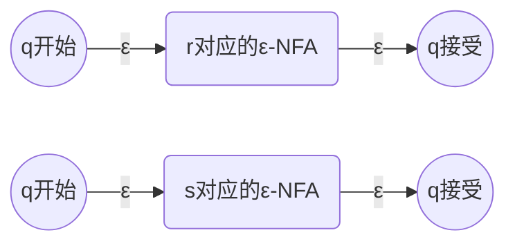
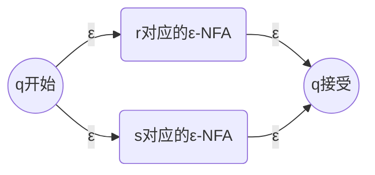
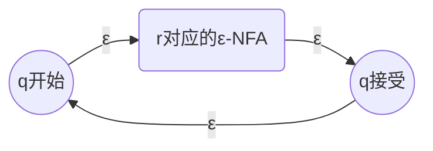

# 正则表达式

**！！注意[正则语言](./正则语言.md)和正则表达式之间的区别与联系！！**

## 正则表达式的定义

字母表$\Sigma$上的正则表达式以递归方式定义：

1. （基础）空集$\emptyset$是正则表达式，表示空语言
2. （基础）$\bm\varepsilon$是正则表达式，表示语言$\{\varepsilon\}$
3. （基础）$\forall a\in\Sigma$，$\bm a$是正则表达式，表示语言$\{a\}$
4. （递归）如果$\bm r$、$\bm s$都是正则表达式，分别表示语言$L$和$M$，那么：
    * （并运算）$\bm r+\bm s$是正则表达式，表示语言$L\cup M$
    * （连接运算）$\bm r\bm s$是正则表达式，表示语言$LM$
    * （闭包运算）$\bm r^*$是正则表达式，表示语言$L^*$
    * （改变运算优先级）$(\bm r)$是正则表达式，表示语言$L$

## 正则表达式与DFA和正则语言间的等价性

为了简便起见，这里分别证明“任意DFA的语言都可以由一个正则表达式所表示”和“任意正则表达式的语言都可以由一个$\varepsilon$-NFA所识别”。

有了这两条性质，显而易见正则表达式与DFA和正则语言间的等价性：

$$
\begin{aligned}
&
  \left\{\begin{aligned}
    &\text{任意DFA的语言都可以由一个正则表达式所表示}\\
    &\text{任意正则表达式的语言都可以由一个$\varepsilon$-NFA所识别}\\
  \end{aligned}\right.&\text{在下面证明}\\
  &\Rightarrow\text{正则表达式与DFA等价}&\text{DFA与}\varepsilon\text{-NFA等价}\\
  &\Rightarrow\text{正则表达式与正则语言等价}&\text{正则语言定义}\\
\end{aligned}
$$

### 任意DFA的语言都可以由一个正则表达式所表示

原命题可以描述为：

$$(\forall A\text{是DFA})(\exists \text{正则表达式}R)(\bm L(A)=\bm L(R))$$

此式显然成立，因为对于任意的语言$L$，我们只需要：

1. $(\forall l=a_1a_2\dots a_n\in L)E_l=\bm{a_1a_2\dots a_n}=\{a_1a_2\dots a_n\}$：用连接运算对语言中的每个字符串构造一个正则表达式
2. $E=\bigcup_{l\in L}E_l=\bigcup_{a_1a_2\dots a_n\in L}\{a_1a_2\dots a_n\}=L$：对所有这些正则表达式进行并运算即可得要构造的语言

DFA的语言当然也能构造出来。

注：实际计算中当然不可能遍历所有字符串，具体使用的构造方法有递归式法、状态消除法等。

### 任意正则表达式的语言都可以由一个$\varepsilon$-NFA所识别（由正则表达式构造$\varepsilon$-NFA的方法）

按照正则表达式的定义，用递归的方式进行证明。

对于字母表$\Sigma$上的正则表达式：

1. （基础）正则表达式$\emptyset$对应的$\varepsilon$-NFA显然是对任何输入都不能跳转到接受状态的$\varepsilon$-NFA：

1. （基础）正则表达式$\bm\varepsilon$对应的$\varepsilon$-NFA显然是一个空转移就跳转到接受状态的$\varepsilon$-NFA：

2. （基础）$\forall a\in\Sigma$，正则表达式$\bm a=\{a\}$对应的$\varepsilon$-NFA显然是读取字符$a$就跳转到接受状态的$\varepsilon$-NFA：

3. （递归）如果$\bm r$、$\bm s$都是正则表达式，分别对应一个$\varepsilon$-NFA，那么可以指定一个起点和终点，其中指定的起点通过空转移到$\varepsilon$-NFA内的起点、$\varepsilon$-NFA内的终点空转移到指定的终点，构造如下$\varepsilon$-NFA：

那么：
  * （并运算）正则表达式$\bm r+\bm s$等价于并联它们就行：

  * （连接运算）正则表达式$\bm r\bm s$等价于串联它们：

  * （闭包运算）正则表达式$\bm r^*$等价于首尾相连：

  * （改变运算优先级）正则表达式$(\bm r)$等价于原$\varepsilon$-NFA不变。

由此，所有的正则表达式均可一步步构造出一个$\varepsilon$-NFA进行表示，原命题得证。

## 正则表达式的运算规则

### 运算优先级定义

括号>闭包运算>连接运算>并运算。例如$\bm{1}+\bm{01^*}=\bm 1+(\bm 0(\bm 1^*))$

### 一些正则表达式计算规则

$$
\begin{aligned}
    \text{并运算}&\\
    &\text{结合律}&\bm{(r+s)+t}&=\bm{r+(s+t)}\\
    &\text{交换律}&\bm{r+s}&=\bm{s+r}\\
    &\text{幂等律}&\bm{r+r}&=\bm{r}\\
    &\text{单位元}\emptyset&\emptyset+\bm{r}&=\bm{r}+\emptyset=\bm{r}\\
    \text{连接运算}&\\
    &\text{结合律}&\bm{(rs)t}&=\bm{r(st)}\\
    &\text{单位元}\bm\varepsilon&\bm{r}\bm\varepsilon&=\bm\varepsilon\bm{r}\\
    &\text{零元}\emptyset&\bm{r}\emptyset&=\emptyset\bm{r}=\emptyset\\
    &&\bm{rs}&\not =\bm{sr}\\
    \text{分配律}&\\
    &\text{左分配律}&\bm{r(s+t)}&=\bm{rs+rt}\\
    &\text{右分配律}&\bm{(r+s)t}&=\bm{rt+st}\\
    \text{闭包运算}&\\
    &&(\bm{r}^*)^*&=\bm{r}^*\\
    &&\emptyset^*&=\bm\varepsilon\\
    &&\bm\varepsilon^*&=\bm\varepsilon\\
    &&\bm r^*&=\bm{r^++\varepsilon}\\
    &&(\bm{\varepsilon+r})^*&=\bm r^*\\
\end{aligned}
$$

### 一些化简规则

$$
\begin{aligned}
    (\bm{\varepsilon+r})\bm r^*&=\bm r^*\\
    \bm{r+rs}^*&=\bm{rs}^*\\
\end{aligned}
$$

### 示例

$E$|$\bm L(E)$
-|-
$\bm a+\bm b$|$\{a\}\cup\{b\}=\{a,b\}$
$(\bm a+\bm b)(\bm a+\bm b)$|$\{a,b\}\{a,b\}=\{aa,ab,ba,bb\}$
$(\bm a+\bm b)^*(\bm{aa}+\bm{bb})$|$\{a,b\}^*\{aa,bb\}=\{\text{以}aa\text{或}bb\text{结尾的字符串}\}$
$\bm{1}+\bm{01^*}$|$\{\varepsilon,1,01,0101,010101,\dots\}$
$(\bm{0+1})^*\bm{01}$|$\{w\in\{0,1\}^*\mid w\text{以}01\text{结尾}\}$
$\bm{01}(\bm{0+1})^*+(\bm{0+1})^*\bm{01}$|$\{w\in\{0,1\}^*\mid w\text{以}01\text{开头}\text{或以}01\text{结尾}\}$
$(\bm{0+1})^*(\bm{1}+\bm{10}+\bm{100})$|$\{w\in\{0,1\}^*\mid w\text{最后三个字符至少有一个是1}\}$
