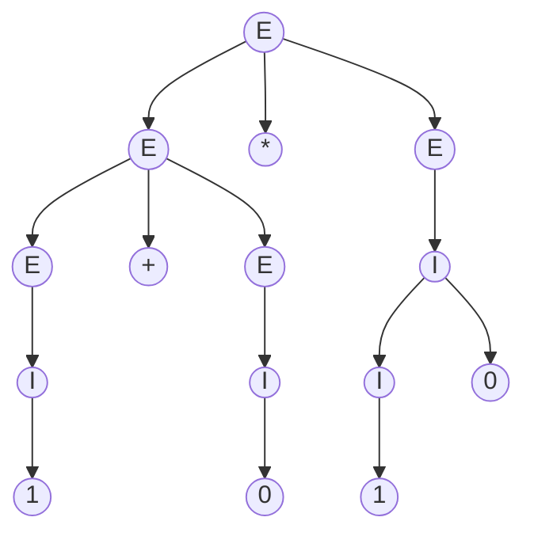
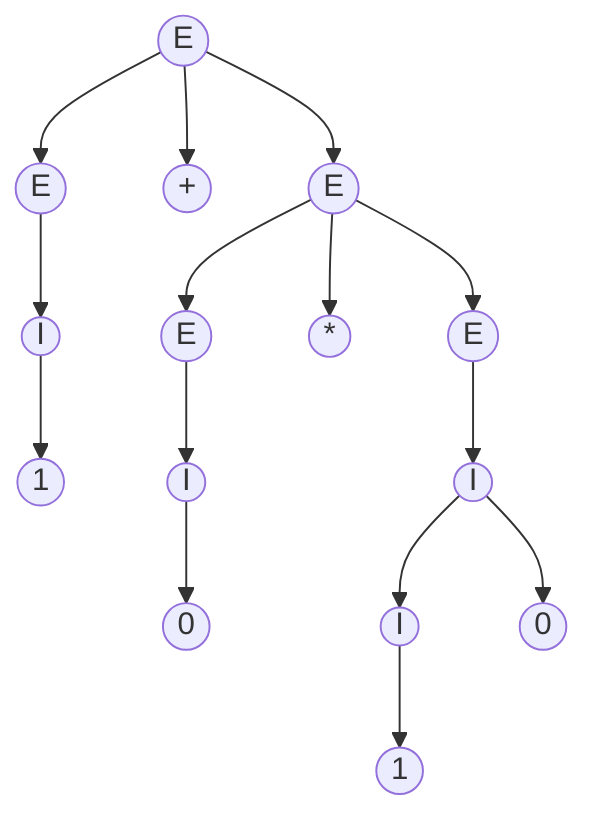
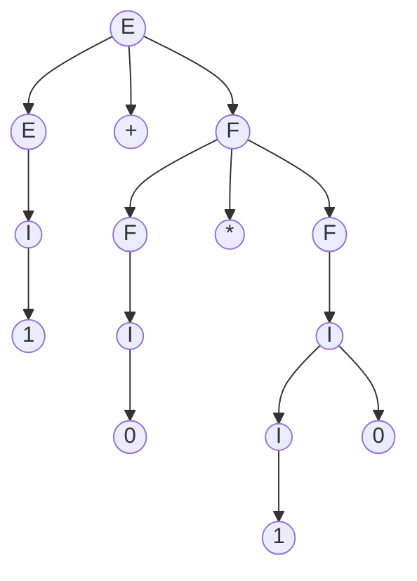

# 语法分析树/派生树

语法分析树是分析上下文无关语言的重要工具，其算法多见于各自高级语言的编译器中。

CFG$G=(V,T,P,S)$的语法分析树/派生树定义为：
* 每个内节点都标记为$V$中的一个变元
* 每个叶节点都标记为$T\cup\{\varepsilon\}$中的变元、终结符或空串
* 某个内节点$A$的子节点从左至右分别是$X_1,X_2,\dots X_n$表示$A\rightarrow X_1X_2\dots X_n\in P$
* 若有$X_i=\varepsilon$那么$A$只能有一个子节点$\varepsilon$，表示$A\rightarrow\varepsilon\in P$

## 语法分析树的产物/结果

**语法分析树的全部叶节点从左到右连接起来组成的符号串称为树的产物/结果。**

若某个语法分析树的根节点是$A$其产物为$\alpha$，则它们之间的关系记为
$$\mathop{/|\backslash}\limits_{\alpha}^A$$

## 语法分析树的子树

**语法分析树中标记为$A$的内节点及其全部子孙节点构成的子树称为$A$子树。**

## 语法分析树和上下文无关语言的等价性

对于CFG$G=(V,T,P,S)$且$A\in V$，有：
$$A\mathop{\Rightarrow}\limits^*\alpha\Leftrightarrow \mathop{/|\backslash}\limits_{\alpha}^A$$

证明：充分性和必要性都可以通过$A\mathop{\Rightarrow}\limits^j\alpha$从$j=1$开始归纳证明，具体证明过程略

## 歧义性

**如果CFG$G$使得有两棵不同的语法分析树产生同一个产物，那么称该CFG是歧义的。**

### 固有歧义性

同一个CFL可以有多个CFG定义。对于某些CFL，可以设计出不歧义的CFG；而**对于某些CFL，它的所有CFG都是歧义的，称这种CFL是固有歧义的。**

注：“判断给定CFG是否歧义”是一个不可计算问题。

#### 案例：固有歧义语言$L=\{a^ib^jc^k|i=j\vee j=k\}$

对于任何形式为$a^nb^nc^n$的串，总存在两棵语法分析树。因此$L$是固有歧义的。

### 经典案例：四则运算表达式的语法分析树

例如，[《上下文无关文法》](./上下文无关文法.md)一节中提到的四则运算表达式的案例在没有确定运算优先级时就是歧义的：
$$G=\{\{E,I\},\{0,1,+,-,\times,\div,(,)\},P,E\}$$
$$
P=\left\{
\begin{aligned}
E&\rightarrow E+E|E-E\\
E&\rightarrow E\times E|E\div E\\
E&\rightarrow (E)|I\\
I&\rightarrow 0|1|I0|I1\\
\end{aligned}
\right\}
$$

$1+0*10$就能由两个语法分析树产生：

显然根据正常的四则运算规则，第二棵子树才是正确的计算过程。这种歧义性在程序编译的实际应用中是不能被允许的。

可以对$P$稍加改造使之成为无歧义的：（使$\times$和$\div$父节点的子树中不存在括号外的$+$和$-$）

$$
P=\left\{
\begin{aligned}
E&\rightarrow E+E|E+F|F+E|F+F\\
E&\rightarrow E-E|E-F|F-E|F-F\\
E&\rightarrow (E)|I\\
F&\rightarrow F\times F|F\div F\\
F&\rightarrow (F)|I\\
F&\rightarrow (E)\\
I&\rightarrow 0|1|I0|I1\\
\end{aligned}
\right\}
$$

这样，$1+0*10$就能由唯一的语法分析树产生：

