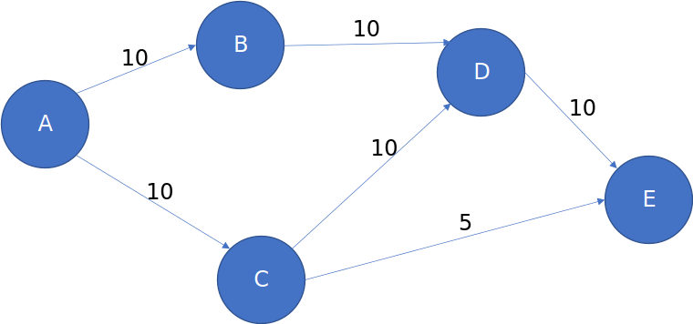
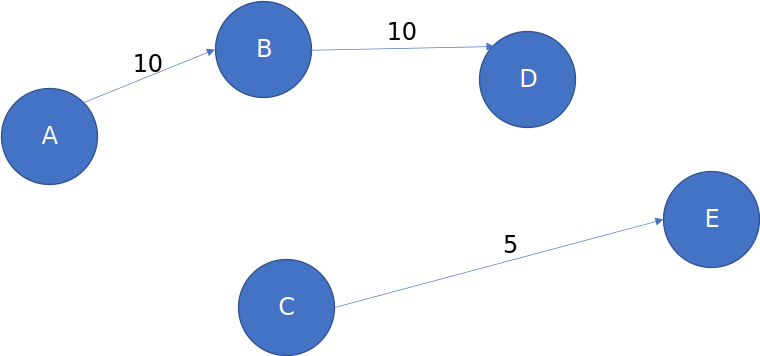
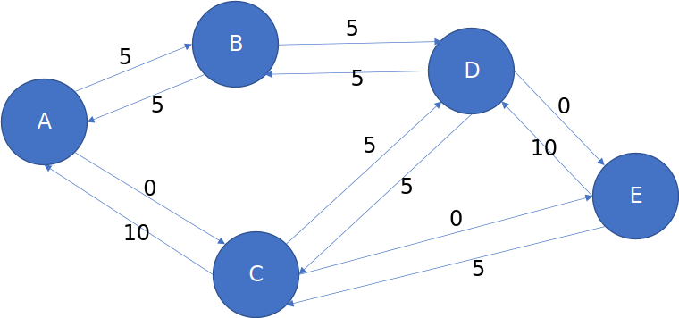
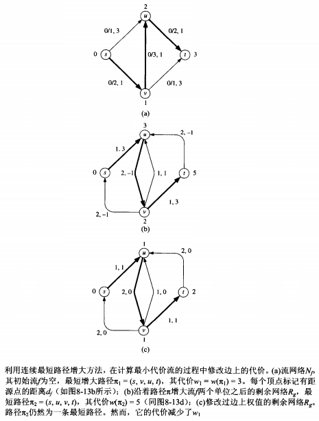
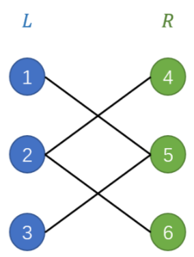
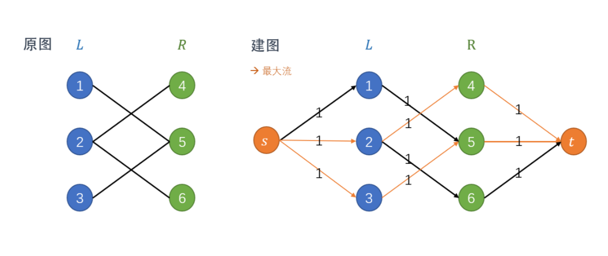
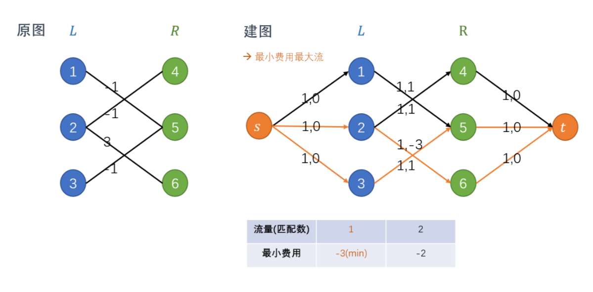

# 最大流算法

## 最大流算法

### 引入

以[POJ1273](http://poj.org/problem?id=1273)作为引入：

>Description
>
>Every time it rains on Farmer John's fields, a pond forms over Bessie's favorite clover patch. This means that the clover is covered by water for awhile and takes quite a long time to regrow. Thus, Farmer John has built a set of drainage ditches so that Bessie's clover patch is never covered in water. Instead, the water is drained to a nearby stream. Being an ace engineer, Farmer John has also installed regulators at the beginning of each ditch, so he can control at what rate water flows into that ditch.
Farmer John knows not only how many gallons of water each ditch can transport per minute but also the exact layout of the ditches, which feed out of the pond and into each other and stream in a potentially complex network.
Given all this information, determine the maximum rate at which water can be transported out of the pond and into the stream. For any given ditch, water flows in only one direction, but there might be a way that water can flow in a circle.
Input
>
>The input includes several cases. For each case, the first line contains two space-separated integers, N (0 <= N <= 200) and M (2 <= M <= 200). N is the number of ditches that Farmer John has dug. M is the number of intersections points for those ditches. Intersection 1 is the pond. Intersection point M is the stream. Each of the following N lines contains three integers, Si, Ei, and Ci. Si and Ei (1 <= Si, Ei <= M) designate the intersections between which this ditch flows. Water will flow through this ditch from Si to Ei. Ci (0 <= Ci <= 10,000,000) is the maximum rate at which water will flow through the ditch.
Output
>
>For each case, output a single integer, the maximum rate at which water may emptied from the pond.
Sample Input
>
>5 4
>
>1 2 40
>
>1 4 20
>
>2 4 20
>
>2 3 30
>
>3 4 10
>
>Sample Output
>
>50

### 问题描述

已知一个有向图$G(V,E)$和每条边的水流量$W_{i,j}$，求起点到终点之间的最大水流量。

### 思路

#### 基本思路：增广路径

显然，从物理上来说，给起点和终点各接上一条水管，不断增大水流量直到有路径刚好溢出，这时的水流量就是最大水流量。体现在程序中就是：随便选一条路径，该路径的流量等于路径上最小边的水流量，从图中减去占用的这部分流量，在剩下的部分重复找路-减流量的过程，最终就能得到最大流量。这里从“剩下的部分”中找到的路径就是我们常说的“增广路径”，找最大流的过程就是不断寻找“增广路径”的过程。

但是，这种方法存在问题，找到的一条从起点到终点的流截断了其他可能的流，比如：

找了ABDE后就会变成：

本来AE之间应该可以传最大15的流的，结果被一条10的流断了。

如何消除这种错误？为了选上那条为5的边，势必要把已选的边流量取消一部分。我们可以把已选的边变成反向边，从而构造出一个新图，在新图的反向边上的流量就是原图上要取消的流量。这种方法就是Ford-Fulkerson算法。

#### 用反向边取消不合理的流量：Ford-Fulkerson算法

Ford-Fulkerson算法给每条路径增加一个初值为0的反向路径，当找到一条路径之后，将路径上的边容量全部减去流量，并在对应的反向边上加上同样大的流量，这样构建的网络称为“残余网络”。每次选好流量后都构建残余网络，在残余网络中再找增广路径，直到没有增广路径可找，反向边上的流量就是最大流路径上的流量。

例如，上面的案例初始化残余网络后就成为这样的图：

而选择了那条会阻断流的路径后，残余网络会变成这样：

进而我们又能找到一条ABDCE为5的流，这条流相当于把CD已经选好的流量取消了5改走CE，从而使得ABDE多走了5的流量。按照上述规则再构造残余网络：

我们发现没有增广路径可找了，算法结束。

## 最小费用最大流 Min Cost Max Flow，MCMF

### 引入

以[UOJ487](https://uoj.ac/problem/487)作为引入：

>给你一张$n$个点$m$条边构成的有向图$G=(V,E)$，其中点从$1$到$n$编号，第$i$条边的起点为$from(i)$，终点为$to(i)$，有容量$cap(i)$和费用$cost(i)$两个属性。并且，图中存在两个特殊点，源点$s$和汇点$t$，$s$点没有入边，$t$点没有出边。
>
>定义流函数$f:E\rightarrow N$为满足以下条件的任一函数（即$f(i)$表示$i$这条边的流量）：
>
>1. $\forall i\in E, 0\le f(i)\le cap(i)$（每条边的流量不超过容量）。
>2. $\forall u\in (V\setminus\{s, t\}), \sum_{from(i) = u\ }f(i)=\sum_{to(i) = u\ }f(i)$（除源汇外每个点的流出量等于流入量）。
>
>定义一个流函数的流量为$s$流出的流量：$flow(f)=\sum_{from(i)=s\ \ \,}f(i)$。
>
>定义一个流函数的总费用为每条边的流量与费用乘积之和：$totalcost(f)=\sum_{i\in E\;}f(i) \cdot cost(i)$。
>
>请求出最大流（$flow(f)$的最大值），以及最大流前提下的最小费用（即$\min\{totalcost(f)|flow(f)=\max\{flow(i)|i\text{ is a flow of }G\}\}$）。

### 问题描述

除了已知一个有向图$G(V,E)$和每条边的容量$W_{i,j}$外，还知道每条边上单位流量产生的费用$C_{i,j}$，求起点到终点之间的最大流量中费用最少的流方案。

### 思路：最短增广路径（连续最短路径增大方法）

先分析一条增广路的费用。
设该费用为$p$，该增广路经过边$e_1,e_2,…,e_m$，每条边的单位流量费用分别是$c_1,c_2,…,c_m$，且该路上当前流量为$a$，那么可以得出下面的式子：
$$p  = ac_1 + ac_2 + … + ac_m  = a(c_1+c_2+…+c_m)$$
也就是：
$$p = a \times \sum_{i=1}^m c_i$$
如果能保证$p$最小且该增广路在最大流中，那么$a$一定是个定值，且等于路上的最小割。

要保证$p$最小，就是要让后面的$\sum_{i=1}^m c_i$最小，它表示该增广路上各条边的单位费用之和。

那么我们能想到什么？最短路！

把$c_i$这一元看作边的边权，那么这个$\sum_{i=1}^m c_i$就表示路上的边权之和。我们要求出最小的$\sum_{i=1}^m c_i$，就是在求图上的最短路。

那么就有了贪心的思路：每次找出图上的最短增广路，那么这条路就“断”了，然后再找最短路，直到无法增广，此时网络达到最大流，且产生的费用最小。

只需要将上面基础的最大流方法中DFS找增广路径的方法找最短增广路径的方法即可。其中，**反向边权值为其所对应的正向边权值的负数**，可直接使用$O(nm)$的Bellman-Ford算法找最短路。

### 进阶：用Dijkstra算法找最短增广路径

如果能想办法用上$O(mlog(n))$的Dijkstra算法找最短路显然比$O(nm)$的Bellman-Ford算法更好，但Dijkstra算法无法处理负权边，因此需要对边权值进行一些修改后再给Dijkstra算法处理：

第一次调用Dijkstra算法时，显然用不到负权边，这时不需要对边进行修改。第一次Dijkstra算法完成后，我们会得到起点到每一个点$u$的最短路径长度$d_u$。

负权边至少要在第一次Dijkstra算法完成后才会出现，此时我们就需要对边的权值进行修改：
$$w'(u,v)=w(u,v)+d_u-d_v$$

显然，$w'(u,v)\geq 0$：
* 如果$d_u$在到$v$的最短路径上，那么$d_v=d_u+w(u,v)$，进而$w'(u,v)=0$
* 如果$d_u$不在到$v$的最短路径上，那么从$u$到$v$必不是最短路径，$d_v<d_u+w(u,v)$，进而$w'(u,v)>0$

显然，修改为$w'(u,v)$不会影响路径间的大小关系：
$$
\begin{aligned}
d_t'&=w'(s,a)+w'(a,b)+w'(b,c)+\dots+w'(x,t)\\
&=w(s,a)+d_a-d_s+w(a,b)+d_b-d_a+w'(b,c)+d_c-d_b+\dots+w(x,t)+d_t-d_x\\
&=w(s,a)+w(a,b)+w(b,c)+\dots+w(x,t)+d_t-d_s\\
&=d_t+d_t-0
\end{aligned}
$$

因此，将边权值修改为$w'(u,v)$不影响求出的最短路径结果。

之后，就是重复“求最短增广路径$\to$修改边权值$\to$求最短增广路径$\to$修改边权值$\to\dots$”的过程直到没有增广路径，算法结束。

## 二分图匹配问题

二分图又称二部图，分为左右两部分，边连接只存在于两部分之间，两部分内部没有边连接。

二分图的匹配指一个**没有公共端点的边**集合，把左边的点和右边的点“配对”起来，使得每个顶点在在**另一个集合中至多有一个伙伴**（如果两边点数量不一样，那就必然有匹配不上的点）。

### 最大二分匹配问题

最大二分匹配问题是指找出一个具有最大边数的匹配，即匹配最多的点。

最大二分匹配问题可以规约到一个最大流问题：

新建总源$s$，总汇$t$。设二分图的左图为$L$，右图为$R$，则将$s$向$L$中的所有节点连边，$R$中的所有节点向$t$连边，并将二分图中原有的无向边转化成$L\to R$的有向边。所有边的容量均为1。于是我们可以得到一张网络流图：

**边的容量为1保证了同一条边不会同时在多条增广路中**，那么任意两条增广路的交点只会是$s$和$t$。此时若求出最大流，那么最大流就是该图的最大匹配，$L\to R$中流量为1的边就是最大匹配中的匹配边。

### 最优匹配/带权匹配问题

一个二分图的最大二分匹配可能有很多，给二分图的每条边加上一个权值，除了求解最大二分匹配问题外，还要求匹配边的权值尽可能的小，这就是带权匹配问题。

和最大二分匹配问题类似，带权匹配问题可以归约到最小费用最大流问题，方法基本相同：

这样，求解一个最小费用最大流问题即可解决带权匹配问题。