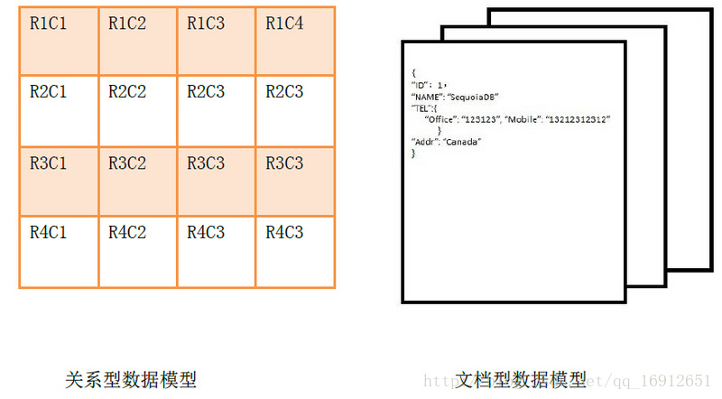
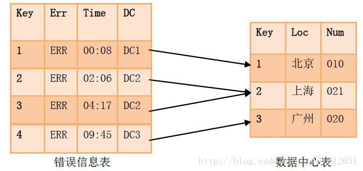
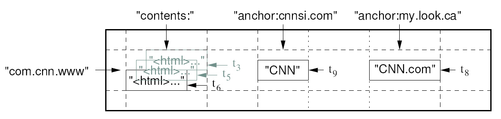
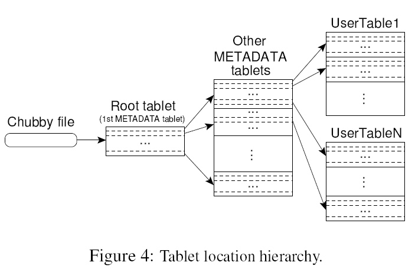

# 各种数据库概述

## 总述：数据库分类和典型产品

* 关系型数据库
  * 关键词：SQL(结构化查询语言)、RDB(关系型数据库)
  * 典型产品：MySQL、Oracle、SQL Server
* 非关系型数据库
  * 关键词：NoSQL(Not only SQL)
  * 典型产品：
    * 键值对数据库：Memcached(临时性键值存储)、Redis(临时+永久键值存储)
    * 文档数据库：MongoDB、CouchDB
    * 图数据库：Neo4J、InfoGrid
    * 列数据库：Cassandra、HBase

## 关系型数据库的数据模型

建立在关系模型基础上的数据库，借助于集合代数等数学概念和方法来处理数据库中的数据。

## 键值对数据库的数据模型

* Key指向Value的键值对，通常用HashTable来实现
* 键值对数据库中的Value值是纯非结构数据，一般作为字符串或者二进制处理
* 就是一个多功能的大字符串数组

## 文档数据库的数据模型

* Key指向(Attribute,Value)的键值对
* 和键值对数据库不同，文档数据库中的Value值是结构化数据
* 文档数据模型和关系型数据库的数据模型类比关系如下（以MySQL和MongoDB为例）：

| 关系型数据库 | 文档数据库       |
| ------------ | ---------------- |
| database     | database         |
| table        | collection(集合) |
| row(行)      | document(文档)   |



### 文档与关系

#### “关系”

如上所示，关系型数据库中的每一条记录存储都需要**遵守一个固定的模式**（固定的列数/属性数），每一列有特定的意义而且规定了数据类型。如果要获取不同的数据，数据库的模式就需要重新修改。

此外，关系型模型还有一个特点就是“数据库标准化”。按照关系型数据的**NF法则**，在关系型数据库结构时，会**将大的表（多个列/属性）压缩成小的、整合的表（把重复的属性值拎出来单独一张表）**，然后互相之间以“**外键**”连接，就像下图所展示的一样。**这种“外键”就是关系型数据库中的“关系”的体现**。



#### “文档”

使用“文档”这个词似乎让人觉得奇怪，但是其实 “文档型数据模型”真的和传统意义的文字“文档”没有什么关系。他不是书、信或者文章，这里说的“文档”其实是一个数据记录，这个记录**能够对包含的数据类型和内容进行“自我描述”**。XML文档、HTML文档和JSON 文档就属于这一类。例如，上面的四条错误信息记录在JSON文档数据库中可能会是像下面这样：

* 记录1

```json
{
    "_id": 1,
    "Err": "ERR",
    "Time": "00:08",
    "DC":{
        "id": 1,
        "Loc": "北京",
        "Num": "010",
        "Street": "长安街"
    },
    "level": 0
}
```

* 记录2

```json
{
    "_id": 1,
    "Err": "ERR",
    "Time": "02:06",
    "DC":{
        "id": 2,
        "Loc": "上海",
        "Num": "021",
        "Range": "闵行区"
    },
    "Note": null
}
```

#### 比较

从上面的对比中也可以很容易的看出，这种文档型的记录方式所记录的数据是不规则的，很容易出现冗余信息，而关系型数据库则不会，比如上面的记录中，“DC”信息在关系型数据库中只会存储一次，由其他的表通过“外键”建立指向性的“关系”，使得一条数据被多条记录共享，极大地减少了重复数据的出现；并且当“DC”的某些信息发生改变时也完全不需要对其他数据进行进一步的修改。这也是关系型数据模型的“一致性”所带来的好处。

但是，这种“一致性”的缺陷在于，复杂的共享数据内部关系网的存在，使得关系型数据在多个服务器之间的传递变得复杂而缓慢，同时让读和写操作的性能变差，不**利于分布式**系统的构建。

而文档数据库则可以很好地解决这个问题。从上面文档数据库存储的方式可以看出，文档数据的每一条记录包含了所记录的抽象个体的全部信息，没有任何外部的引用，这条记录就是“**自包含**”的。这就使得记录很容易完全移动到其他服务器，因为这条记录的所有信息都包含在里面了，不需要考虑还有信息在别的表没有一起迁移走。

有利于分布式部署是文档型数据库最有力的优势。除此之外，用不规则的结构化文档存储数据的优势还有以下两点：

##### 并发性

并发性的原理和分布式相同，都是源自文档数据库的“**自包含**”特性。关系型数据库中，为了保证数据的一致性，一张表一次只能由一个线程进行修改，当并发量大的时候显然很低效。而文档数据库因为“**自包含**”，所以可以由多个线程同时修改不同的文档，因此可以并发操作。

##### 灵活性

面对大量而多样性的数据，如果使用关系型模型，就需要不断修改数据操作模式，这样，可能会引起系统负载的大大提升，同时也会大大增加处理的时间。这一点在社交网站应用中尤其明显：有人会发布风景照片、有人发布对时事的评论还有人分享音乐表达心情，不同的数据有不同的关系，不利于在关系数据库中处理。

#### 优缺点总结

-|优点|缺点
-|-|-
文档数据库|没有数据间的依赖关系，有利于分布和并发|数据之间没有一致性
关系数据库|数据之间有一致性，不容易出错且节约存储空间|数据间严格而复杂的关系不利于分布式部署

## 图数据库的数据模型

图数据库是关系型数据库在“外键”连接方面进行特化后的一种数据库。相对于关系数据库来说，图数据库善于处理大量复杂互连接且低结构化的数据，这些数据变化迅速，需要频繁的查询——在关系数据库中，这些查询会导致大量的表连接，因此会产生性能上的问题。图数据库重点解决了拥有大量连接的传统RDBMS在查询时出现的性能衰退问题。

## 列数据库的数据模型

### BigTable

[教程参考](http://dblab.xmu.edu.cn/post/google-bigtable/)

列数据库模型最初来源于Google提出的Bigtable。Bigtable看起来像一个关系型数据库，采用了很多数据库的实现策略。但是Bigtable并不支持完整的关系型数据模型；而是为客户端提供了一种简单的数据模型，客户端可以动态地控制数据的布局和格式，并且利用底层数据存储的局部性特征。本质上说，Bigtable是一个键值（key-value）映射。

按作者的说法，Bigtable是一个**稀疏**的，**分布式**的，**持久化**的，**多维**的**排序映射**。

#### 多维

Bigtable的键有三维：`(row:string, column:string, time:int64)->string`

* row：行键（row key）：
  * 行键可以是任意字节串，通常有10-100字节。
  * 行的读写都是原子性的。
  * Bigtable**按照行键的字典序存储数据**。
  * Bigtable的表会根据行键**自动划分为片**（tablet），**片是负载均衡的单元**。最初表都只有一个片，但随着表不断增大，**片会自动分裂**，片的大小控制在100-200MB。
  * 行是表的第一级索引，我们可以把该行的列、时间和值看成一个整体，简化为一维键值映射
* column：列键（column key）：
  * 列是第二级索引，每行拥有的列是不受限制的，可以随时增加减少
  * 为了方便管理，**列被分为多个列族**（column family，是访问控制的单元），一个**列族里的列一般存储相同类型的数据**。
    * 一行的**列族很少变化**，但是**列族里的列可以随意添加删除**。列键是按照`[列族名]:[列名]`格式命名的。
    * 访问控制以及磁盘和内存审计是在列家族层面上进行的。这些控制允许我们管理几种不同类型的应用，可以让应用只被允许浏览某些列，无法浏览全部列家族。
* time：时间戳（timestamp）：
  * 时间戳是第三级索引。
  * Bigtable允许**保存数据的多个版本**，版本区分的依据就是时间戳。
  * 时间戳可以由Bigtable赋值，代表数据进入Bigtable的准确时间，也可以由客户端赋值。
  * 数据的不同版本按照时间戳降序存储，因此先读到的是最新版本的数据。
  * 用户可以设定只保存单元格中数据的最近n个版本，或者只保存足够新版本（比如只保存最近7天内的数据版本）。

BigTable的一行可以以如下所示的方式存储（以JSON为例）：

```json
table{
  "aaaaa" : {//行键
    "A:foo" : {//列键，A族foo键
        15 : "y", //时间戳
        4 : "m"  
      },  
    "A:bar" : {//一列，A族bar列
        15 : "d",//一个版本
      },  
    "B:" : {//一列，空列族
        6 : "w"  
        3 : "o"  
        1 : "w"  
      }  
  },  
  // ...  
}  
```

例如GFS原论文中给出的“Webtable”示例：



在“Webtable”中：

* 行键是倒序的URL，表示一个网页（倒序是为了让同一域名下的不同子域存储在一个地方）
* 列键分两个族：
  * `contents`族：该族中没有键，其中直接存储了网页内容及历史版本
  * `anchor:[网址]`键：`archor`族中的键代表那些引用了该行对应网页的页面

#### 稀疏

“稀疏”是指表中每一列的值的存储格式都可以有很大不同。

#### 分布式

Bigtable依赖于google的几项重要的分布式技术：

* GFS(Google File System)：分布式的文件系统，是BigTable用来存储日志和数据文件的文件系统
* SSTable(Sorted String Table)：不可修改的有序的键值映射，提供了查询、遍历等功能，是BigTable存储数据的格式
* Chubby：一种高可用的分布式锁服务，在BigTable中于片定位、片服务器的状态监控、访问控制列表存储等任务

正如上文所说，Bigtable会将表（table）进行分片，片（tablet）的大小维持在100-200MB范围，一旦超出范围就将分裂成更小的片，或者合并成更大的片。每个片服务器负责一定量的片，处理对其片的读写请求，以及片的分裂或合并。片服务器可以根据负载随时添加和删除。

按照这种结构，Bigtable集群包括三个主要部分：

* 一个供客户端使用的库：负责用户与集群的通信
* 一个主服务器（master server）：负责**将片分配给片服务器**，监控片服务器的添加和删除，平衡片服务器的负载，处理表和列族的创建等。
  * 注意，主服务器是用来管理片服务器的，不存储任何片，不提供任何数据服务，也不提供片的定位信息。客户端的读写操作是通过分布式算法直接在片服务器上进行的
* 许多片服务器（tablet server）：这里片服务器并不真实存储数据，而相当于一个**连接Bigtable和GFS的代理**，客户端的一些数据操作都**通过片服务器代理间接访问GFS**，就好像数据都存储在片服务器上。

客户端需要读写数据时，**直接与片服务器联系**。因为客户端并不需要从主服务器获取片的位置信息，所以客户端的读写操作并不需要访问主服务器，主服务器的负载一般很轻。

##### 如何查询（片的定位）



TODO:学习原论文待续