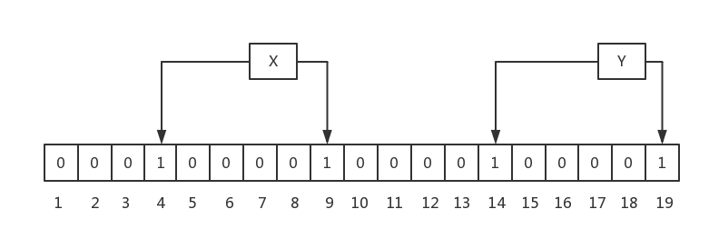
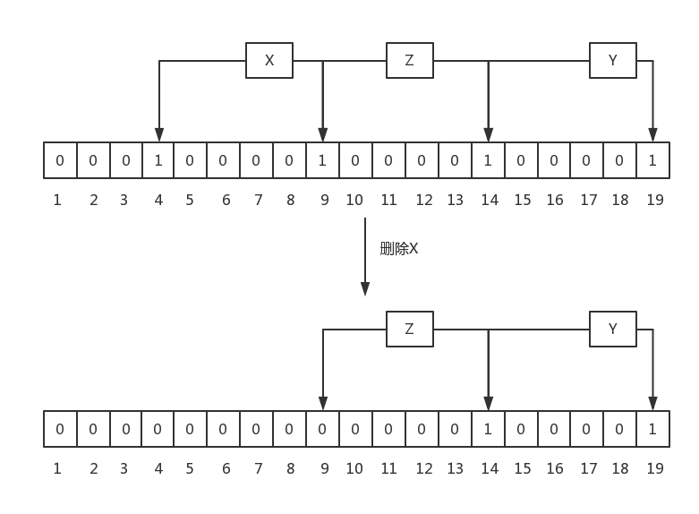

# Bloom Filter：布隆过滤器

## 布隆过滤器——检查一个元素是否在一个集合中——**可能存在**或者**一定不存在**

## 原理：一个bit array，多个hash函数

### 规则一：Bloom Filter中插入一个元素，会使用k个hash函数，来计算出k个在bit array中的位置，然后，将bit array中这些位置的bit都置为1

这种方法的好处在于，不需要一个元素用一个bit位置表示，从而可以压缩hash表长度。比如，原本的bit array一个bit位置表示一个元素，n个bit位置可以表示n个元素的**准确存在性**，而用了Bloom Filter之后，当用k个hash函数时，n个bit位置理论上最多可以表示$C_n^k$个元素的**可能存在性**。在牺牲准确性的基础上，这种存法极大地节约了空间。

### 规则二：Bloom Filter中查找一个元素，会使用和插入过程中相同的k个hash函数，取出每个bit位置对应的值，如果所有bit都为1，则返回元素**可能存在**，否则，返回元素不存在

在Bloom Filter的查询过程中，当判定某个元素可能存在于某一集合之后，就需要进一步进入到集合中确定元素的准确存在性，第二遍查询会造成进一步的性能开销，如果集合中元素原本不存在Bloom Filter却给出元素存在，那相当于白费了第二遍的查询开销。因此，Bloom Filter的假正率(false positive probability)就成为影响Bloom Filter性能一个重要的指标。最好的Bloom Filter应该具有尽可能低的假正率。

假设一个Bloom Filter的有$k$个hash函数$H_1(\cdot)\sim H_K(\cdot)$，其bit array有$m$位$A_1\sim A_M$，要在其集合$S$插入$N$个元素$s_1\sim s_N$，则假正率$P$为：
$$P=(1-(1-\frac{1}{M})^{KN})^K\approx(1-e^{-\frac{KN}{M}})^K$$

当实际插入的元素个数$N=10^5$时，上述公式图形如下：

且其中的假正率$P$和hash函数数量的关系如下图：

一般来说，bit array长度$M$取实际插入的元素个数$N$的10倍。hash函数数量一般为5-10个。

### 规则三：最后，Bloom Filter中不允许有删除操作

因为删除后，可能会造成原来存在的元素返回不存在。

Bloom Filter只允许假正而不允许假负，即不能对一个本来存在的元素报不存在，但是下面这种删除情况就会出现假负：

因此布隆过滤器在实际使用时一般只增不删。

### 附：证明Bloom Filter的假正率表达式

$\because$对于$k$个hash函数，在大样本情况下，每个元素的Hash都能使对bit array中的每一位以均等的概率被置1，即对于$k=1,\cdots,K$和$n=1,\cdots,N$有
$$(\forall i,j=1,\cdots,M)P(H_k(s_n)=i)=P(H_k(s_n)=j)$$

$\because$hash函数的输出值不能大于bit array位数

$\therefore$对于$k=1,\cdots,K$和$n=1,\cdots,N$有
$$\sum_{m=1}^M P(H_k(s_n)=m)=1$$

$\therefore$对于$k=1,\cdots,K$、$n=1,\cdots,N$和$m=1,\cdots,M$有
$$P(H_k(s_n)=m)=\frac{1}{M}$$
也即插入一个元素时一个hash函数使bit array中的某一位置1的概率。

$\therefore$插入元素$s_n$后bit array中$m$位为0的概率为
$$P_n(A_m=0)=\prod_{k=1}^K(1-P(H_k(s_n)=m))=(1-\frac{1}{M})^K$$
其中$n=1,\cdots,N$且$m=1,\cdots,M$

$\therefore$插入全部$n$个元素后bit array中$m$位为0的概率为
$$P(A_m=0)=\prod_{n=1}^NP_n(A_m=0)=(1-\frac{1}{M})^{KN}$$

$\because$假正率可以看作一个集合中不存在的新元素$s_{N+1}$的$k$个hash函数在bit array中的对应位全部为1的概率，即

$$P=\prod_{k=1}^KP(A_{H_k(s_{N+1})}=1)$$

$\therefore$假正率为

$$
\begin{aligned}
    P&=\prod_{k=1}^KP(A_{H_k(s_{N+1})}=1)\\
    &=\prod_{k=1}^K(1-P(A_{H_k(s_{N+1})}=0))\\
    &=(1-(1-\frac{1}{M})^{KN})^K
\end{aligned}
$$

$\because$当$M$足够大时有
$$\lim\limits_{M\to\infin}e^{-\frac{1}{M}}\sim\lim\limits_{M\to\infin}1-\frac{1}{M}$$

$\therefore$原式可化为
$$
\begin{aligned}
\lim\limits_{M\to\infin}P&=\lim\limits_{M\to\infin}(1-(1-\frac{1}{M})^{KN})^K\\
&=(1-\lim\limits_{M\to\infin}(1-\frac{1}{M})^{KN})^K\\
&\approx(1-e^{-\frac{KN}{M}})^K
\end{aligned}
$$

## 与其他算法的对比

### 优点

能够用于集合元素存在性测试的还有这些常见算法：hashmap，set，bit array。相对于这些算法布隆过滤器有这些优势：

* hashmap是一个指针数组，一个指针的开销是sizeof(void *)，在64bit的系统上是64bit，在32位系统上是32bit，如果用链地址法处理冲突还要更多空间。而正如前文所述，Bloom Filter中n个bit位置理论上最多可以表示$C_n^k$个元素的可能存在性，空间利用率远比hashmap大不少
* 对于平衡树方式实现的set，一个节点需要一个指针存储数据的位置，两个指针指向其子节点，空间开销比hashmap还大
* 单纯的bit array相当于Bloom Filter只有一个hash函数的特殊情况，因此如果要获得和BloomFilter相同的误判率，则需要比Bloom Filter更大的存储空间（见上面的图）

### 缺点

* hashmap和set不会出现误判的情况，而Bloom Filter有一定的假正率
* bit array只要一次hash而Bloom Filter要多次hash

## 使用场景

一组元素存在于磁盘中，数据量特别大，应用程序希望在元素不存在的时候尽量不读磁盘，此时，可以在内存中构建这些磁盘数据的Bloom Filter，实际的集合在磁盘中，Bloom Filter的bit array在内存：

* 写操作：将内容写入磁盘，并同时写入Bloom Filter
* 查询操作：
  * 先读内存中的Bloom Filter
  * 如果Bloom Filter返回不存在，则不必再读磁盘
  * 如果Bloom Filter返回可能存在，则再读磁盘确认准确的存在性

## Bloom Filter和hashmap实际性能分析

按照上述查询操作的过程分析Bloom Filter和hashmap的实际性能差距。

### 时间复杂度

假设在内存中Bloom Filter计算的时间开销为$T_0$，从硬盘中读取的开销为$T_1$，那么Bloom Filter查到元素存在和假正的开销为：

$$T_\text{存在}=T_\text{假正}=T_0+T_1$$

不存在的开销为：

$$T_\text{不存在}=T_0$$

再假设Bloom Filter返回元素存在的概率为$P_0$，假正率为$P$，则查询一个元素的平均开销为：

$$
\begin{aligned}
T_{BF}&=P_\text{存在}T_\text{存在}+P_\text{假正}T_\text{假正}+P_\text{不存在}T_\text{不存在}\\
&=(P_0-P)(T_0+T_1)+P(T_0+T_1)+(1-P_0)T_0\\
&=T_0+P_0T_1
\end{aligned}
$$

而对于一个hashmap，若其中存储与此Bloom Filter相同的元素，并且有相同的内存和硬盘性能开销，那么其返回一个元素存在的概率为：

$$P_\text{存在}=P_0-P$$

其查询一个元素的平均开销为：

$$
\begin{aligned}
T_{hashmap}&=P_\text{存在}T_\text{存在}+P_\text{不存在}T_\text{不存在}\\
&=(P_0-P)(T_0+T_1)+(1-(P_0-P))T_0\\
&=T_0+(P_0-P)T_1
\end{aligned}
$$

因此Bloom Filter和hashmap的性能差距为：

$$\Delta T=T_{BF}-T_{hashmap}=PT_1$$

### 空间复杂度

而由前文的所述，Bloom Filter中bit array长度$M$取实际插入的元素个数$N$的10倍；而hashmap若存储地址则每个元素至少需要32bit的空间（32位机）或64bit空间（64位机）。其空间消耗可以表示为：

$$C_{BF}=10N$$

$$C_{hashmap}\in\{32N,64N\}$$

可见，Bloom Filter以$\Delta T$的性能牺牲换取了3-6倍的空间利用率提升。
