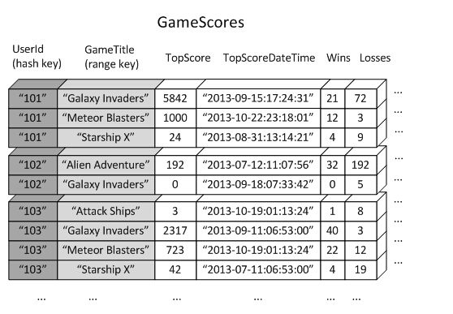
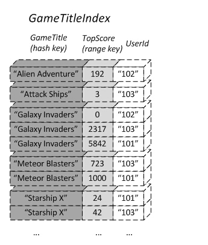
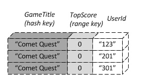

# (未完成)N1QL

NoSQL 对于关系型世界严格的schema也有了适应。关系数据库通过SQL查询语言灵活的查询和使用数据。Couchbase最新的4.0版本，已经增加了上述的SQL“基因”的支持。在Couchbase上使用SQL语言，既保留了JSON文档灵活的数据模型，又支持了强大的SQL语言。N1QL，是目前针对JSON数据最强大的表达式语言。JSON和SQL的组合使我们在这个新的数据时代有了更简单的编程方式和快速构建企业数据应用的利器。

## 特性

### N1QL是SQL+JSON的组合

Couchbase Server是文档数据库，提供了灵活的数据模型。 在JSON文档上使用SQL让开发变得异常简单。N1QL不仅支持复杂的SQL能力，例如跨文档的连接 Join操作，还提供了专门针对JSON数据的嵌套格式，例如NEST和UNNEST操作。

### N1QL提供了良好的性能保障

因为包含了新的强大的索引机制——“全局二级索引**GSI(Global secondary indexes)**”，有极好的低延迟和扩展性。GSI提供了最低的扫描延迟以满足现代数据应用的需求。

#### GSI

如果想精确地定位到数据库中的某行记录，唯一的办法是通过一个index表来查询。如果不通过index表来查找数据，就必须逐行地比较每一列的值，即全表扫瞄。对于较大的表，全表扫描的代价是不可接受的。

但是，很多情况下，需要从多个角度查询数据。例如，在定位某个人的时候，可以通过姓名、身份证号、学籍号等不同的角度来查询，要想把这么多角度的数据都放到index表中几乎不可能。

GSI就是用来解决上述问题的。

##### 二级索引原理（以DynamoDB为例）

网上关于Couchbase的资料很少，所以这里暂时先以DynamoDB为例介绍二级索引。

比如有一张表`GameScores`，其主键为DynamoDB特有的Hash Key + Range Key组合主键`(UserId,GameTitle)`，表中存储了每个用户在每个游戏中的分数情况。组合主键除了提供按用户ID`UserId`的查询之外，还提供按游戏名称`GameTitle`的范围查询。但是在没有二级索引的情况下，如果要按游戏名称查找每个用户的游戏数据，就会导致对`GameTitle`的全表扫描。由于range key的查找速度远小于Hash key，查询速度就很慢。

如果要针对按游戏查找的操作优化数据库的性能，最好的方法就是使用一个二级索引，用Hash key存储游戏名，例如：

这个索引表的主键是`(GameTitle,TopScore)`，其中存储的数据为原表中的Hash key `UserId`，这样，当开发一个与游戏排行榜相关的应用时，只需要用Hash key查找到目标游戏，然后按照`TopScore`的顺序返回`UserId`，而`UserId`又是原表中的Hash key，因此查询速度大大加快。

##### 特别的

* 显然，索引中的数据必须要与原表相同，而原表中不能保证唯一的数据可能成为索引的主键，因此GSI的主键不能要求唯一性。
* 但是数据唯一性又是数据库的基本要求，对此GSI的办法是要求全局索引必须包含原表中的主键。

比如：

这个索引表中的主键是重复的，但是表中存储了原表中的主键，因此是合法的二级索引表。

### N1QL使用新的多维度扩展模型

N1QL的查询服务和索引服务(GSI)从架构设计上就是和couchbase本身的数据操作是完全独立的，查询服务，数据服务，索引服务都是相互独立，可以独立的选择水平扩展或垂直扩展；而不像传统的关系数据库或者其他NoSQL一样，从数据操作到索引到数据查询工作负载都是一样的扩展模型。
