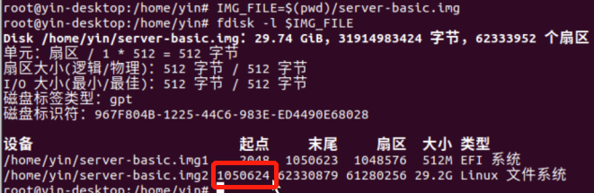
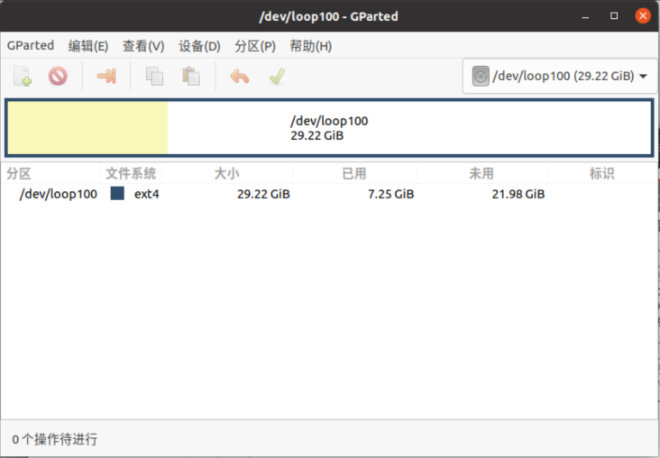
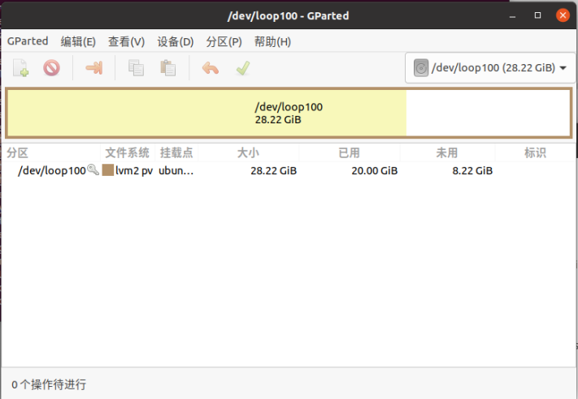
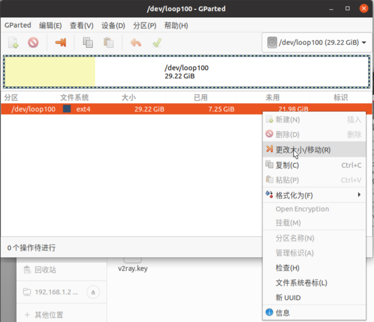
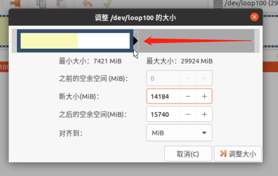
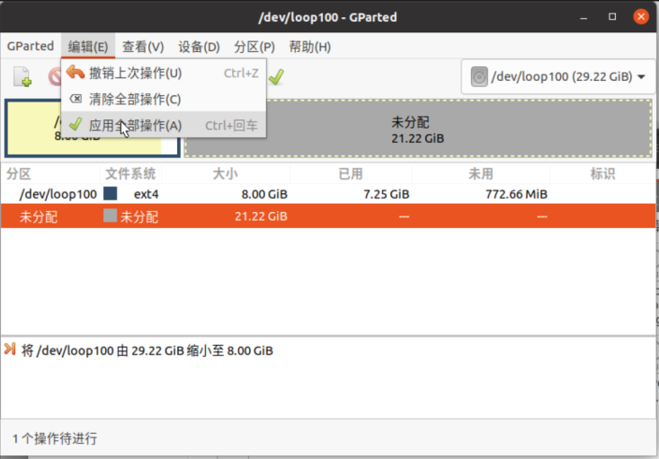
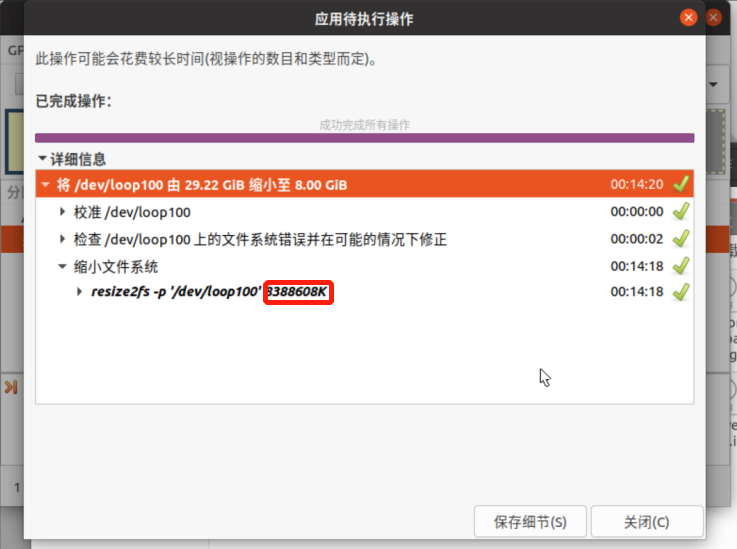
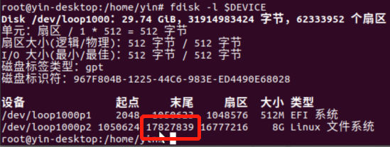

# 如何压缩Win32DiskImager读出的磁盘镜像

做大规模实验经常要一次装很多台机器。通常的办法是将一台已经装好的机器上的系统盘取出来，用Win32DiskImager制作成镜像再写到其他机器的存储器上，这样就不用一台机器一台机器地用安装盘装机了。

但是这种方法有个问题，那就是系统盘有多大读出来的镜像就有多大，64G的盘不管里面写了多少内容读出来的镜像就是64G.这样，在写入镜像的时候就很费时间。显然一个刚装好的系统不可能把64G全写满，所以我们可以将镜像里面没有写入内容的部分裁掉，这样就能极大地节省写入镜像的时间。

## 准备

**注意：开了LVM的盘不能用此方法**

* 用Win32DiskImager做好的镜像
* 运行着Linux操作系统的电脑
* 安装`gparted`

```sh
apt-get install -y gparted
```

## 查看最大的分区的起点位置

通常，镜像中的比较小的分区都是操作系统的固定分区，不能变，只有最大的那个才是存储用户文件的分区。

首先得看看最大的分区从哪开始：

```sh
IMG_FILE=$(pwd)/server-basic.img
fdisk -l $IMG_FILE
```



这个大小最大的分区的起点就是我们要找的数字。

## 挂载镜像中最大的分区到本地回环

知道了起点位置，`losetup`就可以将最大的分区挂载到本地回环上：

```sh
START=1050624
DEVICE=/dev/loop100
losetup $DEVICE $IMG_FILE -o $(($START*512))
```

## 对挂载的设备启动gparted

```sh
gparted $DEVICE
```



如果发现有`lvm`字样说明是开了LVM的盘，不能用这种方法操作。




## 修改大小

点这个“更改大小/移动”



拖着这个拉到最左边然后点“调整大小”



最后点“应用全部操作”



在输出中找到修改后的分区具体大小



## 重建分区

```sh
losetup -d $DEVICE
DEVICE=/dev/loop1000
losetup $DEVICE $IMG_FILE
fdisk $DEVICE
```

* 最大的分区是第2个，所以依次输入`d`和`2`删除该分区
* 然后输入`n`和`2`重建第2个分区
* 输入`$START`的值作为起始位置
* 输入上一步中看到的修改后的分区具体大小的值作为分区大小`+<值>K`，注意要输入前面的加号和后面的K
* 输入`w`确认修改

## 裁剪文件

先看从哪裁剪

```sh
fdisk -l $DEVICE
```

找到修改后的最大扇区末尾，这就是要裁的位置：



卸载设备然后裁之：

```sh
losetup -d $DEVICE
END=17827839
truncate -s $((($END+1)*512)) $IMG_FILE
```

完成，可以看到镜像文件大小显著降低了。

## 刷入系统后如何扩容到物理存储器大小

将一个16G盘的镜像刷到32G的盘上，不经过任何操作开机只会识别出16G的存储空间，这是因为这种刷机方式将分区表也一起刷入卡里，所以多出来的空间相当于没有格式化的新分区。这种情况只需要和前面一样用`gparted`重建一下分区表就可以解决。

1. `gparted /dev/sdb`
2. 将第二个分区的扇区末尾拉到最右边
3. 卸载第二个分区
4. 第二个分区点击右键菜单检查当前分区