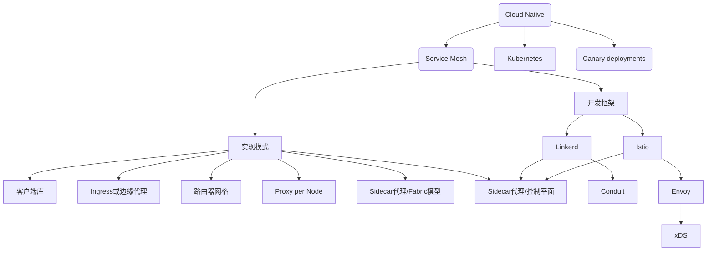
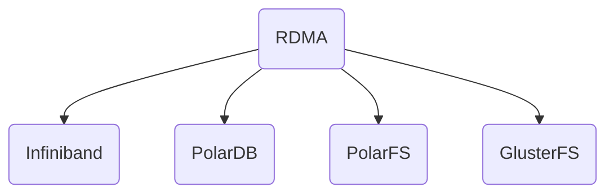

# 知识图谱

```mermaid
graph TD
CloudNative(Cloud Native)-->ServiceMesh(Service Mesh)
CloudNative-->k8s[Kubernetes]
CloudNative-->CanaryDeployments(Canary deployments)
ServiceMesh-->Pattern[实现模式]
Pattern-->ClientDevelopKit[客户端库]
Pattern-->Ingress[Ingress或边缘代理]
Pattern-->RouterMesh[路由器网格]
Pattern-->ProxyperNode[Proxy per Node]
Pattern-->Fabric[Sidecar代理/Fabric模型]
Pattern-->Sidecar[Sidecar代理/控制平面]
ServiceMesh-->Frames[开发框架]
Frames-->Istio
Frames-->Linkerd
Linkerd-->Conduit
Istio-->Envoy
Envoy-->xDS
Linkerd-->Sidecar
Istio-->Sidecar
```

```mermaid
graph TD
RDMA(RDMA)-->Infiniband(Infiniband)
RDMA-->PolarDB(PolarDB)
RDMA-->PolarFS(PolarFS)
RDMA-->GlusterFS(GlusterFS)
```
