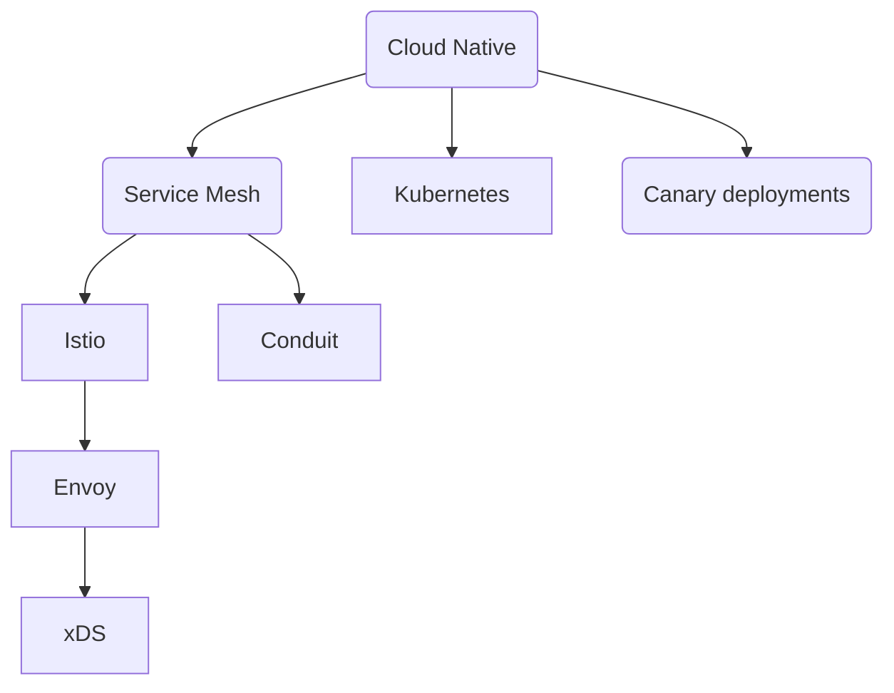
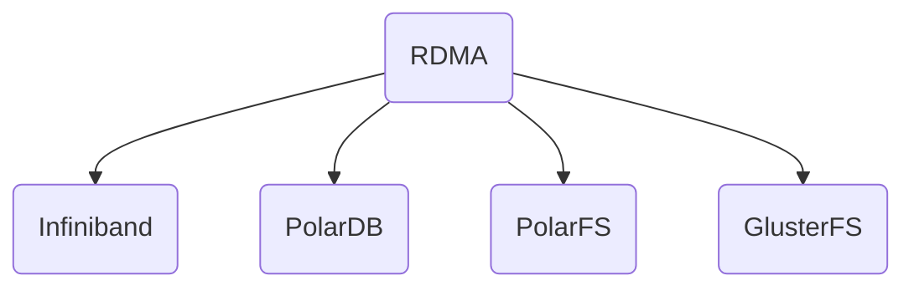

# 知识图谱

```mermaid
graph TD
CloudNative(Cloud Native)-->ServiceMesh(Service Mesh)
CloudNative-->k8s[Kubernetes]
CloudNative-->CanaryDeployments(Canary deployments)
ServiceMesh-->Istio[Istio]
ServiceMesh-->Conduit[Conduit]
Istio[Istio]-->Envoy[Envoy]
Envoy[Envoy]-->xDS[xDS]
```

```mermaid
graph TD
RDMA(RDMA)-->Infiniband(Infiniband)
RDMA-->PolarDB(PolarDB)
RDMA-->PolarFS(PolarFS)
RDMA-->GlusterFS(GlusterFS)
```
