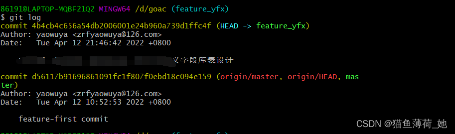

# 【摘录】Commit的合并与修改——rebase变基指令

## 合并 commit

[原文在此](https://blog.csdn.net/qq_39253370/article/details/124277214)

在项目开发时，每天会提交大量的代码，也会有很多 commit 记录，那么要不要处理这些 commit 记录。
当然不处理这些 commit 记录也能进行代码合并，就是记录有点多，并且每个 commit 可能获知的信息不那么全，如果合并一下这些 commit 并添加一些这些 commit 的总的概览，这样看起来 commit 记录也少了很多，并且都是有用的提交记录。

git log: 查看提交历史


上述有五个 commit 记录。如果我想合并四个 commit 记录：

`git rebase -i HEAD~4` 合并前面四个 commit 记录

也可以指定合并某个版本之前的版本：`git rebase -i 3a4226b` 但不包含 `3a4226b`，至合并他之前的。

执行了 rebase 之后会弹出一个窗口，让你选择合并哪些 commit 记录

```
pick 3ca6ec3   '注释**********'
pick 1b40566   '注释*********'
pick 53f244a   '注释**********'
```

需要把 pick 改为 s 或 squash，需要留第一个，第一个不要改，意思是下面的 commit 记录都合并到第一个上面去。

```
pick 3ca6ec3   '注释**********'
s 1b40566   '注释*********'
s 53f244a   '注释**********'
```

保存退出

如果有冲突，可以先解决冲突，解决完之后执行：
```sh
git add .
git rebase --continue
```
如果不想执行或者想放弃的话可以执行：
```sh
git rebase --abort
```

如果没有冲突，或者冲突已经解决，会弹出窗口，让你注释掉一些提交记录，这里是让我们编辑自己合并的这些记录的概览，如：完成了什么功能，按照实际情况填写。

```
# This is a combination of 4 commits.  
# 写上合并的这些 commit 做了什么事，如：
完成了 api 的编写：
	1. 完成了用户相关的 api 编写
	2. 完成了用户列表相关 api 编写

# 下面的都注释
# The first commit’s message is:  
# 注释......
# The 2nd commit’s message is:  
# 注释......
# The 3rd commit’s message is:  
# 注释......
# Please enter the commit message for your changes. Lines starting # with ‘#’ will be ignored, and an empty message aborts the commit.
```

保存退出，按下 esc 再按 ：然后输入 wq 或 x 保存

如图：有 `Successfully rebased and updated` 字样就代表合并成功了


上述操作完成之后可以执行 git log 看看记录。

原来五条，合并了前面四条，还有两条。



## 修改 commit

[原文在此](https://github.com/uolcano/blog/issues/12)

git虽好，但总会遇到一些不希望的提交，所以就会有增删改某次或某些提交的需求。下面收集一下，修改本地和远程版本历史的一些方法。

由于以下修改本身是对版本历史的修改，在需要push到远程仓库时，往往是不成功的，只能强行push，这样会出现的一个问题就是，如果你是push到多人协作的远程仓库中，会对其他人的远程操作构成影响。通常情况下，建议与项目远程仓库的管理员进行沟通，在完成你强制push操作后，通知其他人同步。

### 修改最近一次的commit

修改提交的描述
```sh
git commit --amend
```
然后会进入一个文本编辑器界面，修改commit的描述内容，即可完成操作。

修改提交的文件

```sh
git add <filename> # 或者 git rm
git commit --amend # 将缓存区的内容做为最近一次提交
```

## 修改任意提交历史位置的commit

[原文在此](https://stackoverflow.com/questions/1186535/how-do-i-modify-a-specific-commit)

可以通过变基命令，修改最近一次提交以前的某次提交。不过修改的提交到当前提交之间的所有提交的hash值都会改变。
变基操作需要非常小心，一定要多用`git status`命令来查看你是否还处于变基操作，可能某次误操作的会对后面的提交历史造成很大影响。

首先查看提交日志，以便变基后，确认提交历史的修改


```sh
git log
```

变基操作。 可以用`commit~n`或`commit^^`这种形式替代：前者表示当前提交到n次以前的提交，后者^符号越多表示的范围越大，commit可以是HEAD或者某次提交的hash值；`-i`参数表示进入交互模式。

```sh
git rebase -i <commit range>~
```
以上变基命令会进入文本编辑器，其中每一行就是某次提交，把`pick`修改为`edit`，保存退出该文本编辑器。

>Please note the tilde ~ at the end of the command, because you need to reapply commits on top of the previous commit of `bbc643cd` (i.e. `bbc643cd~`).

**注意：** 变基命令打开的文本编辑器中的commit顺序跟`git log`查看的顺序是相反的，也就是最近的提交在下面，老旧的提交在上面

**注意：** 变基命令其实可以同时对多个提交进行修改，只需要修改将对应行前的`pick`都修改为`edit`，保存退出后会根据你修改的数目多次打开修改某次commit的文本编辑器界面。但是这个范围内的最终祖先commit不能修改，也就是如果有5行commit信息，你只能修改下面4行的，这不仅限于commit修改，重排、删除以及合并都如此。

```sh
git commit --amend # 打开编辑器改commit message
git commit --all --amend --no-edit # 不需要改commit message就使用这条指令
```

接下来修改提交描述内容或者文件内容，跟最近一次的commit的操作相同，不赘述。

然后完成变基操作

```sh
git rebase --continue
```

有时候会完成变基失败，需要git add --all才能解决，一般git会给出提示。

再次查看提交日志，对比变基前后的修改，可以看到的内的所有提交的hash值都被修改了

```sh
git log
```
如果过了一段时间后，你发现这次历史修改有误，想退回去怎么办？请往下继续阅读

重排或删除某些提交

变基命令非常强大，还可以将提交历史重新手动排序或者删除某次提交。这为某些误操作，导致不希望公开信息的提交，提供了补救措施

```sh
git rebase -i <commit range>
```

如前面描述，这会进入文本编辑器，对某行提交进行排序或者删除，保存退出。可以是多行修改。

后续操作同上。

## 合并多次提交

非关键性的提交太多会让版本历史很难看、冗余，所以合并多次提交也是挺有必要的。同样是使用以上的变基命令，不同的是变基命令打开的文本编辑器里的内容的修改。

将pick修改为squash，可以是多行修改，然后保存退出。这个操作会将标记为squash的所有提交，都合并到最近的一个祖先提交上。

**注意：** 不能对的第一行commit进行修改，至少保证第一行是接受合并的祖先提交。

后续操作同上。

## 分离某次提交

变基命令还能分离提交，这里不描述，详情查看后面的参考链接

终极手段

git还提供了修改版本历史的“大杀器”——`filter-branch`，可以对整个版本历史中的每次提交进行修改，可用于删除误操作提交的密码等敏感信息。

删除所有提交中的某个文件

```sh
git filter-branch --treefilter 'rm -f password.txt' HEAD
```

将新建的主目录作为所有提交的根目录

```sh
git filter-branch --subdirectory-filter trunk HEAD
```

## 注意事项

[原文在此](https://github.com/orgs/community/discussions/22695)

一个Commit被修改了，其后的所有Commit都需要修改（内容发生变化），而rebase操作在修改Commit时会在CommitDate里面记录下其修改时间，就像下面这样。
输入`git log --format=fuller`看时间：


这里的`AuthorDate`就是Commit创建的时间`CommitDate`在这个Commit被修改时就会更新。

`git log`里看到的是`AuthorDate`，GitHub上的History里看到的是`CommitDate`，使用时需要注意。

如果不想时间被修改，可以在rebase后把时间改回去：

```sh
git filter-branch --env-filter 'export GIT_COMMITTER_DATE="$GIT_AUTHOR_DATE"'
```
