# Spring Cloud

[教程参考](https://www.jianshu.com/p/196a7598b30c)

[教程参考](https://mp.weixin.qq.com/s/ZH-3JK90mhnJPfdsYH2yDA)

本文中我们主要介绍微服务开发框架——Spring Cloud。尽管Spring Cloud带有"Cloud"的字样，但它并不是云计算解决方案，而是Spring Boot的基础上构建的，**用于快速构建分布式系统的通用模式的工具集**。

## Spring Cloud特点

* 约定优于配置；
* 适用于各种环境。开发、部署PC Server或各种云环境（例如阿里云、AWS等）均可；
* 隐藏了组件的复杂性，并提供声明式、无xml的配置方式；
* 开箱即用，快速启动；
* 轻量级的组件。Spring Cloud整合的组件大多比较轻量。例如Eureka、Zuul等，都是各自领域轻量级的实现；
* 组件丰富，功能齐全。Spring Cloud 为微服务架构提供了非常完整的支持。例如、配置管理、服务发现、断路器、微服务网关等；
* 选型中立、丰富。例如，Spring Cloud支持使用Eureka、Zookeeper或Consul实现服务发现；
* 灵活。Spring Cloud的组成部分是解耦的，开发人员可以按需灵活挑选技术选型。

## Spring Cloud组件

以一个支付应用为例讲解Spring Cloud组件各自作用和互相协作的过程。

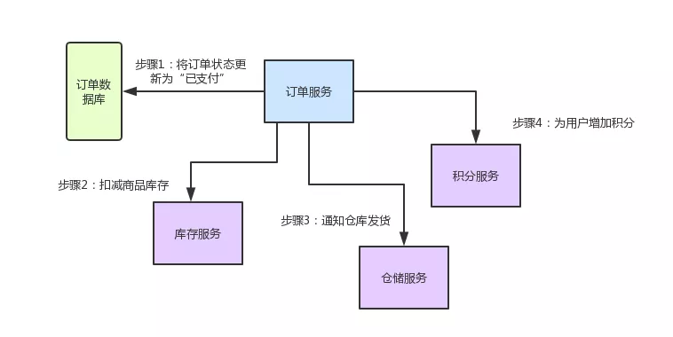

### Netflix Eureka 服务发现

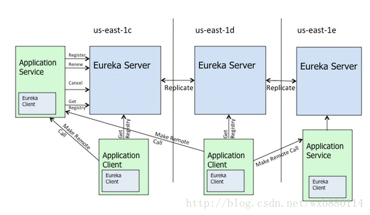

对单体应用进行服务拆分得到各个微服务，而这些服务又是相互独立的，那么我们**如何知道各个微服务的健康状态、如何知道某个微服务的存在呢**？这就是Eureka的任务。

* Euraka体系由两个组件组成：
  * Eureka Client即为微服务节点，启动前要向其指定Eureka Server所在地址，以便在启动时向Eureka Server发送服务注册和心跳信息
  * Eureka Server提供服务注册服务，各个节点启动后，会在Eureka Server中进行注册，这样Eureka Server中的服务注册表中将会存储所有可用服务节点的信息，服务节点的信息可以在界面中直观的看到
* Eureka Client启动后，将会注册到Eureka Server中，同时会定时发送心跳（默认无配置情况下为30s），如果Eureka Server在多个心跳周期内没有接收到某个节点的心跳，那么Eureka Server将会从服务注册表中把这个节点移除(默认90s)

当微服务系统加入了Eureka后，情况变成了这样：

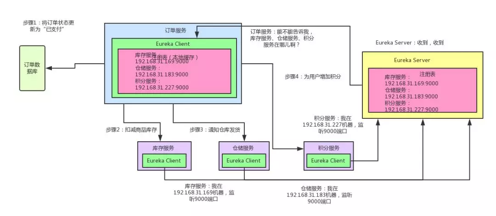

* 库存服务、仓储服务、积分服务中都有一个 Eureka Client 组件，这个组件专门负责将这个服务的信息注册到 Eureka Server 中
* Eureka Server 是一个注册中心，里面有一个注册表，保存了各服务所在的机器和端口号
* 当订单服务想要调用库存/仓储/积分服务时，就去向Eureka Server询问各服务的对应地址
* 然后就可以发起请求调用服务了

### Netflix Feign 声明式、模板化HTTP客户端

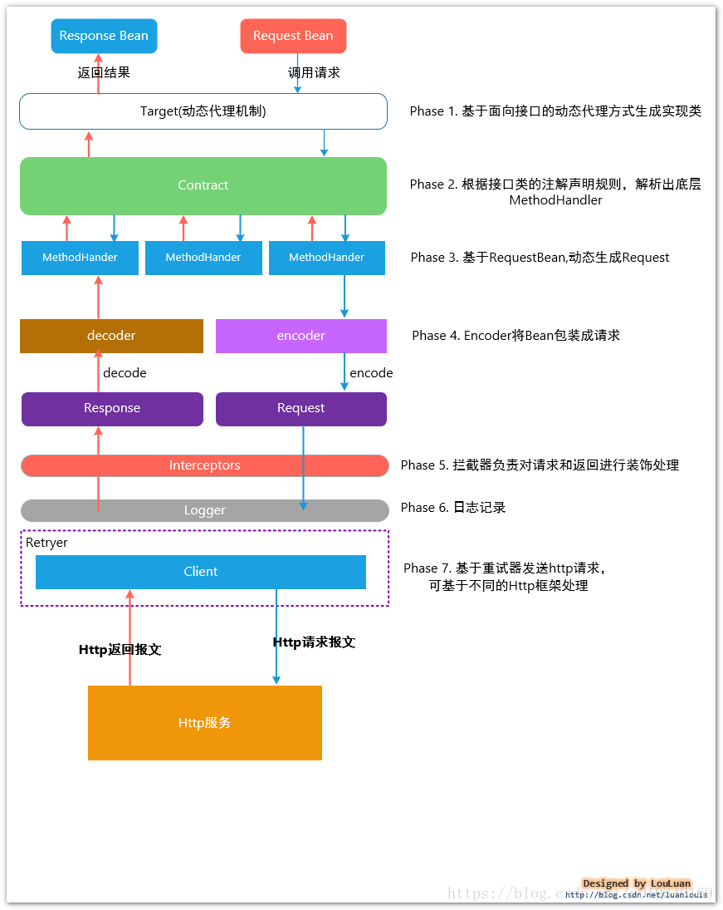

知道了微服务的所在位置就可以发起请求调用微服务，但是显然，直接用Http Request请求微服务的代码会很冗长，这时就要Feign发挥作用了。

* 首先，对某个接口定义 @FeignClient 注解，Feign 就会针对这个接口创建一个动态代理
* 调用那个接口，就会调用 Feign 创建的动态代理。动态代理会根据你在接口上的 @RequestMapping 等注解，来动态构造出你要请求的服务的地址
* 最后针对这个地址，发起请求、解析响应。

加入了Feign，从Eureka中获取服务地址后的请求过程会变成这样：

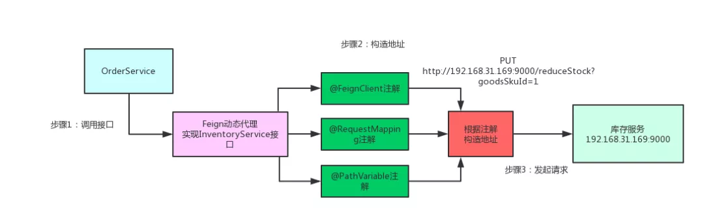

### Netflix Ribbon 客户端负载均衡

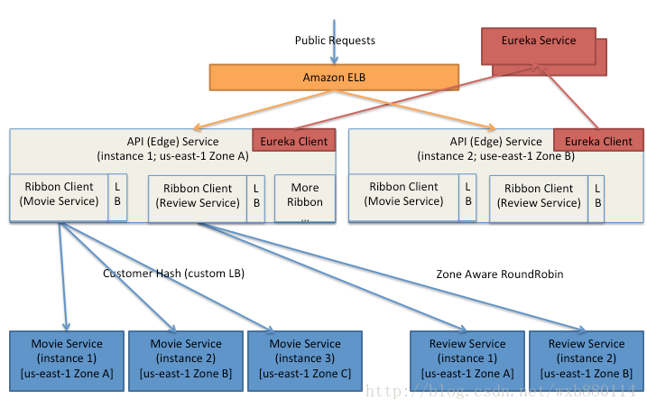

通过使用Eureka已经实现了微服务的注册与发现。启动各个微服务时，Eureka Client会把自己的网络信息注册到Eureka Server上。然而，这样的架构依然有一些问题，如负载均衡。一般来说，各个微服务都会部署多个实例。那么服务消费者要**如何将请求分摊到多个服务提供实例上呢**？这就是Ribbon的任务

* 当为Ribbon配置服务提供者地址列表后，Ribbon就可以基于某种负载均衡算法，自动地帮助服务消费者去请求
* Ribbon提供的负载均衡算法有多种，例如轮询、加权响应时间、随机和区域感知轮询
* Ribbon与Eureka配合使用时，Ribbon可自动从Eureka Server获取服务提供者地址列表，并基于负载均衡算法，请求其中一个服务提供者示例

当在Eureka注册中心加入Ribbon组件之后，一个服务就可以运行多个副本了，Eureka Client每次对同一个服务查询得到的地址可能会不同，Eureka Server会根据算法返回不同地址的服务：

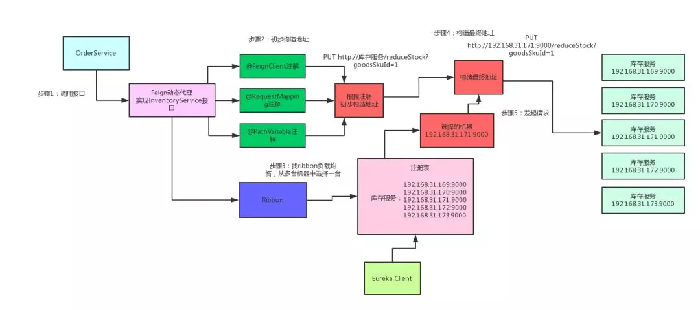

### Netflix Hystrix 断路器

#### 级联故障

级联故障是微服务系统在实际应用中常见的问题。在微服务架构里，一个系统会有很多的服务，其中难免会有服务间的互相依赖。比如，在本文的应用场景下，订单服务在一个业务流程里需要调用库存/仓储/积分三个服务，并且为保证数据完整性，三个服务是要顺序依次调用：一个订单到达时，要先扣库存，再通知发货，再修改积分。

这时，如果积分服务挂了，在订单服务中请求积分服务的线程就会全部卡住，尽管积分服务是最后一个请求的服务，而且还对核心业务没有多大影响（在此场景中，库存和仓储才是业务的核心），过多的阻塞进程还是会导致订单服务宕机。一个服务的宕机导致与其相关的其他服务宕机，这就是级联故障。

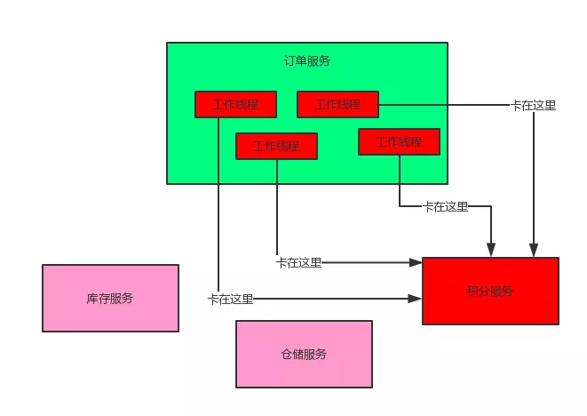

#### 解决方法

既然积分服务对主要业务影响不大，那为什么一定要请求成功呢？支付订单的时候，只要把库存扣减了，然后通知仓库发货就OK了，大不了等积分服务恢复之后，慢慢人肉手工恢复数据就好，当业务发生错误的时候，我们应**优先保证核心业务的稳定性**，适当牺牲附加业务。

这就是Hystrix发挥作用的地方。

对于一些非核心的附加业务上加上Hystrix组件，当这个**业务出故障导致一段时间内有超过某一阈值的请求无法返回或返回错误**时，“熔断”将会发生，“熔断”的业务将会被“降级”，这时，**所有向此服务发送的请求都不会真正到达服务中，而是会被直接记录在数据库或log文件中，以备日后手工恢复**。如图：

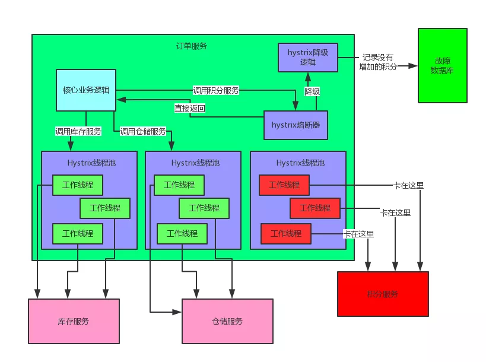

这样，虽然出错的业务没有被修复，但是其错误也不会对其他业务产生影响了。

* 正常情况下，断路器关闭，可以正常请求依赖的服务；
* 当一段时间内，请求失败率达到一定阈值（例如错误率达到50%，或100次/分钟等），断路器就会打开，此时，就不会再去请求依赖的服务；
* 断路器打开一段时间后，会自动进入"半开"状态。此时，断路器允许一个请求访问依赖的服务。如果请求能够调用成功，则关闭断路器；否则继续保持打开状态。

### Netflix Zuul 服务网关

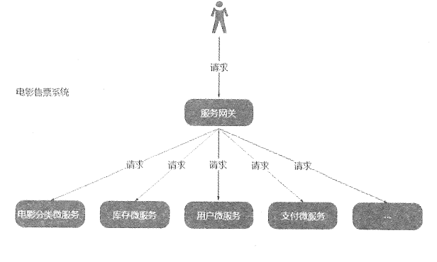

Zuul作为微服务架构中的微服务网关。微服务架构经过前几个组件的组合，已经有了基本的雏形了，那么我们为什么还要使用微服务网关呢？我们可以想象，一般情况下我们一个业务并不是只调用一个接口就可以完成一个业务需求。而如果让客户端直接与各个微服务通信，会有以下问题：

* 客户端会多次请求不同的微服务，增加了客户端的复杂性
* 存在跨域请求，在一定场景下处理相对复杂
* 认证复杂，每个服务都需要独立认证
* 难以重构，随着项目的迭代，可能需要重新划分微服务，如果直接与微服务通信，那么重构会很难实施

Zuul就是用于集中处理前端请求，向前端应用隐藏后端实现，简化开发。加入网关后的微服务就会变成这样：

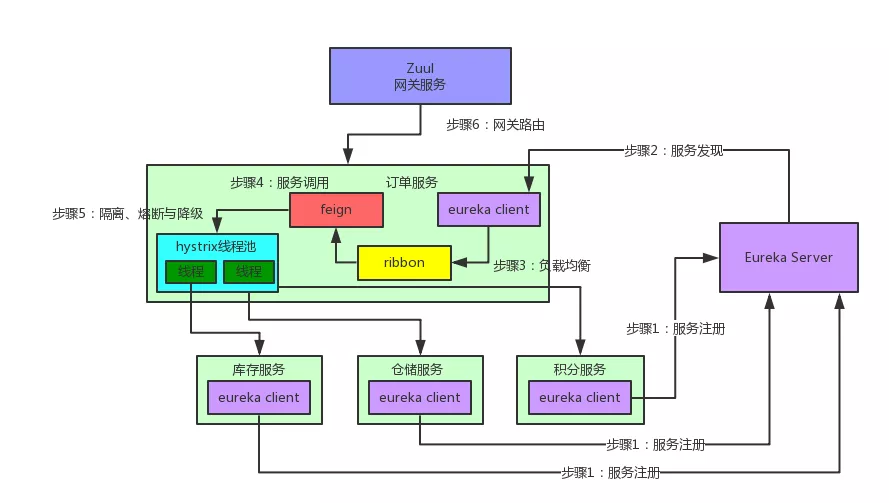

像Android、iOS、PC前端、微信小程序、H5等等，不用去关心后端有几百个服务，就知道有一个网关，所有请求都往网关走，网关会根据请求中的一些特征，将请求转发给后端的各个服务。

### Spring Cloud Config 分布式配置

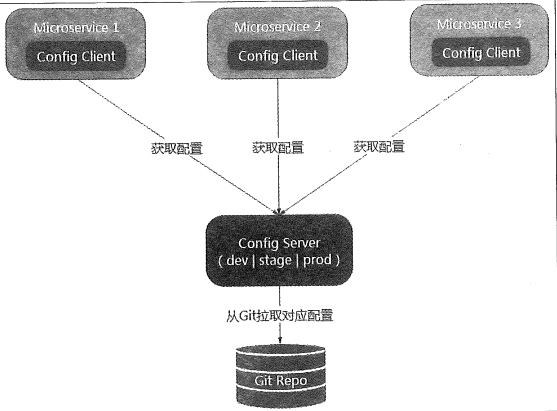

分布式配置就比较好理解了。对于传统的单体应用，常常使用配置文件管理所有配置，而在微服务架构中，微服务的配置管理一般有以下需求：

* 集中管理配置：一个使用微服务架构的应用系统可能会包含成百上千个微服务，因此，集中管理配置是很有必要的
* 不同环境不同配置。例如，数据源配置在不同的环境(开发、测试、预发布、生产等)中是不同的
* 运行期间可动态调整：例如，可根据各个微服务的负载情况，动态调整数据源连接池的大小或熔断阈值，并且在调整配置时不停止微服务
* 配置修改后可自动更新：如配置内容发生变化，微服务能够自动更新配置

集中管理和分发配置文件，这基本上就是Spring Cloud Config的功能。
