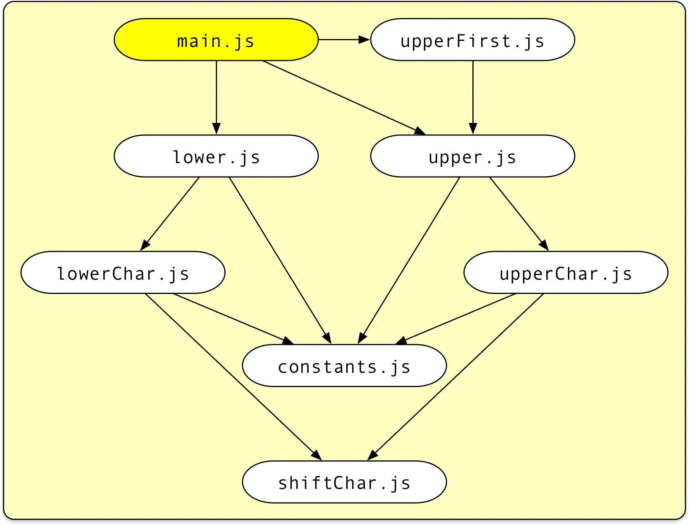
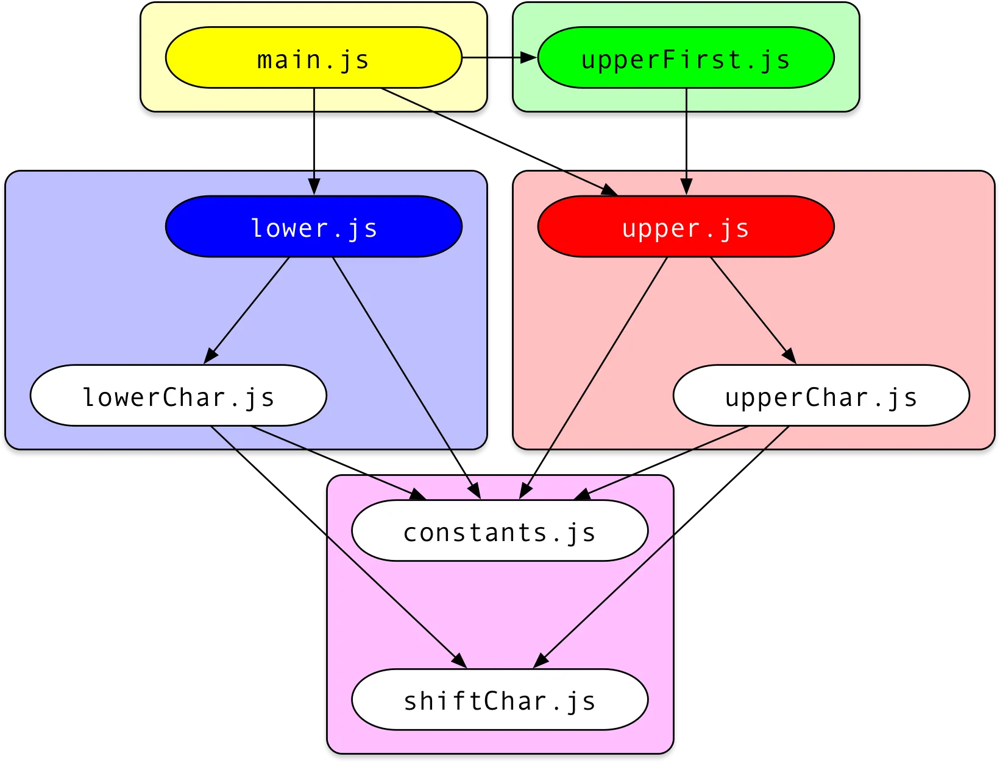

# 【翻译】 Code-splitting for libraries—bundling for npm with Rollup 1.0 面向库的代码分割——使用 Rollup 1.0 为 npm 打包

原文来自 [Medium](https://levelup.gitconnected.com/code-splitting-for-libraries-bundling-for-npm-with-rollup-1-0-2522c7437697), 由 Deepseek 翻译.

[Lukas Taegert](https://medium.com/@lukastaegert?source=post_page---byline--2522c7437697---------------------------------------)

With the recent [1.0 release](https://github.com/rollup/rollup/releases/tag/v1.0.0) of Rollup, code-splitting has become a first-class feature of the notorious JavaScript module bundler. Here I want to make the case for why this is a game-changer not only for the frontend but for libraries as well. In this article you will learn:

- How to bundle a library with Rollup (and why you would want this), including some best practices, but most importantly
- How Rollup code-splitting works and when and how to use it for libraries

随着 Rollup 最近的 [1.0 版本发布](https://github.com/rollup/rollup/releases/tag/v1.0.0)，代码分割已成为这个著名的 JavaScript 模块打包器的一流功能。
在此，我想阐述为何这不仅对前端开发，而且对库开发来说都是一个改变游戏规则的功能。
在本文中，你将学到：
-   如何使用 Rollup 打包一个库（以及你为何需要这样做），包括一些最佳实践，但最重要的是
-   Rollup 代码分割的工作原理，以及何时以及如何将其用于库开发

# Our library project 我们的库项目

For this example, we will be building a collection of awesome utilities to convert strings to upper and lower case that we want to publish to npm under the name `fancy-case` (note: at the time of this writing, there was no library with that name).

在本例中，我们将构建一个很棒的实用工具集合，用于将字符串转换为大写和小写，我们希望在 npm 上以 `fancy-case` 的名称发布它（注意：在撰写本文时，还没有同名的库）。

> Write your sources as ES modules
> 
> 将你的源代码编写为 ES 模块

I definitely recommend using [ECMAScript modules](http://exploringjs.com/es6/ch_modules.html) for writing a library:

- Modern bundlers, including but not limited to Rollup itself, will produce more efficient code when including your library
- ES modules can be easily converted to Node’s CommonJS format. Converting CJS to ES modules on the other hand is more difficult, does not provide full feature parity and leads to less efficient code.

我强烈建议使用 [ECMAScript 模块](http://exploringjs.com/es6/ch_modules.html)来编写库：
-   现代打包器（包括但不限于 Rollup 本身）在包含你的库时将生成更高效的代码
-   ES 模块可以轻松转换为 Node 的 CommonJS 格式。反之，将 CJS 转换为 ES 模块则更困难，无法提供完整的功能对等性，并且会导致效率较低的代码。

We will see below how to convert our project to CJS using Rollup. For now, here are the project files:

我们将在下面看到如何使用 Rollup 将我们的项目转换为 CJS。目前，项目文件如下：

<iframe src="https://levelup.gitconnected.com/media/0e7a7550a662e9350918f3e62d94fe14" allowfullscreen frameborder="0" scrolling="no"></iframe>

Following good programming practices, we write small modules containing functions that “do one thing only”.

遵循良好的编程实践，我们编写包含“只做一件事”的函数的小模块。

> Aim for small modules
>
> 力求小模块


Small modules not only make it easy to see at a glance what a module is about but will also make our code-splitting build more efficient later because Rollup has more options how to group files into chunks. Admittedly, we are taking this somewhat to the extreme here.

小模块不仅便于一目了然地了解模块的作用，而且稍后会使我们的代码分割构建更高效，因为 Rollup 有更多选项来决定如何将文件分组到代码块中。
诚然，我们在这里将其发挥得有些极端。

This is what our project contains so far:

- `main.js` is the main entry module exporting the three utility functions `upper`, `lower`, and `upperFirst` that represent the public API of our library.
- The utility functions themselves are defined in separate modules of the same name.
- The remaining modules contain code that is shared between the utility functions.

到目前为止，我们的项目包含以下内容：

-   `main.js` 是主入口模块，导出三个实用函数 `upper`、`lower` 和 `upperFirst`，它们代表了我们库的公共 API。
-   这些实用函数本身在名称相同的单独模块中定义。
-   其余模块包含在实用函数之间共享的代码。

# Different distribution formats 不同的分发格式

Once we have decided to make our library available to others via npm, we should take a moment to consider how it should be possible to import it. There are indeed quite a few options today:

一旦我们决定通过 npm 使我们的库可供他人使用，我们应该花点时间考虑一下如何导入它。
如今确实有相当多的选择：

## CommonJS module for Node 用于 Node 的 CommonJS 模块

This is probably the most important target. This allows Node users and legacy bundlers to import your library as a [CommonJS module](http://wiki.commonjs.org/wiki/Modules/1.1.1) via

这可能是最重要的目标。这允许 Node 用户和旧版打包器通过以下方式将你的库作为 [CommonJS 模块](http://wiki.commonjs.org/wiki/Modules/1.1.1)导入：


```
const fancyCase = require('fancy-case');
console.log(fancyCase.upper('some Text'));
```

## Single bundle to be used in a script tag 在 script 标签中使用的单一包

The “traditional way” of distributing JavaScript may still be interesting for small, hand-crafted sites with minimal setup. The bundle creates a global variable via which its exports can be accessed.

分发 JavaScript 的“传统方式”对于设置简单的小型手工制作的网站可能仍然有意义。
该包创建一个全局变量，通过它可以访问其导出。

```
<script src="fancy-case.js"></script>
<script>
    console.log(fancyCase.upper('some Text'));
</script>
```

## AMD module to be used with an AMD loader 与 AMD 加载器一起使用的 AMD 模块

There are still quite a few [AMD/RequireJS](https://requirejs.org/) based projects out there. We can distribute a file that can itself be used as a dependency of an AMD module.

现在仍有相当多的基于 [AMD/RequireJS](https://requirejs.org/) 的项目。
我们可以分发一个文件，该文件本身可以用作 AMD 模块的依赖项。

```
define(['fancy-case.js'], function (fancyCase) {
    console.log(fancyCase.upper('some Text'));
});
```

## ES module for modern bundlers 面向现代打包器的 ES 模块

[ECMAScript modules](http://exploringjs.com/es6/ch_modules.html) are now the official, standardized JavaScript module format.

[ECMAScript 模块](http://exploringjs.com/es6/ch_modules.html)现在是官方、标准化的 JavaScript 模块格式。

> Provide an ES module version for optimized browser bundles
>
> 提供 ES 模块版本以优化浏览器包

ES modules support superior static analysis, which in turn enables bundlers to better optimize the generated code using techniques such as [scope-hoisting](https://medium.com/adobetech/optimizing-javascript-through-scope-hoisting-2259ef7f5994) and [tree-shaking](https://medium.com/@Rich_Harris/tree-shaking-versus-dead-code-elimination-d3765df85c80). For that, they are the preferred format for modern bundlers. Our module can be consumed via

ES 模块支持卓越的静态分析，这反过来使打包器能够使用诸如[作用域提升](https://medium.com/adobetech/optimizing-javascript-through-scope-hoisting-2259ef7f5994)和[摇树优化 (tree-shaking)](https://medium.com/@Rich_Harris/tree-shaking-versus-dead-code-elimination-d3765df85c80)等技术更好地优化生成的代码。
因此，它们是现代打包器的首选格式。
我们的模块可以通过以下方式使用：

```
import {upper} from 'fancy-case';
console.log(upper('some Text'));
```

## Direct imports for CJS or ESM consumers 面向 CJS 或 ESM 使用者的直接导入

An emerging new pattern especially for libraries with many independent utility functions is to allow users to import independent parts of the library from separate files. Node users could write

一个新兴的模式，特别是对于具有许多独立实用函数的库，是允许用户从单独的文件导入库的独立部分。
Node 用户可以这样写：

```
const upper = require('fancy-case/cjs/upper');
console.log(upper('some Text'));
```

while ESM consumers could write

而 ESM 使用者可以这样写：

```
import upper from 'fancy-case/esm/upper';
console.log(upper('some Text'));
```

> Provide a way to directly import independent parts of your library
>
> 提供一种直接导入库中独立部分的方式

Direct imports have several advantages:

- Node needs to load and parse less code, which leads to quicker startup time and reduced memory consumption.
- Bundlers need to analyze less code, which makes bundling faster.
- You do not need good tree-shaking support in the bundler to avoid dead code. Often, utility libraries apply fancy transformations to their exports which render tree-shaking algorithms useless; this can be easily avoided using this technique.

直接导入有几个优点：

-   Node 需要加载和解析的代码更少，从而缩短启动时间并减少内存消耗。
-   打包器需要分析的代码更少，从而使打包速度更快。
-   你不需要打包器有很好的摇树优化支持来避免死代码。通常，实用程序库对其导出应用花哨的转换，这会使摇树优化算法失效；使用这种技术可以轻松避免这种情况。

Note however that this can also lead to more bundled code if some modules import the whole library while others directly import some functions. Below we will show how to use Rollup’s new code-splitting to avoid this in an elegant way.

但请注意，如果某些模块导入整个库而其他模块直接导入某些函数，这也可能导致打包后的代码量增加。
下面我们将展示如何使用 Rollup 的新代码分割功能来优雅地避免这种情况。

# Publishing monolithic bundles 发布整体式包

For now, we will focus on the first four publishing targets, i.e. CJS, script tag, AMD and ESM. To that end, let us prepare our project for publishing:

目前，我们将专注于前四个发布目标，即 CJS、script 标签、AMD 和 ESM。
为此，让我们为发布准备项目：

```
mkdir fancy-casecd fancy-casenpm init --yesgit clone https://gist.github.com/lukastaegert/e9c6c04b8f96adc562a70c096c3e7705 srcnpm install --save-dev rollup
```

This will create a `package.json` file for our project, put our sample files into a `src` folder and install Rollup. Rollup supports a special output format called a [“Universal Module Definition”](https://github.com/umdjs/umd), which simultaneously supports the CJS, script tag, and ESM use cases. To create it, add a new file called `rollup.config.js` to the root of your project:

这将为我们的项目创建一个 `package.json` 文件，将我们的示例文件放入 `src` 文件夹，并安装 Rollup。
Rollup 支持一种称为[“通用模块定义 (UMD)”](https://github.com/umdjs/umd)的特殊输出格式，它同时支持 CJS、script 标签和 ESM 用例。
要创建它，请在你的项目根目录添加一个名为 `rollup.config.js` 的新文件：

```
export default {
    input: 'src/main.js',
    output: {
        file: 'umd/fancy-case.js',
        format: 'umd',
        name: 'fancyCase'
    }
};
```

This instructs Rollup to start with `src/main.js` and bundle it together with all its dependencies into a UMD bundle in `umd/fancy-case.js`. The `name` option tells Rollup which global variable to create when the bundle is used in a script tag, in this case `fancyCase`. This variable will **only** be created if this bundle is not consumed in a Node or AMD context.

这指示 Rollup 从 `src/main.js` 开始，将其及其所有依赖项打包成一个 UMD 包，输出到 `umd/fancy-case.js`。
`name` 选项告诉 Rollup 在通过 script 标签使用该包时要创建哪个全局变量，在本例中是 `fancyCase`。
此变量**仅**在该包不是在 Node 或 AMD 环境下使用时才会创建。

Now if you run

现在如果你运行：

```
npx rollup --config
```

from your project’s root, this will pick up our config file and create a new folder named “umd” that contains our UMD bundle. You can check out the result on Rollup’s website: [https://rollupjs.org/repl?gist=e9c6c04b8f96adc562a70c096c3e7705](https://rollupjs.org/repl?gist=e9c6c04b8f96adc562a70c096c3e7705)

在你的项目根目录下执行，这将获取我们的配置文件并创建一个名为“umd”的新文件夹，其中包含我们的 UMD 包。
你可以在 Rollup 网站上查看结果：[https://rollupjs.org/repl?gist=e9c6c04b8f96adc562a70c096c3e7705](https://rollupjs.org/repl?gist=e9c6c04b8f96adc562a70c096c3e7705)



A monolithic bundle merges all modules together

一个整体式包将所有模块合并在一起

If you switch to the UMD tab in the output section of the website and enter the correct `global` variable name, you will see all your files compressed together, surrounded by a wrapper like this

如果你切换到网站输出部分的 UMD 标签页并输入正确的 `global` 变量名，你将看到你所有的文件被压缩在一起，并被类似这样的包装器包围：

```
(function (global, factory) {
  typeof exports === 'object' && typeof module !== 'undefined' ? factory(exports) :
  typeof define === 'function' && define.amd ? define(['exports'], factory) :
  (global = global || self, factory(global.fancyCase = {}));
}(this, function (exports) { 'use strict';

  // ... all your bundled code  Object.defineProperty(exports, '__esModule', { value: true });
}));
```

This wrapper will analyze the current runtime environment and provide the exports of your module in a convenient way. Note this line:

此包装器将分析当前的运行时环境，并以方便的方式提供你模块的导出。
注意这行：

```
Object.defineProperty(exports, '__esModule', { value: true });
```

When attempting to `import default` our UMD bundle in an ESM context, modern bundlers add interoperability code that checks for the presence of the `__esModule` property. If it is present, then the default import will not provide the whole exports object but just the `default` property of that object.

当尝试在 ESM 环境中 `import default` 我们的 UMD 包时，现代打包器会添加互操作性代码，检查是否存在 `__esModule` 属性。
如果存在，则默认导入不会提供整个导出对象，而只是该对象的 `default` 属性。

As we are going to create a dedicated ESM bundle anyway which should be used in these cases, we can consider skipping this line by adding `esModule: false` to the `output` section of the config file. You can also get a more optimized wrapper by creating dedicated builds for the formats “cjs” (Node), “amd” or “iife” (script tag), check out the corresponding tabs on the website.

由于无论如何我们将创建一个专用的 ESM 包用于这些情况，我们可以考虑通过在配置文件的 `output` 部分添加 `esModule: false` 来跳过此行。
你还可以通过为“cjs”（Node）、“amd”或“iife”（script 标签）格式创建专用构建来获得更优化的包装器，请查看网站上相应的标签页。

Note that apart from the wrapper code in contrast to most other bundlers, no dedicated runtime environment to resolve imports is added. Apart from its configurability, this is another reason why Rollup is quite popular with libraries creators that strive to create efficient bundles with minimal overhead.

请注意，除了包装器代码外，与大多数其他打包器不同，它没有添加专门的运行时环境来解析导入。
除了其可配置性之外，这也是 Rollup 在力求创建高效、开销最小的包的库创建者中相当受欢迎的另一个原因。

> UMD bundles should be minified
> 
> UMD 包应该被压缩

As especially for the AMD and script tag use, this bundle is meant to be run in the browser unmodified, we should go the whole way and minify it. To do that, I recommend using [TerserJS](https://github.com/terser-js/terser), which is a fork of the more well-known [UglifyJS](http://lisperator.net/uglifyjs/) that supports modern ES2015+ JavaScript code. After installing the necessary dependency

特别是对于 AMD 和 script 标签的使用，这个包旨在未经修改地在浏览器中运行，我们应该一鼓作气将其压缩。
为此，我推荐使用 [TerserJS](https://github.com/terser-js/terser)，它是更知名的 [UglifyJS](http://lisperator.net/uglifyjs/) 的一个分支，支持现代 ES2015+ JavaScript 代码。
安装必要的依赖项后：

```
npm install --save-dev rollup-plugin-terser
```

you should modify your `rollup.config.js` like this:

你应该像这样修改你的 `rollup.config.js`：

```
import {terser} from 'rollup-plugin-terser';export default {
    input: 'src/main.js',
    plugins: [terser()],
    output: {
        file: 'umd/fancy-case.js',
        format: 'umd',
        name: 'fancyCase',
        esModule: false
    }
};
```

As mentioned above, we also want to provide a dedicated ESM bundle. This could be done by adding a second `output` to our configuration but as this bundle is meant to be consumed by other bundlers anyway and does not profit from minification (in fact this will make it harder to hunt for bugs), I rather recommend to forgo this and export two separate configurations:

如上所述，我们还希望提供一个专用的 ESM 包。
这可以通过在配置中添加第二个 `output` 来完成，但由于这个包本来就是供其他打包器使用的，并且不会从压缩中受益（事实上，这会使调试错误更加困难），我建议放弃这种做法，而是导出两个单独的配置：

```
import {terser} from 'rollup-plugin-terser';export default [\
    {\
        input: 'src/main.js',\
        plugins: [terser()],\
        output: {\
            file: 'umd/fancy-case.js',\
            format: 'umd',\
            name: 'fancyCase',\
            esModule: false\
        }\
    },\
    {\
        input: 'src/main.js',\
        output: {\
            file: 'esm/index.js',\
            format: 'esm'\
        }\
    }\
];
```

To publish our module, we need to make sure that importers of our library receive the right file and that this file is built from the latest sources upon publishing. To do that, modify our `packjage.json` file like this:

要发布我们的模块，我们需要确保库的导入者收到正确的文件，并且该文件在发布时是从最新源代码构建的。
为此，像这样修改我们的 `package.json` 文件：

```
{
  "name": "fancy-case",
  "version": "1.0.0",
  "main": "umd/fancy-case.js",
  "module": "esm/index.js",
  "scripts": {
    "prepare": "rollup --config"
  },
  "files": [\
    "esm/*",\
    "umd/*"\
  ],
  "devDependencies": {
    "rollup": "^1.1.0",
    "rollup-plugin-terser": "^4.0.2"
  }
}
```

> Add both “main” and “module” fields
> 
> 同时添加 "main" 和 "module" 字段

The `main` field makes sure that Node users using `require` will be served the UMD version. The `module` field is not an official npm feature but a common convention among bundlers to designate how to import an ESM version of our library.

`main` 字段确保使用 `require` 的 Node 用户会得到 UMD 版本。
`module` 字段不是 npm 的官方特性，而是打包器之间的一种常见约定，用于指定如何导入我们库的 ESM 版本。

> Use “files” to include your bundles
> 
> 使用 "files" 包含你的包

The `files` field makes sure that besides some default files, only our designated bundles are distributed via npm excluding sources, test files etc. This will keep the `node_modules` folder of your users small and make `npm install` faster. You could also create an `.npmignore` file for a similar effect but with a “deny-listing” instead of an “allow-listing” approach. To my experience, “files” is easier to maintain, though.

`files` 字段确保除了某些默认文件外，只有我们指定的包通过 npm 分发，排除了源代码、测试文件等。
这将使你的用户的 `node_modules` 文件夹保持较小，并使 `npm install` 更快。
你也可以创建一个 `.npmignore` 文件以达到类似效果，但采用的是“拒绝列表”而非“允许列表”的方法。
根据我的经验，“files” 更容易维护。

> Create a “prepare” script
> 
> 创建一个 "prepare" 脚本

The `prepare` script is a special script that will be run by npm each time we run `npm install` or `npm publish`. It also makes it possible to directly install branches from Github for testing purposes via

`prepare` 脚本是一个特殊的脚本，每次我们运行 `npm install` 或 `npm publish` 时，npm 都会运行它。
它还使得可以直接从 Github 安装分支进行测试，通过：

```
npm install <user>/<repository>#<branch>
```

Now we can just run `npm publish` and the first version of our library will be available for everyone via `npm install fancy-case`!

现在我们可以直接运行 `npm publish`，我们库的第一个版本将通过 `npm install fancy-case` 供所有人使用了！

> Do a publishing dry-run with “npm pack”
> 
> 使用 "npm pack" 进行发布试运行

If you are unsure whether you configured everything correctly, you can run `npm pack` first to get a tarball containing everything that will be sent to npm upon publishing and inspect it. If you are slightly paranoid, you can even use this tarball for automated testing.

如果你不确定是否配置正确，可以先运行 `npm pack`，获取一个包含发布时将发送到 npm 的所有内容的 tarball 文件并检查它。
如果你有点偏执，甚至可以使用这个 tarball 进行自动化测试。

# Publishing optimized chunks 发布优化后的代码块

As noted above, it can be very beneficial to our users if we provide direct imports for independent parts of our library. One way of doing this could be to just distribute the source files together with our library and instruct our users to import from there.

如上所述，如果我们为库的独立部分提供直接导入路径，这对我们的用户非常有益。
一种方法是将源文件与我们的库一起分发，并指示用户从那里导入。

This can lead to nasty issues, though, if different parts of the users’s code import our library in different ways. Imagine one module imports the `upper` function from `"fancy-case"` while another imports it from `"fancy-case/src/upper"`. Even though it is technically the same code, these are now two very distinct functions and `upper` will end up twice in the user’s code.

然而，如果用户代码的不同部分以不同的方式导入我们的库，这可能会导致严重的问题。
想象一下，一个模块从 `"fancy-case"` 导入 `upper` 函数，而另一个模块从 `"fancy-case/src/upper"` 导入它。

This may not sound too problematic but imagine what happens if we store some persistent state in a variable next to the `upper` function (definitely not a recommended practice, but it happens) or if the user relies on comparing references to our `upper` function. Suddenly we are facing a myriad of weird, hard-to-track bugs. Also, the untouched source code did not benefit from any optimizations such as scope-hoisting or tree-shaking or any transformations applied to the code via plugins like [rollup-plugin-babel](https://github.com/rollup/rollup-plugin-babel).

这可能听起来问题不大，但想象一下如果我们在 `upper` 函数旁边的一个变量中存储了一些持久状态（绝对不推荐的做法，但确实会发生），或者用户依赖于比较对我们 `upper` 函数的引用，会发生什么。
突然间，我们面临无数奇怪且难以追踪的错误。
此外，未经处理的源代码无法受益于任何优化，如作用域提升或摇树优化，也无法受益于通过插件（如 [rollup-plugin-babel](https://github.com/rollup/rollup-plugin-babel)）应用到代码的任何转换。

> Mark independent parts of your library as additional entry modules
>
> 将库的独立部分标记为额外的入口模块

Rollup 1.0 offers a simple but powerful solution: You can designate the independent parts of your library as additional entry points. Before we change our project, take a look at the result in the REPL: [https://rollupjs.org/repl?gist=e9c6c04b8f96adc562a70c096c3e7705&entry=lower.js,upper.js,upperFirst.js](https://rollupjs.org/repl?gist=e9c6c04b8f96adc562a70c096c3e7705&entry=lower.js%2Cupper.js%2CupperFirst.js)

Rollup 1.0 提供了一个简单但强大的解决方案：你可以将库的独立部分指定为额外的入口点。
在更改项目之前，先看看 REPL 中的结果：[https://rollupjs.org/repl?gist=e9c6c04b8f96adc562a70c096c3e7705&entry=lower.js,upper.js,upperFirst.js](https://rollupjs.org/repl?gist=e9c6c04b8f96adc562a70c096c3e7705&entry=lower.js%2Cupper.js%2CupperFirst.js)



A code-split bundle will group modules into chunks

代码分割后的包会将模块分组到代码块中

You see that our originally eight modules have been reduced to five chunks, one for each entry module and an additional chunk that is imported by several of the other chunks. Depending on the format you look at, the chunks simply `import` or `require` each other without any additional management code added or any code duplication.

你会看到我们原来的八个模块被减少到五个代码块，每个入口模块一个代码块，还有一个额外的代码块被其他几个代码块导入。
根据你查看的格式，这些代码块只是简单地相互 `import` 或 `require`，没有添加任何额外的管理代码，也没有任何代码重复。

To avoid duplications and thus the potential issues with duplicated state or references mentioned above, Rollup applies a “coloring” algorithm that assigns an individual color to each entry module and then traverses the module graph to assign each module the “mixed” color of all entry points that depend on it.

为了避免重复以及由此产生的上述重复状态或引用的潜在问题，Rollup 应用了一种“着色”算法，为每个入口模块分配一个单独的颜色，然后遍历模块图，为每个模块分配所有依赖它的入口点的“混合”颜色。

In our example, both the red entry module `upper.js` as well as the blue entry module `lower.js` depend on `constants.js` and `shiftChar.js` so those are assigned to a new purple chunk. `main.js` and `upperFirst.js` only depend on other entry modules and thus do not further change the coloring.

在我们的示例中，红色的入口模块 `upper.js` 和蓝色的入口模块 `lower.js` 都依赖于 `constants.js` 和 `shiftChar.js`，因此这些模块被分配到一个新的紫色代码块中。
`main.js` 和 `upperFirst.js` 仅依赖于其他入口模块，因此不会进一步改变着色。

This is how you can change your `rollup.config.js` to produce code-split builds for CJS and ESM consumers:

你可以像这样修改你的 `rollup.config.js` 来为 CJS 和 ESM 使用者生成代码分割后的构建：

```
import {terser} from 'rollup-plugin-terser';export default [\
    {\
        input: 'src/main.js',\
        plugins: [terser()],\
        output: {\
            file: 'umd/fancy-case.js',\
            format: 'umd',\
            name: 'fancyCase',\
            esModule: false\
        }\
    },\
    {\
        input: {\
            index: 'src/main.js',\
            upper: 'src/upper.js',\
            lower: 'src/lower.js',\
            upperFirst: 'src/upperFirst.js'\
        },\
        output: [\
            {\
                dir: 'esm',\
                format: 'esm'\
            },\
            {\
                dir: 'cjs',\
                format: 'cjs'\
            }\
        ]\
    }\
];
```

As you can see, we now provide an object as `input` where the properties correspond to the generated entry chunks while the values correspond to their entry modules. Also instead of specifying `file`, we now define an output `dir` where all chunks are placed. If you want to adjust the naming scheme and placement of chunks, take a look a the `entryFileNames` and `chunkFileNames` output options. To inspect the result, just run

如你所见，我们现在提供一个对象作为 `input`，其属性对应于生成的入口代码块，而其值对应于它们的入口模块。
此外，我们现在不是指定 `file`，而是定义一个输出 `dir`（目录），所有代码块都将放置在其中。
如果你想调整代码块的命名方案和位置，请查看 `entryFileNames` 和 `chunkFileNames` 输出选项。
要检查结果，只需运行：

```
npm run prepare
```

> Write JavaScript code in your config file for advanced configurations
> 
> 在配置文件中编写 JavaScript 代码以实现高级配置

If you have a lot of entry points, instead of specifying them individually, note that your config file is a JavaScript file that can import anything from `node_modules` as well as the built-in Node libraries. Thus you can for instance `import fs from 'fs'` and then use `fs.readDirSync` to build an object of entry modules from a directory.

如果有大量入口点，注意配置文件本身就是JavaScript文件，可以从`node_modules`或Node内置库导入内容。
例如可以通过`import fs from 'fs'`然后使用`fs.readDirSync`从目录构建入口模块对象。

Now everything that remains to be done is to adjust your `package.json` file to include the new files and import targets and then publish the result:

现在只需调整`package.json`包含新文件和导入目标，然后发布结果：

```
{
  "name": "fancy-case",
  "version": "1.0.0",
  "main": "cjs/index.js",
  "module": "esm/index.js",
  "scripts": {
    "prepare": "rollup --config"
  },
  "files": [\
    "cjs/*",\
    "esm/*",\
    "umd/*"\
  ],
  "devDependencies": {
    "rollup": "^1.1.0",
    "rollup-plugin-terser": "^4.0.2"
  }
}
```

## Using .mjs 使用.mjs扩展名

Another emerging pattern is to build dual-mode packages where CJS and ES modules are placed next to each other where the CJS files sport the `.js` extension while the ESM files have an `.mjs` extension. This can be easily achieved by using the same `dir` for both outputs while adding

另一种新兴模式是构建双模式包：CJS和ESM文件并列存放，CJS使用`.js`扩展名，ESM使用`.mjs`。
这可以通过为两个输出使用相同目录并添加：

```
entryFileNames: [name].mjs
```

to the ESM output options. Note however that this can change bundling behaviour in some bundlers when using external dependencies and should be done at your own risk.

到ESM的输出选项中实现。
但需注意，使用外部依赖时这可能改变某些打包工具的行为，请自行评估风险。

## Avoiding the waterfall 避免瀑布式加载

One thing you may notice is that Rollup seems to add additional “empty” imports to some chunks. E.g. this is what your `main.js` chunk will look like in the ESM version:

你可能会注意到Rollup会向某些块添加额外的"空"导入。
例如ESM版本的`main.js`块会像这样：

```
import '../chunk-59d826da.js';
export { default as upper } from '../upper.js';
export { default as lower } from '../lower.js';
export { default as upperFirst } from '../upperFirst.js';
```

So why is there an additional import for our shared chunk at the top? Let us take a look what happens when we want to run `main.js` without this addition:

1. load and parse `main.js`
2. after parsing, we know that we also need `upper.js`, `lower.js` and `upperFirst.js` so we load and parse those
3. after parsing any of them, we know that we also need our shared chunk so we load and parse that one as well
4. run everything

为什么顶部会有对共享块的额外导入？
让我们看看没有这个导入时运行`main.js`会发生什么：

1. load加载并解析`main.js`
2. 解析后才知道还需要加载并解析`upper.js`、`lower.js`和`upperFirst.js`
3. 解析这些文件后才知道还需要加载并解析共享块
4. 最后执行所有代码

With the added import, step 3 no longer needs to wait for step 2 as all dependencies are known once an entry chunk has been parsed. Thus, Node user’s will be able to load your library faster while bundlers will profit from reduced module discovery time.

通过添加导入，步骤3无需等待步骤2，因为入口块解析后就能知道所有依赖。
这样Node用户能更快加载库，打包工具也能减少模块发现时间。

## External dependencies 外部依赖

Even though our library is self-sufficient, it is easy to add external dependencies as well. Note however that in this case, you should add the `external` option providing an array of all external dependencies, otherwise you will receive warnings from Rollup. To have external dependencies in a UMD or IIFE build, you also need to specify under which global variable names the external dependencies can be found when using the library in a script tag via the `globals` output option.

尽管我们的库是自包含的，但也很容易添加外部依赖。
但需要注意，此时应该添加`external`选项提供所有外部依赖数组，否则Rollup会发出警告。
对于UMD或IIFE构建，还需通过`globals`选项指定在script标签使用时外部依赖对应的全局变量名。

# Conclusion 结论

Via a single central configuration file, Rollup makes it possible to provide many different bundle formats simultaneously.

通过单一配置文件，Rollup可以同时提供多种打包格式。

Code-splitting with Rollup provides a new way of bundling libraries that can prevent many pit-falls of having several import targets exposed to the user while giving you full configurability and flexibility. Expect Rollup to provide more code optimizations in the future that both code-split and monolithic bundles will profit from.

Rollup的代码分割为库打包提供了新思路，既能避免多导入目标带来的陷阱，又保持完全可配置性和灵活性。
期待Rollup未来提供更多代码优化，使代码分割和整体打包都能受益。

Of course, you can use Rollup as well for bundling web apps ( [check out code-splitting via dynamic imports!](https://rollupjs.org/repl?shareable=JTdCJTIybW9kdWxlcyUyMiUzQSU1QiU3QiUyMm5hbWUlMjIlM0ElMjJtYWluLmpzJTIyJTJDJTIyY29kZSUyMiUzQSUyMiUyRiolMjBEWU5BTUlDJTIwSU1QT1JUUyU1Q24lMjAlMjAlMjBSb2xsdXAlMjBzdXBwb3J0cyUyMGF1dG9tYXRpYyUyMGNodW5raW5nJTIwYW5kJTIwbGF6eS1sb2FkaW5nJTVDbiUyMCUyMCUyMHZpYSUyMGR5bmFtaWMlMjBpbXBvcnRzJTIwdXRpbGl6aW5nJTIwdGhlJTIwaW1wb3J0JTIwbWVjaGFuaXNtJTVDbiUyMCUyMCUyMG9mJTIwdGhlJTIwaG9zdCUyMHN5c3RlbS4lMjAqJTJGJTVDbmlmJTIwKGRpc3BsYXlNYXRoKSUyMCU3QiU1Q24lNUN0aW1wb3J0KCcuJTJGbWF0aHMuanMnKS50aGVuKGZ1bmN0aW9uJTIwKG1hdGhzKSUyMCU3QiU1Q24lNUN0JTVDdGNvbnNvbGUubG9nKG1hdGhzLnNxdWFyZSg1KSklM0IlNUNuJTVDdCU1Q3Rjb25zb2xlLmxvZyhtYXRocy5jdWJlKDUpKSUzQiU1Q24lNUN0JTdEKSUzQiU1Q24lN0QlMjIlMkMlMjJpc0VudHJ5JTIyJTNBdHJ1ZSU3RCUyQyU3QiUyMm5hbWUlMjIlM0ElMjJtYXRocy5qcyUyMiUyQyUyMmNvZGUlMjIlM0ElMjJpbXBvcnQlMjBzcXVhcmUlMjBmcm9tJTIwJy4lMkZzcXVhcmUuanMnJTNCJTVDbiU1Q25leHBvcnQlMjAlN0JkZWZhdWx0JTIwYXMlMjBzcXVhcmUlN0QlMjBmcm9tJTIwJy4lMkZzcXVhcmUuanMnJTNCJTVDbiU1Q25leHBvcnQlMjBmdW5jdGlvbiUyMGN1YmUlMjAoeCUyMCklMjAlN0IlNUNuJTVDdHJldHVybiUyMHNxdWFyZSh4KSUyMColMjB4JTNCJTVDbiU3RCUyMiUyQyUyMmlzRW50cnklMjIlM0FmYWxzZSU3RCUyQyU3QiUyMm5hbWUlMjIlM0ElMjJzcXVhcmUuanMlMjIlMkMlMjJjb2RlJTIyJTNBJTIyZXhwb3J0JTIwZGVmYXVsdCUyMGZ1bmN0aW9uJTIwc3F1YXJlJTIwKCUyMHglMjApJTIwJTdCJTVDbiU1Q3RyZXR1cm4lMjB4JTIwKiUyMHglM0IlNUNuJTdEJTIyJTJDJTIyaXNFbnRyeSUyMiUzQWZhbHNlJTdEJTVEJTJDJTIyb3B0aW9ucyUyMiUzQSU3QiUyMmZvcm1hdCUyMiUzQSUyMmNqcyUyMiUyQyUyMm5hbWUlMjIlM0ElMjJteUJ1bmRsZSUyMiUyQyUyMmFtZCUyMiUzQSU3QiUyMmlkJTIyJTNBJTIyJTIyJTdEJTJDJTIyZ2xvYmFscyUyMiUzQSU3QiU3RCU3RCUyQyUyMmV4YW1wbGUlMjIlM0ElMjIwMCUyMiU3RA%3D%3D)), but this shall not be the focus of this article.

当然Rollup也可用于打包Web应用（[查看通过动态导入实现的代码分割！](https://rollupjs.org/repl?shareable=JTdCJTIybW9kdWxlcyUyMiUzQSU1QiU3QiUyMm5hbWUlMjIlM0ElMjJtYWluLmpzJTIyJTJDJTIyY29kZSUyMiUzQSUyMiUyRiolMjBEWU5BTUlDJTIwSU1QT1JUUyU1Q24lMjAlMjAlMjBSb2xsdXAlMjBzdXBwb3J0cyUyMGF1dG9tYXRpYyUyMGNodW5raW5nJTIwYW5kJTIwbGF6eS1sb2FkaW5nJTVDbiUyMCUyMCUyMHZpYSUyMGR5bmFtaWMlMjBpbXBvcnRzJTIwdXRpbGl6aW5nJTIwdGhlJTIwaW1wb3J0JTIwbWVjaGFuaXNtJTVDbiUyMCUyMCUyMG9mJTIwdGhlJTIwaG9zdCUyMHN5c3RlbS4lMjAqJTJGJTVDbmlmJTIwKGRpc3BsYXlNYXRoKSUyMCU3QiU1Q24lNUN0aW1wb3J0KCcuJTJGbWF0aHMuanMnKS50aGVuKGZ1bmN0aW9uJTIwKG1hdGhzKSUyMCU3QiU1Q24lNUN0JTVDdGNvbnNvbGUubG9nKG1hdGhzLnNxdWFyZSg1KSklM0IlNUNuJTVDdCU1Q3Rjb25zb2xlLmxvZyhtYXRocy5jdWJlKDUpKSUzQiU1Q24lNUN0JTdEKSUzQiU1Q24lN0QlMjIlMkMlMjJpc0VudHJ5JTIyJTNBdHJ1ZSU3RCUyQyU3QiUyMm5hbWUlMjIlM0ElMjJtYXRocy5qcyUyMiUyQyUyMmNvZGUlMjIlM0ElMjJpbXBvcnQlMjBzcXVhcmUlMjBmcm9tJTIwJy4lMkZzcXVhcmUuanMnJTNCJTVDbiU1Q25leHBvcnQlMjAlN0JkZWZhdWx0JTIwYXMlMjBzcXVhcmUlN0QlMjBmcm9tJTIwJy4lMkZzcXVhcmUuanMnJTNCJTVDbiU1Q25leHBvcnQlMjBmdW5jdGlvbiUyMGN1YmUlMjAoeCUyMCklMjAlN0IlNUNuJTVDdHJldHVybiUyMHNxdWFyZSh4KSUyMColMjB4JTNCJTVDbiU3RCUyMiUyQyUyMmlzRW50cnklMjIlM0FmYWxzZSU3RCUyQyU3QiUyMm5hbWUlMjIlM0ElMjJzcXVhcmUuanMlMjIlMkMlMjJjb2RlJTIyJTNBJTIyZXhwb3J0JTIwZGVmYXVsdCUyMGZ1bmN0aW9uJTIwc3F1YXJlJTIwKCUyMHglMjApJTIwJTdCJTVDbiU1Q3RyZXR1cm4lMjB4JTIwKiUyMHglM0IlNUNuJTdEJTIyJTJDJTIyaXNFbnRyeSUyMiUzQWZhbHNlJTdEJTVEJTJDJTIyb3B0aW9ucyUyMiUzQSU3QiUyMmZvcm1hdCUyMiUzQSUyMmNqcyUyMiUyQyUyMm5hbWUlMjIlM0ElMjJteUJ1bmRsZSUyMiUyQyUyMmFtZCUyMiUzQSU3QiUyMmlkJTIyJTNBJTIyJTIyJTdEJTJDJTIyZ2xvYmFscyUyMiUzQSU3QiU3RCU3RCUyQyUyMmV4YW1wbGUlMjIlM0ElMjIwMCUyMiU3RA%3D%3D)），但这并非本文重点。

I hope this provides a nice introduction to the topic, feedback is very much welcome!

希望本文能帮你入门这个主题，非常欢迎反馈意见！