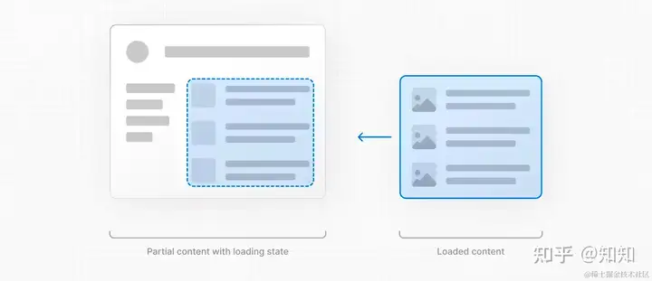

# Next.js和“全栈框架”


**当 Next.js 首次出现时，它为开发者提供了一个革命性的选择：在服务器上渲染页面还是在浏览器中直接渲染，为 Web 开发开启了新纪元。**

## 客户端渲染 VS 服务器端渲染

客户端渲染(Server-Side Rendering, SSR)是指浏览器使用 JavaScript 生成和更新网页，通常导致动态交互。相比之下，服务器端渲染是服务器创建初始页面，将完全形成的页面交付给浏览器，这可以提供更快的初始加载时间。

React 服务器组件在这个新时代至关重要，它使 Next.js 开发者能够创建直接在服务器上渲染的UI组件。这将带来重大的 SEO 和性能优势：
* 高效的数据获取：通过将数据检索靠近其源头，它减少了客户端请求，加速了数据检索过程。
* 增强的安全性：确保服务器上保持敏感信息，如令牌和 API 密钥的安全性。
* 减小 Bundle Sizes：通过在服务器端保留大型依赖项，可以最小化客户端 JavaScript 捆绑大小 —— 对于互联网速度较慢或基本设备的用户来说是一个福音。
* 优化初始页面加载：在服务器上呈现 HTML，让用户立即查看内容，而无需等待客户端渲染。
* 提高 SEO 和可分享性：向搜索引擎和社交平台提供完全呈现的 HTML，改进索引和内容预览。

### 服务端渲染的螺旋上升

服务器端渲染的概念并不新鲜，早年的php、asp、jsp这些Server page都是服务器端渲染的。
之后前后端分离的潮流将Web开发分为前端开发和后端开发两种岗位，后端更专注于提供稳定且高效的数据接口，前端则专责用户界面和交互逻辑。这种模式下，前后端的职责变得更加明确，代码重用和项目可维护性都得到了极大提升。

而如今，经过多年发展趋于完善的现代前端框架却再次引入服务端渲染这一古老方案，似乎是在开历史倒车。
其实不然，虽然从技术上看仍然是服务端渲染，但和php等古老框架的服务器端渲染已有巨大的差别。

其中最大的差别来自于现代前端框架已经形成的 **“组件(Component)”** 概念。
这是前后端分离的时代的革命性创新之一，使得前端页面的开发真正做到了模块化，极大提升了前端代码的可重用性。
在组件概念的基础上，现代前端框架演化出了“可复用单文件组件(Vue, React等)编译打包为静态页面(Svelte, Vite, Webpack等)”的开发范式。
在这种开发范式中，组件就如同包一样。通过`import`等关键字导入和调用，大量的组件相互调用组成完整页面，最后通过前端“编译”并打包为一个HTML文件和若干Javascrpt组成的静态页面。
这里的所谓“编译”本质上是一种翻译，即将单文件组件的语法翻译为HTML和Javascrpt。
不管多复杂的页面最终编译输出的都只有单个HTML文件，所以称之为单页应用 (Single Page Application, SPA)。


在此基础上的服务端渲染就不再像是php那种“查询数据库-将数据填入HTML的某些位置-发送”的模式，而是以组件为单位进行的渲染。
开发者现在可以根据每个组件的情况，决定是在服务器上还是在客户端上进行渲染。这种微调确保了最佳性能和最大的灵活性。


## Next.js 中的渲染策略

Next.js 提供了三种主要的渲染策略，每种都对 SEO 和性能有独特的影响：

* 静态渲染：在构建时创建页面，缓存并通过内容交付网络（CDN）进行分发。由于它的可预测性和快速的加载时间，它非常适合不经常更改的内容，比如博客文章。
* 动态渲染：页面根据用户请求生成，促进个性化内容。虽然这提供了自定义用户体验，但速度可能会慢一些，可能会影响 SEO。不过，通过适当的调整，仍然可以保持最佳性能。
* 流式渲染：服务器逐渐渲染 UI 片段。这种方法可以增强感知性能，允许用户在整个内容完成渲染之前与页面的部分部分进行互动——这对依赖较慢数据获取的内容来说绝对是一个优势。

## Server Component

Next.js 默认所有的组件都是 Server Component 服务端组件，即服务端渲染 SSR 。它的好处主要有两点：安全和性能。

服务端处理数据会更加安全。服务端可缓存数据、直接渲染 HTML 、还可支持 Streaming 流式渲染，这些方式都会提升性能。

如果有些组件需要用到浏览器的 API ，则需要标记为客户端组件，使用 `'use client'`。例如 `useEffect` 就需要客户端组件，其他常见的还有 `useState` 、 DOM 事件、路由和 url 操作、表单校验等很多。当一个组件为客户端组件时，在其中引入的所有子组件都是客户端组件。

```ts
'use client'
​
import { useEffect } from 'react'
​
export default function About() {
  useEffect(() => {
    console.log('done')
  }, [])
​
  return <p>About</p>
}
```

Server Component 是获取数据，并一次性渲染出结果（构建时，或者运行时），重点在于渲染。Client Component 是渲染完成以后，还有其他的交互和更新，重点在于交互。所以两者各有各的职责，要相互配合。

## 加载 UI 和流式渲染：Next.js 增强用户体验的答案

在今天的 Web 景观中，用户体验至关重要。内容加载的任何延迟都可能降低用户的参与度或转化率：

>沃尔玛发现，每提高 1 秒的页面加载时间，转化率增加 2%。

鉴于这一点，Next.js 引入了 loading.js约定，结合 React Suspense，提供有意义的加载 UI。这确保了用户在特定路由段的内容准备就绪时立即看到加载状态。


流式渲染将其提升到更高水平。通过在服务器上准备好的 UI 片段，用户可以在整个内容完成渲染之前开始浏览页面的部分部分。

集成到 Next.js 应用程序路由器中，流式渲染提高了初始页面加载速度和依赖于较慢数据获取的 UI。结果是用户得到迅速的反馈，即使在像产品评论这样的内容丰富页面上也是如此。

有了这些工具，开发者可以设计加载 UI，以及策略性地流式传送路由部分，从而确保提供最佳的用户体验。

当一个页面因为数据加载过慢时，会导致页面加载卡顿。 如果前端后端分离，自己开发前端，解决这个问题很简单，只需要加一个 loading 状态即可。



而在 Next.js 中也非常简单，只需要在路由目录加一个 loading.tsx ，Next.js 会自动实现 loading 状态。

```ts
// app/dashboard/loading.tsx
export default function Loading() {
  // You can add any UI inside Loading, including a Skeleton.
  return <LoadingSkeleton />
}
```

这种是简单粗暴的 loading 整个页面。如果页面模块较多，有可能有些模块加载快，有些模块加载慢，最好的方式是一部分一部分的加载 —— 这就是 Streaming 流式渲染。


Streaming 也不是新东西了，当年 facebook 在 PHP 时代就搞过这个，但后来没流行开来，说明通用性不强。 而 Next.js 结合 React 实现起来就非常简单，主要用到 `<Suspense>` 组件。Page 只是容器，具体的数据获取在各个子组件内部进行。

```ts
// app/dashboard/page.tsx
import { Suspense } from 'react'
import { PostFeed, Weather } from './Components'
 
export default function Posts() {
  return (
    <section>
      <Suspense fallback={<p>Loading feed...</p>}>
        <PostFeed />
      </Suspense>
      <Suspense fallback={<p>Loading weather...</p>}>
        <Weather />
      </Suspense>
    </section>
  )
}
```

## 获取数据和缓存

Server Component 可以直接在一个 async 函数中请求数据，也可以在服务端 API 或者 Server Action 中获取数据。

```ts
async function getData() {
  const res = await fetch('https://api.example.com/...')
  if (!res.ok) {
    throw new Error('Failed to fetch data')
  }
  return res.json()
}
​
export default async function Page() {
  const data = await getData()
  return <main>xxx</main>
}
```

但是，Next.js 默认情况下会缓存获取的数据，如不想缓存，需要增加 revalidate 机制，如按时间，或不缓存。

```ts
fetch('https://...', { cache: 'no-store' })
```

获取第三方数据时，可使用 `noStore()` 做标记。

```ts
import { unstable_noStore as noStore } from 'next/cache';

export async function fetchRevenue() {
  // Add noStore() here to prevent the response from being cached.
  // This is equivalent to in fetch(..., {cache: 'no-store'}).
  noStore();
  
  // get and return db data
}
```

PS：Next.js 还有非常复杂的 [缓存机制](https://nextjs.org/docs/app/building-your-application/caching)，从服务端和客户端、从路由和数据。例如在创建页提交表单以后，回到列表页，需要重新验证页面缓存。

## Server Action

用 `'use server'` 标记一个 ts 文件（里面的所有函数），或者一个 ts 函数，则可把他们标记为 Server Action 即在服务端执行的代码，一般用户客户端提交数据。【注意】`'use server'` 不是标记 React 组件的，而是针对函数的。

Server Component 中，可以直接定义一个 async 函数中为 Server Action ，也可以引入一个文件。

```ts
// Server Component
export default function Page() {
  // Server Action
  async function create() {
    'use server'
    // ...
  }
​
  return (
    // ...
  )
}
```

而 Client Component 只能引入一个 Server Action 文件。或者把 create 函数作为属性，传递给客户端组件。

```ts
// app/actions.ts
'use server'
export async function create() {
  // ...
}
​
// app/ui/button.tsx
import { create } from '@/app/actions'
export function Button() {
  return (
    // ...
  )
}
```

Server Action 函数可用于 `<form>` 或者 DOM 事件、 useEffect 等任何地方，Next.js 为它做了很多工作，例如：

* 服务端组件，可在页面 JS 未加载完成的情况下，进行 form 提交
* 客户端组件，如页面 JS 未加载完成，form 提交会暂存一个队列，页面渲染完再自动执行提交
* Server Action 中可使用 Next.js 数据缓存机制
* 背后统一使用 POST 请求来保证兼容性和安全性

Next.js 使用 Server Action 做到了进一步的 Hybration “水合”，即在开发体验上模糊前端和服务端的界限。你都不用单独开发服务端接口了，所有的都在一个一个 JS 方法中调用和传递。

这样做：第一，可以降低对研发人员的技术要求，只要懂 React 就能快速上手操作。第二，给 Next.js 极大的性能优化空间，一切都听它在背后指挥。

但这样做的坏处，是可能又会培养一批不懂 HTTP 协议的“Next 工程师”，类似一些不懂 JS 语法的“Vue 工程师”一样。

## Server Action 是否重回 PHP 时代？


Next.js 14 发布 Server Action 遭到很多吐槽，又重新回到 PHP 时代？这是服务端渲染的螺旋上升