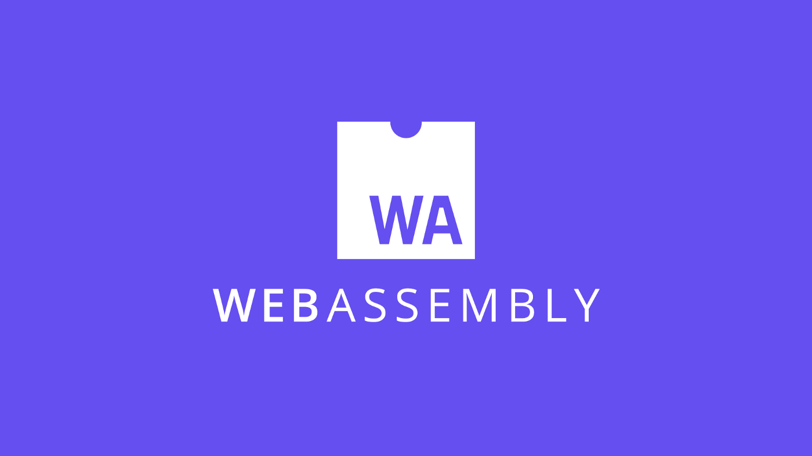
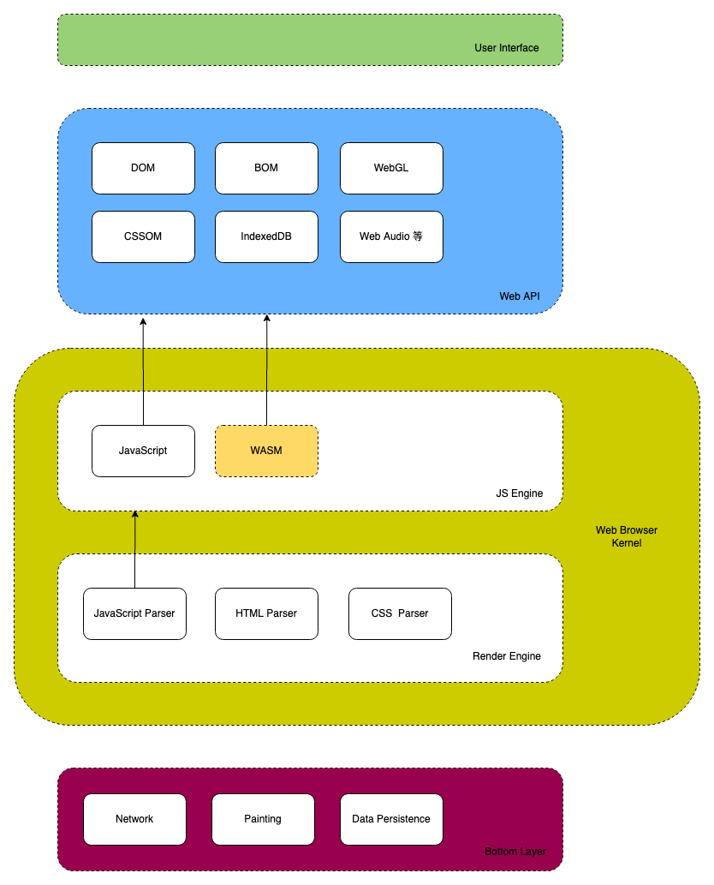
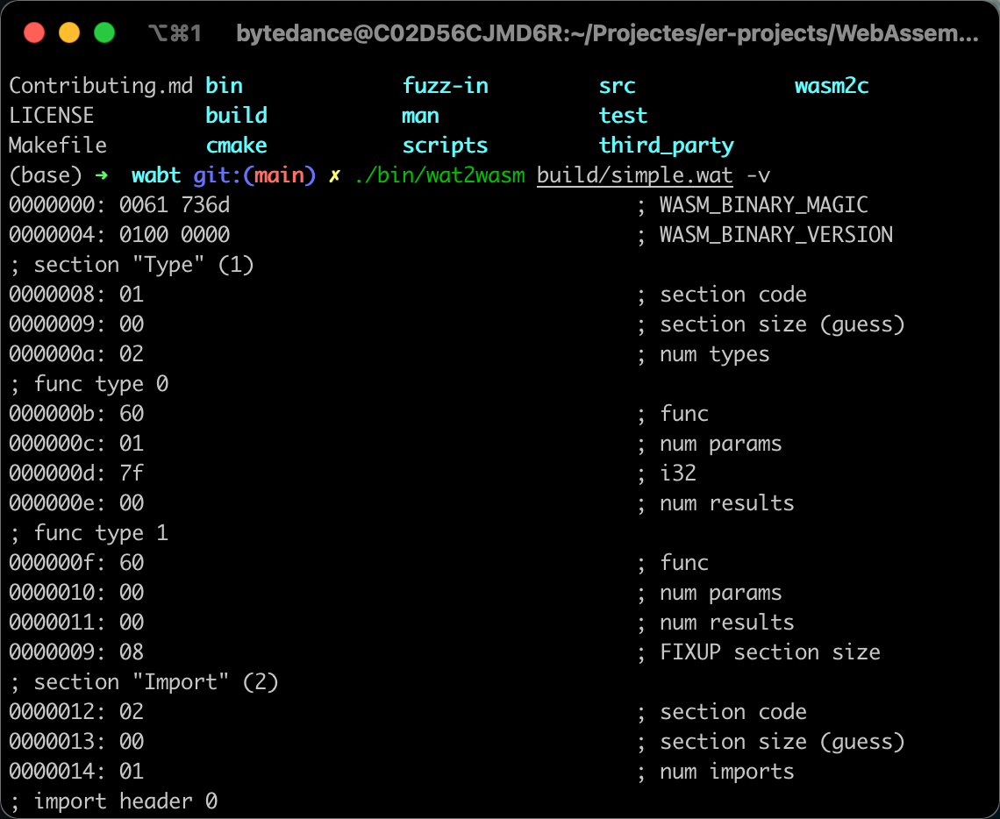
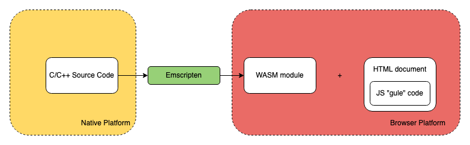
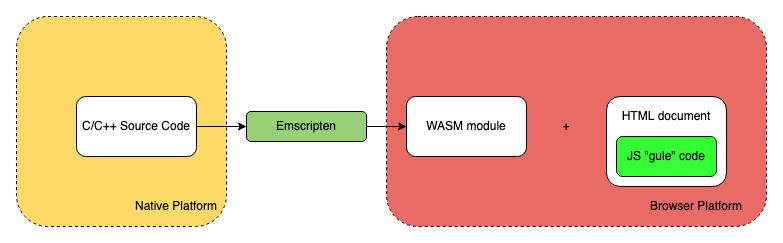
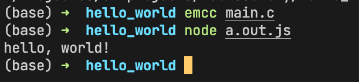
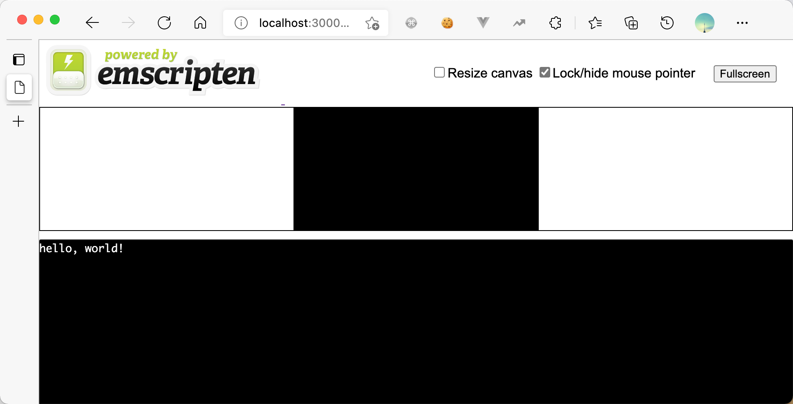
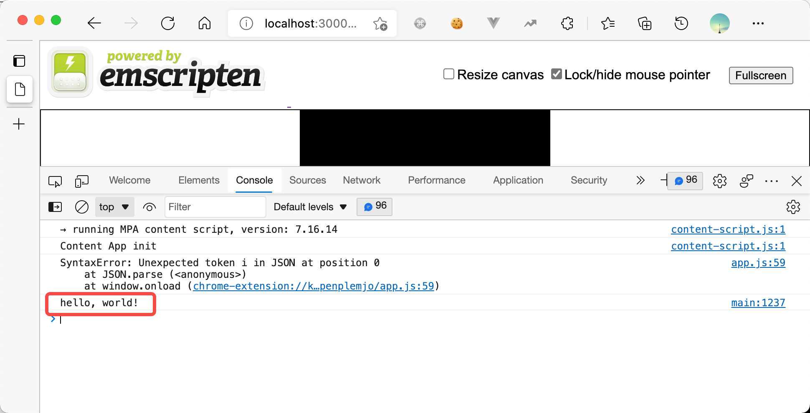

# 【转载】为什么说 WASM 是 Web 的未来？

[原文在此](https://blog.csdn.net/m0_61544080/article/details/121621524)





# 这篇文章打算讲什么？


了解 WebAssembly 的前世今生，这一致力于让 Web 更广泛使用的伟大创造是如何在整个 Web/Node.js
的生命周期起作用的，探讨为什么 WASM 是 Web 的未来？


在整篇文章的讲解过程中，你可以了解到 WebAssembly 原生、AssemblyScript、Emscripten 编译器。


最后还对 WebAssembly 的未来进行了展望，列举了一些令人兴奋的技术的发展方向。


我在之前也撰写过深入了解 WebAssembly 使用细节和在浏览器里面调试 WebAssembly 代码的文章，感兴趣的同学可以点击链接阅读：

* [WebAssembly在浏览器中调试](https://mp.weixin.qq.com/s?__biz=MzkxMjI3OTA3NQ==&amp;mid=2247485531&amp;idx=1&amp;sn=981604a9da572ce6f06051664cf41dc6&amp;chksm=c10e1b17f67992010f019675a66aae5965a6d51b29336dfd90164e800c056f8fe7c7548cb1ac&amp;token=1261539433&amp;lang=zh_CN#rd)
* [编译C/C++ 程序到WebAssembly，然后运行在浏览器和 Node.js](https://mp.weixin.qq.com/s?__biz=MzkxMjI3OTA3NQ==&amp;mid=2247485073&amp;idx=1&amp;sn=3515cf79aecd1024aa2ceb3142ec04b5&amp;chksm=c10e15ddf6799ccbfb981e3f92cafc1a95668af8cba54aba264536b8cbad4c9158d616e9e7ab&amp;token=1261539433&amp;lang=zh_CN#rd)

# 为什么需要 WebAssembly?

## 动态语言之踵


首先先来看一下 JS 代码的执行过程：


&gt;上述是 Microsoft Edge 之前的 ChakraCore 引擎结构，目前 Microsoft Edge 的 JS 引擎已经切换为 V8。

整体的流程就是：

1. 拿到了 JS 源代码，交给 Parser，生成 AST
2. ByteCode Compiler 将 AST 编译为字节码（ByteCode）
3. ByteCode 进入翻译器，翻译器将字节码一行一行翻译（Interpreter）为机器码（Machine Code），然后执行

但其实我们平时写的代码有很多可以优化的地方，如多次执行同一个函数，那么可以将这个函数生成的 Machine Code 标记可优化，然后打包送到 JIT
Compiler（Just-In-Time），下次再执行这个函数的时候，就不需要经过 Parser-Compiler-Interpreter 这个过程，可以直接执行这份准备好的 Machine Code，大大提高的代码的执行效率。


但是上述的 JIT 优化只能针对静态类型的变量，如我们要优化的函数，它只有两个参数，每个参数的类型是确定的，而 JavaScript
却是一门动态类型的语言，这也意味着，函数在执行过程中，可能类型会动态变化，参数可能变成三个，第一个参数的类型可能从对象变为数组，这就会导致 JIT 失效，需要重新进行
Parser-Compiler-Interpreter-Execuation，而 Parser-Compiler 这两步是整个代码执行过程中最耗费时间的两步，这也是为什么 JavaScript 语言背景下，Web
无法执行一些高性能应用，如大型游戏、视频剪辑等。

## 静态语言优化


通过上面的说明了解到，其实 JS 执行慢的一个主要原因是因为其动态语言的特性，导致 JIT 失效，所以如果我们能够为 JS 引入静态特性，那么可以保持有效的 JIT，势必会加快 JS 的执行速度，这个时候 asm.js 出现了。


asm.js 只提供两种数据类型：

* 32 位带符号整数
* 64 位带符号浮点数

其他类似如字符串、布尔值或对象都是以数值的形式保存在内存中，通过 TypedArray 调用。整数和浮点数表示如下：

&gt;`ArrayBuffer`对象、`TypedArray`视图和`DataView` 视图是 JavaScript 操作二进制数据的一个接口，以数组的语法处理二进制数据，统称为二进制数组。参考 [ArrayBuffer](https://es6.ruanyifeng.com/#docs/arraybuffer) 。


```js
var a = 1;

var x = a | 0;  // x 是32位整数
var y = +a;  // y 是64位浮点数
```

而函数的写法如下：

```js
function add(x, y) {
  x = x | 0;
  y = y | 0;
  return (x + y) | 0;
}
```

上述的函数参数及返回值都需要声明类型，这里都是 32 位整数。


而且 asm.js 也不提供垃圾回收机制，内存操作都是由开发者自己控制，通过 TypedArray 直接读写内存：

```js
var buffer = new ArrayBuffer(32768); // 申请 32 MB 内存
var HEAP8 = new Int8Array(buffer); // 每次读 1 个字节的视图 HEAP8
function compiledCode(ptr) {
  HEAP[ptr] = 12;
  return HEAP[ptr + 4];
}
```


从上可见，asm.js 是一个严格的 JavaScript 子集要求变量的类型在运行时确定且不可改变，且去除了 JavaScript 拥有的垃圾回收机制，需要开发者手动管理内存。这样 JS 引擎就可以基于 asm.js
的代码进行大量的 JIT 优化，据统计 asm.js 在浏览器里面的运行速度，大约是原生代码（机器码）的 50% 左右。

## 推陈出新


但是不管 asm.js 再怎么静态化，干掉一些需要耗时的上层抽象（垃圾收集等），也还是属于 JavaScript 的范畴，代码执行也需要 Parser-Compiler 这两个过程，而这两个过程也是代码执行中最耗时的。


为了极致的性能，Web 的前沿开发者们抛弃 JavaScript，创造了一门可以直接和 Machine Code 打交道的汇编语言 WebAssembly，直接干掉 Parser-Compiler，同时 WebAssembly
是一门强类型的静态语言，能够进行最大限度的 JIT 优化，使得 WebAssembly 的速度能够无限逼近 C/C++ 等原生代码。


相当于下面的过程：


无需 Parser-Compiler，直接就可以执行，同时干掉了垃圾回收机制，而且 WASM 的静态强类型语言的特性可以进行最大程度的 JIT 优化。

# WebAssembly 初探


我们可以通过一张图来直观了解 WebAssembly 在 Web 中的位置：





WebAssembly（也称为 WASM），是一种可在 Web 中运行的全新语言格式，同时兼具体积小、性能高、可移植性强等特点，在底层上类似 Web 中的 JavaScript，同时也是 W3C 承认的 Web 中的第 4 门语言。


为什么说在底层上类似 JavaScript，主要有以下几个理由：

* 和 JavaScript 在同一个层次执行：JS Engine，如 Chrome 的 V8
* 和 JavaScript 一样可以操作各种 Web API

同时 WASM 也可以运行在 Node.js 或其他 WASM Runtime 中。

## WebAssembly 文本格式


实际上 WASM 是一堆可以直接执行二进制格式，但是为了易于在文本编辑器或开发者工具里面展示，WASM 也设计了一种 “中间态” 的[文本格式](https://webassembly.github.io/spec/core/text/index.html)，以 `.wat` 或 `.wast` 为扩展命名，然后通过 [wabt](https://github.com/WebAssembly/wabt) 等工具，将文本格式下的 WASM 转为二进制格式的可执行代码，以 `.wasm` 为扩展的格式。


来看一段 WASM 文本格式下的模块代码：

```wasm
(module
  (func $i (import "imports" "imported_func") (param i32))
  (func (export "exported_func")
    i32.const 42
    call $i
  )
)
```


上述代码逻辑如下：

1. 首先定义了一个 WASM 模块，然后从一个 `imports` JS 模块导入了一个函数 `imported_func` ，将其命名为 `$i` ，接收参数 `i32`
2. 然后导出一个名为 `exported_func` 的函数，可以从 Web App，如 JS 中导入这个函数使用
3. 接着为参数 `i32` 传入 42，然后调用函数 `$i`

我们通过 wabt 将上述文本格式转为二进制代码：

1. 将上述代码复制到一个新建的，名为 `simple.wat` 的文件中保存
2. 使用 [wabt](https://github.com/WebAssembly/wabt) 进行编译转换

当你安装好 wabt 之后，运行如下命令进行编译：

```sh
wat2wasm simple.wat -o simple.wasm
```


虽然转换成了二进制，但是无法在文本编辑器中查看其内容，为了查看二进制的内容，我们可以在编译时加上 `-v` 选项，让内容在命令行输出：

```sh
wat2wasm simple.wat -v
```


输出结果如下：





可以看到，WebAssembly 其实是二进制格式的代码，即使其提供了稍为易读的文本格式，也很难真正用于实际的编码，更别提开发效率了。

## 将 WebAssembly 作为编程语言的一种尝试


因为上述的二进制和文本格式都不适合编码，所以不适合将 WASM 作为一门可正常开发的语言。


为了突破这个限制，[AssemblyScript](https://www.assemblyscript.org/) 走到台前，AssemblyScript 是 TypeScript 的一种变体，为
JavaScript 添加了 **[WebAssembly 类型](https://www.assemblyscript.org/types.html#type-rules)**， 可以使用 [Binaryen](https://github.com/WebAssembly/binaryen) 将其编译成 WebAssembly。


&gt;WebAssembly 类型大致如下：


* i32、u32、i64、v128 等
* 小整数类型：i8、u8 等
* 变量整数类型：isize、usize 等

Binaryen 会前置将 AssemblyScript 静态编译成强类型的 WebAssembly 二进制，然后才会交给 JS 引擎去执行，所以说虽然 AssemblyScript 带来了一层抽象，但是实际用于生产的代码依然是
WebAssembly，保有 WebAssembly 的性能优势。AssemblyScript 被设计的和 TypeScript 非常相似，提供了一组内建的函数可以直接操作 WebAssembly 以及编译器的特性.

&gt;内建函数：


* 静态类型检查：
  - `function isInteger<t>(value?: T): ``bool` 等
* 实用函数：
  - `function sizeof<t>(): usize` 等
* 操作 WebAssembly：
  - 数学操作
    - `function clz<t>(value: T): T` 等
  - 内存操作
    - `function load<t>(ptr: usize, immOffset?: usize): T` 等
  - 控制流
    - `function select<t>(ifTrue: T, ifFalse: T, condition: ``bool``): T` 等
  - SIMD
  - Atomics
  - Inline instructions


然后基于这套内建的函数向上构建一套标准库。

&gt;标准库：
* Globals
* Array
* ArrayBuffer
* DataView
* Date
* Error
* Map
* Math
* Number
* Set
* String
* Symbol
* TypedArray

如一个典型的 Array 的使用如下：

```js
var arr = new Array<string>(10)

// arr[0]; // 会出错 😢

// 进行初始化
for (let i = 0; i &lt; arr.length; ++i) {
  arr[i] = ""
}
arr[0]; // 可以正确工作 😊
```


可以看到 AssemblyScript 在为 JavaScript 添加类似 TypeScript 那样的语法，然后在使用上需要保持和 C/C++ 等静态强类型的要求，如不初始化，进行内存分配就访问就会报错。


还有一些扩展库，如 Node.js 的 process、crypto 等，JS 的 console，还有一些和内存相关的 StaticArray、heap 等。


可以看到通过上面基础的类型、内建库、标准库和扩展库，AssemblyScript 基本上构造了 JavaScript 所拥有的的全部特性，同时 AssemblyScript 提供了类似 TypeScript
的语法，在写法上严格遵循强类型静态语言的规范。


值得一提的是，因为当前 WebAssembly 的 ES 模块规范依然在草案中，AssemblyScript 自行进行了模块的实现，例如导出一个模块：

```ts
// env.ts
export declare function doSomething(foo: i32): void { /* ... 函数体 */ }
```


导入一个模块：

```ts
import { doSomething } from "./env";
```


一个大段代码、使用类的例子：

```ts
class Animal<t> {
  static ONE: i32 = 1;
  static add(a: i32, b: i32): i32 { return a + b + Animal.ONE; }

  two: i16 = 2; // 6   instanceSub<t>(a: T, b: T): T { return a - b + <t>Animal.ONE; } // tsc does not allow this }

export function staticOne(): i32 {
  return Animal.ONE;
}

export function staticAdd(a: i32, b: i32): i32 {
  return Animal.add(a, b);
}

export function instanceTwo(): i32 {
  let animal = new Animal<i32>();
  return animal.two;
}

export function instanceSub(a: f32, b: f32): f32 {
  let animal = new Animal<f32>();
  return animal.instanceSub<f32>(a, b);
}
```


AssemblyScript 为我们打开了一扇新的大门，可以以 TS 形式的语法，遵循静态强类型的规范进行高效编码，同时又能够便捷的操作 WebAssembly/编译器相关的 API，代码写完之后，通过 Binaryen
编译器将其编译为 WASM 二进制，然后获取到 WASM 的执行性能。


得益于 AssemblyScript 兼具灵活性与性能，目前使用 AssemblyScript 构建的应用生态已经初具繁荣，目前在区块链、构建工具、编辑器、模拟器、游戏、图形编辑工具、库、IoT、测试工具等方面都有大量使用
AssemblyScript 构建的产物：[https://www.assemblyscript.org/built-with-assemblyscript.html#games](https://www.assemblyscript.org/built-with-assemblyscript.html#games)


&gt;上面是使用 AssemblyScript 构建的一个五子棋游戏。


## 一种鬼才哲学：将 C/C++ 代码跑在浏览器


虽然 AssemblyScript 的出现极大的改善了 WebAssembly 在高效率编码方面的缺陷，但是作为一门新的编程语言，其最大的劣势就是生态、开发者与积累。


WebAssembly 的设计者显然在设计上同时考虑到了各种完善的情况，既然 WebAssembly
是一种二进制格式，那么其就可以作为其他语言的编译目标，如果能够构建一种编译器，能够将已有的、成熟的、且兼具海量的开发者和强大的生态的语言编译到 WebAssembly 使用，那么相当于可以直接复用这个语言多年的积累，并用它们来完善
WebAssembly 生态，将它们运行在 Web、Node.js 中。


幸运的是，针对 C/C++ 已经有 [Emscripten](https://github.com/emscripten-core/emscripten) 这样优秀的编译器存在了。


可以通过下面这张图直观的阐述 Emscripten 在开发链路中的地位：





即将 C/C++ 的代码（或者 Rust/Go 等）编译成 WASM，然后通过 JS 胶水代码将 WASM 跑在浏览器中（或 Node.js）的 runtime，如 ffmpeg 这个使用 C 编写音视频转码工具，通过
Emscripten 编译器编译到 Web 中使用，可直接在浏览器前端转码音视频。

&gt;上述的 JS “Gule” 代码是必须的，因为如果需要将 C/C++ 编译到 WASM，还能在浏览器中执行，就得实现映射到 C/C++ 相关操作的 Web API，这样才能保证执行有效，这些胶水代码目前包含一些比较流行的 C/C++ 库，如 [SDL](https://en.wikipedia.org/wiki/Simple_DirectMedia_Layer)、[OpenGL](https://en.wikipedia.org/wiki/OpenGL)、[OpenAL](https://en.wikipedia.org/wiki/OpenAL)、以及 [POSIX](https://en.wikipedia.org/wiki/POSIX) 的一部分 API。


目前使用 WebAssembly 最大的场景也是这种将 C/C++ 模块编译到 WASM 的方式，比较有名的例子有 [Unreal Engine 4](https://blog.mozilla.org/blog/2014/03/12/mozilla-and-epic-preview-unreal-engine-4-running-in-firefox/)、[Unity](https://blogs.unity3d.com/2018/08/15/webassembly-is-here/) 之类的大型库或应用。

## WebAssembly 会取代 JavaScript 吗？


答案是不会。


根据上面的层层阐述，实际上 WASM 的设计初衷就可以梳理为以下几点：

* 最大程度的复用现有的底层语言生态，如 C/C++ 在游戏开发、编译器设计等方面的积淀
* 在 Web、Node.js 或其他 WASM runtime 获得近乎于原生的性能，也就是可以让浏览器也能跑大型游戏、图像剪辑等应用
* 还有最大程度的兼容 Web、保证安全
* 同时在开发上（如果需要开发）易于读写和可调试，这一点 AssemblyScript 走得更远

所以从初衷出发，WebAssembly 的作用更适合下面这张图：


WASM 桥接各种系统编程语言的生态，近一步补齐了 Web 开发生态之外，还为 JS 提供性能的补充，正是 Web 发展至今所缺失的重要的一块版图。

&gt;Rust Web Framework：[https://github.com/yewstack/yew](https://github.com/yewstack/yew)


# 深入探索 Emscripten

&gt;地址：[https://github.com/emscripten-core/emscripten](https://github.com/emscripten-core/emscripten)
&gt;下面所有的 demo 都可以在仓库：[https://code.byted.org/huangwei.fps/webassembly-demos/tree/master](https://code.byted.org/huangwei.fps/webassembly-demos/tree/master)找到
&gt;Star：21.4K
&gt;维护：活跃


Emscripten 是一个开源的，跨平台的，用于将 C/C++ 编译为 WebAssembly 的编译器工具链，由 LLVM、Binaryen、Closure Compiler 和其他工具等组成。


Emscripten 的核心工具为 Emscripten Compiler Frontend（emcc），emcc 是用于替代一些原生的编译器如 gcc 或 clang，对 C/C++ 代码进行编译。


实际上为了能让几乎所有的可移植的 C/C++ 代码库能够编译为 WebAssembly，并在 Web 或 Node.js 执行，Emscripten Runtime 其实还提供了兼容 C/C++ 标准库、相关 API 到
Web/Node.js API 的映射，这份映射存在于编译之后的 JS 胶水代码中。


再看下面这张图，红色部分为 Emscripten 编译后的产物，绿色部分为 Emscripten 为保证 C/C++ 代码能够运行的一些 runtime 支持：





## 简单体验一下 “Hello World”


值得一提的是，WebAssembly 相关工具链的安装几乎都是以源码的形式提供，这可能和 C/C++ 生态的习惯不无关系。


为了完成简单的 C/C++ 程序运行在 Web，我们首先需要安装 Emscripten 的 SDK：

```sh
# Clone 代码仓库
git clone https: // github . com / emscripten-core / emsdk . git

# 进入仓库
cd emsdk

# 获取最新代码，如果是新 clone 的这一步可以不需要
git pull

# 安装 SDK 工具，我们安装 1.39.18，方便测试
./emsdk install 1.39.18

# 激活 SDK
./emsdk activate 1.39.18

# 将相应的环境变量加入到系统 PATH
source ./emsdk_env.sh

# 运行命令测试是否安装成功
emcc -v #
```


如果安装成功，上述的命令运行之后会输出如下结果：

```sh
emcc (Emscripten gcc/clang-like replacement + linker emulating GNU ld) 1.39.18
clang version 11.0.0 (/b/s/w/ir/cache/git/chromium.googlesource.com-external-github.com-llvm-llvm--project 613c4a87ba9bb39d1927402f4dd4c1ef1f9a02f7)
Target: x86_64-apple-darwin21.1.0
Thread model: posix
```


让我们准备初始代码：

```sh
mkdir -r webassembly/hello_world
cd webassembly/hello_world &amp;&amp; touch main.c
```


在 `main.c` 中加入如下代码：

```c
#include <stdio.h>
int main() {
  printf("hello, world!\n");
  return 0;
}
```


然后使用 emcc 来编译这段 C 代码，在命令行切换到 `webassembly/hello_world` 目录，运行：

```sh
emcc main.c
```


上述命令会输出两个文件：`a.out.js` 和 `a.out.wasm` ，后者为编译之后的 wasm 代码，前者为 JS 胶水代码，提供了 WASM 运行的 runtime。


可以使用 Node.js 进行快速测试：

```sh
node a.out.js
```


会输出 `"hello, world!"` ，我们成功将 C/C++ 代码运行在了 Node.js 环境。





接下来我们尝试一下将代码运行在 Web 环境，修改编译代码如下：

```sh
emcc main.c -o main.html
```


上述命令会生成三个文件：

* `main.js` 胶水代码
* `main.wasm` WASM 代码
* `main.html` 加载胶水代码，执行 WASM 的一些逻辑

&gt;Emscripten 生成代码有一定的规则，具体可以参考：[https://emscripten.org/docs/compiling/Building-Projects.html#emscripten-linker-output-files](https://emscripten.org/docs/compiling/Building-Projects.html#emscripten-linker-output-files)


如果要在浏览器打开这个 HTML，需要在本地起一个服务器，因为单纯的打开通过 `file://` 协议访问时，主流浏览器不支持 XHR 请求，只有在 HTTP 服务器下，才能进行 XHR
请求，所以我们运行如下命令来打开网站：

```sh
npx serve .
```


打开网页，访问 [localhost:3000/main.html](http://localhost:3000/main.html)，可以看到如下结果：





同时开发者工具里面也会有相应的打印输出：





我们成功的将 C 代码跑在了 Node.js 和浏览器！

# 关于 WebAssembly 的未来


本文仅仅列举了一些 WebAssembly 当前的一些主要应用场景，包含 WebAssembly 的高性能、轻量和跨平台，使得我们可以将 C/C++ 等语言运行在 Web，也可以将桌面端应用跑在 Web 容器。


但是这篇文章没有涉及到的内容有 [WASI](https://github.com/WebAssembly/WASI)，一种将 WebAssembly 跑在任何系统上的标准化系统接口，当 WebAssembly
的性能逐渐增强时，WASI 可以提供一种恰是可行的方式，可以在任意平台上运行任意的代码，就像 Docker 所做的一样，但是不需要受限于操作系统。正如 Docker 的创始人所说：

&gt;“ 如果 WASM+WASI 在 2008 年就出现的话，那么就不需要创造 Docker 了，服务器上的 WASM 是计算的未来，是我们期待已久的标准化的系统接口。


另一个有意思的内容是 WASM 的客户端开发框架如 [yew](https://github.com/yewstack/yew)，未来可能将像 React/Vue/Angular 一样流行。


而 WASM 的包管理工具 [WAPM](https://wapm.io/)，得益于 WASM 的跨平台特性，可能会变成一种在不同语言的不同框架之间共享包的首选方式。


同时 WebAssembly 也是由 W3C 主要负责开发，各大厂商，包括 Microsoft、Google、Mozilla 等赞助和共同维护的一个项目，相信 WebAssembly 会有一个非常值得期待的未来。


# 参考链接

* [https://www.ruanyifeng.com/blog/2017/09/asmjs_emscripten.html](https://www.ruanyifeng.com/blog/2017/09/asmjs_emscripten.html)
* [https://pspdfkit.com/blog/2017/webassembly-a-new-hope/](https://pspdfkit.com/blog/2017/webassembly-a-new-hope/)
* [https://hacks.mozilla.org/2017/02/what-makes-webassembly-fast/](https://hacks.mozilla.org/2017/02/what-makes-webassembly-fast/)
* [https://www.sitepoint.com/understanding-asm-js/](https://www.sitepoint.com/understanding-asm-js/)
* [http://www.cmake.org/download/](http://www.cmake.org/download/)
* [https://developer.mozilla.org/en-US/docs/WebAssembly/existing_C_to_wasm](https://developer.mozilla.org/en-US/docs/WebAssembly/existing_C_to_wasm)
* [https://research.mozilla.org/webassembly/](https://research.mozilla.org/webassembly/)
* [https://itnext.io/build-ffmpeg-webassembly-version-ffmpeg-js-part-2-compile-with-emscripten-4c581e8c9a16?gi=e525b34f2c21](https://itnext.io/build-ffmpeg-webassembly-version-ffmpeg-js-part-2-compile-with-emscripten-4c581e8c9a16?gi=e525b34f2c21)
* [https://dev.to/alfg/ffmpeg-webassembly-2cbl](https://dev.to/alfg/ffmpeg-webassembly-2cbl)
* [https://gist.github.com/rinthel/f4df3023245dd3e5a27218e8b3d79926](https://gist.github.com/rinthel/f4df3023245dd3e5a27218e8b3d79926)
* [https://github.com/Kagami/ffmpeg.js/](https://github.com/Kagami/ffmpeg.js/)
* [https://qdmana.com/2021/04/20210401214625324n.html](https://qdmana.com/2021/04/20210401214625324n.html)
* [https://github.com/leandromoreira/ffmpeg-libav-tutorial](https://github.com/leandromoreira/ffmpeg-libav-tutorial)
* [http://ffmpeg.org/doxygen/4.1/examples.html](http://ffmpeg.org/doxygen/4.1/examples.html)
</stdio.h></f32></f32></i32></t></t></t></string></t></t></t></t></t>