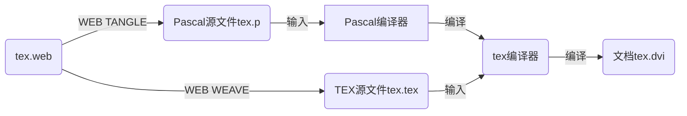

# TEX历史

[参考资料](https://blog.jjgod.org/2006/08/17/constructing-tex-system/)
[参考资料](http://lyanry.is-programmer.com/posts/332)

## 起源

Knuth 最早是在一台 DEC PDP-11 上用一种叫做 SAIL 的语言编写的 TeX，尔后他和一些合作者，开始在 Stanford 大学实验一种叫做 [literate programming (文学编程)](文学编程.md) 的新式编程方法，他们设计了一套叫做 WEB 的系统(可见[简介](文学编程.md))。这个系统的源文件中Pascal写的代码和TEX写的文档混杂于一体，并通过“TANGLE”生成Pascal源文件用于编译TEX程序，“WEAVE”生成TEX源文件用于生成TEX文档（注意，文档是由“TANGLE”生成的Pascal源文件编译为可执行的TEX编译程序之后再拿来编译“WEAVE”出的TEX源文件得到的，如下图）。



经过几年的不断修改，WEB 系统和 TeX 系统相互的影响下逐渐成熟，到 1982 年的时候，两者都基本上稳定下来，此时的 TeX 系统，核心就是一个 tex.web 文件。这个源文件现在被保存在[TUG(TEX User Group)](http://www.tug.org/svn/texlive/trunk/Build/source/texk/web2c/tex.web?view=co)中。

## 分支

最终稳定下来的tex.web代码长度有三万行之多，这使得后续其他人的修改变得非常麻烦。考虑到这个问题 Knuth 给 WEB 系统添加了一个功能：合并主程序和 change file 的功能，使得程序修改可以在其他文件中进行。此后，tex的许多修改操作就移动到了[tex.ch](http://www.tug.org/svn/texlive/trunk/Build/source/texk/web2c/tex.ch?view=co)文件中。

>可是后来，Knuth 又说，TeX 这个程序应该 freeze 下来，大家不要再改了啊，想改，就换个名字，不要再叫做 tex 了。

于是TUG的人们就都使用tex.web作为主程序，按照各自需求写了许多不同的 change file ，从而衍生出 etex、omega、pdftex等等增强版本。

## Web2C

Knuth 开发 TeX 的那个时代，高级程序语言之神 C 还没有获得大众的欢迎。但是后来 Pascal 的地位逐渐被取代，并且在UNIX系统上成为无可替代的语言，这时就需要一个C语言实现的TEX以便在UNIX系统上发展。用C语言实现TEX最简单的办法就是将Tangle出的Pascal代码转换为C语言代码，而正好 Knuth 在写Pascal版的TEX时考虑到了可移植性，没有使用任何Pascal独有的语言特性，使得直接的代码转换非常容易，于是一个新的Tangle程序Web2C应运而生。这个程序除了拥有Tangle功能，还可以将Pascal代码转换为C语言代码，使得TEX能更方便地在UNIX平台编译运行。

从此以后，更先进的TEX增强版本XeTeX、LuaTeX等大都用C语言编写。

## kpathsea

当TUG逐渐壮大，各类包和库越来越多，TeX 需要在本地或者网络上的许多目录中找文件，需要耗费非常长的时间。因此，TUG决定抛弃仅在当前目录或者由用户声明路径的目录下面找文件的方式，转而使用统一的文件架构标准，称为 TDS(TeX Directory Structure)，并退出了一个专用于目录查找的工具kpathsea和数据库ls-R。所有 tex 相关文件按照TDS放在若干个texmf目录里面，然后所有 tex 程序比如 tex.exe，pdftex.exe，xetex.exe 在编译.tex文件的时候如果需要寻找任何文件，都通过 kpathsea.dll 运行库查询一个texmf.cnf配置文件找到文件所在的位置（当然，你也可以自己运行 kpsewhich.exe 程序手动查询某个文件所在的位置）。一个TEX系统中会有多个优先级不同的texmf.cnf，例如下面这个文件就是TeXLive 2019根目录的texmf.cnf文件：

```
% (Public domain.)
% This texmf.cnf file should contain only your personal changes from the
% original texmf.cnf (for example, as chosen in the installer).
%
% That is, if you need to make changes to texmf.cnf, put your custom
% settings in this file, which is .../texlive/YYYY/texmf.cnf, rather than
% the distributed file (which is .../texlive/YYYY/texmf-dist/web2c/texmf.cnf).
% And include *only* your changed values, not a copy of the whole thing!
%
OSFONTDIR = $SystemRoot/fonts//

% Prefer external Perl for third-party TeXLive Perl scripts
% Was set to 1 if at install time a sufficiently recent Perl was detected.
TEXLIVE_WINDOWS_TRY_EXTERNAL_PERL = 0
```

现代操作系统的发展使得目录查找不再成为软件的性能瓶颈，因此也有许多TEX发行版抛弃了kpathsea而直接使用操作系统进行目录查找。目前还在使用kpathsea主要是TeXLive发行版。