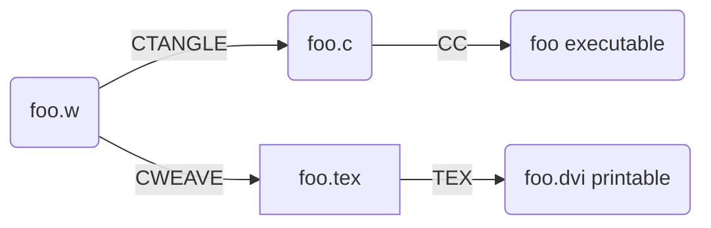

# 文学编程（Literate Programming）

>正如 Donald Ervin Knuth 所构想的那样，文学编程范型不同于传统的由计算机强加的编写程序的方式和顺序，而代之以让程序员用他们自己思维内在的逻辑和流程所要求的顺序开发程序。
>
>——维基百科

参考资料：
* [www.literateprogramming.com](http://www.literateprogramming.com/)
* [维基百科](https://zh.wikipedia.org/wiki/%E6%96%87%E5%AD%A6%E7%BC%96%E7%A8%8B)
* [知乎](https://www.zhihu.com/question/26978956)

## 简介

>文学编程自由地表达逻辑，而且它用人类日常使用的语言写出来，就好像一篇论文一样，**论文里包括用来隐藏抽象的宏和传统的源代码**。文学编程工具用来**从文学源文件中获得两种表达方式**，一种用于计算机进一步的**编译和执行**，称作“绕”出（tangle）的代码，一种用于**格式化文档**，称作从文学源代码中“织”出（weave）。虽然第一代文学编程工具特定于计算机语言，但后来的工具可以不依赖具体语言，并且存在于比编程语言更高的层次中。

* 结构化编程过程：先写好给机器看的代码，然后再加上给人看的注释

在传统的编程过程中，程序的组织方式以代码为主、注释为辅，即“在源代码中放入注释”，在保证代码结构清晰的基础上，加入注释对代码进行解释，以便让人阅读程序。但是比起人类阅读，这时代码的组织方式更适合于机器阅读。

* 文学化编程过程：先写好给人看的论文，然后再加上给机器看的宏

在文学编程中，程序的组织方式以注释为主、代码为辅，即“在注释中放入源代码”。这个过程就像先将自己的思路写成一篇论文，然后再将源代码以宏的形式作为“论文的注释”放入到论文中，以便“让机器阅读论文”。

>我的理解，文学编程的重点在文学，而非编程。因此，文学编程的产物不应该是大型软件，而是paper，分析材料、报告啥的。大型工业级别软件开发应遵循的金科玉律，如“修改封闭，扩展开放”，“高内聚，低耦合”等，在文学化编程范型前，似乎变得格格不入。再深入思考，就会发现**文学化编程组织代码的结构和方式是依附在文档结构上的，按照篇-章-节-段进行**，问题是这种方式能否和软件开发中的**模块-库-包-类**等代码组织方式对应起来，达到软件工程所追求的诸多目标？目前来看，答案是否定的。
>
>——知乎

## 经典文学编程工具WEB、CWEB、[noweb](https://www.ctan.org/pkg/noweb)

>WEB 是一种计算机编程语言系统。它由 Donald Ervin Knuth 本人设计，是第一种实现他称作“文学编程”的语言。WEB包含了2个主要程序：`TANGLE`，从源文本生成可编译的Pascal代码，以及`WEAVE`，使用TEX生成格式漂亮，可打印的文档。
>
>CWEB是WEB的C语言新版本，noweb是另外一种借鉴了WEB的文学编程工具，同时与语言无关。
>
>——维基百科

一个文学编程的经典例子是标准Unix单词计数程序`wc`的文学实现。这个例子的CWEB版本可以在 Donald Ervin Knuth 的《文学编程》书中的第12章找到。这一例子漂亮地阐释了文学编程的基本元素。后来它也为noweb文学编程工具而重写。下面这个例子就是它的noweb版本：

[wc.nw](i/wc.nw)

我们可以看到，noweb源代码中交织着Tex代码和C语言代码。每一个C语言代码片段（宏）的都以一个`<<代码片段名>>=`开头，一个`@`结尾，程序的入口是`<<*>>=`；在某个代码片段中调用其他代码片段只需要调用`<<代码片段名>>`即可。整个程序源代码以一篇论文的方式组织，以篇-章-节-段进行排布；C语言代码散落在源文件各处的代码片段的以及对它们的引用构成，而不是如结构化编程方式那样排列。

看到这个经典的文学编程源代码，我们能更加深刻地体会到文学编程“以人优先”而不是“以机器优先”的思想。它强制将机器的“思想”（结构化程序）撕裂开来，散布到人的“思想”（论文）之中，使程序更适合人来理解而不是机器来理解。

wc.nw `TANGLE`出的C语言源代码如下：

[wc.c](i/wc.c)

wc.nw `WEAVE`出的文档如下（HTML格式）：

[An Example of noweb](i/An%20Example%20of%20noweb.html)

## 借鉴了文学编程思想的现代编程工具 ipython jupyter

jupyter可能是借鉴了文学编程思想的现代编程工具中使用最广泛的一种，它很好地继承了文学编程“以人优先”思想并将其在Python这个优秀的动态语言上发扬光大。jupyter集文本、代码、图像、公式的展现于一体，这使得它非常适合用于教育领域。下面是一个基于jupyter的贝叶斯方法编程教程，大家可以从中体会到文学编程思想的魅力：

[Probabilistic-Programming-and-Bayesian-Methods-for-Hackers](https://github.com/CamDavidsonPilon/Probabilistic-Programming-and-Bayesian-Methods-for-Hackers)
