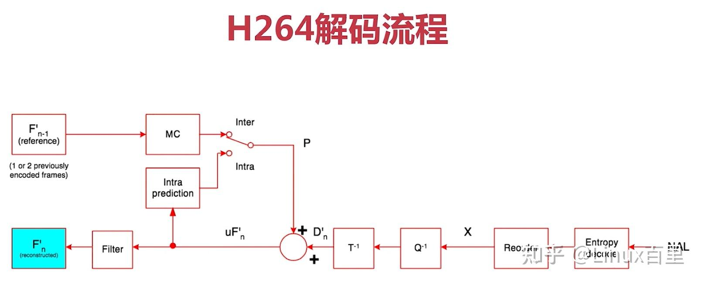

# 【转载】音视频开发学习：H.264/AVC视频编解码技术

##  **一、基本概念** 

### 1、GOP

GOP即Group of picture，是一组连续的图像，由一个I帧和多个B/P帧组成，是编解码器存取的基本单位。GOP结构常用的两个参数M和N，M指定GOP中首个P帧和I帧之间的距离，N指定一个GOP的大小。

GOP中的一组帧是强相关的一组帧，即帧与帧之间的差别较小。

 **闭合式GOP** ：闭合式GOP只需要参考本GOP内的图像即可，不需参考前后GOP的数据。这种模式决定了，闭合式GOP的显示顺序总是以I帧开始以P帧结束

 **开放式GOP**  ：开放式GOP中的B帧解码时可能要用到其前一个GOP或后一个GOP的某些帧。**码流里面包含B帧的时候才会出现开放式GOP。**

开放式GOP和闭合式GOP中I帧、P帧、B帧的依赖关系如下图所示：

## 2、I/B/P帧

* I帧（Intra Frame）：关键帧，采用帧内压缩技术，IDR帧是GOP中的第一帧，属于I帧
* P帧（forward predicted frame）：前向参考帧，压缩时，只参考前面已处理的帧，采用帧间压缩技术，占I帧的一半大小
* B帧（bidirectionally predicted frame）：双向参考帧，压缩时，既参考前面已处理的帧，也参考后面的帧，帧间压缩技术，只占I帧的1/4大小

IDR帧（Instantaneous Decode Refresh）解码器立即刷新帧，特点：

1. 每当遇到IDR帧时，解码器就会清空解码器参考buffer中的内容；
1. 每个GOP中的第一帧是IDR帧
1. IDR帧是一种特殊的I帧

如图所示，GOP中的第一个帧是IDR帧，P帧通常仅参考相邻的前一个I帧或者P帧，B帧可以参考相邻的前一个I/P帧和后一个I/P帧，而B帧与B帧之间是无参考关系的。

## 3、SPS与PPS

* SPS（Sequence Parameters Set）：序列参数集，作用于一连串的视频图像（GOP），如seq_parameters_set_id、帧数以及POC（Picture Order Count）的约束、参考帧数目、解码图像尺寸和帧场编码模式选择标识等
* PPS（Picture Parameters Set）：图像参数集，作用于视频序列中的图像，picture_parameters_set_id、熵编码模式选择标识、片组数目、初始量化参数和去方块滤波系数调整标识等

参数集是一个独立的数据单位，不依赖于参数集外的其他句法元素。一个参数集不对应某一个特定的图像或序列，同一序列参数集可以被多个图像参数集引用，同理，同一个图像参数集也可以被多个图像引用。只在编码器认为需要更新参数集的内容时，才会发出新的参数集。

## 二、H.264压缩技术

* 帧内压缩技术：消除空域数据冗余
* 帧间压缩技术：消除时域数据冗余
* 整数离散余弦变换(DCT)：将时域上的相关性转换为频域上的无关数据并进行量化
* CABAC压缩

## 1、图像划分

H.264/AVC 编码的基本单位是 **宏块** (Macro Block)，所以图像的预测首先是从划分开始的。如下图：

### （1）slice

H.264/AVC 把一张图像划分成粒度更细的一个或者若干个分片(slice)。一个 slice 是由一个宏块序列组成。每一个 slice 是自包含的。如果没有用 FMO 的情况一下，图像是按照光栅扫描的顺序划分 slice 的。如果用了 FMO，图像是被分成若干个 slice group，每个slice group 包含若干个 slice。（大多数情况下一张图像分为一个slice）

根据 slice 的编码类型的不同，分如下几种 slice：

* I slice ：分片内的所有宏块通过帧内预测编码。I slice 内只有 I 宏块。
* P slice ：分片内宏块可以用帧内预测编码，也可以用帧间预测编码，但是每个预测块最多有一个运动补偿信号。P slice 可以包含 I 宏块、P 宏块。
* B slice ：除了 P 片的编码类型可以用外，使用帧间预测编码的宏块，每一个预测块可以有两个运动补偿信号。B slice 可以包含 I 宏块、P 宏块、B 宏块。
* SP slice ：切换 P 片。
* SI slice ：切换 I 片。

### （2）宏块

* 宏块是H.264进行视频压缩的基本单元
* 无论是帧间压缩还是帧内压缩技术，都以宏块为基本单位
* H.264默认使用16x16大小的区域作为一个宏块，也可以划分为8x8大小

H.264对比较平坦的图像使用 16X16 大小的宏块。但为了更高的压缩率，还可以在 16X16 的宏块上更划分出更小的子块。子块的大小可以是 8X16､ 16X8､ 8X8､ 4X8､ 8X4､ 4X4非常的灵活。

宏块有 I 宏块、B 宏块、P 宏块之分。

* I 宏块通过同一帧内的相邻的已编码样本进行帧内预测。
* P 宏块是参考一个已经编码的宏块分区进行预测。
* B 宏块是参考一个或两个已经编码的宏块分区进行预测。

## 2、帧内压缩技术

帧内预测是根据帧内已经编码的样本，为当前的样本计算出一个预测值，用当前样本值减去预测值得到一个残差值，目的就是为了减少传输的数据量。

H.264/AVC 把图像分成粒度更小的 slice。为此，I 宏块预测只参考同一个 slice 内已经编码的样本。宏块内的相邻样本之间也有很高的关联度。宏块内预测可以进一步可以划分成更小的预测块。

对于亮度样本来说，每一宏块可以分成 4 x 4 像素和 16 x 16 像素两种类型的预测块。前者有 9 种预测模式，后者有 4 种预测模式。前者适合预测图像细节较多的区域，后者适合预测图像较为平滑的区域。帧内预测的时候要参考左边、上边已经编码的样本。帧内预测不会跨越 slice 的，为了保证 slice 的自包含。对于色度样本来说，每一个宏块有 8 x 8 像素的色度预测块。

对于4x4的亮度样本，有9种预测模式，如下所示：

其中A-M是已经编码的亮度样本值。

对于16x16的亮度预测块来说，存在四种预测模式，前三种和 4 x 4 模式一样，只有 mode 3 是自己特有，如下：

* 0 （vertical）
* 1 （horizontal）
* 2 （DC）
* 3 （Plane）

对于8x8的色度预测块来说，也分为4种模式，类似16x16的亮度预测块。

## 3、帧间压缩技术

帧间预测是根据先前已编码和传输的图片（参考图片）预测亮度和色度样本块的过程。把之前已经编码或者传输的被参考图像叫做 **参考帧** 。帧间压缩是在同一个GOP中的帧之间进行的。包含如下技术：

* 运动估计（宏块匹配+运动矢量）
* 运动补偿（解码）

视频花屏原因：若GOP中有帧丢失，会造成解码端的图像发生错误，会出现马赛克（花屏）

视频卡顿原因：为了避免花屏的产生，当发现有帧丢失时，就丢弃GOP内所有帧，直到下一个IDR帧重新刷新图像。I帧是按照帧周期来的，如果在下一个I帧来之前不显示后来的图像， 那么视频就静止不动了，这就造成视频的卡顿现象。

## 4、无损压缩

DCT变换

CABAC

## 5、编解码流程

## 三、H.264码流结构

### 1、NAL和VCL

NAL层（Network Abstraction Layer）：网络抽象层，主要用于网络传输。按照一定格式，对视频编码层输出的数据进行打包和封装，并提供包头（header）等信息，以在不同速率的网络上传输或进行存储

VCL层（Video Coding Layer）：视频编码层，主要用于数据编码

### 2、码流基本概念

* SODB（String Of Data Bits）原始数据比特流（二进制数据串），由VCL层产生，长度不一定是8的倍数，故需要补齐
* RBSP（Raw Byte Sequence Payload）：SODB + trailing bits，即如果SODB最后一个字节不对齐，则补1和多个0
* NALU：NAL Header（1B）+ RBSP

slice（切片）和MacroBlock（宏块）：

### 3、码流分层

Annexb格式：在文件中保存，在NAL单元前加上起始码

RTP格式：用于网络传输

## 四、SPS/PPS/Slice Header

### 1、SPS

H.264 Profile：对视频压缩特性的描述，Profile越高，就说明采用了越高级的压缩特性

Profile分为Main Profile和BaseLine Profile两种，这两种都是以Constrained Baseline为基础，Main Profile又可以延伸为以下几种：

H.264 Level：对视频的描述，Level越高，视频的码率、分辨率、fps越高

 分辨率：

帧相关：

* 帧数log2_max_frame_num_minus4 （GOP的最大帧数）
* 参考帧数：max_num_ref_frames （缓存区大小）
* 显示帧序号：pic_order_cnt_type （显示顺序）
* 帧率计算

## 2、PPS

## 3、Slice Header

* 帧类型（I/P/B帧）
* GOP中解码帧序号
* 预测权重
* 滤波 

>

>

> **FFmpeg/WebRTC/RTMP/NDK/Android音视频流媒体高级开发 系统性视频学习** 
> **面试题、学习资料、教学视频和学习路线图** 
> **有需要的可以自行添加学习交流群** 

