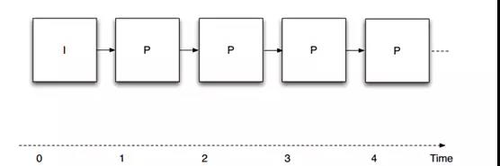
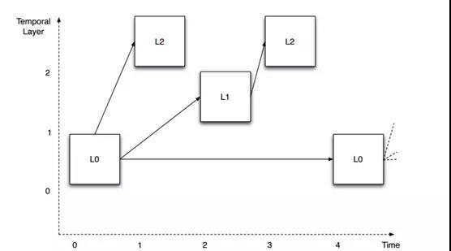
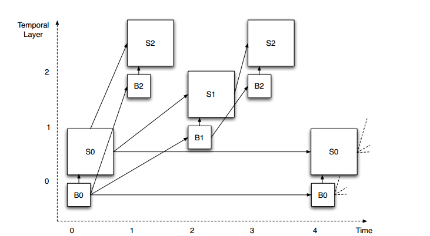
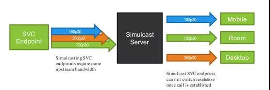

# 【纯转载】SVC和视频通信

>可以说，可伸缩视频编码技术（SVC）在视频会议行业和视频通信中有着重要的影响。在2008年，当Vidyo公司首次推出SVC时，很少人意识到它背后所蕴含的变革力量。大多数人都认为它仅仅只是一个更好的编解码器，甚至还有可能存在一些有待完善的错误。

与任何新技术一样，刚开始时，我们都很难完全理解SVC的工作原理，相关系统及功能的实现机制，甚至是它对整个行业的影响。本文旨在提供一些有关SVC的事实和使用感受，介绍如何基于SVC实现各种功能，同时分析一下目前可伸缩视频编码在视频通信领域的定位以及未来的前景所在。

## 什么是SVC？

首先，什么是SVC？ 它是H.264 / MPEG-4 Part 10高级视频编码标准的扩展，通常称为AVC。AVC是由国际电信联盟（ITU）的视频编码专家组（VCEG）和国际标准化组织（ISO）的运动图像专家组（MPEG）共同开发的，合称联合视频组（JVT）。因此，AVC有两个正式名称：国际电信联盟（ITU）命名的H.264和国际标准化组织（ISO）命名的MPEG-4 Part 10。通常，通信领域的人倾向于将AVC称为H.264，而广播影音娱乐领域的人则倾向于将其称为AVC或MPEG-4。毫无疑问AVC一直是非常成功，它几乎适用于所有现代数字视频应用标准：从视频会议和YouTube，到蓝光DVD和iTunes商店。

SVC是AVC标准的附录G。有人却用AVC这个词来表示H.264标准和附录G，这令人费解。在本文中，我们使用AVC来描述H.264的不可伸缩部分，而用SVC来描述可伸缩部分，当不加区分时则使用H.264进行描述。

当Vidyo公司加入JVT时（2005年夏季），它是唯一对可伸缩视频编码感兴趣的视频会议公司。事实上，SVC的成果要得益于当时对广播和移动应用感兴趣的公司以及学者不留余力的推动。Vidyo公司的工程师们非常积极地参与到联合组的开发中，提供了约18项技术贡献，创建并提供测试视频材料，构建了大部分合适的比特流，以及共同编辑了一致性规范，这些都确保了我们的设计符合视频会议行业的需求。

H.264规范提供了一种方法，允许根据特定的应用领域搭配不同的使用规范，事实上，绝大多数视频编码标准都会有基本的使用规范，并且提供可修改的方法，我们称之为配置文件。配置文件可以说是标准规范所提供的编码工具的子集，主要适用于特定的应用领域。例如，增加端到端延迟的功能对于广播视频而言是可接受的，但对于视频会议而言则是不可接受的，因此在面向视频会议的配置文件中则不包括这个功能。H.264的可伸缩特性体现在其配置文件的参数设置中：Scalable Baseline、Scalable High、Scalable Constrained Baseline、Scalable Constrained High和Scalable High Intra。尽管，在高清分辨率运行的软件配置文件中一般包含Scalable High参数，但是针对视频会议（移动设备）应用的配置文件，一般只包含Scalable Baseline和Scalable Constrained Baseline这两个参数。

与配置文件相关的是一个名为层级的概念。层级定义了特定配置文件中各种操作参数的限制。例如，它定义了特定解码器所能够处理的最大图片的大小。配置文件和级别是一个相当古老的概念：您的普通旧式DVD播放器中，播放MPEG-2格式的视频的主要配置文件是在主级解码器上。您的蓝光播放器所包含的H.264 AVC的高配置解码器则是在4.1级。

## AVC和SVC有什么区别？

SVC和AVC的根本区别在于，前者将视频信号编码为一组图层。各层互相依赖，形成一个层次结构。特定层及其所依赖的层提供了以特定的保真度解码视频信号时所必需的信息。这里的保真度涉及一个或多个空间分辨率，时间分辨率或信噪比(SNR)1。不依赖于任何其他层的最底层被称为基本层，并提供最低质量等级的图像。每个附加层可以通过三个维度（空间，时间或SNR）中任何一个维度提高信号质量。

图1表示以不可缩放的方式进行视频编码。这就是大多数（如果不是全部的话）AVC兼容视频编码器的工作原理。图中每个正方形表示一张图片，而底部的数字表示时间实例。第一张图片为“I”帧，可独立编码，无需参考其他任何图片（“I”取自单词“intra”的首字母）。其他所有的图片为“P”帧，需要参考前面的帧画面进行预测然后编码。箭头表示预测的源图片以及目标图片。通过观察可知，只需一层，则可形成一个无止境的图片链。

图1：非缩放性视频编码

*SNR(信噪比)是压缩视频信号相对于其未压缩版本的失真度量。在信噪比的可伸缩性中，增强层所提供的额外信息既不改变空间分辨率，也不改变时间分辨率。它减少了压缩视频的信号失真，同时增加了信噪比。*

图2表示在时间维度上的可伸缩性视频编码。观察预测箭头的组织方式，在这个例子中，定义了三个不同的层（L0到L2）。图中的图片是垂直偏移的，以便在视觉上分离三层。每一层都需要依赖较低层才能被解码，但不需要任何较高层。这允许从顶层开始移除图片，而不影响剩余图片的可解码性。例如，我们假设图例中显示的图层以30 fps的帧速率显示。如果我们移除所有L2层的图片，剩下层（L0和L1）仍然可以成功解码，并且产生一个15fps的视频。如果我们进一步删除所有的L1图像，那么剩下的L0层依然可以被解码并产生一个7.5fps的视频。

图2：时间可伸缩性

如图3所示，我们可以通过扩展时间可伸缩性结构同时实现空间可伸缩性编码。每个图片现在有两部分：基础层分辨率图片的B部分和空间增强层的S部分，这两个部分结合则可生成全分辨率图像。空间增强层一般为水平和垂直方向上基底分辨率的1.5倍或者2倍。这为不同分辨率的视频在进行空间可缩放性编码时提供了便利，例如VGA和QVGA（比率为2）以及1080p和720p（比率为1.5），都可以进行空间可伸缩性编码。空间可伸缩性可以与时间可伸缩性（和SNR）以完全独立的方式相结合。假设在图示例子的全速率和分辨率分别为30fps下的HD高清分辨率（720p），那么我们可以在分辨率（HD、1/4HD）和帧速率（30fps、15fps、7.5 fps）之间进行任意组合。

图3：空间和时间的可伸缩性

值得注意的是，这不是唯一的可伸缩性结构——在构建空间和时间预测结构方面，该标准具有较大的灵活性。

SVC的一个非常重要的方面是基本层符合AVC的设计。换句话说，SVC信号的基本层可通过AVC解码器进行解码。这确保SVC信号与AVC向后兼容，尽管在涉及到一个以上的层时，其保真度会低于全信号。但注意，SVC编码器不需要一直生成分层比特流 - 如果在不需要和不必要进行可伸缩性编码的环境下运行时，则可以生成传统的AVC流。

## 为什么使用SVC？

SVC提供了一种适应性较强的视频信号表示方式。换句话说，无需对信号进行解码、处理和重新编码，也可以实现自适应。如果我们想要改变图像分辨率或时间帧速率，那么我们唯一需要做的就是从图1中的图表中移除适当的块。如果将这些块视为通过网络传输的数据包，这就相当于从传输的比特流中移除相应的网络数据包。这一点意义非常重大：它为基于多点控制单元（MCU）的传统视频会议系统架构提供了新的设计思路。

MCU是一个复杂的设备，它接收多个视频编码信号，解码后合成到一个新的图像上，重新编码后，再将编码信号发送给预定接收者。显然，从计算的角度来看，这是一个非常复杂的操作。此外，在系统运行中还引起了相当大的延迟，通常为150-200毫秒。为了更好的比较，我们给出一个数据：国际电联规定长途电话的端到端延迟的上限为180毫秒。超过180毫秒后，延迟会令正在通信的各方用户产生较差的体验感受。显然，与MCU进行交互式多点通信是非常困难的。由于采用了级联编码，会导致了质量的损失。值得注意的是，这些问题是架构中固有的，无论投入多少资源都不会消失。例如，提高MCU内部DSP处理器的速度也只能稍微减少延迟。

## AVC不如SVC有效吗？

SVC的高效有一定的代价。如果SVC和AVC编码器产生的相似质量的比特流，那么SVC将比AVC需要大约10-15％的比特位（这取决于编码器的成熟性）。认识到这种“开销”对我们来说非常重要。尽管有额外的开销，但是我们将获得端到端的低延迟和稳健的容错性 - 仅AVC就无法实现这一点。事实上，如果我们考虑丢包造成的质量损失，我们很快会发现，因为AVC编码的质量下降得很快，所以它的效率是远低于SVC。额外的开销带来的回报是，我们的服务器可以轻松扩展至100位用户，以及所有高端视频会议系统功能，如个性化布局和速率匹配。

只关注压缩效率是一个非常狭隘的观点，因为它忽略了完整系统中真正发生的情况。通过共同考虑压缩效率和网络传输，人们可以设计解决方案平衡这两个方面的消耗，解决系统级问题。

牢记SVC是AVC的扩展也很重要。这意味着，当条件允许时，换句话说，当网络具有极高的可靠性时，所有端点都具有类似于网络的访问速度，同时所有端点都具有类似的编码和解码能力时，SVC系统就可以恢复使用普通AVC。然而，当考察企业的全体用户时，我们很少能够访问这样一个非常可靠的网络，而且实际上我们也从未有过相同的接入网络或端点。

就像普通汽车和四轮驱动汽车一样，虽然四轮驱动汽车确实会燃烧更多的燃料，但是谁愿意在结冰的面上冒险行驶普通汽车呢？ 另外，您可以在不需要时关闭它。实际情况是，在全球互联网中，数据包走的“道路”总是“结冰”和危险的。

## 可伸缩性和下一代的编解码器

作为视频编码标准的SVC已于2007年11月完成定稿并出版。在上文中提到，Vidyo公司在标准化过程中非常活跃，并领导了视频会议应用领域的工作。我们还共同开发了用于SVC的RFC 6190的RTP有效载荷格式。

由于SVC在实时应用方面的优越性，在H.264之后的所有编解码器，将全面支持可伸缩性。H.265或高效视频编码（HEVC）在版本1（2013）中包含时间可伸缩性，在Vidyo公司提供的版本2（2014）中包含了空间可伸缩性。VP8和VP9格式在发布之初就具有时间可伸缩性，而通过Vidyo公司和Google之间的联合开发，VP9实现了空间可伸缩性。Vidyo公司为所有这些编解码器的RTP有效载荷格式的定义做出了贡献。

由于大家对SVC有着极大的兴趣，促进了行业组织进一步细化核心规范以确保能够协同工作。国际多媒体电信联盟（IMTC）已经发布了两个规范，一个用于H.264而另一个用于H.265，详细说明了适用于统一通信应用的可伸缩性编码器的配置。同时，确保不同供应商产品能够高效进行协同工作的认证程序仍在开发当中。该工作由Vidyo，Polycom和Avaya共同领导的可伸缩性和联播视频活动小组（SSV AG）负责。

## 可伸缩性、联播和SFUs

对于单一视频信号，同时提供多个不同表示的简单方法就是产生多个编码。与可伸缩编码相反，这不需要任何新的编码工具：您只需以不同的分辨率来多次运行编码器即可。这将产生多个独立的比特流，并且比可伸缩编码占用更多比特位（通常比单个高分辨率流高50％）。由于两个流之间缺乏依赖关系导致了较差的健壮性。这种方案被称为“联播”（源自“同时广播”），并且可以被认为是可伸缩性编码的一个个别案例。

隐藏在联播背后的是，您可以使用一个与VidyoRouter类似的服务器而不是可伸缩编码：终端将高分辨率和低分辨率的流一同传输到服务器端，然后再由服务器选择将流传输到不同的接收端。联播将其开销放置在糟糕的节点上：从传输端点到服务器的上行网络。这往往是最成问题的，例如，ADSL线路。联播技术的一个优点是最高分辨率比特流可以由传统（非伸缩性）解码器进行解码。因此，对于那些部署了大量无法升级的硬件解码器的公司来说，这更具有吸引力的。

在2008年VidyoRouter推出时，其操作原理非常新颖。事实上，和VidyoRouter同时发布的“RTP拓扑结构”RFC（RFC 5117）提供了一个可以用RTP实现的各种实时通信架构的调查，但没有预见到它。2013年10月，我创造了“选择性转发单元”（SFU）来描述选择性转发服务器的操作，不管它是否用于可伸缩视频或联播。在2015年11月发布的RFC 5117修订版（RFC 7667）中，该术语已被采纳，现在详细描述其操作。

目前两个用于实时视频通信的最大公共部署系统，谷歌Hangouts和微软的Skype和商业版Skype，都使用了可伸缩编码与联播。

## 可伸缩性、联播和WebRTC

作为基于浏览器和移动终端的首选架构，在业内WebRTC已经获得良好的发展势头。随着用户和供应商深入了解WebRTC，很显然，SFU型服务器体系结构已经成为高质量多点视频的必选。事实上，由于WebRTC设计时确实是多流的，即端点接收多个视频和音频流而不是单个视频流，这一点与SFU的设计完美匹配。因此，联播已被纳入WebRTC 1.0规范的范围，而可伸缩性将成为WebRTC-NV（“下一个版本”）的一部分。在ORTC中已经支持可伸缩性，该API最初被并入微软的Edge浏览器，现在已经被并入WebRTC 1.0的主要规范中。就编解码器配置而言，现在WebRTC API本身几乎不支持，但我们预计会有所改变，以后可能会允许使用SFUs。

## 为什么SVC会成功?

任何新技术都必须在市场上竞争，赢得用户的心。我认为，SVC和VidyoRouter / SFU获得成功的原因有两个。首先，它们首次将视频会议系统的复杂性降低到与其他网络应用相同的水平。这对于将视频会议能够扩展成为个人应用程序非常重要。其次，即使在公共互联网上运行时，用户的体验质量也达到了非常出色的水平 - 技术变得透明。今天的用户将不会容忍任何事情。这两项功能使视频会议最终真正实现在任何时间、任何地点、任何设备上使用。事实上，如果旧的技术，也就是MCU足够好的话，我们就不会看到视频会议只是一个小众应用。如今SVC的巧设计，高质量和易用性以及更丰富的部署选项（例如通过API和云）使更多的应用程序能够集成视频，使得更多用户能够享受这种美妙的通信工具。
