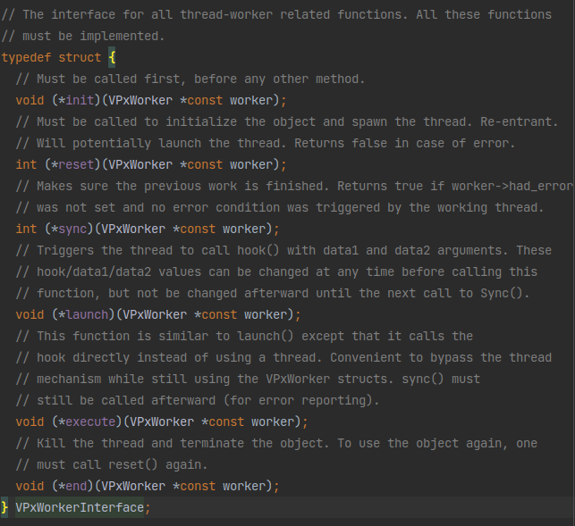
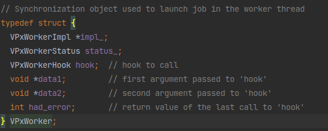
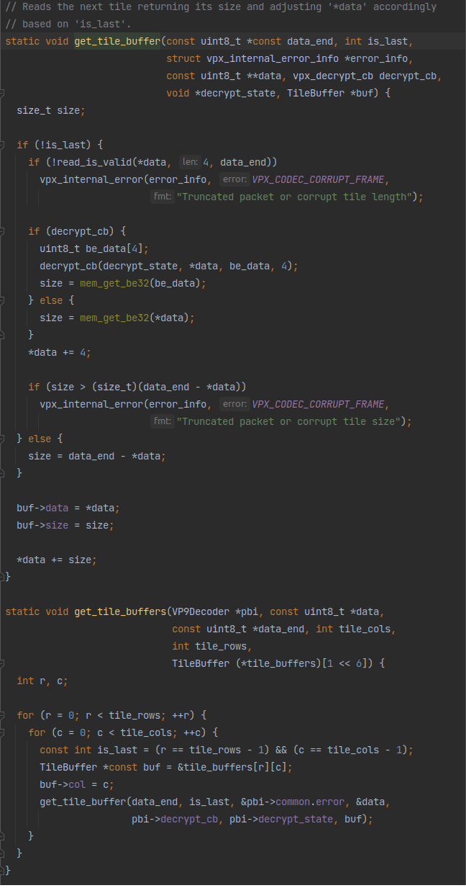

# libvpx中的`decode_tiles`

libvpx中的`decode_tiles`有三种：多线程单行解码的`decode_tiles_row_wise_mt`、多线程多行解码的`decode_tiles_mt`、单线程解码的`decode_tiles`。

## `decode_tiles_mt`

先来看多线程多行解码的`decode_tiles_mt`

```c
static const uint8_t *decode_tiles_mt(VP9Decoder *pbi, const uint8_t *data,
                                      const uint8_t *data_end) {
```
函数开始。

```c
  VP9_COMMON *const cm = &pbi->common;
  const VPxWorkerInterface *const winterface = vpx_get_worker_interface();
```
首先是获取到`VP9_COMMON`和一个`VPxWorkerInterface`。这个`VP9_COMMON`已经见过很多了，这个`VPxWorkerInterface`长这样：



从注释看就是一个`VPxWorker`的执行器，用于在线程中执行`VPxWorker`中的操作。从注释上看主要操作是`launch`和`execute`里面在调用`VPxWorker`里面的`hook`函数。这个`VPxWorker`也很简单：



所以这个`hook`函数应该就是多线程中每个操作所执行的地方了。后面应该会有对这一项赋值并且调用`VPxWorkerInterface`的`launch`或者`execute`的地方。

```c
  const uint8_t *bit_reader_end = NULL;
```
后面要用的的不知道什么变量。

```c
  VP9LfSync *lf_row_sync = &pbi->lf_row_sync;
```
点进去看看，“lf”是环路滤波的英文缩写，这个变量是多线程环路滤波相关的变量。

```c
  YV12_BUFFER_CONFIG *const new_fb = get_frame_new_buffer(cm);
  const int tile_cols = 1 << cm->log2_tile_cols;
  const int tile_rows = 1 << cm->log2_tile_rows;
```
这几个操作在[《libvpx解码过程解读》](./libvpx-decode.md)里面已经见过了，不必多讲。

```c
  const int num_workers = VPXMIN(pbi->max_threads, tile_cols);
```
这里设置了一下worker数量。这个`VPXMIN`点进去看其实是一个比大小的宏，所以这里是取最大线程数`max_threads`和分块行的数量`tile_cols`中的最小值作为线程数？这意思应该是多线程并行只是在同一行中的每一列之间并行，而行与行之间是串行的。

```c
  int n;

  assert(tile_cols <= (1 << 6));
  assert(tile_rows == 1);
  (void)tile_rows;
```
一些判断。怎么有`assert(tile_rows == 1)`？这不是多行多线程吗

```c
  init_mt(pbi);
```
初始化多线程。

```c
  // Reset tile decoding hook
  for (n = 0; n < num_workers; ++n) {
    VPxWorker *const worker = &pbi->tile_workers[n];
    TileWorkerData *const tile_data =
        &pbi->tile_worker_data[n + pbi->total_tiles];
    winterface->sync(worker);

    if (pbi->lpf_mt_opt && cm->lf.filter_level && !cm->skip_loop_filter) {
      tile_data->lf_sync = lf_row_sync;
      tile_data->lf_data = &tile_data->lf_sync->lfdata[n];
      vp9_loop_filter_data_reset(tile_data->lf_data, new_fb, cm, pbi->mb.plane);
      tile_data->lf_data->y_only = 0;
    }

    tile_data->xd = pbi->mb;
    tile_data->xd.counts =
        cm->frame_parallel_decoding_mode ? NULL : &tile_data->counts;
    worker->hook = tile_worker_hook;
    worker->data1 = tile_data;
    worker->data2 = pbi;
  }
```
终于看见前面说的给`hook`赋值的地方了！这里是一个循环给每个`pbi->tile_workers`中的每个worker和`pbi->row_mt_worker_data->thread_data`中的每个worker要用的数据赋值。所以很明显这个`tile_worker_hook`就是多线程解码tile1的核心函数。

```c
  // Load tile data into tile_buffers
  get_tile_buffers(pbi, data, data_end, tile_cols, tile_rows,
                   &pbi->tile_buffers);
```
一个`get_tile_buffers`把`data`里的tile数据加载到`pbi->tile_buffers`里：



笑了😂，就是一行一行一列一列的拷贝。

```c
  // Sort the buffers based on size in descending order.
  qsort(pbi->tile_buffers, tile_cols, sizeof(pbi->tile_buffers[0]),
        compare_tile_buffers);
```
排了个序？可能是排序了多线程可以算的更快？

```c
  if (num_workers == tile_cols) {
    // Rearrange the tile buffers such that the largest, and
    // presumably the most difficult, tile will be decoded in the main thread.
    // This should help minimize the number of instances where the main thread
    // is waiting for a worker to complete.
    const TileBuffer largest = pbi->tile_buffers[0];
    memmove(pbi->tile_buffers, pbi->tile_buffers + 1,
            (tile_cols - 1) * sizeof(pbi->tile_buffers[0]));
    pbi->tile_buffers[tile_cols - 1] = largest;
  } else {
    int start = 0, end = tile_cols - 2;
    TileBuffer tmp;

    // Interleave the tiles to distribute the load between threads, assuming a
    // larger tile implies it is more difficult to decode.
    while (start < end) {
      tmp = pbi->tile_buffers[start];
      pbi->tile_buffers[start] = pbi->tile_buffers[end];
      pbi->tile_buffers[end] = tmp;
      start += 2;
      end -= 2;
    }
  }
```
这应该是把块的任务分给每个线程吧。上面的`num_workers == tile_cols`的情况可以一个线程一个任务，不这样就得有一个线程运行多个任务（前面的排序应该也是为了这个？大任务尽量和小任务一起交给一个线程，尽可能保证处理时间均衡，效率最高）。

```c
  // Initialize thread frame counts.
  if (!cm->frame_parallel_decoding_mode) {
    for (n = 0; n < num_workers; ++n) {
      TileWorkerData *const tile_data =
          (TileWorkerData *)pbi->tile_workers[n].data1;
      vp9_zero(tile_data->counts);
    }
  }
```
初始化线程帧计数？

```c
  {
    const int base = tile_cols / num_workers;
    const int remain = tile_cols % num_workers;
    int buf_start = 0;

    for (n = 0; n < num_workers; ++n) {
      const int count = base + (remain + n) / num_workers;
      VPxWorker *const worker = &pbi->tile_workers[n];
      TileWorkerData *const tile_data = (TileWorkerData *)worker->data1;

      tile_data->buf_start = buf_start;
      tile_data->buf_end = buf_start + count - 1;
      tile_data->data_end = data_end;
      buf_start += count;

      worker->had_error = 0;
      if (n == num_workers - 1) {
        assert(tile_data->buf_end == tile_cols - 1);
        winterface->execute(worker);
      } else {
        winterface->launch(worker);
      }
    }

    for (; n > 0; --n) {
      VPxWorker *const worker = &pbi->tile_workers[n - 1];
      TileWorkerData *const tile_data = (TileWorkerData *)worker->data1;
      // TODO(jzern): The tile may have specific error data associated with
      // its vpx_internal_error_info which could be propagated to the main info
      // in cm. Additionally once the threads have been synced and an error is
      // detected, there's no point in continuing to decode tiles.
      pbi->mb.corrupted |= !winterface->sync(worker);
      if (!bit_reader_end) bit_reader_end = tile_data->data_end;
    }
  }
```
开始执行了！其实就是for循环用`winterface->execute`异步启动每一个worker，最后一个worker用`winterface->launch`同步启动；执行完毕后再用for循环执行`winterface->sync`等待所有worker完成，并且最后还用`pbi->mb.corrupted`和`bit_reader_end`记下了返回值。

很好理解。

```c
  // Accumulate thread frame counts.
  if (!cm->frame_parallel_decoding_mode) {
    for (n = 0; n < num_workers; ++n) {
      TileWorkerData *const tile_data =
          (TileWorkerData *)pbi->tile_workers[n].data1;
      vp9_accumulate_frame_counts(&cm->counts, &tile_data->counts, 1);
    }
  }
```
增长线程帧计数？

```c
  assert(bit_reader_end || pbi->mb.corrupted);
  return bit_reader_end;
}
```
最后判断一下前面记下的返回值`pbi->mb.corrupted`和`bit_reader_end`是否正常，然后退出。

## `decode_tiles`

再来看单线程解码的`decode_tiles`

```c
static const uint8_t *decode_tiles(VP9Decoder *pbi, const uint8_t *data,
                                   const uint8_t *data_end) {
  VP9_COMMON *const cm = &pbi->common;
  const VPxWorkerInterface *const winterface = vpx_get_worker_interface();
  const int aligned_cols = mi_cols_aligned_to_sb(cm->mi_cols);
  const int tile_cols = 1 << cm->log2_tile_cols;
  const int tile_rows = 1 << cm->log2_tile_rows;
  TileBuffer tile_buffers[4][1 << 6];
  int tile_row, tile_col;
  int mi_row, mi_col;
  TileWorkerData *tile_data = NULL;

  if (cm->lf.filter_level && !cm->skip_loop_filter &&
      pbi->lf_worker.data1 == NULL) {
    CHECK_MEM_ERROR(cm, pbi->lf_worker.data1,
                    vpx_memalign(32, sizeof(LFWorkerData)));
    pbi->lf_worker.hook = vp9_loop_filter_worker;
    if (pbi->max_threads > 1 && !winterface->reset(&pbi->lf_worker)) {
      vpx_internal_error(&cm->error, VPX_CODEC_ERROR,
                         "Loop filter thread creation failed");
    }
  }

  if (cm->lf.filter_level && !cm->skip_loop_filter) {
    LFWorkerData *const lf_data = (LFWorkerData *)pbi->lf_worker.data1;
    // Be sure to sync as we might be resuming after a failed frame decode.
    winterface->sync(&pbi->lf_worker);
    vp9_loop_filter_data_reset(lf_data, get_frame_new_buffer(cm), cm,
                               pbi->mb.plane);
  }

  assert(tile_rows <= 4);
  assert(tile_cols <= (1 << 6));

  // Note: this memset assumes above_context[0], [1] and [2]
  // are allocated as part of the same buffer.
  memset(cm->above_context, 0,
         sizeof(*cm->above_context) * MAX_MB_PLANE * 2 * aligned_cols);

  memset(cm->above_seg_context, 0,
         sizeof(*cm->above_seg_context) * aligned_cols);

  vp9_reset_lfm(cm);

  get_tile_buffers(pbi, data, data_end, tile_cols, tile_rows, tile_buffers);

  // Load all tile information into tile_data.
  for (tile_row = 0; tile_row < tile_rows; ++tile_row) {
    for (tile_col = 0; tile_col < tile_cols; ++tile_col) {
      const TileBuffer *const buf = &tile_buffers[tile_row][tile_col];
      tile_data = pbi->tile_worker_data + tile_cols * tile_row + tile_col;
      tile_data->xd = pbi->mb;
      tile_data->xd.corrupted = 0;
      tile_data->xd.counts =
          cm->frame_parallel_decoding_mode ? NULL : &cm->counts;
      vp9_zero(tile_data->dqcoeff);
      vp9_tile_init(&tile_data->xd.tile, cm, tile_row, tile_col);
      setup_token_decoder(buf->data, data_end, buf->size, &cm->error,
                          &tile_data->bit_reader, pbi->decrypt_cb,
                          pbi->decrypt_state);
      vp9_init_macroblockd(cm, &tile_data->xd, tile_data->dqcoeff);
    }
  }

  for (tile_row = 0; tile_row < tile_rows; ++tile_row) {
    TileInfo tile;
    vp9_tile_set_row(&tile, cm, tile_row);
    for (mi_row = tile.mi_row_start; mi_row < tile.mi_row_end;
         mi_row += MI_BLOCK_SIZE) {
      for (tile_col = 0; tile_col < tile_cols; ++tile_col) {
        const int col =
            pbi->inv_tile_order ? tile_cols - tile_col - 1 : tile_col;
        tile_data = pbi->tile_worker_data + tile_cols * tile_row + col;
        vp9_tile_set_col(&tile, cm, col);
        vp9_zero(tile_data->xd.left_context);
        vp9_zero(tile_data->xd.left_seg_context);
        for (mi_col = tile.mi_col_start; mi_col < tile.mi_col_end;
             mi_col += MI_BLOCK_SIZE) {
          if (pbi->row_mt == 1) {
            int plane;
            RowMTWorkerData *const row_mt_worker_data = pbi->row_mt_worker_data;
            for (plane = 0; plane < MAX_MB_PLANE; ++plane) {
              tile_data->xd.plane[plane].eob = row_mt_worker_data->eob[plane];
              tile_data->xd.plane[plane].dqcoeff =
                  row_mt_worker_data->dqcoeff[plane];
            }
            tile_data->xd.partition = row_mt_worker_data->partition;
            process_partition(tile_data, pbi, mi_row, mi_col, BLOCK_64X64, 4,
                              PARSE, parse_block);

            for (plane = 0; plane < MAX_MB_PLANE; ++plane) {
              tile_data->xd.plane[plane].eob = row_mt_worker_data->eob[plane];
              tile_data->xd.plane[plane].dqcoeff =
                  row_mt_worker_data->dqcoeff[plane];
            }
            tile_data->xd.partition = row_mt_worker_data->partition;
            process_partition(tile_data, pbi, mi_row, mi_col, BLOCK_64X64, 4,
                              RECON, recon_block);
          } else {
            decode_partition(tile_data, pbi, mi_row, mi_col, BLOCK_64X64, 4);
          }
        }
        pbi->mb.corrupted |= tile_data->xd.corrupted;
        if (pbi->mb.corrupted)
          vpx_internal_error(&cm->error, VPX_CODEC_CORRUPT_FRAME,
                             "Failed to decode tile data");
      }
      // Loopfilter one row.
      if (cm->lf.filter_level && !cm->skip_loop_filter) {
        const int lf_start = mi_row - MI_BLOCK_SIZE;
        LFWorkerData *const lf_data = (LFWorkerData *)pbi->lf_worker.data1;

        // delay the loopfilter by 1 macroblock row.
        if (lf_start < 0) continue;

        // decoding has completed: finish up the loop filter in this thread.
        if (mi_row + MI_BLOCK_SIZE >= cm->mi_rows) continue;

        winterface->sync(&pbi->lf_worker);
        lf_data->start = lf_start;
        lf_data->stop = mi_row;
        if (pbi->max_threads > 1) {
          winterface->launch(&pbi->lf_worker);
        } else {
          winterface->execute(&pbi->lf_worker);
        }
      }
    }
  }

  // Loopfilter remaining rows in the frame.
  if (cm->lf.filter_level && !cm->skip_loop_filter) {
    LFWorkerData *const lf_data = (LFWorkerData *)pbi->lf_worker.data1;
    winterface->sync(&pbi->lf_worker);
    lf_data->start = lf_data->stop;
    lf_data->stop = cm->mi_rows;
    winterface->execute(&pbi->lf_worker);
  }

  // Get last tile data.
  tile_data = pbi->tile_worker_data + tile_cols * tile_rows - 1;

  return vpx_reader_find_end(&tile_data->bit_reader);
}
```
