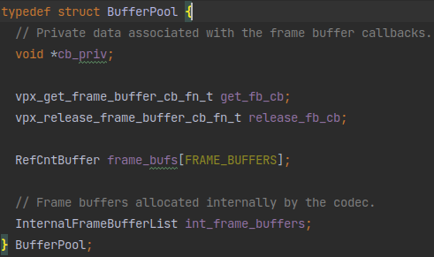
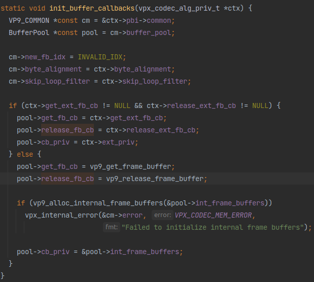
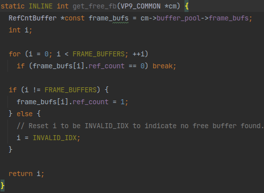
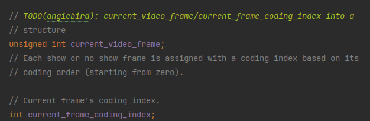
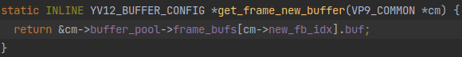
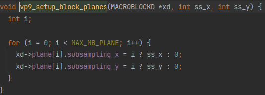

# libvpx解码过程解读

上接[《`libvpx`再深入一点》](./libvpx-insight.md)，本篇从上篇最后的`vp9_receive_compressed_data`函数开始解读。

## `vp9_receive_compressed_data`

```c
int vp9_receive_compressed_data(VP9Decoder *pbi, size_t size,
                                const uint8_t **psource) {
  VP9_COMMON *volatile const cm = &pbi->common;
  BufferPool *volatile const pool = cm->buffer_pool;
  RefCntBuffer *volatile const frame_bufs = cm->buffer_pool->frame_bufs;
  const uint8_t *source = *psource;
  int retcode = 0;
  cm->error.error_code = VPX_CODEC_OK;
```
初始化一些变量

```c
  if (size == 0) {
    // This is used to signal that we are missing frames.
    // We do not know if the missing frame(s) was supposed to update
    // any of the reference buffers, but we act conservative and
    // mark only the last buffer as corrupted.
    //
    // TODO(jkoleszar): Error concealment is undefined and non-normative
    // at this point, but if it becomes so, [0] may not always be the correct
    // thing to do here.
    if (cm->frame_refs[0].idx > 0) {
      assert(cm->frame_refs[0].buf != NULL);
      cm->frame_refs[0].buf->corrupted = 1;
    }
  }
```
可能有丢失帧？

```c
  pbi->ready_for_new_data = 0;

  // Check if the previous frame was a frame without any references to it.
  if (cm->new_fb_idx >= 0 && frame_bufs[cm->new_fb_idx].ref_count == 0 &&
      !frame_bufs[cm->new_fb_idx].released) {
    pool->release_fb_cb(pool->cb_priv,
                        &frame_bufs[cm->new_fb_idx].raw_frame_buffer);
    frame_bufs[cm->new_fb_idx].released = 1;
  }
```
从后面找可用buffer的过程来看，这里的`cm->new_fb_idx`就是上一帧用过的帧buffer的index。结合注释看，这里的操作是为了释放上一帧用完没释放的buffer。

主要调用的函数是这个`pool->release_fb_cb`，这函数是BufferPool里面的一个变量：



顾名思义，这个变量带个`_cb`后缀，应该是某种回调函数，和它上面那个变量一个是用于分配空间时的回调一个是用于释放空间时的回调。它们都是在`init_buffer_callbacks`函数里初始化的：



可以看到，如果没有在传入的`ctx`里设置回调，就会用默认的回调，但是这默认的回调从函数名上看又不像是请求/释放内存空间后的回调函数，而是像进行请求/释放内存空间的函数。再结合前面看到的用法，这个`release_fb_cb`根本就不是操作完成之后的“回调”。可能这个`release_fb_cb`虽然带个`_cb`的名字但是作者并不想把它当成操作之后的回调函数用吧。

```c
  // Find a free frame buffer. Return error if can not find any.
  cm->new_fb_idx = get_free_fb(cm);
  if (cm->new_fb_idx == INVALID_IDX) {
    pbi->ready_for_new_data = 1;
    release_fb_on_decoder_exit(pbi);
    vpx_clear_system_state();
    vpx_internal_error(&cm->error, VPX_CODEC_MEM_ERROR,
                       "Unable to find free frame buffer");
    return cm->error.error_code;
  }
```
找一个可用的帧buffer，如果没有就直接报错退出。前面先释放了buffer，这里用上，很合理。

核心函数就是这个`get_free_fb`：



可用看到，其实就是从传入的`VP9_COMMON`里面的`buffer_poll->frame_bufs`里面找到`ref_count`为0的buffer，如果没有就返回`INVALID_IDX`。

所以很明显记载buffer是否可用就是用一个`ref_count`数值实现的。然后调用的话直接就是`buffer_poll->->frame_bufs[cm->new_fb_idx]`。

```c
  // Assign a MV array to the frame buffer.
  cm->cur_frame = &pool->frame_bufs[cm->new_fb_idx];

  pbi->hold_ref_buf = 0;
  pbi->cur_buf = &frame_bufs[cm->new_fb_idx];
```
接下来，找到的可用的buffer又赋值给了`cm->cur_frame`和`pbi->cur_buf`

（为什么一个是用的`&pool->frame_bufs[cm->new_fb_idx]`另一个用的`&frame_bufs[cm->new_fb_idx]`？明明都是同一个变量，可能只是作者们马虎了吧）

```c
  if (setjmp(cm->error.jmp)) {
    cm->error.setjmp = 0;
    pbi->ready_for_new_data = 1;
    release_fb_on_decoder_exit(pbi);
    // Release current frame.
    decrease_ref_count(cm->new_fb_idx, frame_bufs, pool);
    vpx_clear_system_state();
    return -1;
  }

  cm->error.setjmp = 1;
```
>`setjmp`属于C函数库，作用是分别承担非局部标号和goto作用。

>`setjmp`函数用于保存程序的运行时的堆栈环境，接下来的其它地方，你可以通过调用`longjmp`函数来恢复先前被保存的程序堆栈环境。

这个`setjmp`是C语言里的错误处理机制，是try-catch的初级形式。难懂，以后再学习。

```c
  vp9_decode_frame(pbi, source, source + size, psource);

  swap_frame_buffers(pbi);

  vpx_clear_system_state();
```
直接调用了`vp9_decode_frame`这应该就是主要的解码的函数了。然后`swap_frame_buffers`和`vpx_clear_system_state`应该就是释放内存空间之类的操作。

```c
  if (!cm->show_existing_frame) {
    cm->last_show_frame = cm->show_frame;
    cm->prev_frame = cm->cur_frame;
    if (cm->seg.enabled) vp9_swap_current_and_last_seg_map(cm);
  }

  if (cm->show_frame) cm->cur_show_frame_fb_idx = cm->new_fb_idx;

  // Update progress in frame parallel decode.
  cm->last_width = cm->width;
  cm->last_height = cm->height;
  if (cm->show_frame) {
    cm->current_video_frame++;
  }
```
最后有几个和`show_frame`有关的操作。点进去这个`show_existing_frame`和`show_frame`，发现它们都是在`vp9_decode_frame`的`read_uncompressed_header`里赋值的，并且是从数据包头里读取出来的数据。

从这里的两个`if`可以看出，如果`cm->show_frame`为true，那么：
* 方才解码出的帧`cm->new_fb_idx`会赋值给`cm->cur_show_frame_fb_idx`从名字上看应该是放进当前展示的帧里面
* `cm->current_video_frame`的值加一

从`current_video_frame`的注释里可以进一步推测，这个`show_existing_frame`和`show_frame`应该是控制跳过一些帧（被解码但不被显示）：



```c

  cm->error.setjmp = 0;
  return retcode;
}
```
函数结束。

这个`vp9_receive_compressed_data`也没有触及到解码的核心操作，它只是为解码准备好了各种变量。真正的解码操作在`vp9_decode_frame`里面。

## `vp9_decode_frame`

```c
void vp9_decode_frame(VP9Decoder *pbi, const uint8_t *data,
                      const uint8_t *data_end, const uint8_t **p_data_end) {
```
函数开始。从之前的解析看，这个`data`就是存放压缩帧数据的buffer起点地址，`data_end`是终止地址。在`vp9_receive_compressed_data`里面`p_data_end`赋的值是`psource`，是`source`的地址。所以这里的`p_data_end`就是`data`的地址。

```c
  VP9_COMMON *const cm = &pbi->common;
  MACROBLOCKD *const xd = &pbi->mb;
```
取出两个context，一个是已经见过很多次的运行时变量，另外一个看名字应该是解码用的宏块结构体。

```c
  struct vpx_read_bit_buffer rb;
  int context_updated = 0;
  uint8_t clear_data[MAX_VP9_HEADER_SIZE];
  const size_t first_partition_size = read_uncompressed_header(
      pbi, init_read_bit_buffer(pbi, &rb, data, data_end, clear_data));
```
这应该是读取数据包包头。点进去一看，其实就是调用一堆`vp9_read_sync_code`读取包头，根据读到的值给`cm`赋值。

```c
  const int tile_rows = 1 << cm->log2_tile_rows;
  const int tile_cols = 1 << cm->log2_tile_cols;
```
初始化了两个tile数量相关的变量。点进去发现是在`read_uncompressed_header`调用的`setup_tile_info`的里面从包头中读取并赋值的。放在包头的只能是2的次方的值，压缩成log2存储，非常合理。

```c
  YV12_BUFFER_CONFIG *const new_fb = get_frame_new_buffer(cm);
```
调用的这个：



直接取了`vp9_receive_compressed_data`里面弄好的buffer，没毛病嗷。

```c
#if CONFIG_BITSTREAM_DEBUG || CONFIG_MISMATCH_DEBUG
  bitstream_queue_set_frame_read(cm->current_video_frame * 2 + cm->show_frame);
#endif
#if CONFIG_MISMATCH_DEBUG
  mismatch_move_frame_idx_r();
#endif
```
两个Debug用的东西？不懂

```c
  xd->cur_buf = new_fb;
```
应该是把存储压缩帧信息的buffer赋值给了一个解码用的宏块结构体。

```c
  if (!first_partition_size) {
    // showing a frame directly
    *p_data_end = data + (cm->profile <= PROFILE_2 ? 1 : 2);
    return;
  }
```
`first_partition_size`为false就直接showing a frame？什么操作

```c
  data += vpx_rb_bytes_read(&rb);
  if (!read_is_valid(data, first_partition_size, data_end))
    vpx_internal_error(&cm->error, VPX_CODEC_CORRUPT_FRAME,
                       "Truncated packet or corrupt header length");
```
这一看就是`read_uncompressed_header`读完包头之后来读一下标志位验证包头长度对不对

```c
  cm->use_prev_frame_mvs =
      !cm->error_resilient_mode && cm->width == cm->last_width &&
      cm->height == cm->last_height && !cm->last_intra_only &&
      cm->last_show_frame && (cm->last_frame_type != KEY_FRAME);
```
如果满足条件就`use_prev_frame_mvs`用上一帧的运动矢量？

```c
  vp9_setup_block_planes(xd, cm->subsampling_x, cm->subsampling_y);
```
设置`block_planes`块平面？应该是帧内分块编码相关的操作。看这函数：



😂就是设置了一下长宽吧这是。

```c
  *cm->fc = cm->frame_contexts[cm->frame_context_idx];
  if (!cm->fc->initialized)
    vpx_internal_error(&cm->error, VPX_CODEC_CORRUPT_FRAME,
                       "Uninitialized entropy context.");
```
entropy context？熵上下文？应该是和熵解码相关。不太懂，以后再学

总之这里是初始化了帧解码时的上下文，里面应该是存储的帧解码出来从数据。

```c
  xd->corrupted = 0;
  new_fb->corrupted = read_compressed_header(pbi, data, first_partition_size);
  if (new_fb->corrupted)
    vpx_internal_error(&cm->error, VPX_CODEC_CORRUPT_FRAME,
                       "Decode failed. Frame data header is corrupted.");
```
又是一个读包头的操作，不过这次是在读compressed_header。

```c
  if (cm->lf.filter_level && !cm->skip_loop_filter) {
    vp9_loop_filter_frame_init(cm, cm->lf.filter_level);
  }
```
如果不跳过环路滤波的话就初始化环路滤波器。

>由于FDCT变换后的量化（Quant）过程是一个有损（lossy）过程，会照成信息损失。再经过反量化（Rescale）和IDCT后恢复的矩阵与原矩阵存在一定的误差，特别宏块的边界，会照常恢复的图像呈现方块化，而方块化的图片对于后面的图片预测存在极大的影响，所以我们需要通过环路滤波进行去方块化。

```c
  if (pbi->tile_worker_data == NULL ||
      (tile_cols * tile_rows) != pbi->total_tiles) {
    const int num_tile_workers =
        tile_cols * tile_rows + ((pbi->max_threads > 1) ? pbi->max_threads : 0);
    const size_t twd_size = num_tile_workers * sizeof(*pbi->tile_worker_data);
    // Ensure tile data offsets will be properly aligned. This may fail on
    // platforms without DECLARE_ALIGNED().
    assert((sizeof(*pbi->tile_worker_data) % 16) == 0);
    vpx_free(pbi->tile_worker_data);
    CHECK_MEM_ERROR(cm, pbi->tile_worker_data, vpx_memalign(32, twd_size));
    pbi->total_tiles = tile_rows * tile_cols;
  }
```
接着上面的`tile_rows`和`tile_cols`处理，这里应该是确认`pbi->tile_worker_data`的大小足够并且`pbi->total_tiles`的值正确。

```c
  if (pbi->max_threads > 1 && tile_rows == 1 &&
      (tile_cols > 1 || pbi->row_mt == 1)) {
```
这一看就是准备开始多线程了。

```c
    if (pbi->row_mt == 1) {
      *p_data_end =
          decode_tiles_row_wise_mt(pbi, data + first_partition_size, data_end);
```
一行多列多线程的情况，就调用解码单行的函数`decode_tiles_row_wise_mt`。

```c
    } else {
      // Multi-threaded tile decoder
      *p_data_end = decode_tiles_mt(pbi, data + first_partition_size, data_end);
      if (!pbi->lpf_mt_opt) {
        if (!xd->corrupted) {
          if (!cm->skip_loop_filter) {
            // If multiple threads are used to decode tiles, then we use those
            // threads to do parallel loopfiltering.
            vp9_loop_filter_frame_mt(
                new_fb, cm, pbi->mb.plane, cm->lf.filter_level, 0, 0,
                pbi->tile_workers, pbi->num_tile_workers, &pbi->lf_row_sync);
          }
        } else {
          vpx_internal_error(&cm->error, VPX_CODEC_CORRUPT_FRAME,
                             "Decode failed. Frame data is corrupted.");
        }
      }
    }
```
多行多列多线程的情况，除了解码多行多列的`decode_tiles_mt`还要调用多线程的环路滤波`vp9_loop_filter_frame_mt`。

```c
  } else {
    *p_data_end = decode_tiles(pbi, data + first_partition_size, data_end);
  }
```
这单线程的代码，就只有一个`decode_tiles`解码所有的块。

```c
  if (!xd->corrupted) {
    if (!cm->error_resilient_mode && !cm->frame_parallel_decoding_mode) {
      vp9_adapt_coef_probs(cm);

      if (!frame_is_intra_only(cm)) {
        vp9_adapt_mode_probs(cm);
        vp9_adapt_mv_probs(cm, cm->allow_high_precision_mv);
      }
    }
  } else {
    vpx_internal_error(&cm->error, VPX_CODEC_CORRUPT_FRAME,
                       "Decode failed. Frame data is corrupted.");
  }
```
一些错误处理，里面有三个看着像是自适应的函数`vp9_adapt_coef_probs`、`vp9_adapt_mode_probs`、`vp9_adapt_mv_probs`应该就是正常解码解不出来的时候的一些尝试吧。

```c
  // Non frame parallel update frame context here.
  if (cm->refresh_frame_context && !context_updated)
    cm->frame_contexts[cm->frame_context_idx] = *cm->fc;
```
最后更新帧上下文？

```c
}
```
函数结束。

离真相又进了一步！这个`vp9_decode_frame`负责读取帧压缩数据包头、初始化上下文结构体值，最后调用了多线程的`decode_tiles_row_wise_mt`和`decode_tiles_mt`以及单线程的`decode_tiles`进行解码。所以`decode_tiles_row_wise_mt`、`decode_tiles_mt`、`decode_tiles`这三个函数就是更深层的核心代码。