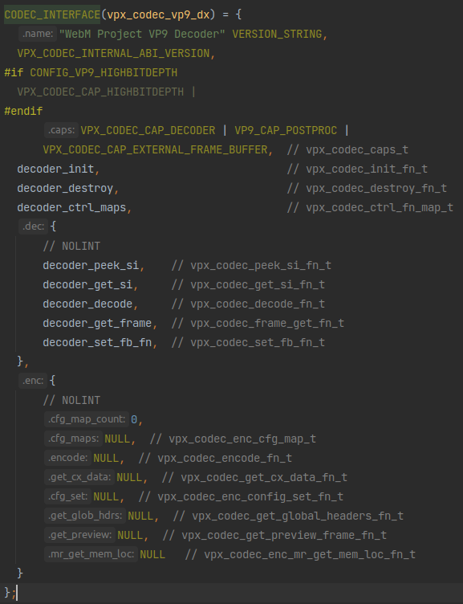
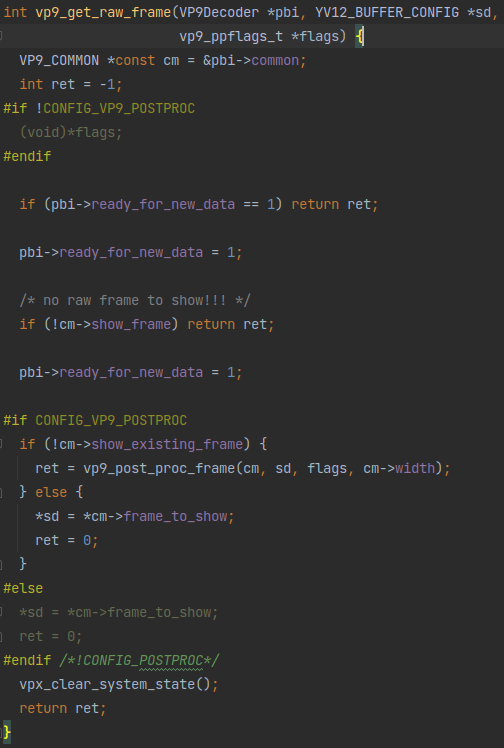

# `libvpx`再深入一点

前置知识：先学会最外层的API
* [《`libvpx`的使用方法简析 - simple_decoder.c》](./libvpx-simple_decoder.md)
* [《`libvpx`的使用方法简析 - simple_encoder.c》](./libvpx-simple_encoder.md)

本文将深入一点点找到内部的编解码函数的调用过程。

在[《`libvpx`的使用方法简析 - simple_decoder.c》](./libvpx-simple_decoder.md)我们了解到解码过程是调用两个API函数`vpx_codec_decode`和`vpx_codec_get_frame`，也知道了这两个函数核心也只是在调用`vpx_codec_iface`里的`dec.decode`和`dec.get_frame`。

而在[《`libvpx`的使用方法简析 - simple_encoder.c》](./libvpx-simple_encoder.md)我们也了解到编码过程也是调用两个API函数`vpx_codec_encode`和`vpx_codec_get_cx_data`，而这两个函数也是调用的`vpx_codec_iface`里的接口`enc.encode`和`get_cx_data`。

除此之外，我们还知道`vpx_codec_iface`的实现分为vp8和vp9两个版本，两个版本都有各自的编码器实现和解码器实现：
* vp9解码器实现是`vpx_codec_vp9_dx`
* vp9编码器实现是`vpx_codec_vp9_cx`
* vp8解码器实现是`vpx_codec_vp8_dx`
* vp8编码器实现是`vpx_codec_vp8_cx`

显然，这些接口实现里的函数就是具体的编解码过程。这样，我们进一步深入的入口就从这些实现开始。

## vp9解码

vp9解码器实现是`vpx_codec_vp9_dx`：



而其中`decoder_decode`就是`dec.decode`、`decoder_get_frame`就是`dec.get_frame`。

### `decoder_get_frame`

先看比较简单的`decoder_get_frame`：
```c
static vpx_image_t *decoder_get_frame(vpx_codec_alg_priv_t *ctx,
                                      vpx_codec_iter_t *iter) {
```
函数开始。

```c
  vpx_image_t *img = NULL;
```
这个是要返回的结果，就是一个帧图像。

```c
  // Legacy parameter carried over from VP8. Has no effect for VP9 since we
  // always return only 1 frame per decode call.
  (void)iter;
```
从注释中可以看到这里是一个历史遗留问题，vp9每次`decoder_get_frame`只会返回一帧，不需要像vp8那样迭代，所以迭代器参数在vp9里没用。

```c
  if (ctx->pbi != NULL) {
```
首先必须要有`ctx->pbi`的存在才能进行下面这些操作。

```c
    YV12_BUFFER_CONFIG sd;
    vp9_ppflags_t flags = { 0, 0, 0 };
    if (ctx->base.init_flags & VPX_CODEC_USE_POSTPROC) set_ppflags(ctx, &flags);
```
首先设置了`vp9_ppflags_t`。从这个if里的判断条件看，这应该是控制后处理过程的设置。

关于视频解码的后处理，可以参考ffmpeg对后处理的介绍：[《wiki:Postprocessing》](https://trac.ffmpeg.org/wiki/Postprocessing)

```c
    if (vp9_get_raw_frame(ctx->pbi, &sd, &flags) == 0) {
```
这里的判断就蕴含着本函数的核心处理过程：



可以看到，其实就是把数据从`pbi->common`里找出来放进`sd`里，并且如果有定义后处理过程就进行一下后处理。

```c
      VP9_COMMON *const cm = &ctx->pbi->common;
      RefCntBuffer *const frame_bufs = cm->buffer_pool->frame_bufs;
```
取出了一个`pbi`里的变量和一个什么buffer。

```c
      ctx->last_show_frame = ctx->pbi->common.new_fb_idx;
```
这里看着像是把之前解码好的帧存储为“上一帧”的操作。

```c
      if (ctx->need_resync) return NULL;
```
这个`need_resync`应该是`vp9_get_raw_frame`里面返回的什么错误吧。

```c
      yuvconfig2image(&ctx->img, &sd, ctx->user_priv);
```
这函数名显然是用于吧`sd`里的帧数据转成img格式的操作。

```c
      ctx->img.fb_priv = frame_bufs[cm->new_fb_idx].raw_frame_buffer.priv;
```
这里看着也像是把之前解码好的帧存储为“上一帧”的操作。

```c
      img = &ctx->img;
      return img;
```
返回了。这个`&ctx->img`应该就是在`yuvconfig2image`从`sd`转换过来的帧图像了。

```c
    }
  }
  return NULL;
}
```
函数结束。

### `decoder_decode`

再来看稍微复杂一点的`decoder_decode`：

```c
static vpx_codec_err_t decoder_decode(vpx_codec_alg_priv_t *ctx,
                                      const uint8_t *data, unsigned int data_sz,
                                      void *user_priv, long deadline) {
```
函数开始。

```c
  const uint8_t *data_start = data;
  const uint8_t *const data_end = data + data_sz;
```
首先是计算原始数据的起始和终止地址。

```c
  vpx_codec_err_t res;
```
初始化了返回值。这返回只返回了错误信息。

```c
  uint32_t frame_sizes[8];
  int frame_count;
```
这个是给后面一个压缩包解码出多个帧的情况用的。从这个`frame_sizes`尺寸看应该是最多8帧。

```c
  if (data == NULL && data_sz == 0) {
    ctx->flushed = 1;
    return VPX_CODEC_OK;
  }
```
如果没有数据就直接返回。

```c
  // Reset flushed when receiving a valid frame.
  ctx->flushed = 0;
```
有数据就先flush。

```c
  // Initialize the decoder on the first frame.
  if (ctx->pbi == NULL) {
    const vpx_codec_err_t res = init_decoder(ctx);
    if (res != VPX_CODEC_OK) return res;
  }
```
如果没有`ctx->pbi`就先初始化。从注释上看，这个`ctx->pbi`为空是在第一帧才会出现的情况。

这个`ctx->pbi`前面经常见到，从这种在第一帧初始化的操作，看来是用来在解码过程中存储一些临时数据的变量。

```c
  res = vp9_parse_superframe_index(data, data_sz, frame_sizes, &frame_count,
                                   ctx->decrypt_cb, ctx->decrypt_state);
  if (res != VPX_CODEC_OK) return res;
```
首先是读取superframe。vpx可以将多个帧放在一个压缩包里，这就是superframe。

这里的`frame_sizes`和`frame_count`应该就是“输出结果”，读取superframe就是读取出帧数量和每个帧数据的大小。

```c
  if (ctx->svc_decoding && ctx->svc_spatial_layer < frame_count - 1)
    frame_count = ctx->svc_spatial_layer + 1;
```
SVC是指可适性视频编码(Scalable Video Coding)，详情请看[《SVC和视频通信》](./SVC和视频通信.md)。

```c
  // Decode in serial mode.
  if (frame_count > 0) {
```
首先是`frame_count>0`的情况。这个应该是解包superframe一个数据包有好几个帧的情况。

```c
    int i;

    for (i = 0; i < frame_count; ++i) {
```
一个循环对每个帧进行解压。

```c
      const uint8_t *data_start_copy = data_start;
      const uint32_t frame_size = frame_sizes[i];
```
首先是获取帧数据起点和大小。

```c
      vpx_codec_err_t res;
      if (data_start < data || frame_size > (uint32_t)(data_end - data_start)) {
        set_error_detail(ctx, "Invalid frame size in index");
        return VPX_CODEC_CORRUPT_FRAME;
      }
```
数据错误就报错返回。

```c
      res = decode_one(ctx, &data_start_copy, frame_size, user_priv, deadline);
      if (res != VPX_CODEC_OK) return res;
```
这个`decode_one`应该就是解码的核心函数了。

```c
      data_start += frame_size;
```
每次解码完成后就更新帧数据起点，很合理。

```c
    }
```
帧解码循环结束。

```c
  } else {
```
接下来是`frame_count<=0`时的操作

```c
    while (data_start < data_end) {
```
这里应该就是没有`frame_count`采用直接扫描的方式

```c
      const uint32_t frame_size = (uint32_t)(data_end - data_start);
```
`frame_size`也是计算出来的

```c
      const vpx_codec_err_t res =
          decode_one(ctx, &data_start, frame_size, user_priv, deadline);
      if (res != VPX_CODEC_OK) return res;
```
核心操作依旧是这个`decode_one`。

```c
      // Account for suboptimal termination by the encoder.
      while (data_start < data_end) {
        const uint8_t marker =
            read_marker(ctx->decrypt_cb, ctx->decrypt_state, data_start);
        if (marker) break;
        ++data_start;
      }
```
接下来这个应该是扫描直到找到下一个帧的起始标记。

```c
    }
  }
```
循环结束。

```c
  return res;
}
```
函数结束。