# `libvpx`的使用方法简析 - [simple_decoder.c](https://github.com/webmproject/libvpx/blob/master/examples/simple_decoder.c)

```c
/*
 *  Copyright (c) 2010 The WebM project authors. All Rights Reserved.
 *
 *  Use of this source code is governed by a BSD-style license
 *  that can be found in the LICENSE file in the root of the source
 *  tree. An additional intellectual property rights grant can be found
 *  in the file PATENTS.  All contributing project authors may
 *  be found in the AUTHORS file in the root of the source tree.
 */
```

# 开头自带的说明书

```c
// Simple Decoder
// ==============
//
// This is an example of a simple decoder loop. It takes an input file
// containing the compressed data (in IVF format), passes it through the
// decoder, and writes the decompressed frames to disk. Other decoder
// examples build upon this one.
//
```
这个案例的功能是读取一个IVF格式的输入文件，解码之后把帧写到磁盘上。

```c
// The details of the IVF format have been elided from this example for
// simplicity of presentation, as IVF files will not generally be used by
// your application. In general, an IVF file consists of a file header,
// followed by a variable number of frames. Each frame consists of a frame
// header followed by a variable length payload. The length of the payload
// is specified in the first four bytes of the frame header. The payload is
// the raw compressed data.
//
```
IVF格式的详情不是本示例的重点。

```c
// Standard Includes
// -----------------
// For decoders, you only have to include `vpx_decoder.h` and then any
// header files for the specific codecs you use. In this case, we're using
// vp8.
//
```
为了调用解码器，需要引入`vpx_decoder.h`。

```c
// Initializing The Codec
// ----------------------
// The libvpx decoder is initialized by the call to vpx_codec_dec_init().
// Determining the codec interface to use is handled by VpxVideoReader and the
// functions prefixed with vpx_video_reader_. Discussion of those functions is
// beyond the scope of this example, but the main gist is to open the input file
// and parse just enough of it to determine if it's a VPx file and which VPx
// codec is contained within the file.
// Note the NULL pointer passed to vpx_codec_dec_init(). We do that in this
// example because we want the algorithm to determine the stream configuration
// (width/height) and allocate memory automatically.
//
```
初始化解码器的函数是`vpx_codec_dec_init()`。

使用哪个解码器接口是在`VpxVideoReader`和`vpx_video_reader_`开头的几个函数里面判断的。具体情况不在本示例的讨论范围内，本示例中解码器信息就包含在文件里面。

NOTE：示例中`vpx_codec_dec_init()`的第三项是解码器配置，本案例中传入的是空指针，这样可以让它自己判合适的配置和分配内存空间。

```c
// Decoding A Frame
// ----------------
// Once the frame has been read into memory, it is decoded using the
// `vpx_codec_decode` function. The call takes a pointer to the data
// (`frame`) and the length of the data (`frame_size`). No application data
// is associated with the frame in this example, so the `user_priv`
// parameter is NULL. The `deadline` parameter is left at zero for this
// example. This parameter is generally only used when doing adaptive post
// processing.
//
```
当帧被读入内存之后，调用`vpx_codec_decode`就可以对其进行解码。

这个`vpx_codec_decode`接受一个帧数据指针(`frame`)和帧尺寸(`frame_size`)，其他一些可有可无的调节参数(`user_priv`)不在本案例的讨论范围，直接设空。本案例中的`deadline`参数设为0，这个参数主要用于自适应。

```c
// Codecs may produce a variable number of output frames for every call to
// `vpx_codec_decode`. These frames are retrieved by the
// `vpx_codec_get_frame` iterator function. The iterator variable `iter` is
// initialized to NULL each time `vpx_codec_decode` is called.
// `vpx_codec_get_frame` is called in a loop, returning a pointer to a
// decoded image or NULL to indicate the end of list.
//
```
每次调用`vpx_codec_decode`都可能产生多个解码帧，调用`vpx_codec_get_frame`获取这些帧。

`vpx_codec_get_frame`的第二个参数接受一个迭代器指针，`vpx_codec_get_frame`会以迭代的方式输出解码后的帧。

```c
// Processing The Decoded Data
// ---------------------------
// In this example, we simply write the encoded data to disk. It is
// important to honor the image's `stride` values.
//
```
本示例中，解码之后的数据直接写进文件里。

```c
// Cleanup
// -------
// The `vpx_codec_destroy` call frees any memory allocated by the codec.
//
// Error Handling
// --------------
// This example does not special case any error return codes. If there was
// an error, a descriptive message is printed and the program exits. With
// few exceptions, vpx_codec functions return an enumerated error status,
// with the value `0` indicating success.
```
`vpx_codec_destroy`用于清理。

本示例中没有什么特殊的需要处理的错误。

## 正文开头

```c
#include <stdio.h>
#include <stdlib.h>
#include <string.h>

#include "vpx/vpx_decoder.h"

#include "../tools_common.h"
#include "../video_reader.h"
#include "./vpx_config.h"
```
一堆`include`不用多讲。

```c
static const char *exec_name;

void usage_exit(void) {
  fprintf(stderr, "Usage: %s <infile> <outfile>\n", exec_name);
  exit(EXIT_FAILURE);
}
```
这是一个输出错误并退出程序的函数，用在接下来会经常见到的`die`函数里面，就是输出一些错误而已，不用太在意。

```c
int main(int argc, char **argv) {
```
主函数开始。

```c
  int frame_cnt = 0;
  FILE *outfile = NULL;
  vpx_codec_ctx_t codec;
  VpxVideoReader *reader = NULL;
  const VpxInterface *decoder = NULL;
  const VpxVideoInfo *info = NULL;

  exec_name = argv[0];

  if (argc != 3) die("Invalid number of arguments.");
```
一堆后面要用到的变量定义。

## 打开待解码的文件

```c
  reader = vpx_video_reader_open(argv[1]);
  if (!reader) die("Failed to open %s for reading.", argv[1]);

  if (!(outfile = fopen(argv[2], "wb")))
    die("Failed to open %s for writing.", argv[2]);
```
打开文件，生成`VpxVideoReader`。这个输入参数`argv[1]`是要待解码文件的文件名，`argv[1]`是放解码后数据的文件的文件名。

```c
  info = vpx_video_reader_get_info(reader);
```
这个函数的定义里面只有一句话：`return &reader->info`😂。

## 获取所需的解码器

```c
  decoder = get_vpx_decoder_by_fourcc(info->codec_fourcc);
  if (!decoder) die("Unknown input codec.");

  printf("Using %s\n", vpx_codec_iface_name(decoder->codec_interface()));
```
这个函数顺着一查，发现下图：

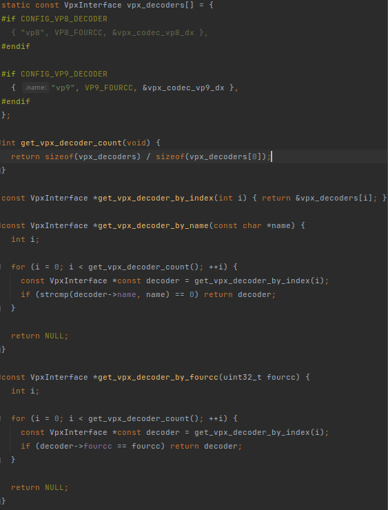

`get_vpx_decoder_by_fourcc`调用了`get_vpx_decoder_by_index`，而`get_vpx_decoder_by_index`直接从一个列表里选出了一个解码器。从这列表看，这就是在选vp8还是vp9。

返回值都是`VpxInterface`类型，说明vp8和vp9的decoder都是继承的同一个接口类。那看看这个`VpxInterface`又是什么：

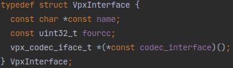

嗯，上面那个`vpx_decoders[]`数组和这个类定义是一一对应的。这`VpxInterface`里面前两个一看就是两个Metadata，最后这个`vpx_codec_iface_t *(*const codec_interface)()`应该就是重点。

定义看着有点复杂，这就是个函数指针。变量名是`codec_interface`，接受返回值是`vpx_codec_iface_t *`，无输入参数的函数。

那这个`vpx_codec_iface_t`又是什么？找找：

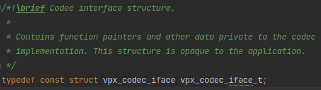

一个`typedef`😂，好吧，再找这个`vpx_codec_iface`：

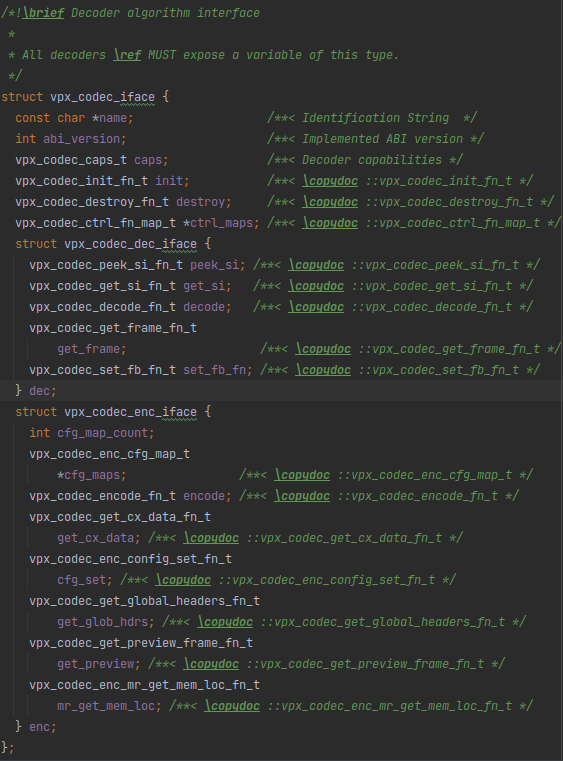

这应该就是vp8和vp9的统一接口了。这里面这些类型随便点进去几个，发现它们都是在`vpx/internal/vpx_codec_internal.h`里面定义的函数指针类型。哇，简单粗暴，确实称得上是“接口”。

那么再回去看`vpx_decoders[]`数组里的值，`codec_interface`对应的是这个`vpx_codec_vp8_dx`和`vpx_codec_vp9_dx`，显然这两个就是返回值是`vpx_codec_iface_t *`且无输入参数的函数，也是解码器的主要部分。

那看看这个`vpx_codec_vp8_dx`和`vpx_codec_vp9_dx`是什么：

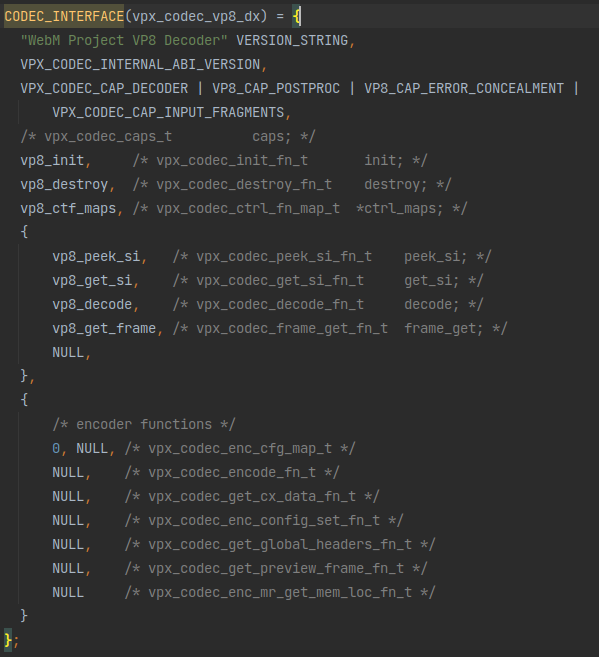


哇这个赋值，显然这就是在给`vpx_codec_iface`里的函数指针变量赋值，那被赋的这些值就是vp8和vp9解码器的具体实现了，记下来以后慢慢看。

还记得`vpx_codec_vp8_dx`和`vpx_codec_vp9_dx`的类型吗？它们应该是返回值是`vpx_codec_iface_t *`且无输入参数的函数，但这里看怎么像是在给`vpx_codec_iface_t`赋值？注意到`vpx_codec_vp8_dx`和`vpx_codec_vp9_dx`都被一个宏`CODEC_INTERFACE`包裹着，那看看这个宏是什么：

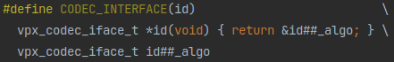

哇，秒懂，赋值之后放进函数里。一个小trick而已，和[《pion/interceptor浅析》](../WebRTC/pion-interceptor.md)里介绍的`RTCPReaderFunc`之流差不多的想法。

## 初始化解码器

好了，继续看示例的代码：
```c
  if (vpx_codec_dec_init(&codec, decoder->codec_interface(), NULL, 0))
    die("Failed to initialize decoder.");
```
开头的说明里讲过的初始化操作。看着像个函数，其实是被套了个宏的函数：

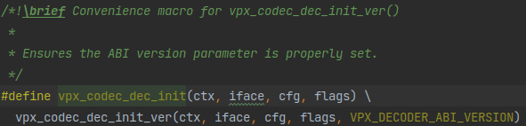

被套的函数是这个：

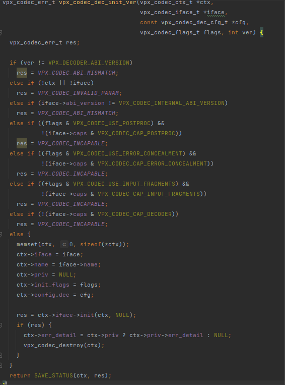

套个宏就是替换最后一个变量用于ABI版本检查。

初始化函数的核心就是给这个上下文变量`ctx`赋了一堆值，还调用了传进来的`iface`里面的`init`函数，这就是`vpx_codec_iface`里的函数之一，前面介绍过，不用多讲。

这个`ctx`是传进来的结构体指针，所以调用这个函数之后，在函数外面用户就可以用赋好值的`ctx`进行各种操作了。

## 解码过程

继续看示例：
```c
  while (vpx_video_reader_read_frame(reader)) {
```
上来就是直接一个`while`循环，这个`vpx_video_reader_read_frame`长这样：

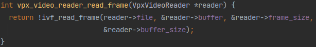

看来就是个ivf读取器啊，看样子是根据`reader`里的文件信息把文件数据写进`reader->buffer`里

```c
    vpx_codec_iter_t iter = NULL;
    vpx_image_t *img = NULL;
    size_t frame_size = 0;
    const unsigned char *frame =
        vpx_video_reader_get_frame(reader, &frame_size);
```
`while`循环里每轮来一个`vpx_video_reader_get_frame`，这个`vpx_video_reader_get_frame`也很简单：
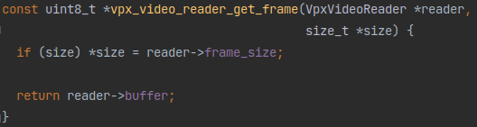

就直接返回`vpx_video_reader_read_frame`里写入的`reader->buffer`然后把数据长度传给`frame_size`。看这个`frame`的类型应该就是个`unsigned char`数组，看来这个libvpx里的压缩帧数据没有专门指定数据类型。

```c
    if (vpx_codec_decode(&codec, frame, (unsigned int)frame_size, NULL, 0))
      die_codec(&codec, "Failed to decode frame.");
```
`vpx_video_reader_read_frame`之后就是`vpx_codec_decode`对帧数据进行解码。这个`vpx_codec_decode`依然很短：

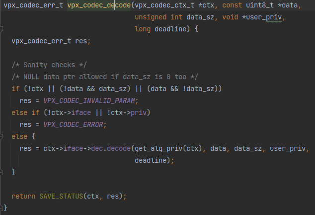

其实就是在调用`vpx_codec_iface`接口里定义好的解码函数`dec.decode`。

```c
    while ((img = vpx_codec_get_frame(&codec, &iter)) != NULL) {
      vpx_img_write(img, outfile);
      ++frame_cnt;
    }
```
最后就是一个`vpx_codec_get_frame`获取到解码出来的帧。~~这个传入的`iter`在前后都没有用到，看来只是为了提供一点内存空间（既然外面用不到为什么还要这样定义？应该是有别的用处吧）~~。注意到有个传入的迭代器参数`iter`只传入了`vpx_codec_get_frame`却没有其他任何操作。这个参数是历史遗留问题，具体可以看`decoder_get_frame`函数里面有一段注释的解释，[《`libvpx`再深入一点》](./libvpx-insight.md)的解析里也有。

这个`vpx_codec_get_frame`依旧很短：

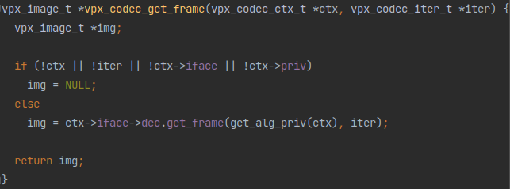

和`vpx_codec_decode`差不多，封装了一下`vpx_codec_iface`接口里定义好的`dec.get_frame`。

```c
  }
```
解码过程结束。

## 一些收尾操作

```c
  printf("Processed %d frames.\n", frame_cnt);
  if (vpx_codec_destroy(&codec)) die_codec(&codec, "Failed to destroy codec");
```
关闭解码器。

```c
  printf("Play: ffplay -f rawvideo -pix_fmt yuv420p -s %dx%d %s\n",
         info->frame_width, info->frame_height, argv[2]);

  vpx_video_reader_close(reader);

  fclose(outfile);
```
关闭文件读取器。

```c
  return EXIT_SUCCESS;
```
退出。

## 完

```c
}

```
主函数结束