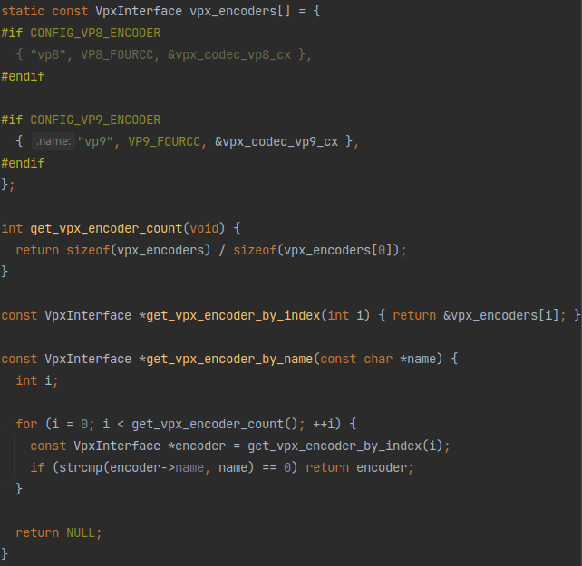
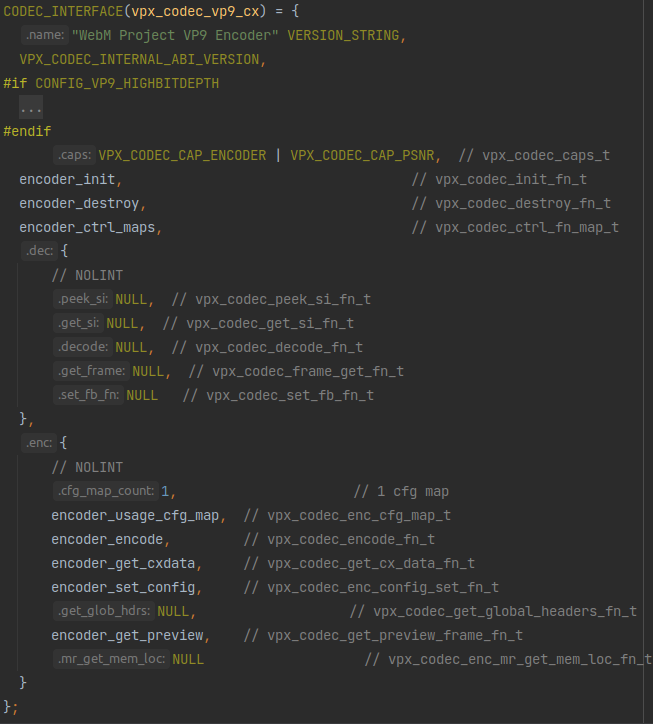
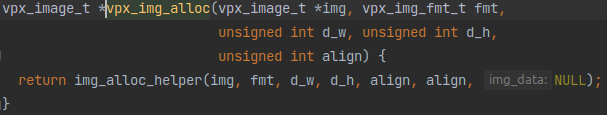
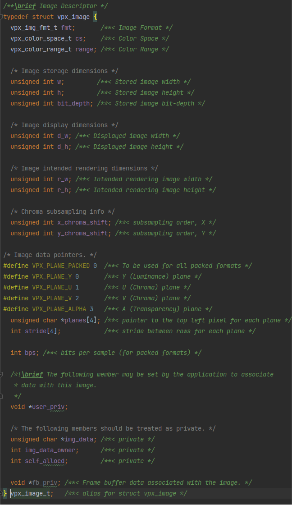
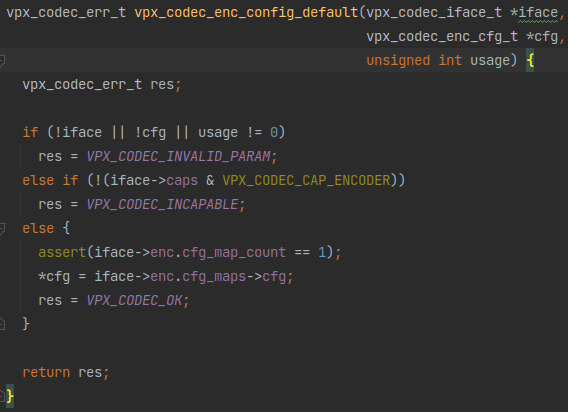
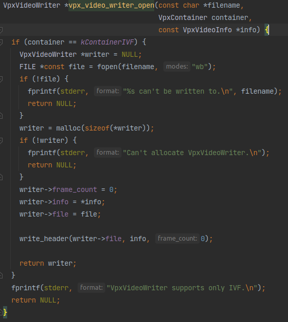
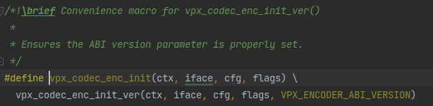
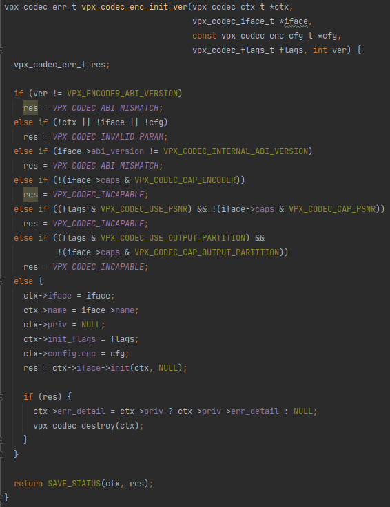
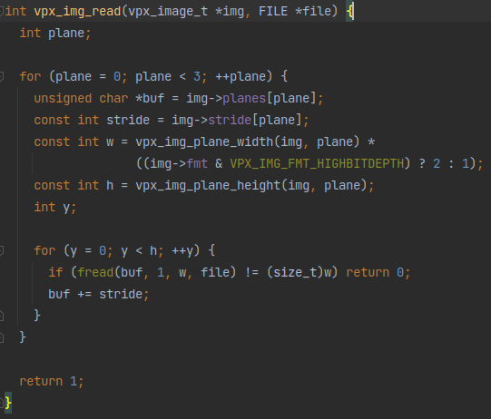
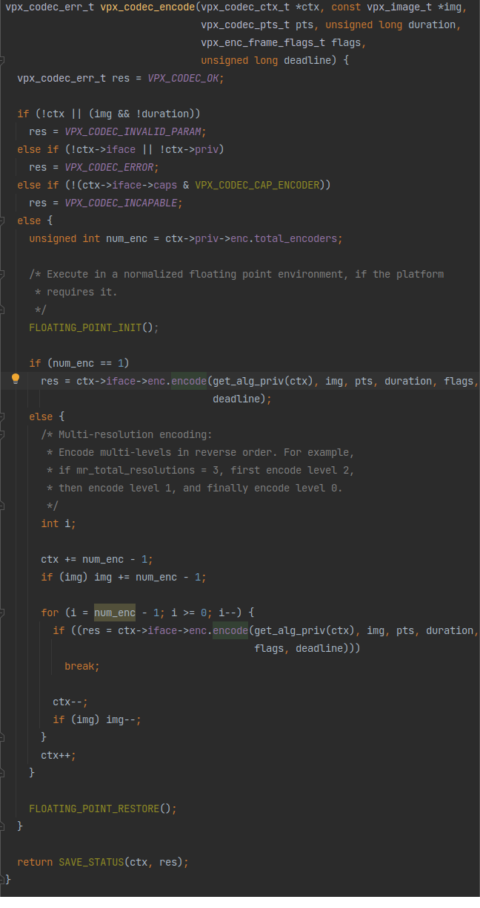

# `libvpx`的使用方法简析 - [simple_encoder.c](https://github.com/webmproject/libvpx/blob/master/examples/simple_encoder.c)

```c
/*
 *  Copyright (c) 2010 The WebM project authors. All Rights Reserved.
 *
 *  Use of this source code is governed by a BSD-style license
 *  that can be found in the LICENSE file in the root of the source
 *  tree. An additional intellectual property rights grant can be found
 *  in the file PATENTS.  All contributing project authors may
 *  be found in the AUTHORS file in the root of the source tree.
 */
```

# 开头自带的说明书

```c
// Simple Encoder
// ==============
//
// This is an example of a simple encoder loop. It takes an input file in
// YV12 format, passes it through the encoder, and writes the compressed
// frames to disk in IVF format. Other decoder examples build upon this
// one.
//
```
这个例程的功能是读取YV12格式的输入，经过编码后以IVF格式保存。

```c
// The details of the IVF format have been elided from this example for
// simplicity of presentation, as IVF files will not generally be used by
// your application. In general, an IVF file consists of a file header,
// followed by a variable number of frames. Each frame consists of a frame
// header followed by a variable length payload. The length of the payload
// is specified in the first four bytes of the frame header. The payload is
// the raw compressed data.
//
```
IVF格式的详情不是本示例的重点。

```c
// Standard Includes
// -----------------
// For encoders, you only have to include `vpx_encoder.h` and then any
// header files for the specific codecs you use. In this case, we're using
// vp8.
//
```
为了调用编码器，需要引入`vpx_encoder.h`。

```c
// Getting The Default Configuration
// ---------------------------------
// Encoders have the notion of "usage profiles." For example, an encoder
// may want to publish default configurations for both a video
// conferencing application and a best quality offline encoder. These
// obviously have very different default settings. Consult the
// documentation for your codec to see if it provides any default
// configurations. All codecs provide a default configuration, number 0,
// which is valid for material in the vacinity of QCIF/QVGA.
//
```
在解码器中“配置”的过程可能不那么重要，但在编码器中，合适的“配置”非常重要。

编码器中有“配置文件”的概念。例如，在线视频会议应用程序中的编码器和需要最佳质量的离线编码器，不同的应用常场景显然需要用到不同的默认配置。

```c
// Updating The Configuration
// ---------------------------------
// Almost all applications will want to update the default configuration
// with settings specific to their usage. Here we set the width and height
// of the video file to that specified on the command line. We also scale
// the default bitrate based on the ratio between the default resolution
// and the resolution specified on the command line.
//
```
本例程在命令行中设置编码器编码时的图像尺寸，并且还根据默认分辨率和命令行中指定的分辨率之间的比率缩放默认比特率。

```c
// Initializing The Codec
// ----------------------
// The encoder is initialized by the following code.
//
```
初始化过程用到了`vpx_codec_enc_init`。

```c
// Encoding A Frame
// ----------------
// The frame is read as a continuous block (size width * height * 3 / 2)
// from the input file. If a frame was read (the input file has not hit
// EOF) then the frame is passed to the encoder. Otherwise, a NULL
// is passed, indicating the End-Of-Stream condition to the encoder. The
// `frame_cnt` is reused as the presentation time stamp (PTS) and each
// frame is shown for one frame-time in duration. The flags parameter is
// unused in this example. The deadline is set to VPX_DL_REALTIME to
// make the example run as quickly as possible.
```
帧是作为一个个连续的块进行读取的，当输入文件结束时，传一个空指针就能让编码器知道编码结束。

对于编码时的flag，本例程只用了`VPX_DL_GOOD_QUALITY`，还有很多其他的flag。`VPX_DL_`开头的这些flag是平衡编码质量和编码速度的，如果需要运行速度可以换成`VPX_DL_REALTIME`

PS：`frame_cnt`这里是什么意思？没理解

```c
// Forced Keyframes
// ----------------
// Keyframes can be forced by setting the VPX_EFLAG_FORCE_KF bit of the
// flags passed to `vpx_codec_control()`. In this example, we force a
// keyframe every <keyframe-interval> frames. Note, the output stream can
// contain additional keyframes beyond those that have been forced using the
// VPX_EFLAG_FORCE_KF flag because of automatic keyframe placement by the
// encoder.
//
```
在编码函数里时传入`VPX_EFLAG_FORCE_KF`强制让当前帧成为关键帧，强制关键帧不会影响原本自动产生的关键帧，只会让输出流中多一些关键帧的数据。

本例程中每隔几帧就会像这样搞一个强制关键帧。

```c
// Processing The Encoded Data
// ---------------------------
// Each packet of type `VPX_CODEC_CX_FRAME_PKT` contains the encoded data
// for this frame. We write a IVF frame header, followed by the raw data.
//
```
编码的输出是一个个pkt（包），在本例程中是IVF格式。

```c
// Cleanup
// -------
// The `vpx_codec_destroy` call frees any memory allocated by the codec.
//
// Error Handling
// --------------
// This example does not special case any error return codes. If there was
// an error, a descriptive message is printed and the program exits. With
// few exeptions, vpx_codec functions return an enumerated error status,
// with the value `0` indicating success.
//
```
`vpx_codec_destroy`用于清理。

本示例中没有什么特殊的需要处理的错误。


```c
// Error Resiliency Features
// -------------------------
// Error resiliency is controlled by the g_error_resilient member of the
// configuration structure. Use the `decode_with_drops` example to decode with
// frames 5-10 dropped. Compare the output for a file encoded with this example
// versus one encoded with the `simple_encoder` example.
```
容错性机制由编码器配置中的`g_error_resilient`成员控制把这个案例和[`decode_with_drops`](https://github.com/webmproject/libvpx/blob/master/examples/decode_with_drops.c)进行比较就能知道这是干嘛用的。

## 正文开头

```c
#include <stdio.h>
#include <stdlib.h>
#include <string.h>

#include "vpx/vpx_encoder.h"

#include "../tools_common.h"
#include "../video_writer.h"
```
一堆`include`不用多讲。

```c

static const char *exec_name;

void usage_exit(void) {
  fprintf(stderr,
          "Usage: %s <codec> <width> <height> <infile> <outfile> "
          "<keyframe-interval> <error-resilient> <frames to encode>\n"
          "See comments in simple_encoder.c for more information.\n",
          exec_name);
  exit(EXIT_FAILURE);
}
```
这是一个输出错误并退出程序的函数，用在接下来会经常见到的`die`函数里面，就是输出一些错误而已，不用太在意。

## 

```c
static int encode_frame(vpx_codec_ctx_t *codec, vpx_image_t *img,
                        int frame_index, int flags, VpxVideoWriter *writer) {

    ......

}
```
从名称上看，这个就是对帧进行编码的函数，后面再解释。

```c
// TODO(tomfinegan): Improve command line parsing and add args for bitrate/fps.
int main(int argc, char **argv) {
```
主函数开始。

```c
  FILE *infile = NULL;
  vpx_codec_ctx_t codec;
  vpx_codec_enc_cfg_t cfg;
  int frame_count = 0;
  vpx_image_t raw;
  vpx_codec_err_t res;
  VpxVideoInfo info = { 0, 0, 0, { 0, 0 } };
  VpxVideoWriter *writer = NULL;
  const VpxInterface *encoder = NULL;
  const int fps = 30;
  const int bitrate = 200;
  int keyframe_interval = 0;
  int max_frames = 0;
  int frames_encoded = 0;
  const char *codec_arg = NULL;
  const char *width_arg = NULL;
  const char *height_arg = NULL;
  const char *infile_arg = NULL;
  const char *outfile_arg = NULL;
  const char *keyframe_interval_arg = NULL;

  exec_name = argv[0];

  if (argc != 9) die("Invalid number of arguments");
```
一堆后面要用到的变量定义。

注意到帧率和比特率都是在这固定好的。

```c
  codec_arg = argv[1];
  width_arg = argv[2];
  height_arg = argv[3];
  infile_arg = argv[4];
  outfile_arg = argv[5];
  keyframe_interval_arg = argv[6];
  max_frames = (int)strtol(argv[8], NULL, 0);
```
结合上面的变量定义，和[《`libvpx`的使用方法简析 - simple_decoder.c》](./libvpx-simple_decoder.md)里的解码器例程一对比，发现所需的设置和命令行参数多了不少，看来libvpx的编码过程比解码复杂很多。

## 获取所需的编码器

```c
  encoder = get_vpx_encoder_by_name(codec_arg);
  if (!encoder) die("Unsupported codec.");
```
这里用命令行里传入的参数查找了编码器，看看这个`get_vpx_encoder_by_name`是怎么找编码器的：



和[《`libvpx`的使用方法简析 - simple_decoder.c》](./libvpx-simple_decoder.md)里面介绍的`get_vpx_decoder_by_fourcc`基本没什么差别，返回的也都是这个`VpxInterface`，不用多讲，不懂的看[《`libvpx`的使用方法简析 - simple_decoder.c》](./libvpx-simple_decoder.md)即可。而且这段代码就在`get_vpx_decoder_by_fourcc`的上面，它们都在`tools_common.c`里。

这个`vpx_codec_vp9_cx`的定义也和[《`libvpx`的使用方法简析 - simple_decoder.c》](./libvpx-simple_decoder.md)里`vpx_codec_vp9_dx`的定义方式差不多：


区别只在于`vpx_codec_vp9_dx`初始化的都是解码器`dec`那边的函数，`vpx_codec_vp9_cx`初始化的都是编码器`enc`那边的函数

```c
  info.codec_fourcc = encoder->fourcc;
  info.frame_width = (int)strtol(width_arg, NULL, 0);
  info.frame_height = (int)strtol(height_arg, NULL, 0);
  info.time_base.numerator = 1;
  info.time_base.denominator = fps;

  if (info.frame_width <= 0 || info.frame_height <= 0 ||
      (info.frame_width % 2) != 0 || (info.frame_height % 2) != 0) {
    die("Invalid frame size: %dx%d", info.frame_width, info.frame_height);
  }
```
获取到了编码器之后还给前面定义的`VpxVideoInfo`类型的变量赋了一堆值，可以看到前面定义的`fps`和一些命令行里指定的值都赋进去了。

## 给即将到来的帧分配内存空间

```c
  if (!vpx_img_alloc(&raw, VPX_IMG_FMT_I420, info.frame_width,
                     info.frame_height, 1)) {
    die("Failed to allocate image.");
  }
```
这个函数长这样：



这里传入的`vpx_image_t *img`应该就是一个存储帧数据的结构体，其定义如下：


有很多的元数据啊，不过一看便知，这个`img_data`就是存帧数据的地方，`vpx_img_alloc`应该就是请求一段内存空间然后把指针赋值给这个结构体成员。

具体请求大呢？这应该是通过后面几个参数计算出来的。从例程里的传入看，这个`fmt`应该是帧数据格式，后面三个是长宽和对齐方式。这样，函数知道了像素数据的存储格式和长宽还有对齐方式，就能计算所需的内存空间大小了。

## 生成一个配置项

```c
  keyframe_interval = (int)strtol(keyframe_interval_arg, NULL, 0);
  if (keyframe_interval < 0) die("Invalid keyframe interval value.");
```
首先获取了一下`keyframe_interval`，这应该就是开头说明里讲的强制关键帧的固定间隔。

```c
  printf("Using %s\n", vpx_codec_iface_name(encoder->codec_interface()));
```
输出了编码器的名字。

```c
  res = vpx_codec_enc_config_default(encoder->codec_interface(), &cfg, 0);
  if (res) die_codec(&codec, "Failed to get default codec config.");
```
这个`vpx_codec_enc_config_default`看着像是给编码器配置上了默认值。这个函数长这样：


就是把传入的`iface`里面的一个结构体`iface->enc.cfg_maps->cfg`赋值给传入的`cfg`指针所指向的内存空间。

按照这种赋值方式，对这个配置项的赋值和修改显然不会影响到`iface->enc.cfg_maps->cfg`里的值，所以这个函数应该是给一个包含默认配置的模板，让用户修改之后传给其他的函数用于一些初始化操作，而不是用于直接控制`iface`的配置。

```c
  cfg.g_w = info.frame_width;
  cfg.g_h = info.frame_height;
  cfg.g_timebase.num = info.time_base.numerator;
  cfg.g_timebase.den = info.time_base.denominator;
  cfg.rc_target_bitrate = bitrate;
  cfg.g_error_resilient = (vpx_codec_er_flags_t)strtoul(argv[7], NULL, 0);
```
这个默认配置输出出来了之后就把前面赋值好的一堆帧长宽之类的变量给设置进去了。

## 打开文件

```c
  writer = vpx_video_writer_open(outfile_arg, kContainerIVF, &info);
  if (!writer) die("Failed to open %s for writing.", outfile_arg);

  if (!(infile = fopen(infile_arg, "rb")))
    die("Failed to open %s for reading.", infile_arg);
```
调用了`vpx_video_writer_open`，看这名字应该是用于写入编码后的数据。下面的`fopen`应该就是输入的无压缩帧数据了。

这个`vpx_video_writer_open`长这样：


也就是打开文件然后赋值给一个`VpxVideoWriter`，没什么特殊的。

## 编码器初始化

```c
  if (vpx_codec_enc_init(&codec, encoder->codec_interface(), &cfg, 0))
    die("Failed to initialize encoder");
```
前面看到的`cfg`果然是用到了初始化里面。

看看这个`vpx_codec_enc_init`：


不出所料和[《`libvpx`的使用方法简析 - simple_decoder.c》](./libvpx-simple_decoder.md)里介绍的`vpx_codec_dec_init`一样都是宏封装了一个函数：



不仔细看甚至都找不出来和`vpx_codec_dec_init_ver`有什么差别。

## 编码过程

```c
  // Encode frames.
  while (vpx_img_read(&raw, infile)) {
    int flags = 0;
    if (keyframe_interval > 0 && frame_count % keyframe_interval == 0)
      flags |= VPX_EFLAG_FORCE_KF;
    encode_frame(&codec, &raw, frame_count++, flags, writer);
    frames_encoded++;
    if (max_frames > 0 && frames_encoded >= max_frames) break;
  }
```
就是不断的调用`vpx_img_read`读帧数据然后传给`encode_frame`去编码。然后就是按照开头说明里讲的，每隔`keyframe_interval`帧传入一个`VPX_EFLAG_FORCE_KF`的flag产生强制关键帧。

这个`vpx_img_read`函数长这样：


应该是每个帧有三个通道(`plane`)，每个通道数据顺序排列，然后通道内的数据是一行一行的像素数据按顺序排列，然后就按照这个规则执行`fread`把数据读进buffer里即可。

```c
  // Flush encoder.
  while (encode_frame(&codec, NULL, -1, 0, writer)) {
  }
```
最后一帧输入进去之后还会出来几个压缩包，最后把剩下的这些包也处理完。

## 收尾

```c
  printf("\n");
  fclose(infile);
  printf("Processed %d frames.\n", frame_count);

  vpx_img_free(&raw);
  if (vpx_codec_destroy(&codec)) die_codec(&codec, "Failed to destroy codec.");

  vpx_video_writer_close(writer);

  return EXIT_SUCCESS;
}
```
`vpx_img_free`释放内存、`vpx_codec_destroy`销毁编码器、`vpx_video_writer_close`关闭文件，不用多讲。

## `encode_frame`

是时候解析`encode_frame`函数了：
```c
static int encode_frame(vpx_codec_ctx_t *codec, vpx_image_t *img,
                        int frame_index, int flags, VpxVideoWriter *writer) {
  int got_pkts = 0;
  vpx_codec_iter_t iter = NULL;
  const vpx_codec_cx_pkt_t *pkt = NULL;
  const vpx_codec_err_t res =
      vpx_codec_encode(codec, img, frame_index, 1, flags, VPX_DL_GOOD_QUALITY);
  if (res != VPX_CODEC_OK) die_codec(codec, "Failed to encode frame");

  while ((pkt = vpx_codec_get_cx_data(codec, &iter)) != NULL) {
    got_pkts = 1;

    if (pkt->kind == VPX_CODEC_CX_FRAME_PKT) {
      const int keyframe = (pkt->data.frame.flags & VPX_FRAME_IS_KEY) != 0;
      if (!vpx_video_writer_write_frame(writer, pkt->data.frame.buf,
                                        pkt->data.frame.sz,
                                        pkt->data.frame.pts)) {
        die_codec(codec, "Failed to write compressed frame");
      }
      printf(keyframe ? "K" : ".");
      fflush(stdout);
    }
  }

  return got_pkts;
}
```

其实也不复杂，就是调用`vpx_codec_encode`对帧进行编码，然后调用`vpx_codec_get_cx_data`获取编码压缩后的压缩包，然后用`vpx_video_writer_write_frame`写入文件。

可以看到和[《`libvpx`的使用方法简析 - simple_decoder.c》](./libvpx-simple_decoder.md)里的解码过程有异曲同工之妙。只不过编码时一个帧会编码出多个压缩包，然后还有输出是否是关键帧的步骤，所以稍微复杂一点。

具体来看这个`vpx_codec_encode`：


前面都和[《`libvpx`的使用方法简析 - simple_decoder.c》](./libvpx-simple_decoder.md)里介绍的解码器差不多，本质上就是调用`vpx_codec_iface`接口里定义好的编码函数`enc.encode`。但是这个编码器后面多了一个“Multi-resolution encoding”？先码住，以后学习一下看看是什么东西。

再看看这个输出压缩包的`vpx_codec_get_cx_data`：

```c
const vpx_codec_cx_pkt_t *vpx_codec_get_cx_data(vpx_codec_ctx_t *ctx,
                                                vpx_codec_iter_t *iter) {
  const vpx_codec_cx_pkt_t *pkt = NULL;

  if (ctx) {
    if (!iter)
      ctx->err = VPX_CODEC_INVALID_PARAM;
    else if (!ctx->iface || !ctx->priv)
      ctx->err = VPX_CODEC_ERROR;
    else if (!(ctx->iface->caps & VPX_CODEC_CAP_ENCODER))
      ctx->err = VPX_CODEC_INCAPABLE;
    else
      pkt = ctx->iface->enc.get_cx_data(get_alg_priv(ctx), iter);
  }

  if (pkt && pkt->kind == VPX_CODEC_CX_FRAME_PKT) {
    // If the application has specified a destination area for the
    // compressed data, and the codec has not placed the data there,
    // and it fits, copy it.
    vpx_codec_priv_t *const priv = ctx->priv; //ctx->priv是用于在框架内部改变的值
    char *const dst_buf = (char *)priv->enc.cx_data_dst_buf.buf; //把一个buf赋值给dst_buf。应该是注释里写的destination area for the compressed data

    if (dst_buf && pkt->data.raw.buf != dst_buf && //先判断这个dst_buf和pkt里存数据的buf不是同一个
        pkt->data.raw.sz + priv->enc.cx_data_pad_before +
                priv->enc.cx_data_pad_after <=
            priv->enc.cx_data_dst_buf.sz) { //再判断这个buf存得下ptk里的数据
      vpx_codec_cx_pkt_t *modified_pkt = &priv->enc.cx_data_pkt;

      memcpy(dst_buf + priv->enc.cx_data_pad_before, pkt->data.raw.buf,
             pkt->data.raw.sz); //把pkt里的数据拷贝进dst_buf里
      *modified_pkt = *pkt;
      modified_pkt->data.raw.buf = dst_buf;
      modified_pkt->data.raw.sz +=
          priv->enc.cx_data_pad_before + priv->enc.cx_data_pad_after;
      pkt = modified_pkt; //然后再把dst_buf赋值回pkt里
    }
    //如果无法拷贝？
    if (dst_buf == pkt->data.raw.buf) { 
      priv->enc.cx_data_dst_buf.buf = dst_buf + pkt->data.raw.sz;
      priv->enc.cx_data_dst_buf.sz -= pkt->data.raw.sz;
    }
  }

  return pkt;
}
```

前面也都和[《`libvpx`的使用方法简析 - simple_decoder.c》](./libvpx-simple_decoder.md)里介绍的解码器差不多，本质上就是调用`vpx_codec_iface`接口里定义好的编码函数`enc.get_cx_data`。然后后面也多了一段不太理解的内容，看逻辑是把压缩包数据拷到别的地方，先码住，以后再看看这个操作是为什么存在。