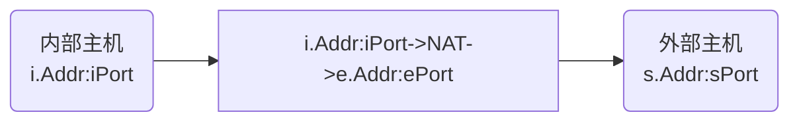
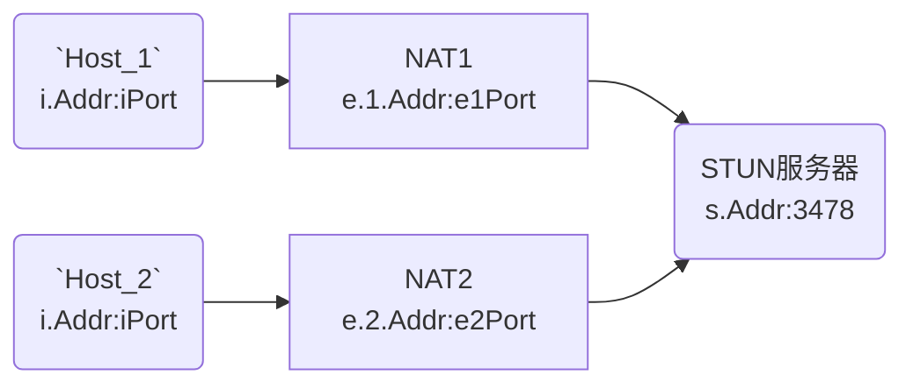
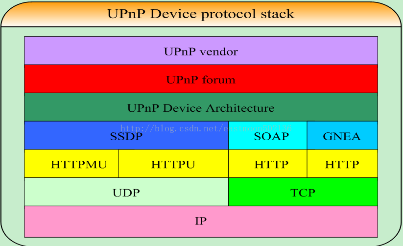
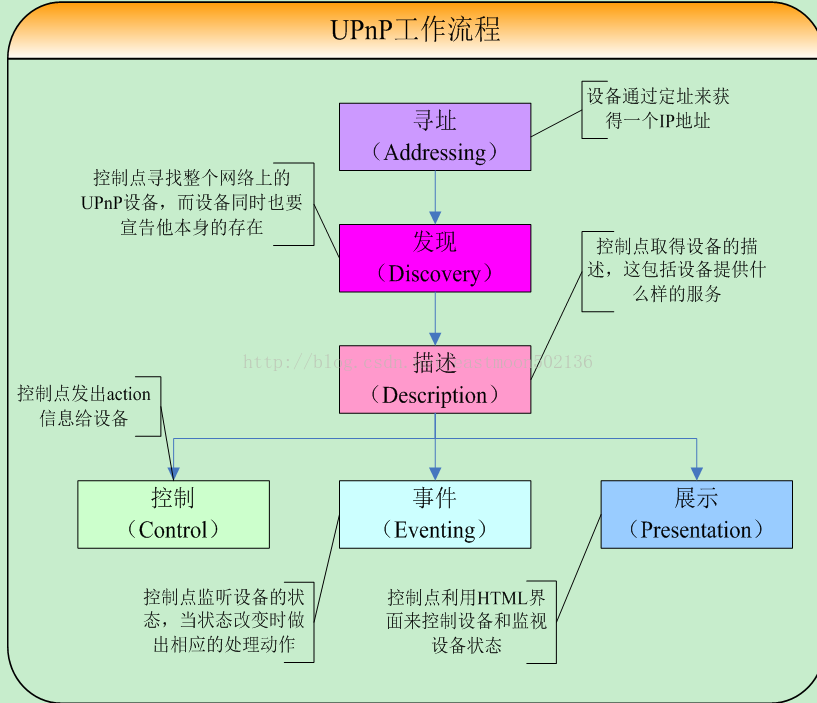

# NAT和NAT穿透

网络地址转换(Network Address Translation, NAT)是一种在IP数据包通过路由器或防火墙时重写来源IP地址或目的IP地址的技术。这种技术被普遍使用在**有多台主机但只通过一个公有IP地址访问互联网**的私有网络中。

NAT的优点：
* 节省IP地址，为IPv4续命
* 来自外部网络的连接不能轻易到达内网，一定程度上保障了内部网络安全

NAT的主要缺点：
* 一些需要初始化从外部网络创建的TCP连接和无状态协议（比如UDP）无法实现
  * 除非NAT路由器管理者预先设置了规则，否则送来的数据包将不能到达正确的目的地址

## NAT分类

假设一个内部主机`i.Addr`通过端口`iPort`向外部主机`s.Addr`的端口`sPort`发送请求，它们之间有一个NAT，将`i.Addr:iPort`转换为了`e.Addr:ePort`。

### 静态NAT(Static NAT)

* 一个局域网对外有多个`e.Addr`
* `i.Addr`和`e.Addr`一一对应
* 每个`i.Addr`都固定分配一个`e.Addr`

最古老的NAT方法。

* 每个访问外网的主机都必须固定分配一个外网IP
* 只有分配了外网IP的主机才能访问外网，其他主机不能访问外网。

### 基本NAT/动态NAT(Basic NAT/Dynamic NAT)

* 一个局域网对外有多个`e.Addr`
* `i.Addr`和`e.Addr`一一对应
* NAT程序维护一个可用IP池，用于动态分配`e.Addr`
* 只有`i.Addr`要访问外网时才给分配`e.Addr`

这种方法也非常古老，现在用的不多。

* IP地址按需取用，比静态NAT更节约IP地址

### 网络地址端口转换(NAPT)

* 一个局域网对外只有一个`e.Addr`
* `i.Addr:iPort`和`e.Addr:ePort`对应
* 只需要一个`e.Addr`IP地址即可运行，不需要IP池

NAPT是现在常用的技术。

* IP地址只需要一个，对外端口按需取用，IP地址节约到极致

#### 完全圆锥型NAT(Full cone NAT)

* `i.Addr:iPort`和`ePort`一一对应
* 所有发自`i.Addr:iPort`的数据包都经由`e.Addr:ePort`向外发送
* 任意外部主机向`e.Addr:ePort`发送数据包都能到达`i.Addr:iPort`

#### 受限圆锥型NAT((Address-)Restricted cone NAT)

* `i.Addr:iPort`和`ePort`一一对应
* 所有发自`i.Addr:iPort`的数据包都经由`e.Addr:ePort`向外发送
* 只有`s.Addr`上的任意端口向`e.Addr:ePort`发送数据包才能到达`i.Addr:iPort`

#### 端口受限圆锥型NAT(Port-Restricted cone NAT)

* `i.Addr:iPort`和`ePort`一一对应
* 所有发自`i.Addr:iPort`的数据包都经由`e.Addr:ePort`向外发送
* 只有`s.Addr:sPort`向`e.Addr:ePort`发送数据包才能到达`i.Addr:iPort`

#### 对称NAT(Symmetric NAT)

* 同一个`i.Addr:iPort`到不同的`s.Addr:sPort`都各自对应一个`ePort`
* 所有发自`i.Addr:iPort`且到达`s.Addr:sPort`的数据包都经由`e.Addr:ePort`向外发送
* 只有`s.Addr:sPort`向`e.Addr:ePort`发送数据包才能到达`i.Addr:iPort`

## NAT穿透方法

### STUN(Simple Traversal of User Datagram Protocol Through Network Address Translators)

STUN协议主要针对通信双方都在NAT后的情况，需要一个通信双方都能访问到的STUN服务器协调双方的通信。

假定一个STUN服务器位于公网上，IP地址为`s.Addr`，STUN服务端应用程序监听于默认端口3478；`Host_1`和`Host_2`分别位于两个NAT后，其内网IP地址正巧都一样是`i.Addr`，它们都运行这STUN客户端，都通过端口`iPort`与STUN服务器持续通信。而经过NAT后，STUN服务器看到的它们建立连接的IP地址和端口分别是`e.1.Addr:e1Port`和`e.2.Addr:e2Port`。

在实际的通信开始前，STUN服务器会维护一个主机->IP+端口的表，例如上面这种情况下，表格中就会有`Host_1->e.1.Addr:e1Port`和`Host_2->e.2.Addr:e2Port`两项。

若假定`Host_1`想向`Host_2`发送一条信息。显然，**不管NAT1是哪种模式，都不影响`Host_1`出站流量**，`Host_1`发送的数据包能正常出站。因此，关键问题就在于，数据包离开了NAT1之后，如何经过NAT2到达`Host_2`。

根据前文所述，NAT2可能采用了上述四种模式之一，不同的模式下STUN的处理方式不尽相同。在开始通信前，STUN客户端和服务器会通过一系列TCP和UDP包探测所处的NAT环境（探测方式很简单，稍微想想就能懂，在不济看看不同NAT环境下的运行过程也能想到对应的探测方法）。

##### 直接向`Host_2`的IP地址发送

当`Host_1`要发信息给`Host_2`的`jPort`时：

1. `Host_1`上的客户端向STUN服务器查询`Host_2`此时的IP地址`e.2.Addr`
2. `Host_1`上的客户端直接将包发往`e.2.Addr:jPort`

显然，这种方法**要求到`e.2.Addr`任何端口的包都能到达`Host_2`**，因此只有在NAT2是基本NAT时才可用。

##### 直接向`Host_2`在NAT2对应的端口中发送

当`Host_1`要发信息给`Host_2`的`jPort`时：

1. `Host_1`上的客户端向STUN服务器查询`Host_2`此时的IP地址和端口`e.2.Addr:e2Port`
2. `Host_1`上的客户端将包进行一层封装，在载荷中注明真实目的端口为`jPort`，然后发往`e.2.Addr:e2Port`（进而通过NAT2转到`i.Addr:iPort`）
3. `Host_2`上监听于`iPort`的STUN客户端收到包后，从载荷中拆出真正的数据包和目的端口`jPort`
4. `Host_2`上的客户端将包转发到`localhost:jPort`

根据前面分析的NAT规则，当`Host_2`上的客户端向STUN服务器发包时，STUN服务器收到的包的源地址和端口`e.2.Addr:e2Port`就是NAT2为`Host_2`开放的地址和端口，因此直接往`e.2.Addr:e2Port`发包就能到达`Host_2`。

显然，这种方法**要求从任何地址到`e.2.Addr:e2Port`的包都能到达`Host_2`**，因此只有在NAT2是基本NAT或完全圆锥型NAT时才可用。

##### `Host_2`先往`Host_1`发一个消息，`Host_1`再向`Host_2`对应的端口中发送

当`Host_1`要发信息给`Host_2`的`jPort`时：

1. `Host_1`通知STUN服务器：我要向`Host_2`发送消息
2. STUN服务器通过于`Host_2`的持续通信过程通知`Host_2`：`Host_1`要连接你；同时附上服务器中记录的`Host_1`当前的地址和端口`e.1.Addr:e1Port`
3. `Host_2`通过端口`iPort`向`e.1.Addr:e1Port`发送任意信息
4. `Host_1`上的客户端将包进行一层封装，在载荷中注明真实目的端口为`jPort`，然后发往`e.2.Addr:e2Port`（进而通过NAT2转到`i.Addr:iPort`）
5. `Host_2`上监听于`iPort`的STUN客户端收到包后，从载荷中拆出真正的数据包和目的端口`jPort`
6. `Host_2`上的客户端将包转发到`localhost:jPort`

仔细一看，这种方法其实是欺骗了NAT2，让它以为`Host_2`在与`e.1.Addr:e1Port`通信：`Host_2`通过`iPort`向`e.1.Addr:e1Port`发送的消息会在NAT2处变成通过`e2Port`向`e.1.Addr:e1Port`发送了信息。进而，在受限圆锥型NAT和端口受限圆锥型NAT中，后续来自`e.1.Addr:e1Port`的所有信息都能通过`e2Port`畅通无阻地到达`Host_1`的`iPort`端口。

因此这种方法在NAT2是基本NAT、完全圆锥型NAT、受限圆锥型NAT和端口受限圆锥型NAT时都可用。

对于对称型NAT，`Host_2`从`iPort`发送到`e.1.Addr:e1Port`的信息会被NAT2分到另一个端口`e3Port`，这时`Host_1`必须往`e.2.Addr:e3Port`发消息才能到达`Host_1`，但是，`e3Port`具体是哪个是由NAT路由器决定的，`Host_2`并不知道具体端口号，`Host_1`也只有在NAT1是基本NAT或完全圆锥型NAT时才能收到`Host_2`发来的任意信息得到源地址端口，所以，如果通信双方有一方是对称型NAT时，另一方必须是基本NAT或完全对称NAT，STUN才能运行。

### TURN(Traversal Using Relay NAT)：由服务器来转发包，适用于任何NAT

TURN是STUN的扩展，相比STUN多了由服务器来转发包的功能，从而能适应双方都是对称型NAT的环境。

当`Host_1`要发信息给`Host_2`的`jPort`时：

1. `Host_1`上的客户端将包进行一层封装，在载荷中注明真实目的为`Host_2`的`jPort`，然后发往服务器`s.Addr:3478`
2. STUN服务器拆包，得知这是要给`Host_2`的包，于是发往`e.2.Addr:e2Port`（进而通过NAT2转到`i.Addr:iPort`）
3. `Host_2`上监听于`iPort`的STUN客户端收到包后，从载荷中拆出真正的数据包和目的端口`jPort`
4. `Host_2`上的客户端将包转发到`localhost:jPort`

这种方法完全由服务器进行包的转发，在NAT看来，就是`Host_2`一直在向一个服务器请求数据，与一般的HTTP等常用通信方式无异，因此在任何NAT环境下都可以使用。

和STUN相比，TURN主要的缺点就是所有流量都要走服务器，延迟高，且服务器负载很大。

### 由内网主机控制端口映射规则

#### UPnP(Universal Plug and Play, 通用即插即用)

UPnP 并不是周边设备即插即用模型的简单扩展。在设计上，它支持0设置、网络连接过程“不可见”和自动查找众多供应商提供的多如繁星的设备的类型。换言之，一个 UPnP 设备能够自动跟一个网络连接上、并自动获得一个 IP 地址、广播自己的功能并获悉其它已经连接上的设备及其功能。最后，此设备能自动顺利地切断网络连接，并且不会引起意想不到的问题。

* HTTPU和HTTPMU是在UDP协议上实现的HTTP协议
* SSDP、GENA、SOAP指的是保存在XML文件中的数据格式
* UPnP Device Architecture 仅仅是一个抽象的、公用的设备模型。任何UPnP设备都必须使用这一层
* UPnP Forum 是UPnP论坛的各个专业委员会的设备定义层，在这个论坛中，不同电器设备由不同的专业委员会定义，，例如：电视委员会只负责定义网络电视设备部分，空调器委员会只负责定义网络空调设备部分等
* UPnP Vendor 的信息是由设备制造厂商来“填充” 的，这部分一般有设备厂商提供的、对设备控制和操作的底层代码，然后，就是名称序列号呀，厂商信息之类的东西

* 发现：SSDP(Simple Service Discovery Protocol, 简单发现协议)
  * 当一个控制点（客户端）接入网络的时候，它可以向一个特定的多播地址的SSDP端口使用M-SEARCH方法发送“ssdp:discover”消息。当设备监听到这个保留的多播地址上由控制点发送的消息的时候，设备会分析控制点请求的服务，如果自身提供了控制点请求的服务，设备将通过单播的方式直接响应控制点的请求。
  * 当一个设备计划从网络上卸载的时候，它也应当向一个特定的多播地址的SSDP端口使用NOTIFY方法发送“ssdp:byebye”消息。
    * 但是，即使没有发送“ssdp:byebye”消息，控制点也会根据“ssdp:alive”消息指定的超时值，将超时并且没有再次收到的“ssdp:alive”消息对应的设备认为是失效的设备。
  * 在IPv4环境，当需要使用多播方式传送相关消息的时候，SSDP一般使用多播地址239.255.255.250和UDP端口号1900。
  * 根据互联网地址指派机构的指派，SSDP在IPv6环境下使用多播地址FF0X::C，这里的X根据scope的不同可以有不同的取值。
* 控制：SOAP(Simple Object Access Protocol, 简单对象访问协议)
  * SOAP只指定了XML文件的格式，具体的内容格式由UPnP Forum和UPnP Vendor设备厂商自行指定，UPnP也因此非常自由
  * SOAP是交换数据的一种协议规范，使用在计算机网络Web服务中，交换带结构的信息。SOAP为了简化网页服务器从XML数据库中提取数据时，节省去格式化页面时间，以及不同应用程序之间按照HTTP通信协议，遵从XML格式执行资料互换，使其抽象于语言实现、平台和硬件。
* 事件：GENA(Generic Event Notification Architecture, 普通事件通知体系)
  * 事件系统用于描述一个服务状态的描述变化。

UPnP能控制设备，当然也包括路由器设备

#### IGD(Internet Gateway Device, 互联网网关设备协议)

IGD就是基于UPnP控制互联网网关设备的协议。互联网网关设备就是UPnP Forum层定义的设备之一。

IGD在内网主机的客户端侧有如下功能：
* 获知公网（外部）IP地址
* 请求一个新的公网IP地址
* 列举现有的端口映射
* 添加和移除端口映射
* 给映射分配租赁时间

### 把端口映射情况直接告诉内网主机

#### NAT-PMP(NAT Port Mapping Protocol, NAT端口映射协议)

NAT-PMP是一个能自动创建网络地址转换（NAT）设置和端口映射配置而无需用户介入的网络协议。

NAT-PMP使用用户数据报协议（UDP），在5351端口运行。

NAT-PMP是PCP(端口控制协议)的前身。

>2014年10月，Rapid7安全研究员Jon Hart公布，因厂商对NAT-PMP协议设计不当，估计公网上有1200万台网络设备受到NAT-PMP漏洞的影响。NAT-PMP协议的规范中特别指明，NAT网关不能接受来自外网的地址映射请求，但一些厂商的设计并未遵守此规定。黑客可能对这些设备进行恶意的端口映射，进行流量反弹、代理等攻击。

#### PCP(Port Control Protocol, 端口控制协议)

许多 ISP 用户的应用程序必须可以通过 Internet 访问（例如，物联网设备、通过网络提供监视的IP摄像机等）。满足此要求的一种方法是创建大规模的静态NAT端口映射。但对于大量用户来说，创建静态NAT端口映射并不是一个可行的解决方案。

端口控制协议(PCP)使内网设备能够为自己和/或其他第三方设备请求特定的NAT端口映射，由NAT设备创建端口映射并将其反馈给内网设备。内网设备于是可以向互联网上的远程设备发送返回的`公网IP地址:端口`信息，从而使用户可以连接到设备。

#### RSIP(Realm Specific IP, 特定域IP)

**RSIP旨在替代NAT**，保持NAT节约IPv4地址的特性，同时保证数据包的端到端完整性。

在RSIP模式下，内网主机访问外网时：
1. `i.Addr`主机上的RSIP客户端请求向RSIP网关发起请求
2. RSIP网关提供一个公网IP`e.Addr`或一个公网IP+一组端口号`e.Addr:ePorts`
3. 同时RSIP网关设置转发规则`e.Addr[:ePort] -> i.Addr`
4. 于是，`i.Addr`就能以RSIP网关提供的IP`e.Addr`作为自己的IP在公网愉快的玩耍了

仔细一看，RSIP和NAT的唯一的区别就是：
* NAT内网主机访问公网时不知道自己的公网IP，也不知道端口会被转成哪个
* RSIP内网主机访问公网时知道自己的公网IP，也知道端口的转换关系

### 让路由器修改IP数据包中的部分内容以使协议正常运行

#### ALG(Application Layer Gateway/Application-Level Gateway, 应用层网关)：针对载荷中包含IP地址而造成错误的协议

ALG针对的场景是：

* 在某些协议中，不仅包头里有一个`i.Addr:iPort`，载荷里面还会有`i.Addr:jPort`
* 包接收方需要向`i.Addr:jPort`发包以进行后续的协议操作

这种场景下存在的问题是：

* NAT只能转换包头的地址和端口
* 载荷里的`j.Addr:jPort`显然是内网地址，包接收方无法向其建立连接

ALG的思想是：

1. NAT路由器识别载荷中的`i.Addr:jPort`并将其转换成`e.Addr:fPort`
2. NAT路由器自动打开端口`fPort`，将其数据转发到`i.Addr:jPort`

ALG支持的协议：FTP、H.323（包括RAS、H.225、H.245）、SIP、DNS、ILS、MSN/QQ、NBT、RTSP、SQLNET、TFTP等。

#### SBC(Session Border Controller, 会话边界控制器)

SBC针对的场景和ALG类似，但其仅面向企业级VoIP应用：

* VoIP协议的载荷中包含IP地址信息
* 通常企业中为了安全，在引入VoIP前势必已经建了很多NAT和防火墙

这种场景下存在的问题是：

* 如果要使用ALG以让VoIP正常工作，就要对大量路由器和防火墙进行升级，费时费力还不安全

SBC的思想是：

1. 终端将IP-PBX/软交换等核心控制设备的地址设置为SBC Proxy的地址
2. 终端注册到核心设备时，SBC创建相应的地址映射表项
3. 当终端开始呼叫时，SBC修改相应的地址信息，将报文发送给真正的核心设备
4. 所有的信令流、媒体流都可经过SBC进行转发，另外也可设置媒体流旁路

仔细一看，这不就是个针对VoIP应用设计的反向代理吗。

### ICE(Interactive Connectivity Establishment, 交互式连接创建)

ICE是一种框架而非协议：

ICE创建是由IETF的MMUSIC(多方多媒体会话控制)工作组开发出来的一种framework，可集成各种NAT穿透技术，如STUN、TURN、RSIP等。该framework可以让SIP的客户端利用各种NAT穿透方式打穿远程的防火墙。
