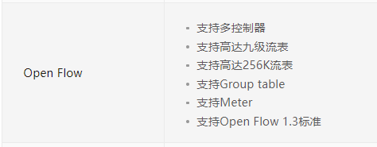
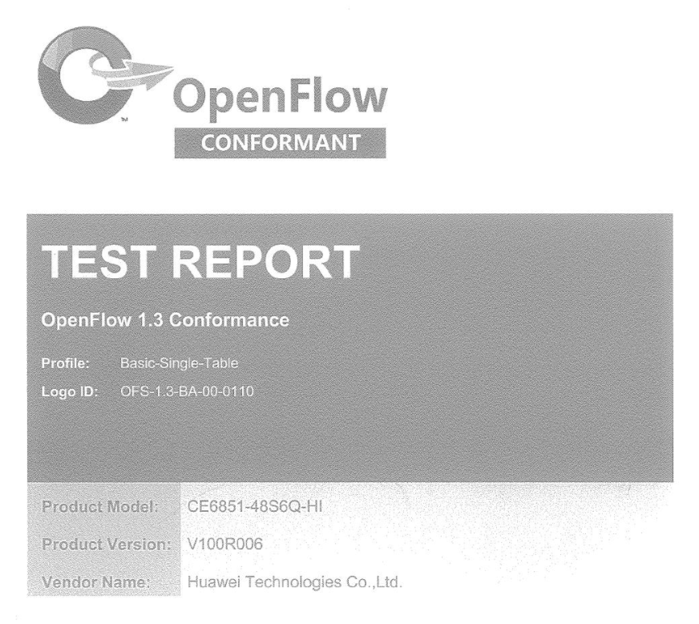
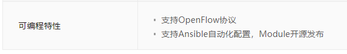

# Huawei的OpenFlow交换机调研

## 公司信息

调研项目|结果
-|-
公司所在地|中国
交换机销售页|https://e.huawei.com/cn/products/enterprise-networking/switches

## 设备信息

### S12700系列敏捷交换机

#### 产品资料中对OpenFlow 1.3支持性的叙述

Huawei S系列交换机OpenFlow1.3认证证书：https://e.huawei.com/cn/material/networking/campusswitch/ee0517e14102455daa07fb12228e04e3

产品主页上的技术规格表：https://e.huawei.com/cn/products/enterprise-networking/switches/campus-switches/s12700

国内厂商的OpenFlow 1.3认证记录：https://www.sdnctc.com/index.php/readylogo_search/readylogo_search/id/12/action/all

华为 Sx700系列交换机 OpenFlow详版彩页：https://max.book118.com/html/2017/0624/117802655.shtm

### CloudEngine 12800系列数据中心交换机

#### 产品资料中对OpenFlow 1.3支持性的叙述

CloudEngine交换机OpenFlow认证证书：https://e.huawei.com/cn/material/networking/dcswitch/93b832b9aeba4b0689a4e5c40b6e67c9

产品主页上的技术规格表：https://e.huawei.com/cn/products/enterprise-networking/switches/data-center-switches/ce12800

国内厂商的OpenFlow 1.3认证记录：https://www.sdnctc.com/index.php/readylogo_search/readylogo_search/id/12/action/all
