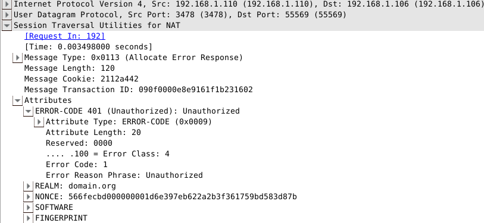

# 【转载】P2P通信标准协议(二)之TURN

原文：[《P2P通信标准协议(二)之TURN》](https://evilpan.com/2015/12/15/p2p-standard-protocol-turn/)

上一篇[P2P通信标准协议(一)](https://evilpan.com/2015/12/12/p2p-standard-protocol-stun/)介绍了在NAT上进行端口绑定的通用规则，应用程序可以根据这个协议来设计网络以外的通信。但是，[STUN/RFC5389](http://www.rfc-editor.org/info/rfc5389)协议里能处理的也只有市面上大多数的`Cone NAT`（关于NAT类型可以参照[P2P通信原理与实现](https://evilpan.com/2015/10/31/p2p-over-middle-box/)），对于`Symmetric NAT`，传统的P2P打洞方法是不适用的。因此为了保证通信能够建立，我们可以在没办法的情况下用保证成功的中继方法（Relaying），虽然使用中继会对服务器负担加重，而且也算不上P2P，但是至少保证了最坏情况下信道的通畅，从而不至于受NAT类型的限制。[TURN/RFC5766](http://www.rfc-editor.org/info/rfc5766)就是为此目的而进行的拓展。

## TURN简介

TURN的全称为Traversal Using Relays around NAT，是STUN/RFC5389的一个拓展，主要添加了Relay功能。如果终端在NAT之后， 那么在特定的情景下，有可能使得终端无法和其对等端（peer）进行直接的通信，这时就需要公网的服务器作为一个中继， 对来往的数据进行转发。这个转发的协议就被定义为TURN。TURN和其他中继协议的不同之处在于，它允许客户端使用同一个中继地址（relay address）与多个不同的peer进行通信。


使用TURN协议的客户端必须能够通过中继地址和对等端进行通讯，并且能够得知每个peer的的IP地址和端口（确切地说，应该是peer的服务器反射地址）。 而这些行为如何完成，是不在TURN协议范围之内的。其中一个可用的方式是客户端通过email来告知对等端信息， 另一种方式是客户端使用一些指定的协议，如“introduction” 或 “rendezvous”，详见[RFC5128](http://www.rfc-editor.org/info/rfc5128).


如果TURN使用于ICE协议中，relay地址会作为一个候选，由ICE在多个候选中进行评估，选取最合适的通讯地址。一般来说中继的优先级都是最低的。 TURN协议被设计为ICE协议(Interactive Connectivity Establishment)的一部分，而且也强烈建议用户在他们的程序里使用ICE，但是也可以独立于ICE的运行。 值得一提的是，TURN协议本身是STUN的一个拓展，因此绝大部分TURN报文都是STUN类型的，作为STUN的一个拓展，TURN增加了新的方法（method）和属性（attribute）。 因此阅读本章时最好先了解一下[STUN协议](https://evilpan.com/2015/12/12/p2p-standard-protocol-stun/)。

## 操作概述

在典型的情况下，TURN客户端连接到内网中，并且通过一个或者多个NAT到达公网，TURN服务器架设在公网中，不同的客户端以TURN服务器为中继和其他peer进行通信，如下图所示：

```                                            Peer A
                                            Server-Reflexive    +---------+
                                            Transport Address   |         |
                                            192.0.2.150:32102   |         |
                                                |              /|         |
                              TURN              |            / ^|  Peer A |
        Client’s              Server            |           /  ||         |
        Host Transport        Transport         |         //   ||         |
        Address               Address           |       //     |+---------+
       10.1.1.2:49721       192.0.2.15:3478     |+-+  //     Peer A
                |               |               ||N| /       Host Transport
                |   +-+         |               ||A|/        Address
                |   | |         |               v|T|     192.168.100.2:49582
                |   | |         |               /+-+
     +---------+|   | |         |+---------+   /              +---------+
     |         ||   |N|         ||         | //               |         |
     | TURN    |v   | |         v| TURN    |/                 |         |
     | Client  |----|A|----------| Server  |------------------|  Peer B |
     |         |    | |^         |         |^                ^|         |
     |         |    |T||         |         ||                ||         |
     +---------+    | ||         +---------+|                |+---------+
                    | ||                    |                |
                    | ||                    |                |
                    +-+|                    |                |
                       |                    |                |
                       |                    |                |
                 Client’s                   |            Peer B
                 Server-Reflexive    Relayed             Transport
                 Transport Address   Transport Address   Address
                 192.0.2.1:7000      192.0.2.15:50000     192.0.2.210:49191
```
在上图中，左边的TURN Client是位于NAT后面的一个客户端（内网地址是10.1.1.2:49721），连接公网的TURN服务器（默认端口3478）后， 服务器会得到一个Client的`反射地址`（Reflexive Transport Address, 即NAT分配的公网IP和端口）192.0.2.1:7000， 此时Client会通过TURN命令创建或管理`ALLOCATION`，allocation是服务器上的一个数据结构，包含了中继地址的信息。 服务器随后会给Client分配一个中继地址，即图中的192.0.2.15:50000，另外两个对等端若要通过TURN协议和Client进行通信，可以直接往中继地址收发数据即可，TURN服务器会把发往指定中继地址的数据转发到对应的Client，这里是其反射地址。


Server上的每一个allocation都唯一对应一个client，并且只有一个中继地址，因此当数据包到达某个中继地址时，服务器总是知道应该将其转发到什么地方。但值得一提的是，一个Client可能在同一时间在一个Server上会有多个allocation，这和上述规则是并不矛盾的。

## 传输

在协议中,TURN服务器与peer之间的连接都是基于UDP的,但是服务器和客户端之间可以通过其他各种连接来传输STUN报文, 比如TCP/UDP/TLS-over-TCP. 客户端之间通过中继传输数据时候,如果用了TCP,也会在服务端转换为UDP,因此建议客户端使用UDP来进行传输. 至于为什么要支持TCP,那是因为一部分防火墙会完全阻挡UDP数据,而对于三次握手的TCP数据则不做隔离.

## 分配(Allocations)

要在服务器端获得一个中继分配,客户端须使用分配事务. 客户端发送分配请求(Allocate request)到服务器,然后服务器返回分配成功响应,并包含了分配的地址.客户端可以在属性字段描述其想要的分配类型(比如生命周期).由于中继数据实现了安全传输,服务器会要求对客户端进行验证,主要使用STUN的`long-term credential mechanism`.


一旦中继传输地址分配好,客户端必须要将其保活.通常的方法是发送刷新请求(Refresh request)到服务端.这在TURN中是一个标准的方法.刷新频率取决于分配的生命期,默认为10分钟.客户端也可以在刷新请求里指定一个更长的生命期, 而服务器会返回一个实际上分配的时间. 当客户端想中指通信时,可以发送一个生命期为0的刷新请求.


服务器和客户端都保存有一个成为五元组(5-TUPLE)的信息,比如对于客户端来说,五元组包括客户端本地地址/端口,服务器地址/端口, 和传输协议;服务器也是类似,只不过将客户端的地址变为其反射地址,因为那才是服务器所见到的. 服务器和客户端在分配 请求中都带有5-TUPLE信息,并且也在接下来的信息传输中使用,因此彼此都知道哪一次分配对应哪一次传输.

```    TURN                                 TURN           Peer          Peer
    client                               server          A             B
      |-- Allocate request --------------->|             |             |
      |                                    |             |             |
      |<--------------- Allocate failure --|             |             |
      |                 (401 Unauthorized) |             |             |
      |                                    |             |             |
      |-- Allocate request --------------->|             |             |
      |                                    |             |             |
      |<---------- Allocate success resp --|             |             |
      |            (192.0.2.15:50000)      |             |             |
      //                                   //            //            //
      |                                    |             |             |
      |-- Refresh request ---------------->|             |             |
      |                                    |             |             |
      |<----------- Refresh success resp --|             |             |
      |                                    |             |             |
```
如上图所示,客户端首先发送Allocate请求,但是没带验证信息,因此STUN服务器会返回error response,客户端收到错误后加上所需的验证信息再次请求,才能进行成功的分配.

## 发送机制(Send Mechanism)

client和peer之间有两种方法通过TURN server交换应用信息,第一种是使用`Send`和`Data`方法(method),第二种是使用通道(channels),两种方法都通过某种方式告知服务器哪个peer应该接收数据,以及服务器告知client数据来自哪个peer.


Send Mechanism使用了Send和Data指令(Indication).其中Send指令用来把数据从client发送到server,而Data指令用来把数据从server发送到client.当使用Send指令时,客户端发送一个Send Indication到服务端,其中包含:


* XOR-PEER-ADDRESS属性,指定对等端的(服务器反射)地址.
* DATA属性,包含要传给对等端的信息.


当服务器收到Send Indication之后,会将DATA部分的数据解析出来,并将其以UDP的格式转发到对应的端点去,并且在封装数据包的时候把client的中继地址作为源地址.从而从对等端发送到中继地址的数据也会被服务器转发到client上. 值得一提的是,Send/Data Indication是不支持验证的,因为长效验证机制不支持对indication的验证,因此为了防止攻击, TURN要求client在给对等端发送indication之前先安装一个到对等端的许可(permission),如下图所示,client到Peer B 没有安装许可,导致其indication数据包将被服务器丢弃,对于peer B也是同样:

```    TURN                                 TURN           Peer          Peer
    client                               server          A             B
      |                                    |             |             |
      |-- CreatePermission req (Peer A) -->|             |             |
      |<-- CreatePermission success resp --|             |             |
      |                                    |             |             |
      |--- Send ind (Peer A)-------------->|             |             |
      |                                    |=== data ===>|             |
      |                                    |             |             |
      |                                    |<== data ====|             |
      |<-------------- Data ind (Peer A) --|             |             |
      |                                    |             |             |
      |                                    |             |             |
      |--- Send ind (Peer B)-------------->|             |             |
      |                                    | dropped     |             |
      |                                    |             |             |
      |                                    |<== data ==================|
      |                            dropped |             |             |
      |                                    |             |             |
```
TURN支持两种方式来创建许可,比如其中一种就是发送`CreatePermission request`.

## 信道机制(Channels)

对于一些应用程序,比如VOIP(Voice over IP),在Send/Data Indication中多加的36字节格式信息会加重客户端和服务端之间的带宽压力.为改善这种情况,TURN提供了第二种方法来让client和peer交互数据.该方法使用另一种数据包格式, 即`ChannelData message`,信道数据报文. ChannelData message不使用STUN头部,而使用一个4字节的头部,包含了一个称之为信道号的值(channel number).每一个使用中的信道号都与一个特定的peer绑定,即作为对等端地址的一个记号.


要将一个信道与对等端绑定,客户端首先发送一个信道绑定请求(ChannelBind Request)到服务器,并且指定一个未绑定的信道号以及对等端的地址信息. 绑定后client和server都能通过ChannelData message来发送和转发数据.信道绑定默认持续10分钟,并且可以通过重新发送ChannelBind Request来刷新持续时间.和Allocation不同的是,并没有直接删除绑定的方法,只能等待其超时自动失效.

```    TURN                                 TURN           Peer          Peer
    client                               server          A             B
      |                                    |             |             |
      |-- ChannelBind req ---------------->|             |             |
      | (Peer A to 0x4001)                 |             |             |
      |                                    |             |             |
      |<---------- ChannelBind succ resp --|             |             |
      |                                    |             |             |
      |-- [0x4001] data ------------------>|             |             |
      |                                    |=== data ===>|             |
      |                                    |             |             |
      |                                    |<== data ====|             |
      |<------------------ [0x4001] data --|             |             |
      |                                    |             |             |
      |--- Send ind (Peer A)-------------->|             |             |
      |                                    |=== data ===>|             |
      |                                    |             |             |
      |                                    |<== data ====|             |
      |<------------------ [0x4001] data --|             |             |
      |                                    |             |             |
```
上图中0x4001为信道号,即ChannelData message的头部中头2字节,值得一提的是信道号的选取有如下要求:


* 0x0000-0x3FFF : 这一段的值**不能**用来作为信道号
* 0x4000-0x7FFF : 这一段是可以作为信道号的值,一共有16383种不同值在目前来看是足够用的
* 0x8000-0xFFFF : 这一段是保留值,留给以后使用


还是那句老话,关于协议具体的细节可以去翻阅RFC5766的草稿,其中每个属性以及其格式都介绍得很详细.

## 实例

在上一章也提到过,因为RFC是标准协议,因此实现上往往有良好的兼容性和拓展性.现存的开源P2P应用程序, 如果按照标准来设计,可以很容易与之对接.其中比较著名的就是[PJSIP](http://www.pjsip.org),PJSIP是一个开源的多媒体通信库,实现了许多标准协议,如SIP, SDP, RTP, STUN, TURN 和 ICE. 当然我们也能自己实现.比如GitHub上的[TurnServer](https://github.com/evilpan/TurnServer)就是其中一个对TURN服务端的实现.下面在局域网环境下对TURN数据包进行简要分析.首先有如下机器情况:


* TurnServer运行在192.168.1.110,使用默认端口3478,采用用户名和密码验证,其中用户名为pannzh,密码123456
* TurnClient运行在192.168.1.106,为了方便,令peer也在192.168.1.106运行,端口为59593

这里使用wireshark来抓包分析,关于wireshark的简介可以参照我之前的文章[细说中间人攻击(一)](https://evilpan.com/2015/11/01/mitm-detail-1/), 首先TurnClient发送Allocation请求:


可以看到第一次requst被服务器拒绝,因为后者要求nonce验证信息,服务器的返回中包含了nonce信息, 除此之外还包含了ERROR-CODE,SOFTWARE,FINGERPRINT属性.



在下一次request请求中,客户端加上了收到的nonce,以及USERNAME和REALM等属性,再次发送到TurnServer:


服务器接收到了正确的allocation请求,于是返回succcess response,可以看到在返回中带有默认的lifetime为1800秒, XOR-MAPPED-ADDRESS以及XOR-RELAY-ADDRESS等属性:


前文也说过,若要和peer进行通信,必须先创建一个许可,因此Client向服务器发送CreatePermission请求,其中携带了peer的信息:


服务器如果通过验证,就会返回success response,随后Client可以通过上文说到的两种方法与Peer进行通讯,比如下面的Send indication方法:


通过对TurnServer发送indication告知数据的接收方以及数据内容让TurnServer进行转发,从而间接地向对等端发送DATA. 而从对等端来看,就是收到一个从client的relay地址192.168.1.110:65315到目的地址192.168.1.106:59593(即peer地址)的UDP数据包.

## 后记

本来打算这篇介绍完TURN和ICE的,不过后来发现内容实在有点多,即便是只粗略介绍.因此只能把ICE协议的介绍留在下一篇来说了. TURN协议因为是STUN的拓展,当然也沿袭了STUN的工具性质,只为穿越NAT提供方法,而不作为P2P通信的完整解决方案.一个比较适合研究的TurnServer源代码我也放到[这里](https://github.com/evilpan/TurnServer)了,而客户端的实现则根据每个人的具体需求而不同,因此不再赘述.
