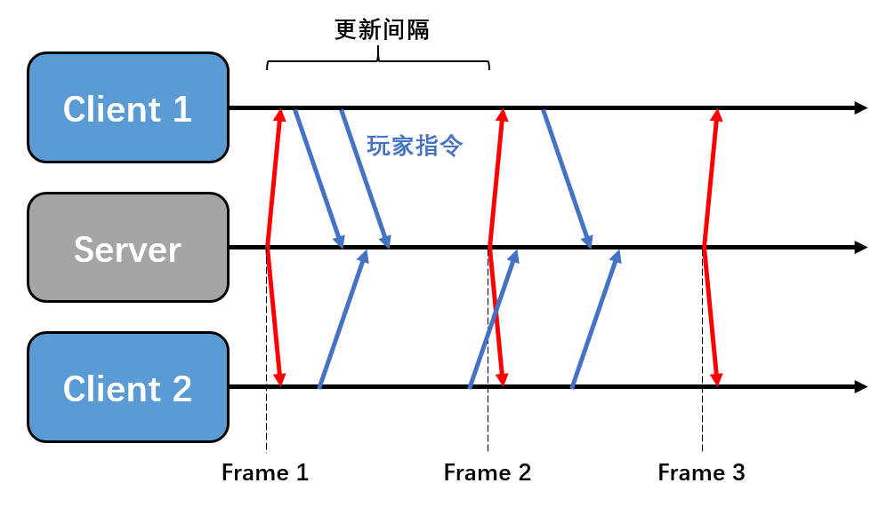
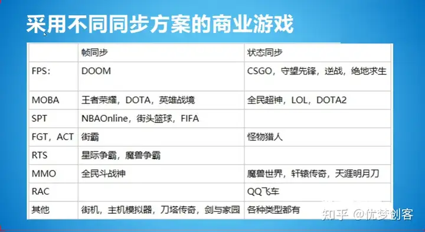
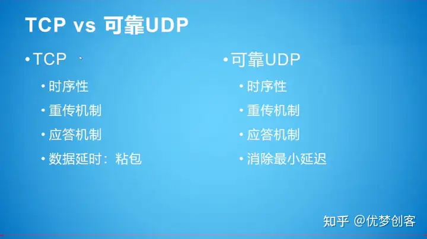
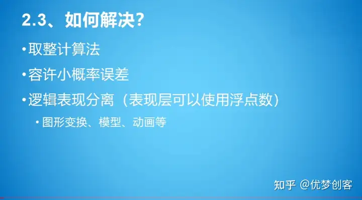
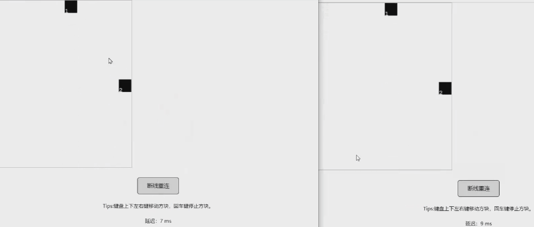

# 【摘录】帧同步LockStep：原理与实现

帧同步与更为传统的状态同步均为游戏常见同步方案，主要区别在于：

状态同步主要逻辑计算放在服务器端，将计算结果下发给客户端；

帧同步服务器仅仅起到收集客户端输入并广播的作用。

## 基本原理

某MMORPG游戏，为了增加同屏人数，使用了**服务端运行全量逻辑**方案+AOI同步优化，并且只同步玩家释放技能指令，血量改变，蓝量改变等**状态数据**来优化带宽占用————状态同步

某MOBA游戏，为了应对恶劣的网络环境与优化带宽，使用了**自定义可靠UDP**方案，**按帧同步数据**，并在本地使用**定点数**，服务器运行全量战斗逻辑用于判决玩家是否存在作弊行为————帧同步

某FPS游戏，本地与服务器同时跑全量战斗逻辑，本地可先行与服务器做**预测**，并且按**逻辑帧**来搜集同步每一帧**发生变化的状态数据**，当客户端发现自己与服务端状态不一致时进行回滚————状态帧同步

### 状态同步

当某个客户端进行了某个操作后，操作发送到服务器，服务器将玩家的操作执行出结果，得出玩家现在的快照（位置、血量、蓝量等等变化的信息），再由服务器将该客户端的信息广播下发到其他的客户端进行同步。

### 帧同步技术

其原理其实颇为简单，客户端将玩家输入不断发送给服务端，服务器以一个固定的频率组合客户端的输入，并把组合的数据构成一帧广播给客户端。

若服务端在一个更新周期内未收到客户端数据则视为无操作，而客户端缺失一帧数据则会卡住自己，需要向服务器申请缺失数据。

未收到客户端数据并不一定意味着客户端侧真的无操作，也有可能是客户端数据延迟太高或在网络中被丢包。有些帧同步方案会要求客户端每一帧都必须发包，无操作就发空包，服务器只有在收到所有客户端的一帧后才同步给其他客户端。这样的方法可以保证客户端的每个操作都是有效的，但是这样只要有一个玩家延迟高卡住那所有玩家都会卡住。

### 状态帧同步

状态帧同步就是状态同步和帧同步的概念相结合。客户端向服务器上传操作，服务器跑逻辑，但是又在按照固定的每一帧下发所有玩家的状态（属性位置等）给每一个客户端实现同步。

这里最具典型的就是守望先锋就是采用的状态帧同步的概念。在这个概念中，服务器和客户端都是有一套相同的代码的，但是客户端的逻辑代码更偏向于用来做预测行为，客户端可以预测主玩家的行为，让主玩家不需要等待服务器的快照就能直接执行玩家按下的操作，这样就能增加玩家的体验，而当服务器下发快照的时候，玩家再去验证自己的预测是否正确，不正确的就对操作进行回滚。

## 优缺点

相较状态同步，帧同步主要有一些优点：

1. 由于客户端只需要发送与接收少量指令，在流量上的消耗远低于状态同步
1. 开发效率更高，逻辑上与开发单机类似，不需要联调。
1. 天然支持战斗回放，只需要将保存的帧数据重新播放一遍即可。
1. 由于计算放在了客户端，节约了服务器资源

劣势为：

1. 断线重连更慢
1. 对网络要求更高，需要实现逻辑与表现分离，用画面预表现来弥补
1. 由于客户端处理主要计算，难以实现反作弊，最典型的是视野挂
1. 对于玩家数量巨大的场景支持困难

## 游戏案例

## 帧同步效果演示

这是一个双人射击游戏的演示Demo，游戏场景里有两位玩家，第一位玩家是瑞典的，另外一位是巴西玩家，这两位玩家的网络延迟是不一样的，左边这位同学的网络延迟相对低一点，大概是50ms的网络延迟，右边的巴西玩家延迟比较大，有大概200ms

虽然玩家之间延迟不同，但这两位玩家的画面是完全相同的，这就是帧同步要实现的第一个最基本的技术点，也就是**虽然两位玩家延迟不同，但是这两位玩家所经历的游戏是一样的**，这也是帧同步的难点

另外还有一个技术要点，在第一代的帧同步技术里，就是延迟高的玩家跟延迟低的玩家进行游戏时，延迟高的玩家会把延迟低的玩家卡住，而在第二代的帧同步技术里延迟高的玩家不会卡住延迟低的玩家，只会卡住他自己

## 帧同步游戏框架需要实现什么？

### 可靠UDP协议

#### TCP协议存在的问题

TCP协议为了保证数据的时序性、重传机制、应答机制、粘包机制，会有50毫秒的默认数据延迟，比如有一些只有一个字节的数据包，这时TCP协议如果一个字节，一个字节的发，那么它本身的数据包裹大小就比这个一个字节的数据包要大得多，所以TCP协议有一个粘包机制。粘包机制不是一个缺点，而是一个特性，它会等待50毫秒，然后将这50毫米以内的小数据包合并成一个包发送。

#### 解决方法

由于TCP协议存在默认延迟的问题，要使用无粘包机制的UDP协议以避免默认延迟。
但是因为UDP协议本身不能保证时序性，不能进行数据校验和重传，也没有应答机制，不能确定数据的顺序。
可靠UDP就是在UDP协议上增加一些东西，来实现时序性、重传机制、以及应答机制。

### 确定性的数学和物理运算库

#### 浮点数计算的不精确和不一致性

上图左边是正常运行的游戏，右边是断线重连的游戏，在左边完成一局游戏后右边进行断线重连时可以发现左边的三个怪物跟右边的三个怪物的位置是不一样的。

在C#程序里算一下0.1加0.2，得到的结果一定不是0.3，而是比0.3多一点，而且在每个客户端上算出来不一定完全相同。
所以如果你使用了Unity的物理组件、碰撞组件，就会使游戏出现两边客户端不一致的问题。
因为Unity所有的物理、导航、动画、碰撞全部都是基于浮点数运算的，所以我们必须要自己实现一套能够精确运算浮点数的运算库，保证在每个客户端上的浮点数计算结果完全相同。

另外如果仅仅只是实现浮点数的优化并不能达到多个客户端完全同步的目的，还必须要保证随机数一致，使用的容器在存储数据时的顺序也必须一致。

#### 解决方法

定点数：

取整计算法：这个问题可以通过取整计算法来解决，但这种方法也有一点小问题，取整计算法把浮点数取整后的精确性是有误差的

容许小概率的误差：在初始开发时可以允许小概率的误差，出现问题时只要在服务器上给点补偿就行了

逻辑表现分离：可以允许表现层使用浮点数有误差，只需要保证逻辑层没有误差

## 帧同步游戏框架可以实现什么？

### 断线重连

上图是两个玩家的游戏画面，左边是玩家1，右边是玩家2

可以看到玩家1在进行断线重连后通过追帧重新演算到了当前帧的游戏状态，追到当前帧后，玩家1与玩家2又可以进行同步移动了

### 比赛回放

比赛回放的实现还是比较简单的，只要在服务器上记录一下关键帧，然后进行回放就可以了

如果要在客户端回放，就要下发到客户端

### 帧同步游戏框架的反作弊问题

帧同步将