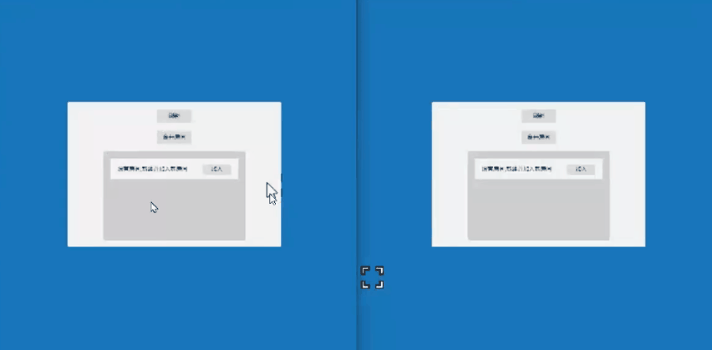

# 【摘录】帧同步LockStep：原理与实现

## 帧同步效果演示

这是一个双人射击游戏的演示Demo，游戏场景里有两位玩家，第一位玩家是瑞典的，另外一位是巴西玩家，这两位玩家的网络延迟是不一样的，左边这位同学的网络延迟相对低一点，大概是50ms的网络延迟，右边的巴西玩家延迟比较大，有大概200ms

虽然玩家之间延迟不同，但这两位玩家的画面是完全相同的，这就是帧同步要实现的第一个最基本的技术点，也就是**虽然两位玩家延迟不同，但是这两位玩家所经历的游戏是一样的**，这也是帧同步的难点

另外还有一个技术要点，在第一代的帧同步技术里，就是延迟高的玩家跟延迟低的玩家进行游戏时，延迟高的玩家会把延迟低的玩家卡住，而在第二代的帧同步技术里**延迟高的玩家不会卡住延迟低的玩家，只会卡住他自己**

## 帧同步游戏框架需要实现什么？

### 可靠UDP协议

#### TCP协议存在的问题

TCP协议为了保证数据的时序性、重传机制、应答机制、粘包机制，会有50毫秒的默认数据延迟，比如有一些只有一个字节的数据包，这时TCP协议如果一个字节，一个字节的发，那么它本身的数据包裹大小就比这个一个字节的数据包要大得多，所以TCP协议有一个粘包机制。粘包机制不是一个缺点，而是一个特性，它会等待50毫秒，然后将这50毫米以内的小数据包合并成一个包发送。

#### 解决方法

由于TCP协议存在默认延迟的问题，要使用无粘包机制的UDP协议以避免默认延迟。
但是因为UDP协议本身不能保证时序性，不能进行数据校验和重传，也没有应答机制，不能确定数据的顺序。
可靠UDP就是在UDP协议上增加一些东西，来实现时序性、重传机制、以及应答机制。

### 确定性的数学和物理运算库

#### 浮点数计算的不精确和不一致性

上图左边是正常运行的游戏，右边是断线重连的游戏，在左边完成一局游戏后右边进行断线重连时可以发现左边的三个怪物跟右边的三个怪物的位置是不一样的。

在C#程序里算一下0.1加0.2，得到的结果一定不是0.3，而是比0.3多一点，而且在每个客户端上算出来不一定完全相同。
所以如果你使用了Unity的物理组件、碰撞组件，就会使游戏出现两边客户端不一致的问题。
因为Unity所有的物理、导航、动画、碰撞全部都是基于浮点数运算的，所以我们必须要自己实现一套能够精确运算浮点数的运算库，保证在每个客户端上的浮点数计算结果完全相同。

另外如果仅仅只是实现浮点数的优化并不能达到多个客户端完全同步的目的，还必须要保证随机数一致，使用的容器在存储数据时的顺序也必须一致。

#### 解决方法

取整计算法：这个问题可以通过取整计算法来解决，但这种方法也有一点小问题，取整计算法把浮点数取整后的精确性是有误差的

容许小概率的误差：在初始开发时可以允许小概率的误差，出现问题时只要在服务器上给点补偿就行了

逻辑表现分离：可以允许表现层使用浮点数有误差，只需要保证逻辑层没有误差

## 帧同步游戏框架可以实现什么？

### 断线重连

上图是两个玩家的游戏画面，左边是玩家1，右边是玩家2

可以看到玩家1在进行断线重连后通过追帧重新演算到了当前帧的游戏状态，追到当前帧后，玩家1与玩家2又可以进行同步移动了

### 比赛回放

比赛回放的实现还是比较简单的，只要在服务器上记录一下关键帧，然后进行回放就可以了

如果要在客户端回放，就要下发到客户端

## 帧同步游戏框架的反作弊问题

