# 计算机网络复习

简答题分要点写，要点下面分小要点写

## what is internet

### “nuts and bolts” view：具体构成描述

* 主机（hosts）或称端系统（end system）：运行着网络应用的计算设备
* 通信链路：电缆、铜线、光纤、电磁波、卫星等将端系统连接在一起
* 大量的包交换：路由器+连接层交换机在转发数据包
* 控制着数据发送的协议：TCP, IP, HTTP, Skype,  Ethernet
* 网络的网络 - Internet：loosely hierarchical松散的等级制度、public Internet versus private intranet
* Internet标准：RFC - Request for comments、IETF - Internet Engineering Task Force
* 通信基础设施：

### a service view：为应用程序提供服务的基础设施角度描述

* 分布式应用程序：Web, VoIP, email, games, e-commerce, file sharing
* 为分布式应用程序提供的通信服务：可靠通信、尽最大可能通信

### internet 和 Internet 的区别

以小写字母 i 开始的 internet（互联网或互连网）是一个通用名词，它泛指由多个计算机网络互连而成的网络。 

以大写字母I开始的的 Internet（因特网）则是一个专用名词，它指当前全球最大的、开放的、由众多网络相互连接而成的特定计算机网络，它采用 TCP/IP 协议族作为通信的规则，且其前身是美国的 ARPANET。

## Edge和Core

* 网络边缘：应用和主机/端系统
  * Client/Server模型：客户端从服务器处接受服务。例Web browser/server、email client/server
  * peer-peer模型：很少使用或完全不使用专用服务器。例Skype,  BitTorrent
* 接入网、物理线路：有线/无线通信链路
* 网络核心：相互连接的路由器、网络的网络
  * packet-switching：分组交换方式，数据被切分成一个个数据片进行传输
  * circuit switching 电路交换方式，每一个数据传输都占用一个专用的线路

## 网络延迟

4种网络延迟：

* 节点处理时间：检查误码、决定出口
* 排队时间：在输出端口处的排队时间。依赖于网络拥塞程度
* 传输时间：将数据传化为信号、通信链路单位时间内能传输的信号有有限
* 传播时间：信号在电路中传到另外一端的时间

一些其他的延迟：

* 一些协议自带延迟发送功能
* media packetization delay介质包装延迟：流数据必须先填满一个最小的包才能打包发送，多见于视频电话应用中

## 丢包Packet loss

交换机队列长度有限，队列满后来的包被丢弃

丢包后重传也会反映在最终的延迟上

## 吞吐量：发送端和接收端之间每秒可以传送的bit数量

## 加密技术名词

* Malware：恶意软件
  * 病毒：破坏计算机功能或者数据的代码，需要一定的用户交互（如接收Email运行病毒程序等）
  * 蠕虫：通过网络进行自我传播的恶意程序，不需要通过用户交互即可进入计算机
  * 木马：用作控制远程计算机的后门程序，隐藏在其他程序中
* Spyware：间谍软件
  * 监控并收集键盘输入、网站浏览记录等
* Botnet：僵尸网络
  * 控制计算机执行某种任务的网络
  * 执行广告、发动DDoS攻击等
* DoS：拒绝服务攻击
  * Vulnerability attack：漏洞攻击
  * DDoS：分布式拒绝服务攻击，短时间内发送大量请求致使对方网络瘫痪
  * Bandwidth flooding：带宽泛洪
  * Connection flooding：连接泛洪
* IP spoofing：IP地址欺骗。产生的IP数据包为伪造的源IP地址，以便冒充其他系统或发件人的身份
* packet sniffing：数据包嗅探。获取网络上流经的数据包
  * 可从无线信道、广播信道、受控的路由器处获取数据包
* record-and-playback：记录某个操作的包并在之后回放（如付款等）

## Internet历史中的名词概念

### 1961-1972: Early packet-switching principles:

* Baran - packet-switching in military nets
* ARPAnet(Advanced Research Project Agency network)
* NCP (Network Control Protocol) first host-host protocol

### 1972-1980: Internetworking, new and proprietary nets:

* ALOHAnet satellite network in Hawaii
* Cerf和Kahn建立了TCP/IP
* Ethernet at Xerox PARC
* proprietary architectures: DECnet, SNA, XNA

### Cerf and Kahn’s internetworking principles:

* minimalism, autonomy - no internal changes required to interconnect networks
* best effort service model
* stateless routers
* decentralized control

### 1980-1990: new protocols, a proliferation of networks

TCP/IP、DNS、ftp、TCP congestion control、Csnet, BITnet, NSFnet, Minitel

1989-1991: Web was invented at CERN

### 1990, 2000’s: commercialization, the Web, new apps

* WWW：hypertext、HTML、HTTP、Mosaic浏览器、Netscape浏览器
* 即时通讯、P2P、网络安全日渐重要

## 分组交换Packet switched 

分组交换的方式分为 datagram networks和virtual circuit networks两种
* datagram networks：网络层无连接服务，比如UDP
* 虚电路Virtual circuit (VC) ：网络层有链接服务，比如TCP

### 虚电路

从起点到终点的一条路径，类比电话线路

* 在传输数据前先建立连接
* 每个分组都携带VC identifier而不是目的地址
* 路径上的每个路由器都维护连接的状态
* 连接/路由资源与VC相关联

#### 组成部分

* 从源到目的的一条链路
* 每条链路都有不同的VC标记
* 沿途所有路由器转发表中的条目（建立连接则新增条目，断开连接则删除条目）

#### 运行过程：signaling protocols

1. Initiate call：发送端初始化调用
2. incoming call：接收端收到调用
3. Accept call：接收端接收调用
4. Call connected：发送端连接建立完成
5. 发送端发送数据
6. 接收端接收数据

### Datagram Network 数据报网络

* 网络层没有建立连接的过程
* 路由器中不维护连接状态信息
* 每个分组都携带目的地址，分组转发使用目的地址
  * 不同分组可能走不同的路径

### 虚电路 vs 数据报网络

数据报网络|虚电路
-|-
用于计算机间的数据传输|用于电话网络
没有严格的时间要求|严格的时间要求、可靠的数据传输
端系统处程序复杂|端系统处程序简单
网络内部程序简单|网络内部程序复杂

数据报网络中的端系统角色复杂，难统一服务

## Internet Protocol (IP)

* 应用层：应用服务，HTTP、FTP、SMTP、...
* 传输层：提供可靠的传输服务，TCP、UDP
* 网络层：无连接的分组传输
  * ARP (Address Resolution Protocol)
  * RARP (Reverse Address Resolution Protocol)
  * ICMP (Internet Control Message Protocol)
  * IGMP (Internet Group Management Protocol)
* 链路层：向上层隐藏下层物理结构，
  * IP地址是网络层面的地址，用于向目的子网发送数据报
    * 可类比为邮编，每个地域的邮编都有固定的形式，每个地域都不一样，不随人变化
  * MAC(Media Access Control)地址，又称LAN地址或物理地址或Ethernet地址，是链路层面的地址，用于发送MAC帧到具体的端口
    * 可类比为身份证号，每个人一个，人走到任何地域身份证号都不会变

## ARP

通过ARP将IP地址与MAC动态绑定，以避免使用集中式的数据库。

### 运行原理

* LAN内的那个IP节点（端系统或路由器）都有一张ARP表
* ARP表记录了LAN中每个IP地址对应的MAC地址
* 向某个IP发送数据时，查询IP对应的MAC地址，向对应端口发送即可

### 动态绑定

当某个IP不在ARP表中时：

1. 广播ARP查询指令，查询目的IP的MAC地址
2. 目的IP对应的主机收到查询发回自己的IP和MAC地址
3. 存入ARP表

## IP数据报格式

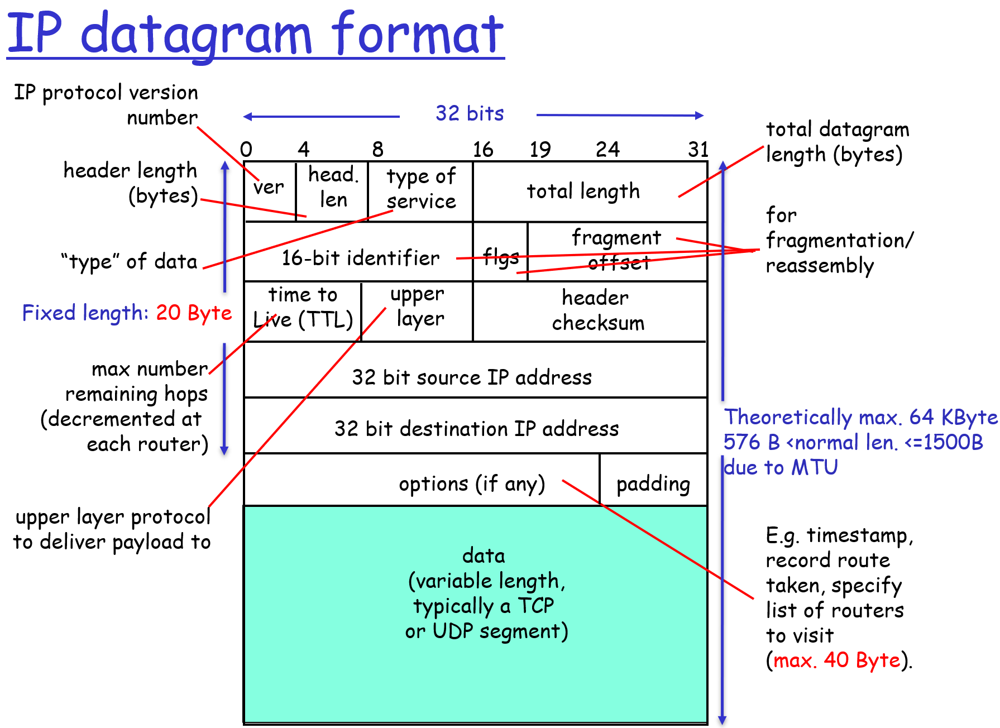

## IPV4地址

* 一个IP地址代表端系统或路由器上的一个接口
  * 每个地址表示一个到网络的连接而不是独立的计算机
  * 当计算机位置变了，它的IP地址必须变
* 接口：路由器/端系统互相之间的物理链路
  * 一个路由器通常有多个端口
  * 一个端系统通常只有一个端口

### Classful IP Addresses：分类IP编址

IP地址的前面部分作为网络地址，网络中的所有主机的IP地址只有后面部分不一样。网络地址按前缀长度分为ABC三类，每一类的前缀长度是固定不变的。

#### 分类IP编址下的路由表

路由表中存着许多网络地址，每个网络地址对应一个下一跳IP地址或某个接口。当有数据报到达时，检查数据报IP所属哪个物理网络地址：

* 间接交付：某个网络地址对应一个下一跳地址，数据报由下一跳网络中的某个路由器继续转发
* 直接交付：某个网络地址对应一个接口地址，数据报直接从某个接口出去到对应的网络
* 默认路由：某个地址在路由表中没有下一跳也没有接口对应，则发送到默认地址
  * 默认地址通常用于一个小的网络到一个大的广域网的转发

#### 优缺点

* 优点：路由表中只需要放网络地址而不是每个主机的地址
* 缺点：每个物理网络都要分配地址前缀，每个前缀包含许多地址，让IP地址消耗很快
  * 地址前缀的长度固定，但有的物理网络主机很多，需要很多的IP，而有的物理网络主机很少，IP浪费

### 子网掩码：地址前缀的长度不固定

网络地址不再按固定的前缀长度分为ABC三类，而是通过一个子网掩码指定所属的网络。

主机很多的网络给个短点的子网掩码，主机很少的网络给个长点的子网掩码，从而提高IP地址利用率。

CIDR表达方式：IP地址/掩码长度

#### 分类IP编址+子网掩码下的路由表

路由表中存储的不再是固定的ABC类网络地址，而是IP地址/掩码长度。当有数据报到达时，检查数据报IP所属的网络是通过将IP地址与掩码进行与运算得到，其他操作与没有子网掩码时完全一样。

#### 分类IP编址+子网掩码下的地址分配策略：Classless Inter-Domain Routing (CIDR) 无分类域间路由选择

ISP分配的IP地址不再区分ABC类而是按照主机数量分配网络地址和合适大小的子网掩码。

#### 路由聚合（地址聚合）

将多个同网段的小子网聚合成一个大子网。一个拥有多个同网段小子网的ISP的网际路由器可以只向Internet报告大子网的地址（短的子网掩码），到不同的小子网的数据报由ISP内部的路由器进行进一步处理。

当某个小子网转到了另一个不同网段的ISP中，则最长前缀匹配可以保证较小子网的地址被有限匹配到。

### Anonymous P2P：匿名点对点网络

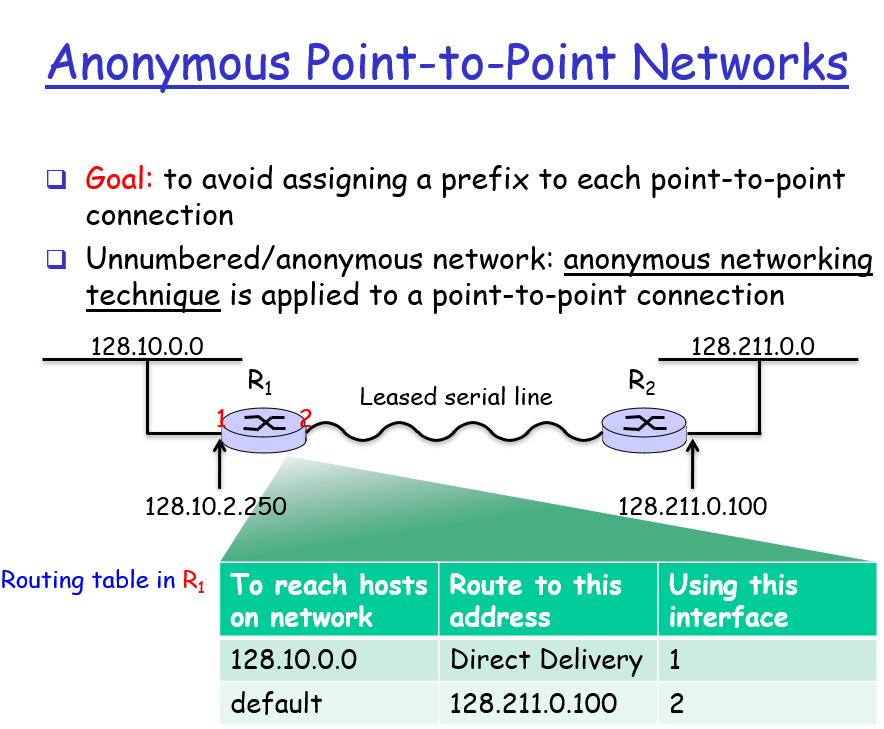

### NAT：让内网主机访问外网

将内网发往公网的数据报源IP地址从私网地址改为公网地址，用不同的端口区分发回的数据报。

优点：

* 建立了公网和私网间的简易网关
* Stateful Filter Implementation使得使用NAT可以提升网络安全性
* 隐藏的网络内部的架构

#### 外部主机无法主动访问NAT内部主机的解决方法

* 配置静态端口映射
* 基于UPnP的IGD协议：自动配置端口映射
  1. 获知公网（外部）IP地址
  2. 请求一个新的公网IP地址
  3. 列举现有的端口映射
  4. 添加和移除端口映射
  5. 给映射分配租赁时间
* relay：内网穿透

### 为延缓IPV4地址消耗而做出的努力

* Dial-access / PPP / DHCP
* Strict allocation policies
* CIDR
* NAT

## ICMP: Internet Control Message Protocol 网际控制报文协议

* 端系统和路由器之间的网络层信息通信
  * 错误报告
    * 目的不可达
    * Source quench-源端抑制 其表示路由或者主机因为网络拥塞丢弃了报文
    * 超时
    * 参数错误
    * 重定向
  * 查询（比如用在ping程序中）
    * 响应(request/reply)
    * 时间戳(request/reply)
    * 地址掩码(request/reply)
    * Router Advertisement(简称RA),Router Solicitation(简称RS)

ICMPv6：
* ICMPv6邻居请求（Neighbor Solicitation）消息：在地址解析中的作用类似于IPv4中的ARP请求报文。用来获取邻居的链路层地址，验证邻居是否可达，进行重复地址检测等
* 邻居通告报文NA（Neighbor Adivertisment）报文：用来对NS消息进行响应或当节点在链路层变化的时候主动发出NA消息，告知邻居本节点的变化
* ICMPv6路由器请求（Router Solicitation）消息：节点启动后，通过RS消息向路由器发出请求，请求前缀和其他配置信息，用于节点的自动配置
* ICMPv6路由器通告（Router Advertisement）消息：在没有抑制RA消息发布的条件下，路由器会周期性地发布RA消息，其中包括前缀信息选项和一些标志位的信息
* ICMPv6重定向（Redirect）消息：Type字段值为137，当满足一定的条件时，缺省网关通过向源主机发送重定向消息，使主机重新选择正确的下一跳地址进行后续报文的发送

## IPV6

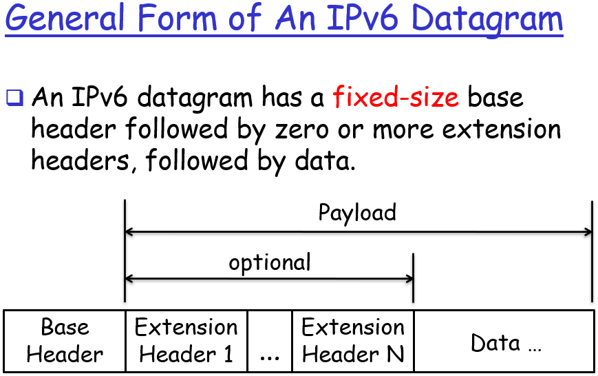
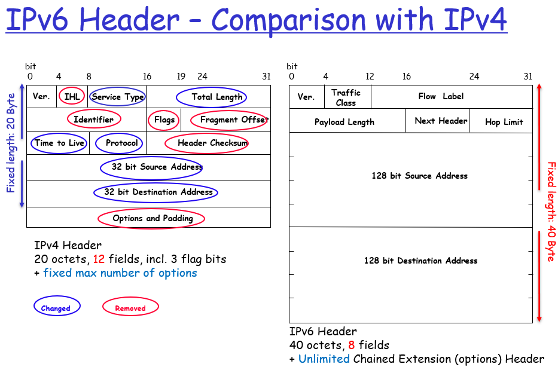

* 简单的报文头结构
* 降低了通常情况下的分组处理开销
* 保持了低的带宽开销
* 灵活可扩展的自定义分组头信息
* 为64位处理器架构优化

### IPV6和IPV4兼容

* 双协议栈：在一个设备上同时部署IPV6和IPV4两种协议
* 隧道技术：将IPV6作为内容封装在IPV4中发送
* 协议翻译Translation：NAT技术的扩展
  * 与IPV6设备通信使用正常的IPV6协议
  * 与IPV4设备通信使用NAT

## Unit 3

### What inside router

* 路由表 Forward Tables
  * 由路由器自己确定
  * 由一个统一的中心下发（SDN）

### SDN的基本概念

一个总的集中的控制器计算出转发表下发给系统中的路由器。

* 基于流的转发：SDN路由器/交换机可以定义从运输层到网络层到链路层的所有转发规则，而不再拘泥于基于IP地址的转发
* 控制与转发分离
* 可编程性

## 三种类型 Three types of switching fabrics

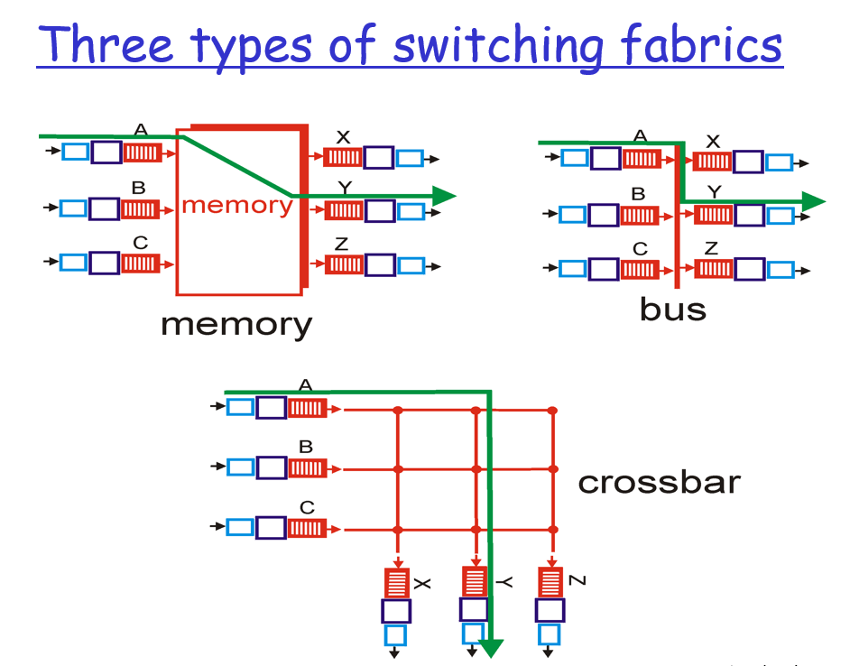

### 输入排队

* 产生情况：交换结构不能相对于输入线路速度快到使所有的分组无延迟地通过它传送
* 产生排队延迟
* Buffer满时产生丢包

### 交换机Output port的排队

* 产生情况：在输出端口传输一个分组的时间内，又有多个分组到达该端口
* 产生排队延迟
* Buffer满时产生丢包

## Hubs (more)集线器

* 集线器可以按层次结构（或多层设计）排列，骨干集线器位于顶部
* 简单，便宜的设备
* 延长节点对之间的最大距离（每个集线器100m）
* 集线器通常用于小型网络，在该小型网络中，通过网络传输的数据量永远不会很高。

## Switch有哪些功能

* 链路层设备：比集线器更智能，发挥积极作用
  * 存储，转发以太网帧
  * 检查传入帧的MAC地址，在要在段上转发帧时有选择地将帧转发到一个或多个传出链接
* 透明
  * 主机不知道交换机的存在
* 即插即用，自学习
  * 交换机无需配置
  * 交换机内存有一个转发表
  * 交换机可以从转发的帧中获取到MAC地址，与接口位置一起存入转发表
  * 如果帧指向的某个MAC地址未找到，则向除源端口外的所有端口转发
  * 一个MAC地址对应一个端口，一个端口可以对应多个MAC地址，因此可以级联
* 允许多个同时传输
  * 每个端设备都有一个独立连接
  * 缓存分组进行转发
  * 没有线路冲突，全双工
  * 可同时执行多条路径间的转发

## Comparison of Typical Features of Popular Interconnection Devices

|集线器|交换机|网桥|路由器
-|-|-|-|-|
工作于|物理层|链路层|链路层|网络层
通信隔离|否|是|是|是
即插即用|是|是|是|否
可选的路由||否|否|否|是

## IP over ATM、SDH、WDM

[参考教程](https://blog.csdn.net/dog250/article/details/69668590)

### 早期IP骨干网络的多层结构

从高到低：IP->ATM->SONET->WDM

SONET/SDH定义了一组在光纤上传输光信号的速率和格式，通常统称为光同步数字传输网，是宽带综合数字网B-ISDN的基础之一。SONET/SDH采用TDM技术，是同步系统，由主时钟控制，精度10^-9).两者都用于骨干网传输。

多层结构的缺点：
* 功能冗余：许多层都做的同样的事情
* 速度慢：电子设备处理速度比不上光纤传输的速度
* 延迟高
* 低效、带宽资源浪费
* 难以协同工作

### IP over SONET/SDH和IP over ATM

注：所有的IP over XX都是在主干网中使用的技术，局域网因为规模小部署简单所以一开始就全是以太网交换机和路由器

理解：
* WDM是什么？
  * 波分复用WDM(Wavelength Division Multiplexing)是将两种或多种不同波长的光载波信号（携带各种信息）在发送端经复用器(亦称合波器，Multiplexer)汇合在一起，并耦合到光线路的同一根光纤中进行传输的技术。
* SONET和SDH是什么？
  * SDH(SynchronosDigitalHierarchy)同步时分复用是曾经用于打电话的网络协议
  * SONET(Synchronous Optical Network)同步光纤网络是进入光纤时代后的光纤版SDH
  * 都基于时分复用，固定时隙，不适合传输大小不固定的IP数据报
  * 面向的对象电话具有固定的数据率，且流量小而延迟敏感
  * SONET/SDH over WDM：用WDM波分复用模拟SONET/SDH的时分复用
* ATM是什么？
  * ATM试图统一适配语音业务和IP业务
  * ATM建立在SONET/SDH基础之上
  * 它兼具存储转发的分组交换网络和固定时隙复用的电路交换网络的优点
* 为什么需要IP over这些网络？
  * 在IP技术出现之前，电话网已经推广开了
  * 从零开始建立一个由交换机构成的网络不是一朝一夕就能完成的事
  * 因此，IP技术的大规模推广必须要借助已经发展成熟的电话网
  * 得益于IP技术的分层特点，可以将底层技术换成ATM、SDH、WDM而不修改IP协议，就是IP over ATM、SDH、WDM
* IP over ATM、SDH、WDM的未来
  * 显而易见，基于存储转发和统计复用的以太网技术才是计算机网络的未来，SDH、WDM设备都会逐步被以太网设备替换掉
  * 目前IP业务量对电话业务量已呈碾压之势，ATM也会逐渐淘汰

#### Overlay

Overlay 在网络技术领域，指的是一种网络架构上叠加的虚拟化技术模式，其大体框架是对基础网络不进行大规模修改的条件下，实现应用在网络上的承载，并能与其它网络业务分离，并且以基于IP的基础网络技术为主。Overlay 技术是在现有的物理网络之上构建一个虚拟网络，上层应用只与虚拟网络相关。

IP over SONET/SDH和IP over ATM就是典型的Overlay网络，它们使用曾经电话网络时代的基础设施承载新时代的IP业务。

#### ATM

* 三层结构：AAL->ATM->物理层
* 其中AAL层（adaptation layer）在ATM网络边缘
* 网络核心由ATM层cell switching组成
* IP over ATM：
  * 用于主干网路由器之间的连接
    * 主干网路由器位于ATM主干网的“边缘”
  * ATM作为连接层，模拟交换机
  * 优点：
    * 使用虚电路的架构，通信质量好
  * 缺点：
    * 不能有效地支持数据报传输
    * 可扩展性不佳
    * 建立连接耗时长
    * IP协议和ATM协议本就是为了完成不同的任务所开发出来的，让它们一起工作很费劲

## Switching Technology - 交换技术

* 用于替代通过面向连接的方法进行无连接包转发的方法
* 使用更快的数组查找，而不需要路由器的最长前缀表查找目标地址
* 通常与异步传输模式（ATM）关联，因为两者是同时出现的

### Potential Advantages Of Switching For IP Forwarding

* 更快的转发
  * 使用索引代替路由表查找
* 汇总路线信息
  * 避免在每个路由器中都有完整的路由表
  * 因为标签用于指定下一跳，所以可以为许多数据包分配相同的标签
* 管理总流量的能力
  * 服务水平协议（SLA）是指总流量（例如，两个ISP之间的所有流量）
  * SLA：服务级别协议是指提供服务的企业与客户之间就服务的品质、水准、性能等方面所达成的双方共同认可的协议或契约。
  * 一个标签可以分配给每个聚合，以便于管理

### 新一代骨干网：多协议标签交换（Multi-Protocol Label Switching，MPLS）

#### 历史

* 到1996年底，出现了专有的多层交换解决方案，其中集成了ATM交换和IP路由
  * Data-driven model
    * Ipsilon/Nokia设计了IP交换机
    * Toshiba开发了Cell Switching Router (CSR)
  * Control-driven model (MPLS support)
    * Tag Switching developed by Cisco Systems 
    * Aggregate Route-Based IP Switching (ARIS) designed by IBM Corporation
    * IP Navigator delivered by Cascade/Ascend/Lucent Technologies 

#### 原理

传统的路由决策，路由器需要对网络数据包进行解包，再根据目的IP地址计算归属的FEC。而MPLS提出，当网络数据包进入MPLS网络时，对网络数据包进行解包，计算归属的FEC，生成标签（Label）。当网络数据包在MPLS网络中传输时，路由决策都是基于Label，路由器不再需要对网络数据包进行解包。并且Label是个整数，以整数作为key，可以达到O(1)的查找时间。大大减少了路由决策的时间。

FEC：Forward Equivalence Class，This set of packets having related characteristics is bounded to the same MPLS label and are forwarded with the same priority in the same path. Each packet in MPLS network is assigned with FEC only once at the Ingress router. 

#### 应用

* Traffic Engineering：流量工程
  * QoS：指网络能根据用户的要求分配和调度资源，对不同的数据流提供不同的服务质量
  * MPLS基础上的流量工程指通过MPLS标签功能让流量绕开最短但比较拥堵的路径
* Class of Service (CoS)
  * 在两个节点间有不同的路径，通过MPLS使不同性能和质量要求的服务走不同的路径
* Virtual Private Networks (VPNs)
  * 一个ISP通过MPLS将IP数据报直接转发到另外一个ISP的边界路由器上，从而让ISP内部的设备感觉自己和另外一个ISP在同一个网段下

#### 总结

* 专为运行在任何链路层技术上而设计，而不仅仅是ATM基础架构
* 促进骨干网技术向基于SONET/WDM和IP/WDM基础结构的下一代光学Internet迁移。
* 允许ISP提供传统IP路由技术无法轻易支持的新服务
* 简化网络设计和操作
* 增强可扩展性

## 数据中心网络

* 预路由控制Per-router control: 各路由器上的路由算法在控制面交互
* 逻辑中心化控制：一个独立的、并且通常是远程的路由控制器通过各路由器上的control agents (CAs)为每个路由器下发路由表

### 数据中心网络等级体系结构

## 传输层服务和协议

* 提供了不同主机上的应用程序进程间的逻辑通信
  * socket to socket 应用程序通过它的socket发送和接收数据
  * 定位进程：IP地址+端口号
* 传输层协议运行于端系统上
  * 发送端：将应用程序消息拆分为片段，传给网络层
  * 接收端：将片段拼成消息，传给应用层
* 两种传输层协议：
  * TCP: Transmission Control Protocol, reliable
  * UDP: User Datagram Protocol, unreliable

## 多路复用multiplexing和多路分解demultiplexing

* 发送端多路复用：从多个socket收到数据，在包头加上复用信息以便多路分解
* 接收端多路分解：收到一个报文段，将其分解放入正确的socket中
  * 端系统接收到IP数据报
    * IP数据报包含源IP，目的IP
    * 数据报携带一个传输层报文段
    * 传输层报文段中有源端口号和目的端口号
  * 按照数据报中的IP地址和端口号将报文段发到正确的socket中

## TCP和UDP的segment

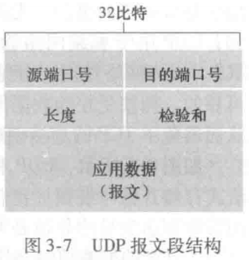

## RDT(Reliable data transfer)：在不可信信道中进行可信数据传输

* 发送端：
  * 应用层执行`rdt_send()`执行可信数据传输
  * 底层调用`udt_send()`在不可信信道中传输数据
  * `rdt_send()`和`udt_send()`之间有发送端RDT协议保证数据传输可信
* 接收端：
  * 底层执行`rdt_recv()`接收数据
  * 数据通过`deliver_data()`传给上层应用
  * `rdt_recv()`和`deliver_data()`之间有接收端RDT协议保证数据传输可信

### Rdt1.0: reliable transfer over a reliable channel 没有任何错误的信道

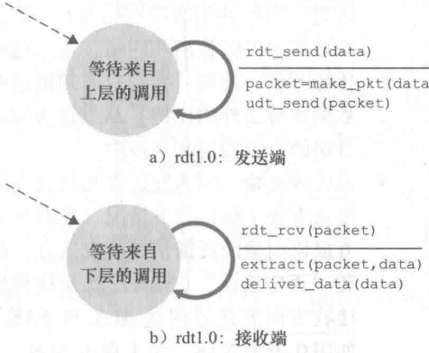

### Rdt2.0: channel with bit errors 有少量bit出错的信道

* 错误校验
* acknowledgements (ACKs)：告诉发送方无bit错误
* negative acknowledgements (NAKs)：告诉发送方有bit错误，请发送方执行重传

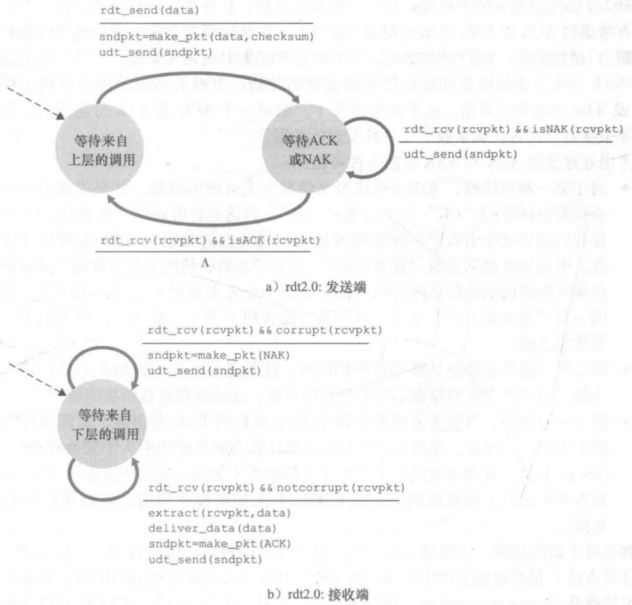

还存在的问题：ACK/NAK消息也会受损

### Rdt2.1：ACK/NAK消息也会受损

解决方法：当发送方收到出错的接收方消息时，直接重传当前分组

但只是这样接收方没法判断到达的分组是新分组还是重传的分组，因此还需要在分组中加序号，以便接收方判断顺序

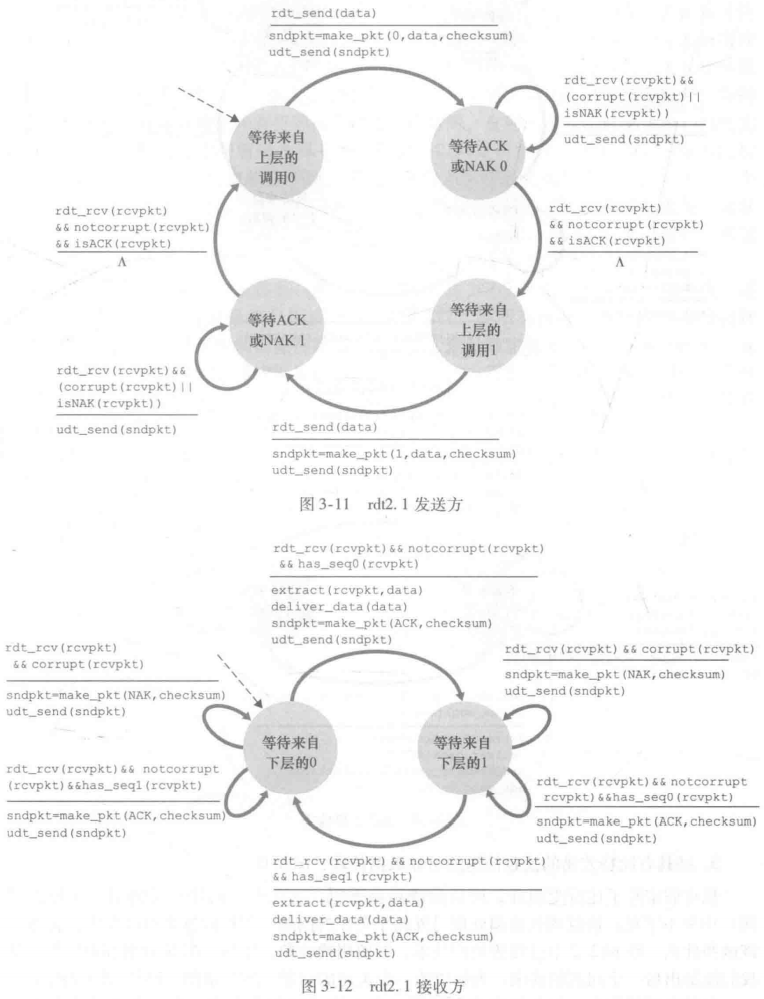

### Rdt2.2：无NAK模式

用上一个正常接收的分组的ACK代替NAK，接收方收到两次同一个分组的ACK后，重传此分组后面的分组。

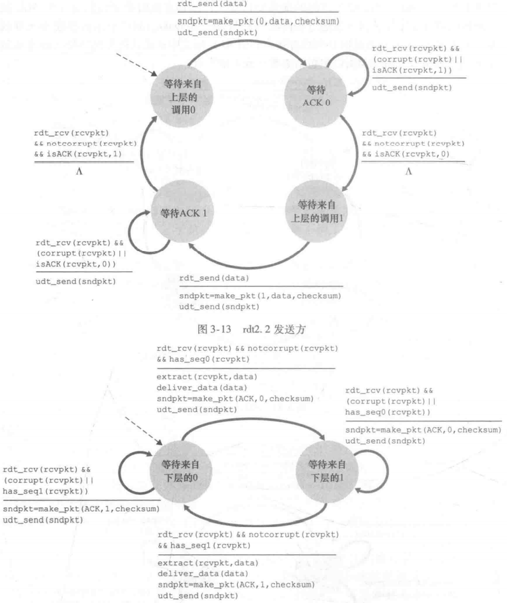

### Rdt3.0(比特交替协议)：bit出错+丢包的信道

当数据包发出后，发送方如果等待了一个往返时延还收不到ACK，就重传。

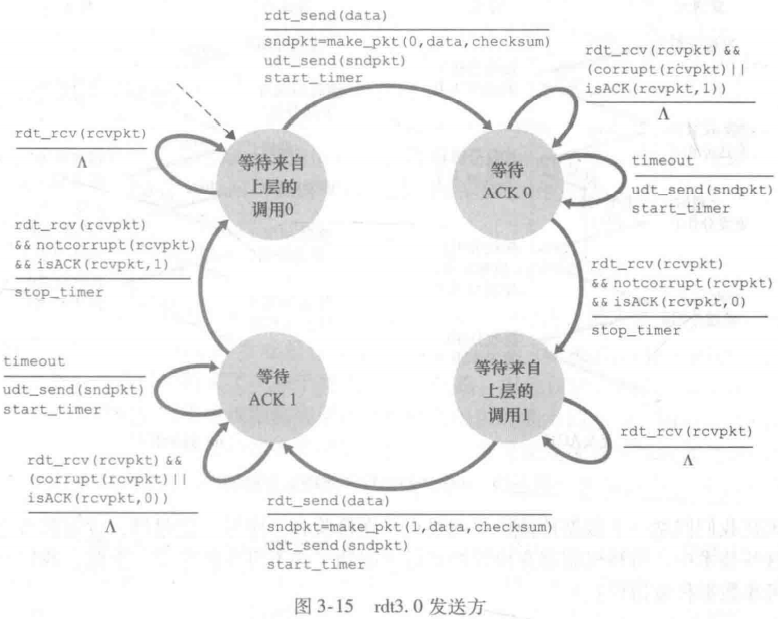

存在的问题：停止等待效率低

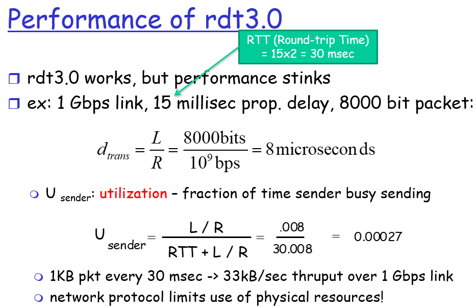

## Go-Back-N, GBN 回退N步(sliding window protocol)（有一个课后题）

* 发送方发送多个分组而不需要等待确认
* 滑动窗口：已发送而未确认的分组最多为N个，达到限制就停止发送等待确认
* 回退N步：出现分组丢失时，重传丢失分组之后的所有分组
  * 积累确认：ACK中的序号表明该序号以前的报文都正确接收
  * 某个分组发出后一段时间内收不到对应ACK，从该分组处开始重传
  * 注：接收方不缓存失序分组

## Selective repeat, SR 选择重传协议 receiver dilemma with too-large windows: A new packetor a retransmission?知道要调整窗口就行了

* GBN每次都要重传失败分组后的所有分组，不好
* SR只重传失败的分组，好

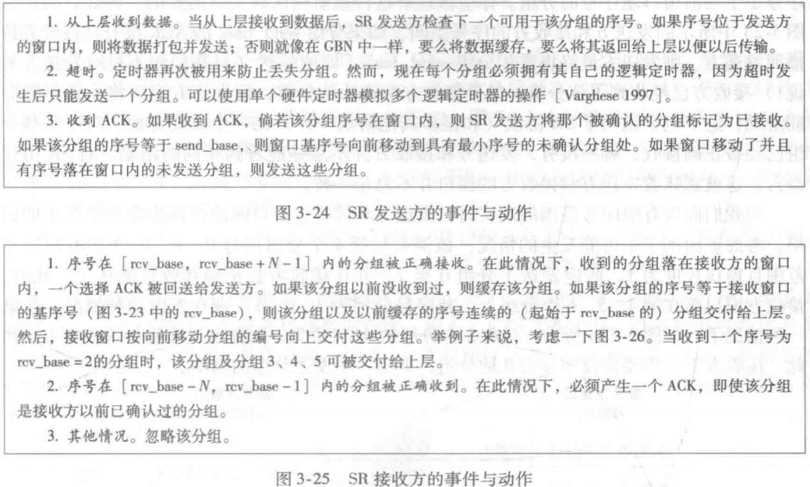

## TCP segment structure每个field该怎么用

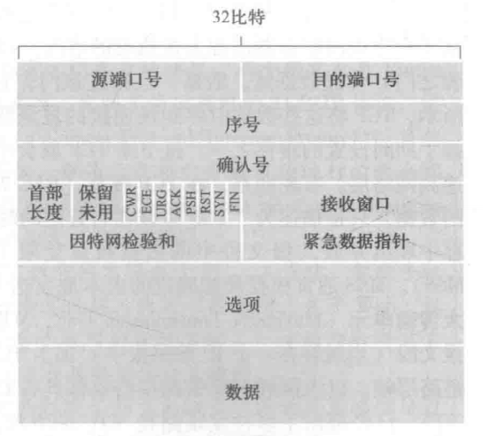

* 源端口+目的端口
* 序号：用于实现RDT
* 确认号：指示接收方愿意接收的字节数量，用于流量控制
* 首部长度：TCP首部长度是可变的，该位用于指示首部长度
* 一些可选字段
* 标志字段：
  * ACK用于接收方确认，置1表示确认
  * RST、STN、FIN用于连接的建立和拆除
  * PSH、URG表示有紧急数据要立即交付上层，实践中未使用

### Sequence number 序号和 Acknowledgement number 确认号的使用

一个TCP报文中，序号表示报文的顺序、确认号中是上一个收到的TCP报文的序号

例如：
* 发送端：seq=42表示这是发送端的第42个报文
* 接收端：ack=42表示收到了发送端的第42个报文，seq=79表示这是接收端的第79个报文
* 发送端：接下来就要发送第43个报文了，seq=43，并且确认第79个报文，ack=79
* ......以此类推

### TCP 往返时间（Round Trip Time, RTT）估计与超时

TCP使用一种指数加权移动平均的公式计算往返时间

## 快速重传：改进的回退N步

* 分组编号即seq
* ACK消息即确认号=上一个分组中seq的消息
* TCP协议中接收方会缓存失序的报文（因此可以说TCP是GBN和SR的结合体）
* 将回退N步中的超时判定条件从等待一段时间改为收到三个相同报文段的冗余ACK
  * 为什么是三个冗余才重传？
    * 失序报文被缓存
    * 下面的IP层不能保证按序抵达，第二个冗余ACK来的时候可能中间有报文段在路上，因此应该多等一会
    * 三次是权衡利弊出的估计值

## TCP flow control 流量控制

接收端在报文中放上接收窗口的信息，发送放将发送但未确认的报文数量限制在接收窗口范围内。

### 三次握手

### 四次挥手

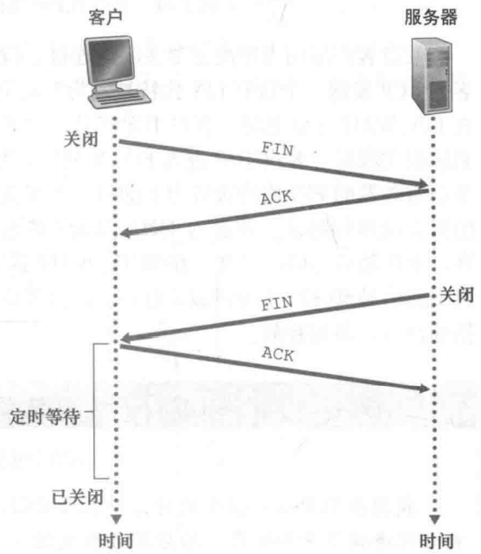

## Principles of Congestion Control

* 拥塞：太多的源主机发送了太多的数据，速度太快以致于网络无法处理
* 与流控制不同
* 代价：丢包（缓存满）、延迟（排队长）

### 三种情况

* 两个发送方，一个无穷缓存的路由器：拥塞时无丢包，但排队时间长，吞吐量有限
  * 发送端延迟随发送速度上升，接近最大吞吐量后接近无穷
  * 成功到达接收端的流量则会在吞吐量见顶后不再增加
* 两个发送方，一个有限缓存路由器：有丢包，发送方要重传，引起不必要的消耗
  * 发送端延迟随发送速度上升，并逐渐趋于稳定，因为丢包重传
* 四个发送方，多跳路由器：
  * 成功到达接收端的流量随发送速度先增加后下降（缓存被另外两个主机占满）

fast recovery

### Approaches towards congestion control

* 端到端控制
  * 网络中没有直接的拥塞通知
  * 拥塞判断来自于端系统检测到到的丢包和延迟
  * TCP所采用的策略
* 网络协助的拥塞控制
  * 路由器提供拥塞反馈

### TCP拥塞控制：AIMD（Additive Increase Multiplicative Decrease，加性增，乘性减）

MSS（Maximum Segment Size，最大报文长度）

1. 慢启动Slow Start (SS)：启动时从1MSS开始，每当有一个报文段被确认，cwnd就增加1个MSS大小，这样cwnd的值就随着网络往返时间(Round Trip Time,RTT)呈指数级增长
2. 拥塞避免Congestion Avoidance (CA)：cwnd大小超过一个预设的慢启动门限ssthresh后，cwnd增加方式改为线性：当窗口中所有的报文段都被确认时，cwnd的大小加1MSS
3. 快恢复 Fast Recovery：出现丢包（收到3个ACK）后，ssthresh设置为cwnd的一半，cwnd重置为1MSS，重新从慢启动开始

### Random early detection (RED)随机早检测

Tail-Drop：尾部丢弃和TCP Global synchronization 全局同步：
* 早期路由器使用的尾部丢弃策略会对TCP拥塞控制产生重大影响
  * 单个TCP连接通过路由器时，丢失会导致TCP进入慢速启动； 收到ACK后，增加拥塞窗口
  * 实际上，网络中的许多TCP连接都通过路由器，丢失可能导致所有连接的过程相同，并导致全局同步
* 原因：
  * 数据报通常是多路复用的
  * 在尾部丢弃策略下，路由器将丢弃N个连接中的一个网段，而不是一个连接中的N个网段
  * 同时丢失会导致所有N个TCP实例同时进入慢启动状态（吞吐量突然降低）
  * 网络恢复后，吞吐量会突然增加很多

随机早检测算法将队列的平均队长作为决定拥塞避免机制是否应被处罚的随机函数的参数，增加了在队列长度变得太大之前平滑瞬时拥塞的可能性，减少了同时使多个流受分组丢弃影响的可能性。

## TCP fairness TCP公平性

TCP公平性目标：多个TCP连接共享一个路径时，它们的流量应该均分。

### UDP公平性

* 多媒体应用通常用UDP协议传数据
  * 多媒体应用不想要波动的数据率
  * UDP能以恒定速率注入流量
* UDP没有内置的拥塞策略，不与其他连接合作，因此是不公平的

### TCP公平性

* TCP机制不能解决UDP的公平性问题
  * 一个应用可以开多个并行的连接传数据

## 多媒体网络

### 三个应用

* 流存储：流式存储音频和视频：
  * 流式传输：所有数据到达前就开始播放，播放同时接收后面的内容
  * 相互作用：客户端可以对内容进行暂停前进倒退等操作
  * 连续播放：一旦开始播放就应该根据记录的时序进行，带宽必须大于视频数据率
* 交互式、实时流：会话式IP语音和视频：
  * 延迟敏感（<150ms good, <400 ms ok）
  * 但可以容忍数据丢失
* 实况流：流式实况音频和视频
  * 有很多接收相同音视频的用户
  * 延迟敏感（<10s ok）
  * 但可以容忍数据丢失

Jitter是一个流中的数据包延迟的可变性（抖动）

### How should the Internet evolve to better support multimedia?

* 综合服务理念：
  * 会导致Internet的根本变化，以便应用程序可以保留端到端带宽
  * 这需要在主机和路由器中使用新的复杂软件
* 自由放任
  * 网络主体没有重大变化
  * 需要时可以增加带宽
  * 内容分发，应用层多播
* 差异化服务理念：
  * 对互联网基础设施的更改较少，但提供了一级和二级服务

### 支持多媒体网络应用的方法

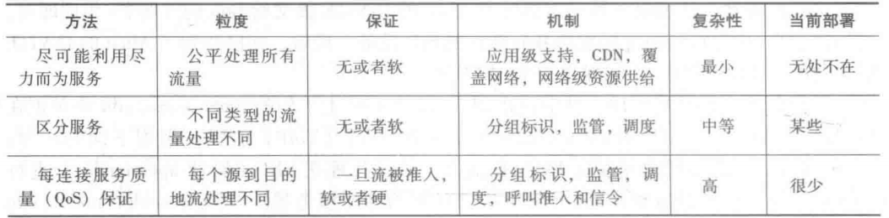

### QoS Summary四个基石

* 网包分类(packet classification)能够依据多域网包包头(packet header)信息对网络流量进行细粒度的分类
* 调度和管理
  * 调度：选择发往链路的下一个包，比如FIFO、优先级调度，加权公平调度等
  * 管理：将流量限制在要求的参数范围内
    * 比如：平均数据率、包发送速度、包长度
* 呼叫准入：让流申告它的QoS需求，然后让网络决定是接收还是阻塞该流
* 高资源利用率

## 路由算法分类

### 全局/去中心化

* 全局路由
  * 所有路由器都有全网的拓扑结构信息
  * LS（连接状态算法）
* 去中心化路由
  * 路由器只知道邻居的路由信息
  * PV（距离向量算法）

### 静态/动态

* 静态路由
  * 路由信息变化很慢，通常是人工指定更新
  * 启动时确定
  * 通常只用于简单的情况
* 动态路由
  * 路由信息变化快
  * 启动时初始化
  * 组建大型网络时很有必要

### 负载敏感/负载不敏感

* 负载敏感的路由算法
  * 链路开销反映负载水平
  * ARPAnet
* 负载不敏感的路由算法
  * 链路开销不反映负载水平
  * 现今的网络路由算法RIP、OSPF、BGP

### 使用范围

* 自治系统AS,Autonomous System：
  * 某个管理机构控制下的，运行着统一的路由算法的网络
  * 划分自治系统解决规模问题；还可以让ISP根据自己的情况组织网络
  * 每一个AS都有一个唯一的编号ASN
* 内部网关协议IGP,Interior Gateway Protocol：用于自治系统内部的路由协议
* 外部网关协议EGP,Exterior Gateway Protocol：用于自治系统间的路由协议

## 路由算法

* PV：每个节点请求它相连的路由器的路由表（包含链路开销），从中计算出到所有终点的最小链路开销作为自己的路由表
* LS：每个节点向网络中的所有其他节点广播链路状态，路由器获取全网的链路状态后进行路由（如用Dijkstra算最短路径）
* RIP(Routing Information Protocol,路由信息协议）：是一种使用PV计算路由表的IGP
* OSPF开放最短路径优先：用Dijkstra算最短路径算路由表的LS算法，是一种IGP
* BGP边界网关协议：自治系统间的路由选择，位于AS边界的路由器向全网广播自己的网络地址，边界路由器以AS为单位进行路由，是一种EGP
  * Hot Potato：让到其他AS的信息在自己的AS内部停留时间尽可能地短
  * Cold Potato：让到其他AS的信息从离距离目的地尽可能近的边界路由器出去

## VPN

* 目标：让内部数据报保持私有的同时还仍允许来自外部的访问
  * 让公共网络Internet承载隐私消息
* 主要的优点：节约成本
  * 不需要架设单独的路由器、链路、DNS等基础设施

### VPN设备

* Customer (C) devices：在客户网络中的交换机或路由器，感知不到VPN的存在
* Customer Edge (CE) devices：将客户的网络连接到PE
* Service Provider Edge (PE) devices：与CE直接相连，是服务网络中的交换机或路由器
* Service Provider (P) devices：为用户提供服务的设备，感知不到用户是通过VPN连接的

### VPN协议

#### site-to-site

连接两个地理上隔离的机构的内部网络

* IP security (IPsec) — designed to protect IP traffic between security gateways or hosts as it transits an intervening network. 
* Generic Routing Encapsulation (GRE) — to construct tunnels and transport multiprotocol traffic between CE devices in a VPN. GRE has little or no inherent security, but GRE tunnels can be protected using IPsec.
* Draft Martini pseudowires (emulated circuits, Any Transport over MPLS [AToM]) — allows point-to-point transport of protocols such as Frame Relay, ATM, Ethernet, Ethernet VLAN (802.1Q), High-Level Data Link Control (HDLC), and PPP traffic over MPLS.
* Layer Two Tunneling Protocol version 3 (L2TPv3) — allows the point-to-point transport of protocols over an IP or other backbone.
* IEEE 802.1Q tunneling (Q-in-Q) — 802.1Q tunneling allows a service provider to tunnel tagged Ethernet (802.1Q) customer traffic over a shared backbone. 
* MPLS LSPs 

#### Remote Access

让移动用户或在家工作的用户远程访问组织内部的资源

* The Layer Two Forwarding (L2F) Protocol — a Cisco proprietary protocol that is designed to allow the tunneling of PPP (or Serial Line Interface Protocol [SLIP]) frames between a NAS and a VPN gateway device located at a central site
* The Point-to-Point Tunneling Protocol (PPTP)
* L2TPv2/L2TPv3 — L2TP  has limited intrinsic security, and so L2TP tunnels are often protected using IPsec.
* IPsec — As  well as enabling site-to-site VPNs, IPsec can also be used to securely tunnel data traffic between remote access or mobile users and a VPN gateway/concentrator
* Secure Sockets Layer (SSL) — a security protocol that was originally developed by Netscape Communications

### What VPN needs

* VPNs must be encrypted 
  * so no one can read it
* VPNs must be authenticated
* No one outside the VPN can alter the VPN
* All parties to the VPN must agree on the security properties

### 重要功能

* Authentication – validates that the data was sent from the sender.
* Access control – limiting unauthorized users from accessing the network.
* Confidentiality – preventing the data to be read or copied as the data is being transported.
* Data Integrity – ensuring that the data has not been altered 

## 多播：将包从源点复制发往所有节点

* 硬件广播：
  * 使用总线技术将一个包传到多个出口
  * 大部分协议都有保留广播地址
    * 以太网MAC地址FF-FF-FF-FF-FF-FF

* 高效：同时向多个终端发信息不需要在源点处复制发送

### in-network duplication 网内复制

* 不可控泛洪Uncontrolled flooding：节点收到广播后直接复制发送给其他所有邻居
  * 问题：回环、广播风暴
* 可控泛洪Controlled flooding ：节点收到广播后先判断自己是否已经广播过相同的包了，如果没有才复制广播
  * reverse path forwarding (RPF) / reverse path broadcast (RPB): 只转发从源点经最短路径到达的包
    * 通过源IP和进入的接口判断是否来自最短路径
    * 避免回环，但无法完全避免冗余发送的问题
* 生成树协议（Spanning Tree Protocol，STP）：任何节点都不会收到冗余包
  1. 算法首先根据网络的拓扑结构生成一棵树
  2. 节点只沿树的方向转发广播消息
  * 每个节点都能成为广播源（树的路径都可以沿两个方向传输）
  * 每个节点只需要知道它的邻居中有哪些在树种与其相连即可

### 多播服务模型

* 多播组：
  * 由间接地址进行标识（D类地址）
  * 主机将IP数据报寻址到多播组
  * 路由器将多播数据报转发到加入了多播组的主机
  * 每个主机都可以加入和退出多播组
  * 每个主机都可以向多播组发消息（没有加入组也可以发，但不能收）
* 多播寻址：标准正在建立
* 多播作用域Multicast scope：
  * 包含多播组内的一部分成员
  * 由一组网络进行定义，组播数据报通过该网络传播以到达组
  * 定义方式：
    * TTL：TTL=0主机内广播；  TTL=1本地网络；TTL>1外部网络
    * 管理域

### IGMP：Internet Group Management Protocol Internet组管理协议

主机IP软件需要进行组播扩展，才能使主机能够在本地网络上收发组播分组。但仅靠这一点是不够的，因为跨越多个网络的组播转发必须依赖于路由器。路由器为建立组播转发路由必需了解每个组员在Internet中的分布，这要求主机必须能将其所在的组播组通知给本地路由器，这也是建立组播转发路由的基础。主机与本地路由器之间使用Internet组管理协议（IGMP，Internet Group Management Protocol）来进行组播组成员信息的交互。

### 多播路由

目标：找到一个连接所有多播组成员的树
两种方法：
* source-based：树以发信主机起始，每个主机一个树
  * shortest path trees (MOSPF)
  * reverse path forwarding (DVMRP, PIM-DM)
* shared-tree：所有组成员共享一颗树
  * minimal spanning (Steiner) 
  * center-based trees (CBT, PIM-SM)

算法：
* Reverse Path Multicasting (RPM)
* Core-Based Trees (CBT)
* Distance-Vector Multicast Routing Protocol (DVMRP)
* Protocol Independent Multicast - Dense Mode (PIM-DM)
* Protocol Independent Multicast - Sparse Mode (PIM-SM)
* Multicast extensions to OSPF (MOSPF)