# 2020顶会论文阅读笔记

## 概述

标题和核心思想|思路和核心解决方案|现有研究缺失和本文贡献|细节问题
-|-|-|-
IEEE Transactions on Mobile Computing 20 JointDNN: An Efficient Training and Inference Engine for Intelligent Mobile Cloud Computing Services 把移动端、云端的优化过程建模为一个有向无环图求最短路径的问题|<li>有向无环图的点权值表示一个操作在云端或在移动端运行的计算成本</li><li>有向无环图的边权值表示发送数据到云端或从云端取回结果的成本</li><li>根据实际情况定义“成本”</li><li>在有向无环图上求成本最小的路径</li>|<li>一种进行云/端计算任务切分的新思路</li><li>使用了计算图的思想，解法LARAC也不是他提的</li><li>Introduction没仔细看</li>|<li>ResBlock这种有支路的怎么办？分支点开始一直在云/端算和先上云/端再回端/云在汇集点处会产生不一样的“成本”（汇集点的计算需要分支点的数据），所以在构造计算图时每个支路都开个独立子图分别计算就行了</li><li>图有了，如何优化？近似算法LARAC</li>
SIGCOMM2020 Concurrent Entanglement Routing for Quantum Networks: Model and Designs 按照量子纠缠通信的特性设计多并发的量子中继网络|<li>中控协调控制网络中的所有连接</li><li>每个量子中继器都有全局路由信息</li><ol><li>中控告诉所有量子中继器谁和谁要连接</li><li>中继器各自寻找可行路径，并开始与路径上的前驱后继进行量子纠缠</li><li>将连接是否成功发往附近节点</li><li>有选择地对成功纠缠的量子进行量子交换</li></ol>|<li>量子纠缠时间太短了，因此路径上的所有中继器必须同时建立量子纠缠</li><li>量子纠缠时间太短了，因此中继器只能获得附近节点的连接信息</li>|<li>如何找可行路径？Q-PASS：潜在路径预先计算好存在中继器中；Q-CAST：贪心算法在线找路</li><li>建立连接失败怎么办？尽量多地进行连接，完事了从成功连接的路径上选择最好的</li><li>如何从多个成功连接的路径中选择最好的？</li>
SIGCOMM2020 Come as You Are: Helping Unmodified Clients Bypass Censorship with Server-side Evasion 利用GFW漏洞执行反审查|<li>常见的审查软件（包括GFW）都需要与被审查的TCP连接进行状态同步</li><li>状态同步需要监测TCP连接上收发包的序列</li><li>于是，我们让服务端执行特殊的发包序列，可以迷惑GFW，让GFW同步到“TCP连接断开”状态，于是之后的内容不再被审查</li><li>同时，这些特殊的包还会直接被客户端忽略或抛弃，以至于对客户端没有影响</li>|<li>现行的反审查策略都是VPN、还有代理啥的，要在客户端上改协议，不好</li><li>本文只需要改服务端的协议</li>|<li>在不同的国家防火墙构造有所不同，每个有墙国家都需要一些特别的策略</li><li>帝国主义假借“自由”之名企图乱我民心，见怪不怪了</li>
SIGCOMM2020 1RMA: Re-envisioning Remote Memory Access for Multi-tenant Datacenters 将数据中心中的RDMA交给软件控制，硬件只提供基本的操作指令，从而更好地适应多租户环境（最了解应用的只有应用自己）|<li>RDMA协议：基于硬件连接->基于datagram</li><li>RDMA控制（拥塞/重传）：烧在硬件上->提供接口给软件控制</li><li>RDMA加密：无->烧在硬件上</li>|<li>RNIC硬件缓存满导致性能下降</li><li>RNIC硬件不方便保证RDMA操作顺序</li><li>RNIC硬件不方便错误处理（在发送端看来失败的操作可能仍在系统中传播）</li><li>RNIC硬件安全机制无法分辨多租户，因此只能提供基于连接的安全机制</li><li>RNIC硬件拥塞控制无法分辨多租户，因此隔离性不好</li><li>RNIC硬件什么东西都烧在硬件上，不方便性能检查和调优</li>|
SIGCOMM2020 Interpreting Deep Learning-Based Networking Systems 用决策树和超图拟合网络控制领域用的神经网络以增强可解释性|<li>在网络控制领域用的神经网络其输出基本上都是一些规则(rule)</li><li>神经网络可解释性不好，决策树或者超图可解释性好</li><li>可以用决策树或超图学习拟合这些输出规则的神经网络，以提高可解释性，方便监测和调试</li><li>根据全局信息输出策略的神经网络：用超图学习拟合</li><li>根据局部信息输出策略的神经网络：用决策树拟合并进行一些剪枝</li>|<li>用一个模型拟合另一个模型称为“模仿学习”，本文是模仿学习在网络领域的首次应用，并且有很好的效果</li><li>在网络领域，理解输入状态和输出规则之间的关系比理解一个神经网络的内部构造更加重要，因此现有的从神经网络结构角度的模型解释不适合网络领域</li><li>现有的解释神经网络的框架基本都只能解释几个固定种类，而网络领域用的神经网络种类很多</li><li>网络领域用到的神经网络输入输出有自己的特点</li>|
SIGCOMM2020 Server-Driven Video Streaming for Deep Learning Inference 在视频流+图像识别应用中，让云端而不是摄像头端判断视频帧的哪些区域需要传高清图|<li>摄像头向云端发送低清视频流</li><li>云端在低清视频流上运行图像识别</li><li>云端判断哪些区域需要用高清图进一步识别（注意力机制）</li><li>云端向摄像头主动请求局部高清图</li>|<li>直接传高清视频带宽不够</li><li>摄像头判断重要区域的准确率不够（计算资源有限）</li>|<li>哪些区域需要传高清</li><li>如何控制带宽使用量</li>
MobiCom2020 OnRL: Improving Mobile Video Telephony via Online Reinforcement Learning 用强化学习规划视频电话应用的带宽使用以提升通信质量|<li>强化学习模型收集网络环境信息，调节视频的比特率，实现最少的帧延迟和最高的带宽利用率</li><li>在每个单独的视频电话设备上运行强化学习模型</li><li>将这些强化学习模型收集起来进行联邦学习生成新模型</li><li>新模型再分发到单独的视频电话设备上训练，重复上述过程</li>|<li>现在的类似应用都是离线训练在线使用，以至于算法和训练的环境绑定，和实际环境不一定适应</li><li>现在的类似应用都是在模拟器里训练，与实际环境不一定匹配（本文有阿里参与，有直接在线训练的条件，只能说阿里nb）</li>|<li>视频流的比特率不能想多少就多少怎么办</li><li>强化学习模型出现错误行为把系统搞崩了怎么办</li>

## 部分详情

### JointDNN: An Efficient Training and Inference Engine for Intelligent Mobile Cloud Computing Services

只有一条直线顺序执行是如何建图？

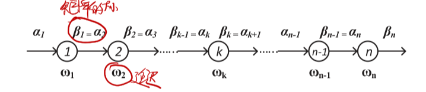

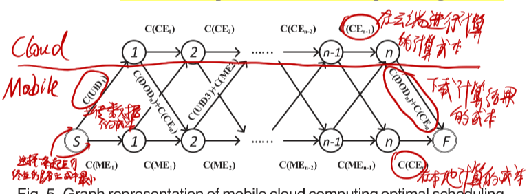

有分支的时候如何建图？

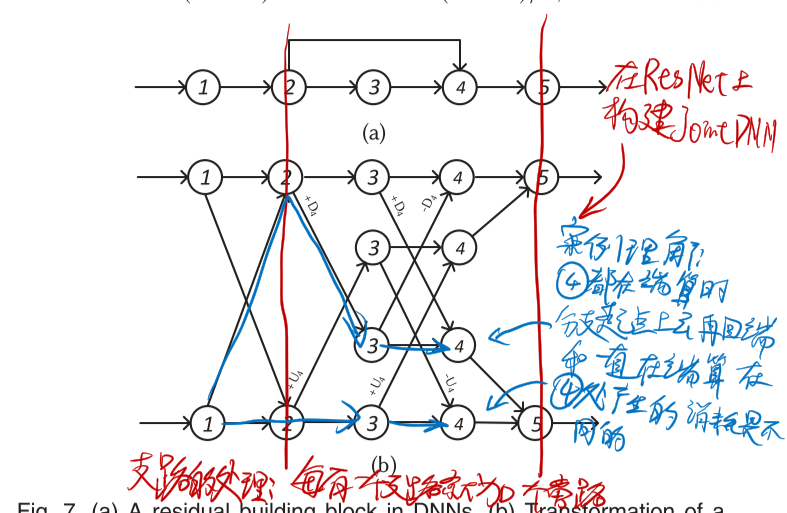

### Concurrent Entanglement Routing for Quantum Networks: Model and Designs

本文专注于量子纠缠通信中使用量子交换(Quantum Swapping)进行路由中继的场景，主要解决在大规模组网和多并发连接情况下的路由问题。

量子纠缠路由过程：（A经过C中继器与B连接）
1. C中的一个量子位与A建立纠缠
2. C中的另一个量子位与B建立纠缠
3. C将与AB建立纠缠的量子进行量子交换

最重要的一些假设：
* 量子中继器的拓扑结构相对稳定，变化不大（不同于包交换）
* 量子纠缠的持续时间很短，因此
  * 在一次通信中，路径上的所有中继量子位必须在很短时间内建立连接（不同于电路交换）
  * 量子信息转瞬即逝，在传输中途不可存储（不同于包交换）
* 一个量子位同一时刻只能用于一个信道（显然）
* 中继器量子位有限

#### 总体设计

* 需要一个中央控制器
* 每个中继器都需要有全网的中继器拓扑信息

1. 中央控制器向所有中继器发送信息：A要与B相连
2. 每个中继器都各自计算出A到B的可行路径（由于中继器里面都是全网的拓扑信息，所以算出来的结果也是相同的）
3. 路径上的中继器根据自己的位置与指定的前驱和后继中继器建立纠缠（注意这里所有可行的路径都要连上，有些可能都用不上，但有些可能会作为备用路）
4. 将纠缠是否成功的信息发往周围节点
5. 如果有纠缠失败的，中继器根据附近节点发来的信息在备用路径上建立纠缠
6. 在成功纠缠的路径上进行量子交换

#### 设计思想

* 留给找路算法的运行时间很短，所以每个中继器都要存一份全网的拓扑结构信息以快速出结果（本文应该是默认了通信消耗大于计算消耗）
* 一个路径上不会所有跳都连接失败，所有已纠缠成功的跳还能利用，但由于量子纠缠的持续时间很短，所以在找备用路径时，时间只够获取临近跳的信息

#### 两个关键问题

* 如何找路？
* 如何找备用路？
* 路径好坏的评价指标？

评价指标:

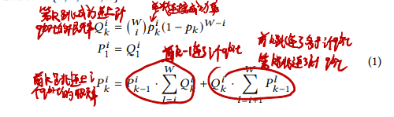
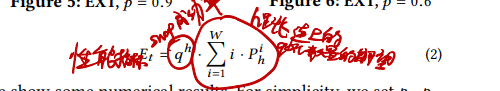

#### 基于离线计算的找路算法：Q-PASS

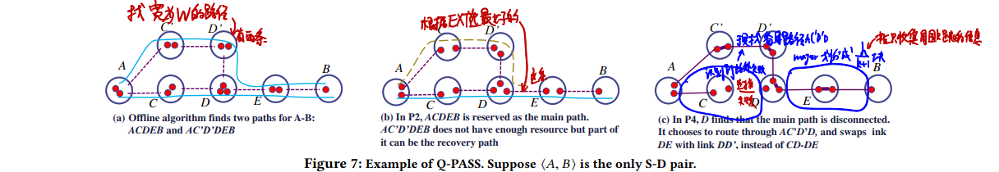

* 如何找路？
  1. 离线将所有可能路径都算一遍，文中没写到底具体怎么算怎么保存
  2. 运行时计算所有起点到终点的路径好坏，选最好的路
* 如何找备用路？
  1. 设置中继器可以获取到的数据跳数k，将路径划分为$\lceil h_m/k\rceil$小段（从而每个小段都在中继器可以获取到的信息跳数范围内）
  2. 如果某一小段中出现断连（这个断连信息只在这一小段中共享），若设这一小段的起点终点为$v_{i_0}$和$v_{i_{k+1}}$，则找一条$v_{i_0}$到$v_{i_{k+1}}$但没用上的路径作为备用路
  3. 由于前面所述的基本过程，这里所有可行的路径都连上了，所以使用备用路只要进行一下量子交换即可

#### 纯在线计算的找路算法：Q-CAST

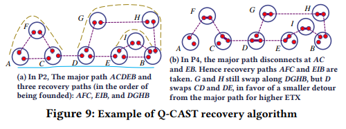

* 如何找路？
  1. EDA(Extended Dijkstra Algorithm)找最好的路径
     * 因为这里路径“长度”不是加法算的所以要扩展Dijkstra算法
     * 实操中设定一个路径跳数上限限制搜索范围加速计算
  2. 从图中删除找到的路径上的边
  3. 在剩下的图中运行EDA，重复上述过程直到EDA找不到路
  4. 选出最好的路
* 如何找备用路？
  1. 在剩下的图中找与主路有两条边相连且最远离主路不大于k跳的子图标记为备用路（也就是与主路上的某一部分连成环，并且在中继器可以获取到的数据跳数为k时，消息可以传遍全部的子图）
  2. 当主路上有连接失败时，直接找附近的备用路进行连接即可（由于上一步找的备用路最远离主路不大于k跳，所以可以直接发信息让它们连上）

#### 我的思考

研究很初级很理想化问题很多

可能存在的问题：拓扑结构相对稳定的假设可能不适合实际情况
* 为什么留给找路算法的运行时间很短？明明是找好路才开始纠缠？
* 本文居然没有考虑同步问题？文章虽然说了要保证连接同时建立，但根本上没有保障连接同时建立的手段
* 需要中心化的控制，不好
* 每个中继器都要求运行相同的找路算法，实践上不好控制
* 拓扑结构这个假设在大规模的情况下不适用，中继器拓扑结构发生变化不能及时响应

量子计算这个领域很新，网络中的各种基本问题（分布式、容错、路由之类）在这里都还没有研究过，有很多显而易见的研究方向

如何在现在要研究的领域中找到像这样的方向？看论文只能告诉我们别人研究过了哪些东西，没法知道有哪些东西是应该被研究的

比如SPINN提出之后，感觉再多的研究都是万变不离其宗，在结构上不会有什么根本性变化，除非超越BranchyNet。

BranchyNet就像是量子通信技术，SPINN就像是在这个量子通信技术上建立的量子路由算法之一。

不过，本文的量子路由系统显而易见还缺少去中心化，SPINN还缺什么？如何发现一个现有研究缺少的东西？

### Come as You Are: Helping Unmodified Clients Bypass Censorship with Server-side Evasion

这个作者很强啊，对TCP和相关协议的理解非常深入非常透彻，能猜到GFW的运行模式，知道哪些操作对客户端端没有影响，以至于能做出用服务端特殊发包方式引导客户端反GFW的操作。据论文所说，这种纯服务端的研究在反审查研究中尚属首次。

### 1RMA: Re-envisioning Remote Memory Access for Multi-tenant Datacenters

1RMA将哪些硬件职能交给了软件？👇

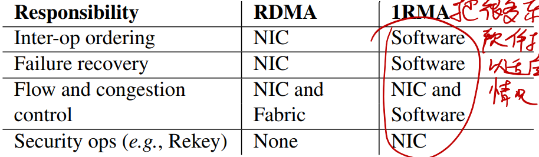

1RMA的操作执行流程👇

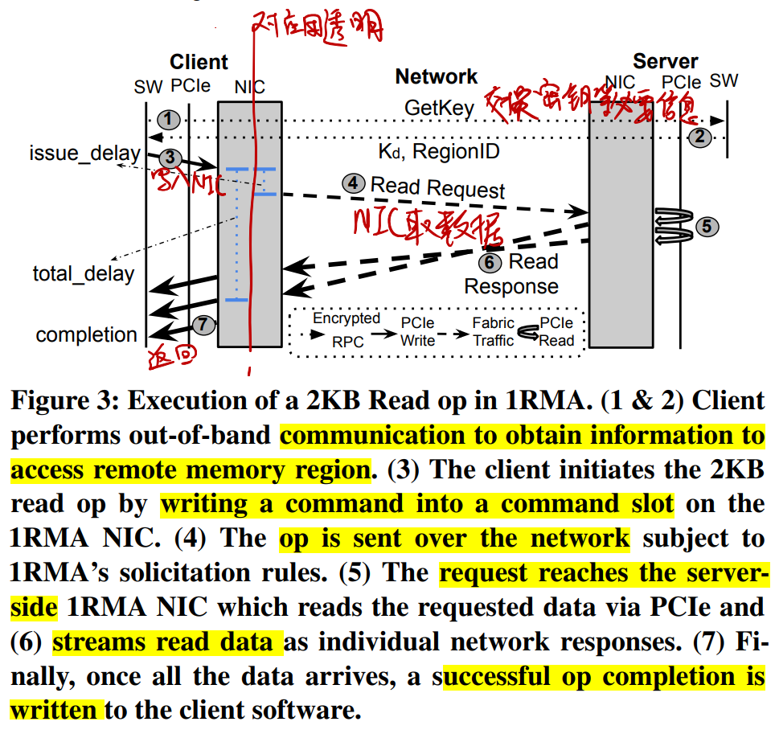

### Server-Driven Video Streaming for Deep Learning Inference

#### Server-Driven和传统Source-Driven对比👇

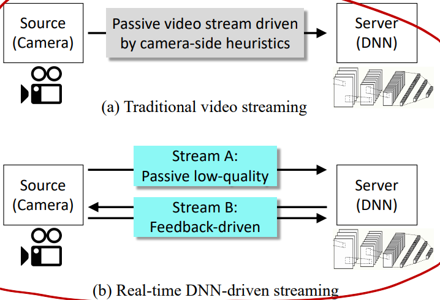

#### 哪些区域需要高清？👇

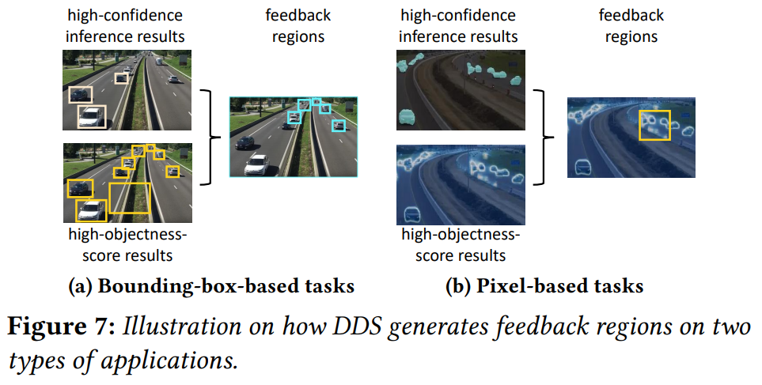

* 目标检测应用（结果为很多框，每个框对每个标签都有一个分数）
  * 哪些区域不用高清feedback region：分数很高的框、很大的框
  * 哪些区域需要高清feedback region：除上述框之外的所有识别出目标的框都要高清
* 语义分割应用（结果为每个像素对每个标签都有一个分数）
  * 哪些区域需要高清feedback region：分数最高的标签和分数第二高的标签分数差小的像素
    * 用框框住尽可能多的高分数差像素

#### 如何适应变化的带宽？

* 依据：上一帧传输时的所用带宽、当前待传输帧的可用带宽（通过卡尔曼滤波估计）
* 调节：高清视频流清晰度、低清视频流清晰度

### OnRL: Improving Mobile Video Telephony via Online Reinforcement Learning

* 视频流的比特率不能想多少就多少怎么办
  * 视频电话应用有它自己的控制方式，视频编码方式不能说变就变
  * 把比特率的变化过程也作为强化学习的输入，让强化学习解决
* 强化学习模型出现错误行为把系统搞崩了怎么办
  * 构造一些规则限制强化学习模型的行为
  * 如果强化学习模型输出了不符合规则的行为，则
    * 在强化学习上给予惩罚
    * 用传统的比特率控制方法暂时替代强化学习模型，直到模型恢复正常

## 有趣的论文概述

标题和核心思想|思路和核心解决方案|现有研究缺失和本文贡献|细节问题
-|-|-|-
USENIX2018 Neural Adaptive Content-aware Internet Video Delivery 用神经网络在客户端增强在线视频清晰度|<li>给视频训练一个将低清晰度视频转成高清晰度视频的神经网络</li><li>在看在线视频的时候先下载神经网络，之后就能只传低清视频了，节约带宽</li>|<li>现有的带宽自适应视频流技术没有在客户端的视频增强方案</li><li>基于神经网络的视频压缩技术刚刚起步，效果不佳</li>|<li>神经网络太大怎么边下载边运行</li><li>怎么规划神经网络的下载过程以减小对视频下载的影响</li>
SIGCOMM2020 Neural-Enhanced Live Streaming: Improving Live Video Ingest via Online Learning 用神经网络在服务端增强直播上传视频流的清晰度|<li>在线训练将低清晰度视频转成高清晰度视频的神经网络</li><li>直播上传流主要上传低清晰度视频，同时上传少量高清晰度视频供训练</li><li>训练和推断同时进行</li>|第一次将神经网络视频增强用在直播上传流中，这个场景最大的特点就是要训练和视频增强必须同时进行|<li>怎么让在线训练快点收敛</li><li>如何调节上行数据发送速率</li><li>如何规划上行带宽的使用</li>
MobiCom2020 NEMO: Enabling Neural-enhanced Video Streaming on Commodity Mobile Devices 用神经网络在移动设备上增强视频清晰度|<li>预先给视频训练一个将低清晰度视频转成高清晰度视频的神经网络</li><li>预先对低清视频进行运动矢量压缩</li><li>客户端用神经网络增强部分帧，用运动矢量计算剩下的帧</li>|第一次将神经网络视频增强用在移动设备上，这个场景的最大特点就是算力不够以至于不能每一帧都用神经网络增强，需要配合传统的视频编解码方案|<li>如何选择用神经网络增强的帧</li><li>怎么调节进行增强的计算量以适应不同设备</li>

## 部分详情

### Neural Adaptive Content-aware Internet Video Delivery

#### 神经网络太大怎么办

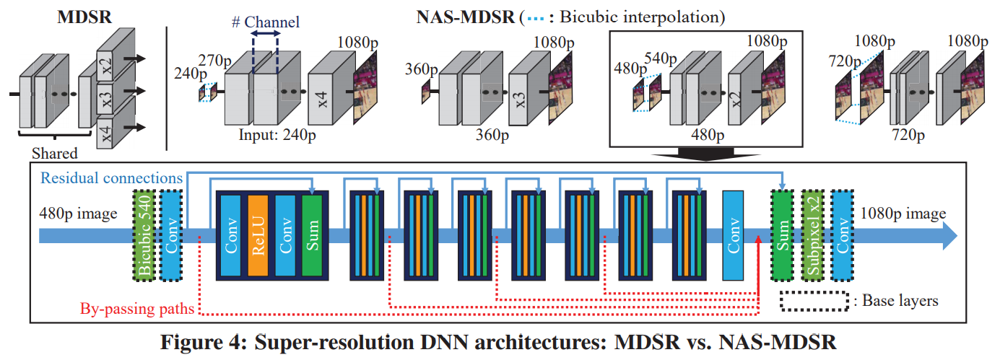

可伸缩神经网络：用于视频增强的神经网络是渐进式的，其中的有多个可选的中间层，有这些中间层时视频增强的效果更好，没有也没问题。于是客户端在开始放视频时只需要先下载基础的神经网络，中间层可以边看视频边下载。

#### 如何适应变化的带宽

用强化学习决定何时下载神经网络的部分，以最大化减小对视频流下载的影响。

## Poster和Demo概述

标题和核心思想|思路和核心解决方案|现有研究缺失和本文贡献|细节问题
-|-|-|-
MobiCom2020 Demo: A Query Engine for Zero-streaming Cameras 一个方便好用的视频帧查询应用，帮助用户调取感兴趣的视频|<li>在录视频时截取一些帧进行目标识别然后把结果存在本地</li><li>使用识别记录估计感兴趣的视频片段</li><li>把用户感兴趣的片段给用户自己选，没进行一次选择都更新一下感兴趣的内容范围，进而更新查询结果</li><li>如此逐步更新直到结束</li>|
MobiCom2020 Demo Demo: A Hyperlocal Mobile Web for the Next 3 Billion Users 一套“超本地化”的内容分发模式 <small>感觉就是个</small>|<li>“超本地化”：用中文讲大概是“同城”的意思，表明内容的产生和分发全部是在用户附近进行</li><li>一套专为在用户附近产生和分发内容的系统，包括内容分发用的协议、去中心化的内容分发算法和运营模式等</li>|<li>内容的产生和分发离用户太远</li><li>现有的Web内容(主要是HTML)不适合低端设备</li>|<li>用MAML代替HTML：MAML里面没有样式，标签结构简单，渲染样式在用户那边设置（这不就相当于一个本地应用的数据协议？）</li><li>一个牛逼的编辑器：让用户在手机上就能生产内容（做网页）</li><li>推送以社区为单位，用户可以创建公开社区和私人社区然后邀请其他用户加入（这不就是QQ群？）</li><li>智能打广告：广告和内容一起生成，根据广告发布者的预算和用户相关信息推送广告</li>
MobiCom2020 Poster: CarML: Distributed Machine Learning in Vehicular Clouds 利用大街上车辆中的闲置计算资源进行数据密集型应用|<li>云端将数据集划分为一个个batch</li><li>在路边放基站给路上的车分发计算任务(batch)</li><li>车辆计算完成后将计算结果返回基站</li>|<li>车联网领域没有关注计算密集型应用</li><li>现有边缘计算多关注通信和网络方面的研究，没有从整体的系统层面关注车联网中网络不确定性相关的问题</li>|<li>如何划分和分发batch</li><li>如何通信和汇聚计算结果</li><li>失败和错误处理怎么办</li><li>分发任务的基站放在哪</li>

## 部分详情

### Poster: CarML: Distributed Machine Learning in Vehicular Clouds

* 如何划分和分发batch
  * 划分数据集：让计算任务所需数据不超过单个基站和车辆的存储容量，又能最大化利用计算资源
  * 分发batch：基站决定将任务传给哪辆车进行计算
* 通信和汇聚计算结果
* 失败和错误处理：云端跟踪记录每个batch是否计算完成，定期向基站分发没有计算完成的batch
* 街道上分发计算任务的基站如何放置：分析历史数据，将车辆放在车流量大的位置