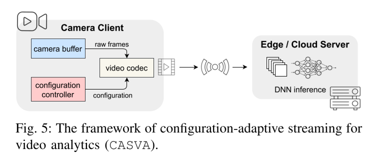

# (Infocom2022) CASVA: Configuration-Adaptive Streaming for Live Video Analytics

## 中心思想

Address the influences of fine-grained network and video content dynamics on configuration performance

探索网络和视频内容的动态性对性能的影响

Proposed CASVA, a Configuration-Adaptive Streaming framework designed for live Video Analytics, based on: How video configuration affects its bandwidth requirement and inference accuracy

基于视频配置（帧率、）对带宽和推断准确性的影响，构造针对视频分析构造自适应的视频流传输系统

## 思路

训练强化学习模型进行视频配置

## 现有研究不足

* 现有的视频分析系统 VideoStorm, Chameleon, Nexus, Mainstream：不关注视频传输的带宽瓶颈
* 现有的策略 帧过滤，帧压缩，DNN模型切分和近似：都只能针对特定应用；规则固定
* ABR：给人设计的，传完整的流畅的视频，但是视频分析并不一定需要完整流畅的视频

## 预实验反映的现象

* 视频配置对码率和模型精度的影响很复杂并且随视频内容变化
* 基于离线profile的解决方案跟不上

## 系统设计

* 在视频编码处不同的视频

### 问题描述

不同的