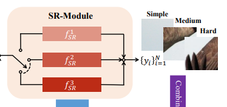

# ClassSR: A General Framework to Accelerate Super-Resolution Networks by Data Characteristic

```bibtex
@article{kong_classsr_2021,
	title = {{ClassSR}: A General Framework to Accelerate Super-Resolution Networks by Data Characteristic},
	url = {http://arxiv.org/abs/2103.04039},
	shorttitle = {{ClassSR}},
	journaltitle = {{arXiv}:2103.04039 [cs]},
	author = {Kong, Xiangtao and Zhao, Hengyuan and Qiao, Yu and Dong, Chao},
	urldate = {2021-05-07},
	date = {2021-03-06},
	eprinttype = {arxiv},
	eprint = {2103.04039},
	note = {tex.ids= {ClassSRGeneralFrameworkAccelerate}2021a},
	keywords = {Computer Science - Computer Vision and Pattern Recognition},
}
```

本论文的核心思想非常简单，就是将图像等分成不同区域，估计图像的不同区域进行超分辨率的难度，然后根据难度将这些区域交给不同的网络进行超分辨率。


## Class-Module：估计图像的不同区域进行超分辨率的难度

Class-Module是一个简单的5Conv+Pooling+全连接层网络。


## SR-Module：使用不同结构的网络对不同难度的区域进行超分辨率

本文使用了最简单的“不同结构”：使用一种网络（如FSRCNN或者CARN等）作为“强”网络，减少各层卷积的通道数量作为“弱”网络。



## 损失函数 L1-Loss：通常的超分辨率网络损失函数

用来训练各个SR-Module的，就是通常的超分辨率网络损失函数，不用多说。

## 损失函数 Class-Loss：让分类结果变得显著

$$L_c=-\sum_{i=1}^{M-1}\sum_{j=i+1}^M\mid P_i(x)-P_j(x)\mid, s.t.\sum_{i=1}^MP_i(x)=1$$

$M$是类别数量，$P_i(x)$是Class-Module的分类结果，这个损失函数其实就是让分类结果里大的更大小的更小

## 损失函数 Average-Loss：让各类别数量大致相等

$$L_a=\sum_{i=1}^M\mid\sum_{j=1}^BP_{i}(x_j)-\frac{B}{M}\mid$$

$B$是训练Batch的大小，$\sum_{j=1}^BP_{i}(x_j)$用于替代类别标记（因为01类别标记没法梯度），这个损失函数可以避免分类模型把所有分块全部分到最强的模型那里（显然最强模型可以令L1-Loss最小）

## 总损失函数

$$L=w_1L_1+w_2L_c+w_3L_a$$

$w_1$、$w_2$、$w_3$是trade-off参数

很直观，没啥好说的

## 训练方式

### 先训练SR-Module

1. 所有样本通过MSRResNet进行超分辨率，取结果PSNR
2. 所有样本按PSNR排序
3. 超分辨率效果好（PSNR低）的拿去训练简单模型，超分辨率效果不好（PSNR高）的拿去训练复杂模型

通过统一模型，超分辨率效果好表明这样本比较简单，超分辨率效果不好表明这样本比较复杂

### 再训练Class-Module

固定SR-Module，用上面写的损失函数$L$训练Class-Module

（作者这里讲到先后分开训练的原因：SR-Module和Class-Module一起训练结果不稳定）

## 结果


可以看到，超分辨率效果下降不多，计算量下降明显
