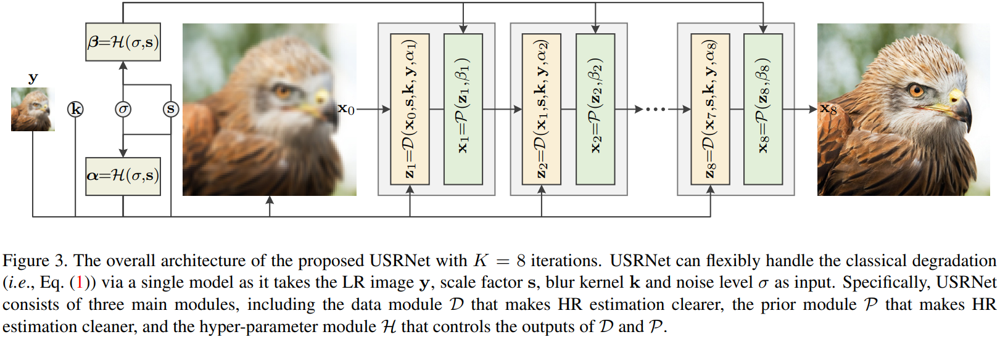
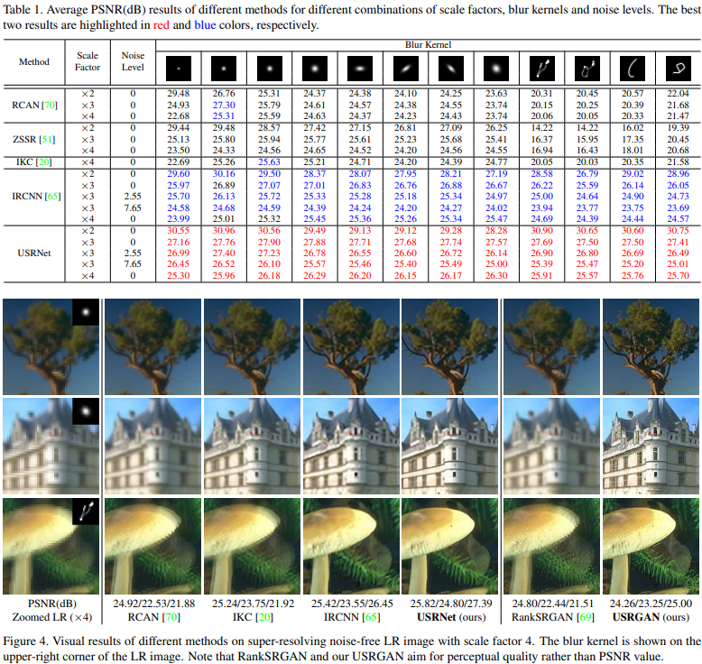
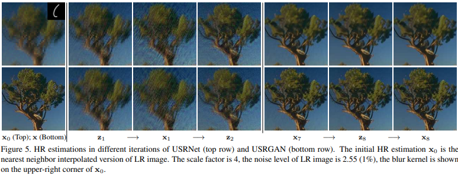

# Deep Unfolding Network for Image Super-Resolution

```bibtex
@inproceedings{DeepUnfoldingNetworkImage2020,
  title = {Deep {{Unfolding Network}} for {{Image Super}}-{{Resolution}}},
  booktitle = {2020 {{IEEE}}/{{CVF Conference}} on {{Computer Vision}} and {{Pattern Recognition}} ({{CVPR}})},
  author = {Zhang, Kai and Van Gool, Luc and Timofte, Radu},
  date = {2020-06},
  pages = {3214--3223},
  publisher = {{IEEE}},
  location = {{Seattle, WA, USA}},
  doi = {10.1109/CVPR42600.2020.00328},
  url = {https://ieeexplore.ieee.org/document/9157092/},
  urldate = {2021-05-14},
  archiveprefix = {arXiv},
  eprint = {2003.10428},
  eprinttype = {arxiv},
  eventtitle = {2020 {{IEEE}}/{{CVF Conference}} on {{Computer Vision}} and {{Pattern Recognition}} ({{CVPR}})},
  isbn = {978-1-72817-168-5},
  keywords = {Computer Science - Computer Vision and Pattern Recognition,Electrical Engineering and Systems Science - Image and Video Processing},
  langid = {english}
}
```

## 概括

### 研究现状

* 基于模型的方法：基于图像降质的光学模型对图像进行超分辨率
  * 不需要训练，也没有超参数
  * 能适应不同的缩放尺度、模糊核和噪声
  * 可解释性好
* 基于机器学习的方法：使用机器学习中的一些方法对图像进行超分辨率
  * 需要大量数据进行训练
  * 训练数据决定了适用范围，单一个模型无法适应多种不同的缩放尺度、模糊核和噪声
  * 效果比基于模型的方法好

### 本文贡献

结合基于模型的方法和基于机器学习的方法进行超分辨率

## 本文使用的基于模型的方法：Deep Unfolding

Deep Unfolding 是前人已有的研究，是一种基于光学模型的迭代求解方法

参考论文：《Learning Deep CNN Denoiser Prior for Image Restoration》

### 图像降质的光学模型

$$\bm y=(\bm x\otimes\bm k)\downarrow_{\bm s}+\bm n$$

1. $(\bm x\otimes\bm k)$：原始高清图像$\bm x$与一个模糊核$\bm k$卷积
2. $\downarrow_{\bm s}$：进行$\bm s\times\bm s$下采样（其实就是池化）
3. $\bm n$：噪声

### MAP(最大后验概率) framework 估计高清图

已知模糊核$\bm k$，使$E(\bm x)$最小的高清图像$\bm x$就是最大后验概率估计得到的高清图

$$E(\bm x)=\frac{1}{2\sigma^2}\parallel\bm y-(\bm x\otimes\bm k)\downarrow_{\bm s}\parallel^2+\lambda\Phi(\bm x)$$

1. $\frac{1}{2\sigma^2}\parallel\bm y-(\bm x\otimes\bm k)\downarrow_{\bm s}\parallel^2$：保真项
2. $\lambda\Phi(\bm x)$：用于处理噪声的惩罚项，$\lambda$为trade-off参数

### 半二次分裂(half-quadratic spliting, HQS)算法

原问题：

$$min_x f(x)+g(x)$$

半二次分裂近似问题：

$$\begin{aligned}
&min_{x,z}&f(x)+g(z)\\
&s.t.&x=z
\end{aligned}$$

增广拉格朗日：

$$\mathcal L(x,z;\mu)=f(x)+g(z)+\frac{\mu}{2}\parallel x-z\parallel^2$$

半二次分裂迭代求解：

$$\left\{\begin{aligned}
z_{k+1}&=argmin_z f(x_k)+g(z)+\frac{\mu}{2}\parallel x_k-z\parallel^2\\
x_{k+1}&=argmin_x f(x)+g(z_k)+\frac{\mu}{2}\parallel x-z_k\parallel^2\\
\end{aligned}\right.$$

固定$x$优化$z$、固定$z$优化$x$，如此循环往复逼近最优解。

### MAP framework + HQS = Deep Unfolding

原问题：

$$min_{\bm x} E(\bm x)=\frac{1}{2\sigma^2}\parallel\bm y-(\bm x\otimes\bm k)\downarrow_{\bm s}\parallel^2+\lambda\Phi(\bm x)$$

半二次分裂近似+增广拉格朗日：

$$\mathcal L(\bm x,\bm z;\mu)=\frac{1}{2\sigma^2}\parallel\bm y-(\bm z\otimes\bm k)\downarrow_{\bm s}\parallel^2+\lambda\Phi(\bm x)+\frac{\mu}{2}\parallel\bm z-\bm x\parallel^2$$

迭代：

$$\left\{\begin{aligned}
\bm z_{k}&=argmin_z \parallel\bm y-(\bm z\otimes\bm k)\downarrow_{\bm s}\parallel^2+\mu\sigma^2\parallel\bm z-\bm x_{k-1}\parallel^2\\
\bm x_{k}&=argmin_x \lambda\Phi(\bm x)+\frac{\mu}{2}\parallel\bm z_k-\bm x\parallel^2\\
\end{aligned}\right.$$

$\mu$ should be large enough so that x and z are approximately equal to the fixed point. However, this would also result in slow convergence. Therefore, a good rule of thumb is to iteratively increase µ. For convenience,
the $\mu$ in the $k$-th iteration is denoted by $\mu_k$.

## Deep Unfolding + 机器学习

核心思想就是把上面的两个迭代求解式看成由两层神经网络组成的一个模块，把迭代的过程看成是网络模块的堆叠。这种将迭代做成堆叠的方法也是model-based问题用learning-based框架来解决的常见方法。

两个迭代求解式分别变成两层神经网络：
* Data Module：$\bm z_k=\mathcal D(\bm x_{k-1},\bm s,\bm k,\bm y,\alpha_k)$
* Prior Module：$\bm x_k=\mathcal P(\bm z_k,\beta_k)$

堆叠：



### 估计模糊核$\bm k$

根据前面介绍的图像降质的光学模型$\bm y=(\bm x\otimes\bm k)\downarrow_{\bm s}+\bm n$，恢复图像时所用到的模糊核$\bm k$可以直接用一些简单的估计方法得到：

$$\bm k_{bicubic}^{\times\bm s}=argmin_{\bm k}\parallel(\bm x\otimes\bm k)\downarrow_{\bm s}-\bm y\parallel$$

### Data Module

Data Module 就是求解迭代方程中的$\bm z_k$：

$$\bm z_{k}=argmin_z \parallel\bm y-(\bm z\otimes\bm k)\downarrow_{\bm s}\parallel^2+\mu\sigma^2\parallel\bm z-\bm x_{k-1}\parallel^2$$

这个式子归根到底就是一个复杂的一元二次方程，作者把它转到频域里解：

$$\bm z_{k}=\mathcal D(\bm x_{k-1},\bm s,\bm k,\bm y,\alpha_k)=\mathcal F^{-1}\left(\frac{1}{\alpha_k}\left(\bm d-\overline{\mathcal F(\bm k)}\odot_{\bm s}\frac{(\mathcal F(\bm k)\bm d)\Downarrow_{\bm s}}{(\overline{\mathcal F(\bm k)}\mathcal F(\bm k))\Downarrow_{\bm s}+\alpha_k}\right)\right)$$

其中：
$$\bm d=\overline{\mathcal F(\bm k)}\mathcal F(\bm y\uparrow_{\bm s})+\alpha_k\mathcal F(\bm x_{k-1})$$
$$\alpha_k=\mu_k\sigma^2$$
* $\mathcal F(\cdot)$、$\mathcal F^{-1}(\cdot)$、$\overline{\mathcal F(\cdot)}$：傅里叶变换、傅里叶反变换、傅里叶变换的共轭复数
* $\odot_{\bm s}$：the distinct block processing operator with element-wise multiplication, i.e., applying elementwise multiplication to the $\bm s\times\bm s$ distinct blocks of $\overline{\mathcal F(\bm k)}$
* $\Downarrow_{\bm s}$：the distinct block downsampler, i.e., averaging the $\bm s\times\bm s$ distinct blocks
* $\uparrow_{\bm s}$the standard s-fold upsampler, i.e., upsampling the spatial size by filling the new entries with zeros

于是，$\mathcal D(\bm x_{k-1},\bm s,\bm k,\bm y,\alpha_k)$就是Data Module，这里面没有任何需要学习的参数

### Prior Module

在图像领域，$\bm x_{k}=argmin_x \lambda\Phi(\bm x)+\frac{\mu}{2}\parallel\bm z_k-\bm x\parallel^2$是典型的图像去噪问题，noise level $\beta_k=\sqrt{\lambda/\mu_k}$。

作者就是在这里用了一个CNN网络来完成降噪的任务。网络的输入是$\bm z_{k}$，输出是$\bm x_k$

CN网络的结构是ResNet+U-Net。 U-Net is widely used for image-to-image mapping, while ResNet owes its popularity to fast training and its large capacity with many residual
blocks.

### 超参数 Module

至此，还有没能确定的参数是$\alpha_k=\mu_k\sigma^2$和$\beta_k=\sqrt{\lambda/\mu_k}$，其中$\sigma$是数据集整体的特征，要通过统计方法提前知晓，于是超参数就只剩下$\lambda$和$\mu_k$了。

这里作者讲到：
>Although it is possible to learn a fixed $\lambda$ and $\mu_k$, we argue that a performance gain can be obtained if $\lambda$ and $\mu_k$ vary with two key elements, i.e., scale factor s and noise level σ, that influence the degree of ill-posedness.

于是又用了一个简单的3层全连接层作为超参数 Module 确定$\bm\alpha=[\alpha_1,\alpha_2,\dots,\alpha_k]$和$\bm\beta=[\beta_1,\beta_2,\dots,\beta_k]$：

$$[\bm\alpha,\bm\beta]=\mathcal H(\sigma,\bm s)$$

## 训练

作者说用的是最基本的L1 Loss，不细看了

## 效果





还是很棒的，对不同的模糊核都有很好的效果