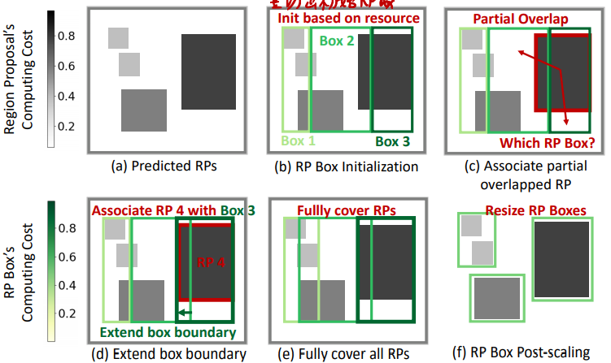

# Elf: accelerate high-resolution mobile deep vision with content-aware parallel offloading

```bibtex
@inproceedings{ElfAccelerateHighresolutionMobile2021,
  title = {Elf: Accelerate High-Resolution Mobile Deep Vision with Content-Aware Parallel Offloading},
  shorttitle = {Elf},
  booktitle = {Proceedings of the 27th {{Annual International Conference}} on {{Mobile Computing}} and {{Networking}}},
  author = {Zhang, Wuyang and He, Zhezhi and Liu, Luyang and Jia, Zhenhua and Liu, Yunxin and Gruteser, Marco and Raychaudhuri, Dipankar and Zhang, Yanyong},
  date = {2021-10-11},
  pages = {201--214},
  publisher = {{Association for Computing Machinery}},
  location = {{New Orleans Louisiana}},
  doi = {10.1145/3447993.3448628},
  url = {https://dl.acm.org/doi/10.1145/3447993.3448628},
  urldate = {2021-03-20},
  eventtitle = {{{ACM MobiCom}} '21: {{The}} 27th {{Annual International Conference}} on {{Mobile Computing}} and {{Networking}}},
  isbn = {978-1-4503-8342-4},
  langid = {english},
  series = {{{MobiCom}} '21}
}
```

## 为提升推断速度做出的努力

* 模型裁剪
  * 量化神经网络QNN
  * 知识蒸馏
  * 网络架构搜索
  * 缺点：精度下降
* 硬件研究
  * GPU
  * FPGA
  * ASIC
  * 缺点：能耗高
* 服务器推断
  * AWS Wavelength用5G把图像发到附件的服务器推断
  * 缺点：网速只够发低清图
  * 缺点：单个服务器资源无限，没考虑多用户多服务器优化
  * 缺点：没有GPU共享，浪费计算时间

## 应用领域

* 专注于使用现有CNN模型的应用
* 专注于高分辨率多目标识别应用

## 本文方案

将推断任务切成多个小片发给多个服务器同时计算
1. 一个CNN切出图像的重点区域，每个区域包含一个目标
2. 一个CNN对切分出的目标进行识别

## 设计要点

1. 如何切分计算？
   * ×模型并行：以模型中的层为单位进行并行计算（传输量大、同步复杂）
   * √数据并行：以图像中的部分为单位进行并行计算（智能切分）
2. 如何分配计算？
   * 依据：图中待识别对象数量、识别对象的资源需求、服务器的资源余量
   * 调整：卸载策略
   * 最小化：计算时间、客户端负载

## 挑战和解决方案

1. 如何识别图中目标区域？
   * 用LSTM根据之前帧的识别结果预测目标分布位置(Region Proposal, RP)
   * 标记帧间相同目标
   * 低分辨率图用于识别新出现的目标
2. 如何切分和分配目标区域？
   * 内容敏感：用AutoFocus切掉不需要的部分
   * 计算开销敏感：估计切出的RP的计算开销
   * 计算资源敏感：估计服务端的资源余量，基于分块的资源需求和服务器资源余量进行切分

## 本文的核心技术点之一——基于LSTM的RP预测


上式表明，LSTM的输入序列为前N帧的识别结果（RP位置），输出为新一帧的识别结果；识别结果包括左上角和右下角坐标和面积。


其所使用的LSTM就是一个常规的注意力LSTM模型。对于每一帧，都要输入前N帧序列进行一次计算。

**注意，这并不是一个基于内容的方法**

## 本文的核心技术点之二——RP标记

显然，LSTM输入的RP信息时，同一个目标在不同帧的标记必须统一，不然就无法获取RP位置的移动信息。

基于位置和面积的RP识别方法：
1. 位置：RP中心点离的近的更可能是相同的RP
2. 面积：RP面积差别小的更可能是相同的RP

具体差多小认为是相同？实验确定的值：
* 位置：xy坐标差别小于0.02
* 面积：面积大小差别小于0.2

具体过程：
* 在满足面积和位置限制的前提下，优先匹配面积最小的，直到全部匹配完
* 不满足条件的和全部匹配完还没匹配上的，算做新目标
* 

细节问题：RP盖不住整个目标？根据实际情况扩展RP框

## 本文的核心技术点之三——处理新出现的对象：Low Resolution Compensation (LRC)

每隔N帧就将低清晰度的帧发给云端，让云端帮忙识别出新出现的目标。

具体隔几帧？trade-off：
* N小，计算量大
* N大，新目标识别的延迟高

## RP切分完成后如何分配


显然，任务的分配过程每帧都要执行一轮，分配计算的目标是要令时间最长的那个任务执行时间$T_k^t$尽可能短。

* 这里的$T_k^t=T_{rps,k}^t+T_{lrc,k}^t$表明LRC任务也可能和RP识别任务一起分配到服务器。
* $T_{rps,k}^t$和$T_{lrc,k}^t$的计算式表明其是直接由计算量除服务器算力估算得到。

### 本文的核心技术点之四——RP组合为RPbox



1. 按照可用服务器数量和其各自的资源余量等比例对所有RP区域进行纵切
   * 切出的区域数量等于服务器数量
   * 切出的区域宽度之比等于服务器资源余量之比
   * 目的是让各服务器上的计算时间大致相等
2. 扩展所有RPbox直至覆盖所有部分包含的RP，若包含某个RP导致其所需的计算时间增加很多就不扩展
   * 具体地，计算时间增加超过一个阈值就不扩，具体阈值多少在实验中体现
3. 扩展完之后，如果还有剩余的RP，那就将其并入到临近有较强计算能力的RPbox中
   * 尽可能使得并入后的RPbox所需计算时间不大于RPbox最长的计算时间，或使得最长的计算时间增长最小
   * 每次并入后，都重新计算RPbox最长的计算时间
4. RP分配完成后，将RPbox边框收缩到恰好包含所有RP

### LRC步骤的切分方式

通常，LRC步骤不用切，但作者在实验中提到了服务器很多的情况，并指出LRC步切分一下可以提升速度。

但LRC时不知道RP的位置，所以只能按比例平均切，即只执行上一节的第一步。

## 如何估计服务端算力和RPbox计算消耗

估算服务端算力和RPbox计算消耗非本文重点。作者提出的参考方法：
* 估算服务端算力：
  * 直接从服务端查询
  * 基于过去N帧的计算延迟和相关网络状况进行估计
* 估算RPbox计算消耗
  * 简单方法：面积越大计算消耗越大
  * 高级方法：SACT